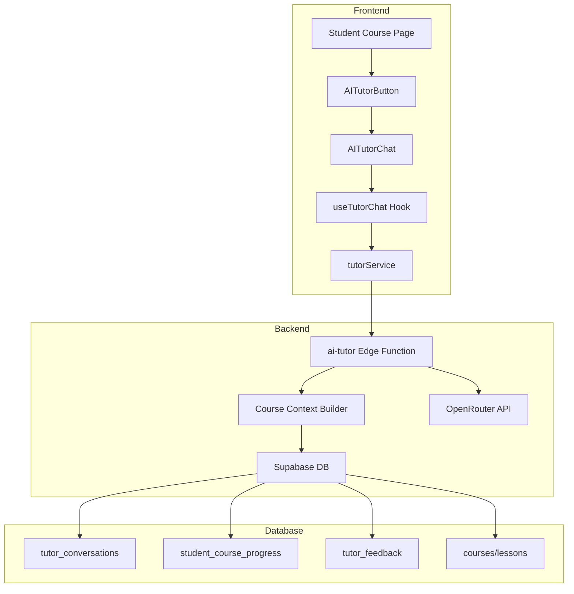

# AI Course Tutor - Design Document

## Overview

The AI Course Tutor is a conversational AI assistant integrated into the student course learning experience. It provides personalized, context-aware tutoring by understanding the course structure, current lesson content, and student progress. The system uses streaming responses for real-time interaction and persists conversations for continuity.

The tutor leverages the existing course data model (courses, modules, lessons, resources) and integrates with the student authentication system. It uses OpenRouter/OpenAI APIs for AI generation with carefully crafted system prompts that include course context.

## Architecture



## Components and Interfaces

### Frontend Components

#### 1. AITutorButton
A floating action button displayed on course/lesson pages.

```typescript
interface AITutorButtonProps {
  courseId: string;
  lessonId?: string;
  position?: 'bottom-right' | 'bottom-left';
}
```

#### 2. AITutorChat
The main chat interface component with message display and input.

```typescript
interface AITutorChatProps {
  courseId: string;
  lessonId?: string;
  onClose: () => void;
}

interface ChatMessage {
  id: string;
  role: 'user' | 'assistant';
  content: string;
  timestamp: Date;
}
```

#### 3. useTutorChat Hook
Custom hook managing chat state, streaming, and API calls.

```typescript
interface UseTutorChatReturn {
  messages: ChatMessage[];
  isLoading: boolean;
  isStreaming: boolean;
  error: string | null;
  sendMessage: (content: string) => Promise<void>;
  loadConversation: (conversationId: string) => Promise<void>;
  startNewConversation: () => void;
  conversations: Conversation[];
}
```

### Backend Services

#### 1. AI Tutor Edge Function
Handles chat requests with streaming responses.

```typescript
// POST /ai-tutor/chat
interface ChatRequest {
  conversationId?: string;
  courseId: string;
  lessonId?: string;
  message: string;
}

// Response: Server-Sent Events stream
// event: token
// data: {"content": "partial response"}
// event: done
// data: {"conversationId": "uuid", "messageId": "uuid"}
```

#### 2. Course Context Builder
Assembles course information for AI system prompt.

```typescript
interface CourseContext {
  courseTitle: string;
  courseDescription: string;
  currentModule: ModuleContext | null;
  currentLesson: LessonContext | null;
  availableResources: ResourceContext[];
  studentProgress: ProgressContext;
}

function buildCourseContext(
  courseId: string, 
  lessonId: string | null, 
  studentId: string
): Promise<CourseContext>
```

### Frontend Services

#### tutorService.ts
```typescript
interface TutorService {
  sendMessage(request: ChatRequest): AsyncGenerator<string>;
  getConversations(courseId: string): Promise<Conversation[]>;
  getConversation(conversationId: string): Promise<Conversation>;
  submitFeedback(messageId: string, rating: number, text?: string): Promise<void>;
  getSuggestedQuestions(lessonId: string): Promise<string[]>;
}
```

## Data Models

### Database Schema

```sql
-- Tutor conversations table
CREATE TABLE tutor_conversations (
  id UUID PRIMARY KEY DEFAULT gen_random_uuid(),
  student_id UUID NOT NULL REFERENCES auth.users(id) ON DELETE CASCADE,
  course_id UUID NOT NULL REFERENCES courses(course_id) ON DELETE CASCADE,
  lesson_id UUID REFERENCES lessons(lesson_id) ON DELETE SET NULL,
  title VARCHAR(255),
  messages JSONB DEFAULT '[]'::jsonb,
  created_at TIMESTAMPTZ DEFAULT NOW(),
  updated_at TIMESTAMPTZ DEFAULT NOW()
);

-- Student course progress table
CREATE TABLE student_course_progress (
  id UUID PRIMARY KEY DEFAULT gen_random_uuid(),
  student_id UUID NOT NULL REFERENCES auth.users(id) ON DELETE CASCADE,
  course_id UUID NOT NULL REFERENCES courses(course_id) ON DELETE CASCADE,
  lesson_id UUID NOT NULL REFERENCES lessons(lesson_id) ON DELETE CASCADE,
  status VARCHAR(20) DEFAULT 'not_started' CHECK (status IN ('not_started', 'in_progress', 'completed')),
  time_spent_seconds INTEGER DEFAULT 0,
  last_accessed TIMESTAMPTZ,
  completed_at TIMESTAMPTZ,
  created_at TIMESTAMPTZ DEFAULT NOW(),
  updated_at TIMESTAMPTZ DEFAULT NOW(),
  UNIQUE(student_id, course_id, lesson_id)
);

-- Tutor feedback table
CREATE TABLE tutor_feedback (
  id UUID PRIMARY KEY DEFAULT gen_random_uuid(),
  conversation_id UUID NOT NULL REFERENCES tutor_conversations(id) ON DELETE CASCADE,
  message_index INTEGER NOT NULL,
  rating INTEGER CHECK (rating IN (-1, 1)),
  feedback_text TEXT,
  created_at TIMESTAMPTZ DEFAULT NOW()
);
```

### Message Structure (JSONB)

```typescript
interface StoredMessage {
  id: string;
  role: 'user' | 'assistant';
  content: string;
  timestamp: string; // ISO 8601
  tokens?: number;
}
```

## Correctness Properties

*A property is a characteristic or behavior that should hold true across all valid executions of a system-essentially, a formal statement about what the system should do. Properties serve as the bridge between human-readable specifications and machine-verifiable correctness guarantees.*

Based on the prework analysis, the following correctness properties have been identified:

### Property 1: Context reflects current lesson
*For any* lesson navigation event, the course context builder SHALL include the current lesson's title, content, and module information in the generated context.
**Validates: Requirements 2.1, 2.3**

### Property 2: Conversation message integrity
*For any* conversation with existing messages, loading the conversation SHALL return all messages in order, and appending a new message SHALL preserve all existing messages.
**Validates: Requirements 3.2, 3.3**

### Property 3: Conversation creation completeness
*For any* new conversation creation, the stored record SHALL contain valid student_id, course_id, and a non-empty title.
**Validates: Requirements 3.4, 7.1**

### Property 4: Suggested questions count
*For any* lesson, the suggested questions generator SHALL return between 3 and 5 questions inclusive.
**Validates: Requirements 4.1**

### Property 5: Suggested questions update on lesson change
*For any* two different lessons in the same course, the suggested questions SHALL be different.
**Validates: Requirements 4.3**

### Property 6: Progress recording completeness
*For any* lesson completion event, the progress record SHALL contain a valid timestamp and status of 'completed'.
**Validates: Requirements 5.1, 7.3**

### Property 7: Streaming response lifecycle
*For any* chat request that receives a response, the streaming mechanism SHALL deliver content incrementally, and upon completion, the full message SHALL be persisted to the conversation.
**Validates: Requirements 6.1, 6.3**

### Property 8: Message append preserves history
*For any* conversation, appending a message SHALL increase the message count by exactly one and preserve all previous message content unchanged.
**Validates: Requirements 7.2**

### Property 9: Row-level security enforcement
*For any* student querying conversations, the result set SHALL contain only conversations where student_id matches the authenticated user.
**Validates: Requirements 7.4**

### Property 10: Feedback storage completeness
*For any* feedback submission with a rating, the stored record SHALL contain the conversation reference and rating value.
**Validates: Requirements 8.2, 8.3**

## Error Handling

### API Errors
- **Rate Limiting**: Display "Please wait a moment before sending another message" with retry timer
- **AI Service Unavailable**: Display "AI service temporarily unavailable. Please try again later."
- **Network Errors**: Display "Connection lost. Retrying..." with automatic retry (3 attempts)
- **Invalid Course/Lesson**: Redirect to course list with error toast

### Streaming Errors
- **Stream Interruption**: Save partial response, display error, offer retry button
- **Timeout**: After 60 seconds, abort stream and display timeout message

### Data Errors
- **Conversation Not Found**: Create new conversation automatically
- **Permission Denied**: Display "You don't have access to this conversation"

## Testing Strategy

### Unit Testing
Unit tests will verify individual component behavior:
- Course context builder correctly assembles context from course data
- Message serialization/deserialization
- Suggested questions generator
- Progress calculation functions

### Property-Based Testing
Property-based tests will use **fast-check** library to verify correctness properties:

1. **Context Builder Properties**: Generate random course/lesson combinations and verify context structure
2. **Conversation Integrity**: Generate random message sequences and verify append/load operations
3. **Progress Recording**: Generate random completion events and verify data integrity
4. **RLS Enforcement**: Generate random user/conversation combinations and verify access control

Each property-based test MUST:
- Run a minimum of 100 iterations
- Be tagged with the format: `**Feature: ai-course-tutor, Property {number}: {property_text}**`
- Reference the specific correctness property being validated

### Integration Testing
- End-to-end chat flow with mocked AI responses
- Conversation persistence and retrieval
- Progress tracking across lesson navigation

### Manual Testing
- AI response quality and relevance
- Streaming UX smoothness
- Cross-browser compatibility
