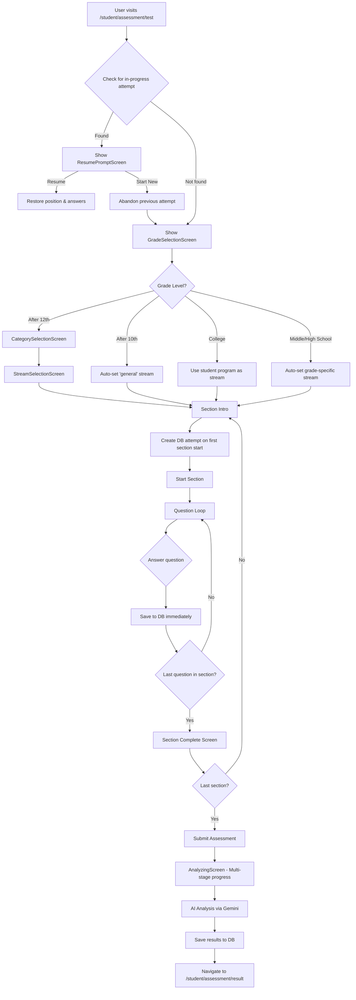

# Career Assessment System - Complete Technical Guide

> **Purpose**: This document provides a comprehensive technical overview of the student career assessment system at `/student/assessment`. It covers architecture, flow, components, database schema, and all implementation details for developers and AI coding agents.

---

## Table of Contents

1. [System Overview](#system-overview)
2. [Route Structure](#route-structure)
3. [Assessment Flow](#assessment-flow)
4. [Architecture & Components](#architecture--components)
5. [Database Schema](#database-schema)
6. [Configuration & Constants](#configuration--constants)
7. [AI Integration](#ai-integration)
8. [State Management](#state-management)
9. [Timer System](#timer-system)
10. [Resume & Persistence](#resume--persistence)
11. [Restrictions & Validation](#restrictions--validation)
12. [Environment-Specific Behavior](#environment-specific-behavior)
13. [Testing & Debug Tools](#testing--debug-tools)

---

## System Overview

The Career Assessment System is a **production-grade, AI-powered platform** that evaluates students across multiple dimensions to provide personalized career guidance.

### Key Features
- ✅ Multi-dimensional assessment (interests, personality, aptitudes, values)
- ✅ AI-powered question generation and analysis
- ✅ Adaptive difficulty testing using Item Response Theory (IRT)
- ✅ Real-time progress persistence with resume capability
- ✅ 6-month restriction between attempts
- ✅ Grade-specific customization (Middle School to College)
- ✅ Stream/category-based routing
- ✅ Comprehensive career recommendations

### Technology Stack
- **Frontend**: React, TypeScript, Framer Motion
- **State Management**: Custom hooks (useAssessmentFlow, useAssessment, etc.)
- **Database**: Supabase (PostgreSQL)
- **AI**: Gemini AI for analysis, OpenRouter for question generation
- **Adaptive Testing**: Custom IRT implementation

---

## Route Structure

### Main Routes

| Route | Component | Purpose |
|-------|-----------|---------|
| `/student/assessment/test` | `AssessmentTestPage` | Main assessment interface |
| `/student/assessment/result` | `AssessmentResult` | View assessment results/report |
| `/student/assessment/platform` | `AssessmentStart` | Assessment start screen |
| `/student/assessment/dynamic` | `DynamicAssessment` | Dynamic assessment with resume parsing |
| `/student/assessment/start` | `AssessmentTestPage` (with TestProvider) | Alternative start route |
| `/student/assessment/results` | `AssessmentResults` (with TestProvider) | Alternative results route |

### File Locations

```
src/
├── pages/student/
│   ├── AssessmentTestPage.tsx          # Route wrapper (re-exports from features)
│   ├── AssessmentResult.jsx            # Results display page
│   └── AssessmentStart.jsx             # Start screen
├── features/assessment/
│   ├── career-test/
│   │   ├── AssessmentTestPage.tsx      # Main implementation
│   │   ├── hooks/
│   │   │   ├── useAssessmentFlow.ts    # State machine for navigation
│   │   │   ├── useAIQuestions.ts       # AI question loading
│   │   │   ├── useAssessmentSubmission.ts  # Submission logic
│   │   │   └── useStudentGrade.ts      # Student info fetching
│   │   ├── components/
│   │   │   ├── questions/              # Question renderers
│   │   │   ├── screens/                # Full-screen components
│   │   │   └── layout/                 # Layout components
│   │   └── config/
│   │       └── sections.ts             # Section configurations
│   ├── components/
│   │   ├── GradeSelectionScreen.jsx
│   │   ├── CategorySelectionScreen.jsx
│   │   ├── StreamSelectionScreen.jsx
│   │   ├── ResumePromptScreen.jsx
│   │   └── RestrictionScreen.jsx
│   ├── constants/
│   │   └── config.ts                   # All configuration constants
│   └── data/
│       └── questions/                  # Static question data
└── hooks/
    ├── useAssessment.js                # Database operations
    └── useAdaptiveAptitude.js          # Adaptive testing logic
```

---

## Assessment Flow

### Complete User Journey



### Detailed Step-by-Step Flow

#### 1. Initial Check & Resume (0-2 seconds)

- System checks `personal_assessment_attempts` table for in-progress attempts
- Query: `status = 'in_progress' AND student_id = current_user`
- If found, shows `ResumePromptScreen` with:
  - Stream/category information
  - Start date/time
  - Questions answered count
  - Progress percentage
  - Options: Resume, Start Fresh, Back to Dashboard

#### 2. Grade Selection
- Auto-detects student grade from profile
- Shows appropriate options based on environment:
  - **localhost**: All options visible
  - **skillpassport.pages.dev**: All options visible
  - **skilldevelopment.rareminds.in**: Filtered by detected grade
- Grade options:
  - Middle School (6-8)
  - High School (9-10)
  - After 10th (Grade 11)
  - After 12th (Grade 12 completed)
  - College (UG/PG)

#### 3. Category/Stream Selection (After 12th only)
- **After 12th students**: Must select category (Science/Commerce/Arts)
- **After 10th students**: Auto-assigned 'general' stream (AI recommends best stream in results)
- **College students**: Use their program as stream (normalized to max 20 chars)
- **Middle/High School**: Auto-assigned grade-specific stream

#### 4. Section Intro Screen
- Shows section title, description, and instructions
- Displays question count and time limit (if applicable)
- "AI-Powered" badge for aptitude/knowledge sections
- Loading state for adaptive sections (questions loading)
- **Important**: Database attempt is created when user clicks "Start Section" on first section

#### 5. Question Loop
- Questions displayed one at a time
- Answer saved to database immediately after selection
- Progress updated every 10 seconds
- Timer state saved every 10 seconds
- Navigation: Previous/Next buttons (Previous disabled for adaptive sections)
- Validation: Cannot proceed without answering

#### 6. Section Complete Screen
- Shows section completion message
- Displays time taken for the section
- Shows next section title (if not last)
- Button: "Continue to Next Section" or "Submit Assessment"

#### 7. Submission & Analysis
- Collects all answers and section timings
- Shows `AnalyzingScreen` with 7 stages:
  1. Preparing (0-10%)
  2. Sending to AI (10-20%)
  3. AI Analyzing (20-70%)
  4. Processing Results (70-85%)
  5. Finding Courses (85-95%)
  6. Saving Report (95-100%)
  7. Complete (100%)
- Sends data to Gemini AI for comprehensive analysis
- Saves results to `personal_assessment_results` table
- Navigates to `/student/assessment/result`

---

## Architecture & Components

### Core Hooks

#### `useAssessmentFlow` (State Machine)
**Location**: `src/features/assessment/career-test/hooks/useAssessmentFlow.ts`

**Purpose**: Manages the entire assessment navigation and state

**State Variables**:
```typescript
{
  gradeLevel: GradeLevel | null,
  selectedCategory: string | null,
  studentStream: string | null,
  currentScreen: ScreenType,
  currentSectionIndex: number,
  currentQuestionIndex: number,
  showSectionIntro: boolean,
  showSectionComplete: boolean,
  answers: Record<string, any>,
  sectionTimings: Record<string, number>,
  timeRemaining: number | null,
  elapsedTime: number,
  isSubmitting: boolean,
  error: string | null
}
```

**Key Methods**:
- `startSection()` - Begins a section
- `goToNextQuestion()` - Advances to next question
- `goToPreviousQuestion()` - Goes back (disabled for adaptive)
- `completeSection()` - Marks section as complete
- `goToNextSection()` - Advances to next section
- `jumpToSection(index)` - Jumps to specific section (test mode)
- `setAnswer(questionId, value)` - Saves answer
- `setGradeLevel(level)` - Sets grade level
- `setStudentStream(stream)` - Sets stream/category

#### `useAssessment` (Database Operations)
**Location**: `src/hooks/useAssessment.js`

**Purpose**: Handles all database interactions

**Key Methods**:

```javascript
{
  startAssessment(streamId, gradeLevel) // Creates new attempt
  saveResponse(sectionId, questionId, answer) // Saves UUID-based answer
  updateProgress(sectionIndex, questionIndex, timings, timerRemaining, elapsedTime, allAnswers) // Updates position
  checkInProgressAttempt() // Checks for existing attempt
  abandonAttempt(attemptId) // Marks attempt as abandoned
}
```

**Returns**:
```javascript
{
  loading: boolean,
  currentAttempt: Attempt | null,
  studentRecordId: string | null
}
```

#### `useAIQuestions` (AI Question Loading)
**Location**: `src/features/assessment/career-test/hooks/useAIQuestions.ts`

**Purpose**: Loads AI-generated aptitude and knowledge questions

**Behavior**:
- Checks cache first (`personal_assessment_questions` table)
- Generates new questions if cache miss
- Only runs for after10/after12/college grade levels
- Questions are stream-specific

**Returns**:
```typescript
{
  aiQuestions: {
    aptitude: Question[],
    knowledge: Question[]
  },
  loading: boolean,
  error: string | null
}
```

#### `useAdaptiveAptitude` (Adaptive Testing)
**Location**: `src/hooks/useAdaptiveAptitude.js`

**Purpose**: Manages adaptive aptitude test using IRT

**Key Features**:
- Starts at medium difficulty
- Adjusts difficulty based on performance
- Estimates ability level in real-time
- Three phases: warmup, adaptive, verification
- ~21 questions total

**Methods**:
```javascript
{
  startTest() // Begins adaptive session
  resumeTest(sessionId) // Resumes existing session
  submitAnswer(answer) // Submits answer and gets next question
}
```

**Returns**:
```javascript
{
  session: AdaptiveSession | null,
  currentQuestion: Question | null,
  progress: {
    questionsAnswered: number,
    estimatedTotalQuestions: number,
    currentPhase: string,
    currentDifficulty: number
  },
  loading: boolean,
  submitting: boolean
}
```

#### `useAssessmentSubmission` (Submission Logic)
**Location**: `src/features/assessment/career-test/hooks/useAssessmentSubmission.ts`

**Purpose**: Handles final submission and AI analysis

**Process**:
1. Validates all answers are present
2. Prepares data for AI analysis
3. Calls Gemini AI API
4. Parses AI response
5. Saves results to database
6. Navigates to results page

**Methods**:
```javascript
{
  submit({
    answers,
    sections,
    studentStream,
    gradeLevel,
    sectionTimings,
    currentAttempt,
    userId,
    timeRemaining,
    elapsedTime
  })
}
```

**Returns**:
```javascript
{
  isSubmitting: boolean,
  error: string | null
}
```

#### `useStudentGrade` (Student Info)
**Location**: `src/features/assessment/career-test/hooks/useStudentGrade.ts`

**Purpose**: Fetches student information from database

**Returns**:
```typescript
{
  studentId: string | null,
  studentGrade: number | null,
  isCollegeStudent: boolean,
  studentProgram: string | null,
  monthsInGrade: number,
  loading: boolean
}
```

### Screen Components

#### `GradeSelectionScreen`
**Location**: `src/features/assessment/components/GradeSelectionScreen.jsx`

**Props**:
```javascript
{
  onGradeSelect: (level: GradeLevel) => void,
  studentGrade: number | null,
  detectedGradeLevel: GradeLevel | null,
  monthsInGrade: number,
  isCollegeStudent: boolean,
  loadingStudentGrade: boolean,
  shouldShowAllOptions: boolean,
  shouldFilterByGrade: boolean,
  studentProgram: string | null
}
```

**Features**:
- Auto-detection with manual override
- Filtering based on environment
- Visual grade cards with icons
- Recommended badge for detected grade

#### `CategorySelectionScreen`
**Location**: `src/features/assessment/components/CategorySelectionScreen.jsx`

**Props**:
```javascript
{
  onCategorySelect: (category: string) => void,
  onBack: () => void,
  gradeLevel: GradeLevel | null
}
```

**Categories**:
- Science (Engineering, Medical, Pure Sciences)
- Commerce (Business, Finance, Accounting)
- Arts/Humanities (Literature, Social Sciences, Design)

#### `StreamSelectionScreen`
**Location**: `src/features/assessment/components/StreamSelectionScreen.jsx`

**Props**:
```javascript
{
  onStreamSelect: (stream: string) => void,
  onBack: () => void,
  selectedCategory: string | null,
  gradeLevel: GradeLevel | null,
  studentProgram: string | null
}
```

**Stream Options**: See [Configuration & Constants](#configuration--constants) section

#### `ResumePromptScreen`
**Location**: `src/features/assessment/components/ResumePromptScreen.jsx`

**Props**:
```javascript
{
  pendingAttempt: Attempt,
  onResume: () => void,
  onStartNew: () => void,
  isLoading: boolean
}
```

**Displays**:
- Stream label
- Start date/time
- Questions answered count
- Progress percentage with visual bar
- Warning about abandoning progress

#### `RestrictionScreen`
**Location**: `src/features/assessment/components/RestrictionScreen.jsx`

**Props**:
```javascript
{
  errorMessage: string,
  onViewLastReport: () => void,
  onBackToDashboard: () => void
}
```

**Shows**:
- 6-month restriction message
- Explanation of waiting period
- Button to view last report
- Button to return to dashboard

#### `SectionIntroScreen`
**Location**: `src/features/assessment/career-test/components/screens/SectionIntroScreen.tsx`

**Props**:
```typescript
{
  title: string,
  description: string,
  instruction: string | null,
  icon: React.ComponentType | null,
  color: string,
  sectionId: string,
  questionCount: number,
  timeLimit: number | null,
  isAptitude: boolean,
  isAdaptive: boolean,
  isTimed: boolean,
  showAIPoweredBadge: boolean,
  isLoading: boolean,
  onStart: () => void
}
```

#### `SectionCompleteScreen`
**Location**: `src/features/assessment/career-test/components/screens/SectionCompleteScreen.tsx`

**Props**:
```typescript
{
  sectionTitle: string,
  nextSectionTitle: string | null,
  elapsedTime: number,
  isLastSection: boolean,
  onContinue: () => void
}
```

#### `AnalyzingScreen`
**Location**: `src/features/assessment/career-test/components/screens/AnalyzingScreen.tsx`

**Props**:
```typescript
{
  gradeLevel?: string,
  currentStage?: AnalysisStageId,
  progressPercent?: number,
  errorMessage?: string
}
```

**Stages**:
1. `preparing` - Organizing data (0-10%)
2. `sending` - Connecting to AI (10-20%)
3. `analyzing` - AI analysis (20-70%)
4. `processing` - Generating matches (70-85%)
5. `courses` - Finding courses (85-95%)
6. `saving` - Storing report (95-100%)
7. `complete` - Done (100%)

**Features**:
- Real-time progress tracking
- Fun facts displayed during wait
- Animated progress bar
- Stage-specific icons and messages

#### `QuestionRenderer`
**Location**: `src/features/assessment/career-test/components/questions/QuestionRenderer.tsx`

**Purpose**: Renders different question types

**Question Types**:
- Likert Scale (1-5)
- Multiple Choice
- Multiselect
- Situational Judgment Test (SJT) - Best/Worst
- Text Input
- Adaptive Multiple Choice

**Props**:
```typescript
{
  question: Question,
  questionId: string,
  sectionId: string,
  answer: any,
  onAnswer: (value: any) => void,
  responseScale?: ResponseScale,
  isAdaptive?: boolean,
  adaptiveTimer?: number,
  adaptiveDifficulty?: number,
  adaptiveLoading?: boolean,
  adaptiveDisabled?: boolean
}
```

---

## Database Schema

### Tables

#### `personal_assessment_attempts`
**Purpose**: Tracks each assessment attempt

**Columns**:
```sql
id UUID PRIMARY KEY
student_id UUID REFERENCES students(id)
grade_level TEXT NOT NULL
stream_id TEXT NOT NULL
status TEXT DEFAULT 'in_progress' -- 'in_progress', 'completed', 'abandoned'
current_section_index INTEGER DEFAULT 0
current_question_index INTEGER DEFAULT 0
timer_remaining INTEGER -- seconds remaining for timed sections
elapsed_time INTEGER -- seconds elapsed for current section
section_timings JSONB -- { "riasec": 120, "bigfive": 180, ... }
all_responses JSONB -- All answers including non-UUID questions
adaptive_aptitude_session_id UUID REFERENCES adaptive_aptitude_sessions(id)
started_at TIMESTAMP DEFAULT NOW()
completed_at TIMESTAMP
created_at TIMESTAMP DEFAULT NOW()
updated_at TIMESTAMP DEFAULT NOW()
```

**Indexes**:
- `idx_attempts_student_status` on `(student_id, status)`
- `idx_attempts_student_completed` on `(student_id, completed_at)`

#### `personal_assessment_responses`
**Purpose**: Individual answers to UUID-based questions (AI-generated)

**Columns**:
```sql
id UUID PRIMARY KEY
attempt_id UUID REFERENCES personal_assessment_attempts(id)
question_id UUID REFERENCES personal_assessment_questions(id)
section_id TEXT NOT NULL
response_value JSONB NOT NULL
created_at TIMESTAMP DEFAULT NOW()
```

**Indexes**:
- `idx_responses_attempt` on `(attempt_id)`
- `idx_responses_question` on `(question_id)`

#### `personal_assessment_questions`
**Purpose**: Cached AI-generated questions

**Columns**:
```sql
id UUID PRIMARY KEY
stream_id TEXT NOT NULL
section_type TEXT NOT NULL -- 'aptitude', 'knowledge'
subtag TEXT -- 'numerical', 'logical', 'verbal', 'spatial', 'abstract'
question_text TEXT NOT NULL
options JSONB -- ["A", "B", "C", "D"]
correct_answer TEXT
difficulty TEXT -- 'easy', 'medium', 'hard'
created_at TIMESTAMP DEFAULT NOW()
```

**Indexes**:
- `idx_questions_stream_section` on `(stream_id, section_type)`
- `idx_questions_subtag` on `(subtag)`

#### `personal_assessment_results`
**Purpose**: Final analysis results

**Columns**:
```sql
id UUID PRIMARY KEY
attempt_id UUID REFERENCES personal_assessment_attempts(id)
student_id UUID REFERENCES students(id)
grade_level TEXT NOT NULL
stream_id TEXT NOT NULL

-- RIASEC Scores
riasec_scores JSONB -- { "R": 4.2, "I": 4.8, "A": 3.1, ... }
riasec_code TEXT -- "IAS"

-- Big Five Scores
bigfive_scores JSONB -- { "O": 4.5, "C": 3.8, "E": 4.2, ... }

-- Work Values
work_values JSONB -- { "achievement": 4.5, "independence": 4.0, ... }

-- Employability Score
employability_score DECIMAL(3,1) -- 0.0 to 5.0

-- Aptitude Scores
aptitude_scores JSONB -- { "numerical": 75, "logical": 82, ... }

-- Recommendations
recommended_careers JSONB -- [{ name, fit_score, description }, ...]
recommended_courses JSONB -- [{ title, relevance, provider }, ...]
skill_gaps JSONB -- ["Communication", "Data Analysis", ...]

-- AI Analysis
ai_analysis TEXT -- Full AI-generated report
action_plan TEXT -- Personalized next steps

created_at TIMESTAMP DEFAULT NOW()
```

**Indexes**:
- `idx_results_student` on `(student_id)`
- `idx_results_attempt` on `(attempt_id)`

#### `adaptive_aptitude_sessions`
**Purpose**: Adaptive test sessions

**Columns**:
```sql
id UUID PRIMARY KEY
student_id UUID NOT NULL
grade_level TEXT NOT NULL
status TEXT DEFAULT 'active' -- 'active', 'completed', 'abandoned'
current_phase TEXT DEFAULT 'warmup' -- 'warmup', 'adaptive', 'verification'
current_difficulty DECIMAL(3,2) DEFAULT 0.50 -- 0.0 to 1.0
ability_estimate DECIMAL(3,2) -- Estimated ability level
questions_answered INTEGER DEFAULT 0
correct_answers INTEGER DEFAULT 0
started_at TIMESTAMP DEFAULT NOW()
completed_at TIMESTAMP
```

**Indexes**:
- `idx_adaptive_sessions_student` on `(student_id)`

#### `adaptive_aptitude_responses`
**Purpose**: Individual adaptive test answers

**Columns**:
```sql
id UUID PRIMARY KEY
session_id UUID REFERENCES adaptive_aptitude_sessions(id)
question_id UUID NOT NULL
question_difficulty DECIMAL(3,2) NOT NULL
selected_answer TEXT NOT NULL
is_correct BOOLEAN NOT NULL
time_taken INTEGER -- seconds
created_at TIMESTAMP DEFAULT NOW()
```

**Indexes**:
- `idx_adaptive_responses_session` on `(session_id)`

---

## Configuration & Constants

### File: `src/features/assessment/constants/config.ts`

#### Grade Levels
```typescript
GRADE_LEVELS = {
  MIDDLE: 'middle',           // Grades 6-8
  HIGHSCHOOL: 'highschool',   // Grades 9-10
  HIGHER_SECONDARY: 'higher_secondary', // Grades 11-12
  AFTER_10: 'after10',        // After 10th (Grade 11)
  AFTER_12: 'after12',        // After 12th
  COLLEGE: 'college'          // UG/PG
}
```

#### Timer Configuration
```typescript
TIMERS = {
  ADAPTIVE_QUESTION_TIME_LIMIT: 90,      // seconds per adaptive question
  APTITUDE_INDIVIDUAL_TIME_LIMIT: 60,    // seconds per aptitude question
  APTITUDE_SHARED_TIME_LIMIT: 900,       // 15 minutes for shared aptitude
  KNOWLEDGE_TIME_LIMIT: 1800,            // 30 minutes for knowledge
  AUTO_SAVE_INTERVAL: 30000,             // 30 seconds
  TIME_WARNING_THRESHOLD: 60,            // Show warning at 60s
  TIME_CRITICAL_THRESHOLD: 10            // Critical warning at 10s
}
```

#### Assessment Restriction
```typescript
ASSESSMENT_RESTRICTION = {
  MONTHS_BETWEEN_ATTEMPTS: 6
}
```

#### Stream Categories
```typescript
STREAM_CATEGORIES = [
  { 
    id: 'science', 
    label: 'Science', 
    description: 'Engineering, Medical, Pure Sciences' 
  },
  { 
    id: 'commerce', 
    label: 'Commerce', 
    description: 'Business, Finance, Accounting' 
  },
  { 
    id: 'arts', 
    label: 'Arts/Humanities', 
    description: 'Literature, Social Sciences, Design' 
  }
]
```

#### After 12th Streams by Category

**Science Streams**:
- B.Sc Computer Science / B.Tech CS/IT
- B.Tech / B.E (Other Engineering)
- MBBS / BDS / Nursing
- B.Pharm / Pharm.D
- B.Sc (Physics/Chemistry/Biology/Maths)
- B.Sc Animation / Game Design

**Commerce Streams**:
- BBA General
- BCA General
- BBA Digital Marketing
- B.Com / B.Com (Hons)
- CA / CMA / CS
- BBA Finance / Banking

**Arts Streams**:
- BA (English/History/Political Science)
- BA Journalism / Mass Communication
- B.Des / Fashion Design
- BA LLB / BBA LLB
- BA/B.Sc Psychology
- BFA / Visual Arts

#### After 10th Streams (11th/12th Class)

**Science**:
- Science (PCMB) - Physics, Chemistry, Maths, Biology
- Science (PCMS) - Physics, Chemistry, Maths, Computer Science
- Science (PCM) - Physics, Chemistry, Maths
- Science (PCB) - Physics, Chemistry, Biology

**Commerce**:
- Commerce with Maths
- Commerce without Maths

**Arts**:
- Arts & Humanities

#### Response Scales

**RIASEC (Interests)**:
1. Strongly Dislike
2. Dislike
3. Neutral
4. Like
5. Strongly Like

**Big Five (Personality)**:
1. Very Inaccurate
2. Moderately Inaccurate
3. Neither
4. Moderately Accurate
5. Very Accurate

**Work Values**:
1. Not Important
2. Slightly Important
3. Moderately Important
4. Very Important
5. Extremely Important

**Employability**:
1. Not Like Me
2. Slightly
3. Somewhat
4. Mostly
5. Very Much Like Me

**High School (4-point)**:
1. Not me
2. A bit
3. Mostly
4. Strongly me

#### Section Colors
```typescript
SECTION_COLORS = {
  riasec: 'rose',
  bigfive: 'purple',
  values: 'indigo',
  employability: 'green',
  aptitude: 'amber',
  knowledge: 'blue',
  adaptive_aptitude: 'indigo',
  hs_interest_explorer: 'rose',
  hs_strengths_character: 'amber',
  hs_learning_preferences: 'blue',
  hs_aptitude_sampling: 'purple',
  middle_interest_explorer: 'rose',
  middle_strengths_character: 'amber',
  middle_learning_preferences: 'blue'
}
```

---

## AI Integration

### Question Generation

**Service**: OpenRouter API
**Model**: Various (configurable)
**Purpose**: Generate aptitude and knowledge questions

**Process**:
1. Check cache (`personal_assessment_questions` table)
2. If cache miss, call OpenRouter API
3. Generate 10-15 questions per section
4. Store in cache with metadata (stream, section, subtag, difficulty)
5. Return questions to assessment

**Question Format**:
```json
{
  "id": "uuid",
  "question_text": "What is 2 + 2?",
  "options": ["2", "3", "4", "5"],
  "correct_answer": "4",
  "difficulty": "easy",
  "subtag": "numerical"
}
```

### Result Analysis

**Service**: Gemini AI
**Model**: gemini-1.5-flash (or configurable)
**Purpose**: Comprehensive career analysis

**Input Data**:
```json
{
  "gradeLevel": "after12",
  "stream": "cs",
  "riasecScores": { "R": 3.2, "I": 4.8, "A": 2.1, "S": 3.5, "E": 3.8, "C": 4.2 },
  "bigFiveScores": { "O": 4.5, "C": 3.8, "E": 4.2, "A": 4.0, "N": 2.5 },
  "workValues": { "achievement": 4.5, "independence": 4.0, ... },
  "employabilityScore": 4.2,
  "aptitudeScores": { "numerical": 75, "logical": 82, "verbal": 68, ... },
  "sectionTimings": { "riasec": 120, "bigfive": 180, ... }
}
```

**Output**:
```json
{
  "riasecCode": "IAS",
  "recommendedCareers": [
    {
      "name": "Software Engineer",
      "fitScore": 92,
      "description": "...",
      "requiredSkills": ["Programming", "Problem Solving"],
      "salaryRange": "₹6-15 LPA"
    }
  ],
  "recommendedCourses": [
    {
      "title": "Data Structures & Algorithms",
      "relevance": "Essential for software engineering",
      "provider": "Coursera"
    }
  ],
  "skillGaps": ["Communication", "Leadership"],
  "actionPlan": "1. Focus on...\n2. Develop...",
  "analysis": "Full detailed analysis text..."
}
```

---

## State Management

### Flow State Machine

The assessment uses a state machine pattern managed by `useAssessmentFlow`:

**Screens**:
- `grade_selection`
- `category_selection`
- `stream_selection`
- `section_intro`
- `assessment` (questions)
- `section_complete`
- `analyzing` (submission)

**Transitions**:
```
grade_selection → category_selection (after12 only)
grade_selection → section_intro (other grades)
category_selection → stream_selection (deprecated, now skipped)
category_selection → section_intro (direct)
stream_selection → section_intro
section_intro → assessment (on "Start Section")
assessment → section_complete (on last question)
section_complete → section_intro (next section)
section_complete → analyzing (last section)
analyzing → result page (on completion)
```

### Answer Storage

**Local State** (React):
```typescript
answers: Record<string, any> = {
  "riasec_q1": 4,
  "riasec_q2": 5,
  "bigfive_q1": 3,
  "aptitude_uuid-123": "C",
  ...
}
```

**Database** (Two locations):
1. **UUID-based questions** → `personal_assessment_responses` table
2. **Non-UUID questions** → `all_responses` JSONB column in `personal_assessment_attempts`

### Progress Tracking

**Current Position**:
- `current_section_index`: Which section (0-based)
- `current_question_index`: Which question in section (0-based)

**Timings**:
- `elapsed_time`: Seconds elapsed in current section
- `timer_remaining`: Seconds remaining for timed sections
- `section_timings`: Completed section times `{ "riasec": 120, ... }`

**Saved Every**:
- Answer change: Immediately
- Position change: Immediately
- Timer state: Every 10 seconds
- All responses: Every 10 seconds

---

## Timer System

### Timer Types

#### 1. Elapsed Time Timer (Non-timed sections)
**Purpose**: Track how long user spends on section
**Behavior**: Counts up from 0
**Sections**: RIASEC, Big Five, Work Values, Employability
**Storage**: `elapsed_time` column

#### 2. Countdown Timer (Timed sections)
**Purpose**: Enforce time limit
**Behavior**: Counts down from limit
**Sections**: Knowledge section (30 min)
**Storage**: `timer_remaining` column
**Auto-advance**: Yes, when reaches 0

#### 3. Per-Question Timer (Aptitude)
**Purpose**: Individual question time limit
**Behavior**: Counts down from 60s per question
**Sections**: Aptitude (individual phase)
**Storage**: Not persisted (resets per question)
**Auto-advance**: Yes, when reaches 0

#### 4. Adaptive Timer
**Purpose**: Time limit for adaptive questions
**Behavior**: Counts down from 90s per question
**Sections**: Adaptive Aptitude
**Storage**: Not persisted (resets per question)
**Auto-advance**: Yes, submits random answer if time expires

### Timer Implementation

```typescript
// Elapsed time (non-timed sections)
useEffect(() => {
  if (!currentSection.isTimed) {
    const interval = setInterval(() => {
      setElapsedTime(prev => prev + 1);
    }, 1000);
    return () => clearInterval(interval);
  }
}, [currentSection]);

// Countdown timer (timed sections)
useEffect(() => {
  if (currentSection.isTimed && timeRemaining > 0) {
    const interval = setInterval(() => {
      setTimeRemaining(prev => prev - 1);
    }, 1000);
    return () => clearInterval(interval);
  }
  
  if (timeRemaining === 0) {
    handleNextQuestion(); // Auto-advance
  }
}, [currentSection, timeRemaining]);

// Auto-save timer state
useEffect(() => {
  if (elapsedTime > 0 && elapsedTime % 10 === 0) {
    dbUpdateProgress(..., elapsedTime, ...);
  }
}, [elapsedTime]);
```

---

## Resume & Persistence

### What Gets Saved

**Immediately**:
- Every answer (UUID questions → `personal_assessment_responses`)
- Current position (section/question index)

**Every 10 seconds**:
- Timer state (elapsed_time, timer_remaining)
- All answers (non-UUID → `all_responses` JSONB)
- Section timings

**On section complete**:
- Section timing (total time spent)
- All section answers

### Resume Process

1. **Check for in-progress attempt**:
```sql
SELECT * FROM personal_assessment_attempts
WHERE student_id = $1 AND status = 'in_progress'
ORDER BY started_at DESC
LIMIT 1
```

2. **Load responses**:
```sql
SELECT question_id, response_value
FROM personal_assessment_responses
WHERE attempt_id = $1
```

3. **Restore state**:
- Set `gradeLevel` from `grade_level`
- Set `studentStream` from `stream_id`
- Set `currentSectionIndex` from `current_section_index`
- Set `currentQuestionIndex` from `current_question_index`
- Set `elapsedTime` from `elapsed_time`
- Set `timeRemaining` from `timer_remaining`
- Set `sectionTimings` from `section_timings`
- Restore all answers from `restoredResponses` + `all_responses`

4. **Resume adaptive session** (if exists):
```javascript
if (attempt.adaptive_aptitude_session_id) {
  await adaptiveAptitude.resumeTest(attempt.adaptive_aptitude_session_id);
}
```

5. **Navigate to correct screen**:
- If `questionIndex > 0`: Go directly to question
- If `questionIndex === 0`: Show section intro
- Skip intro if mid-section

### Abandoning Attempt

When user clicks "Start Fresh":
```sql
UPDATE personal_assessment_attempts
SET status = 'abandoned'
WHERE id = $1
```

---

## Restrictions & Validation

### 6-Month Restriction

**Check**:
```sql
SELECT * FROM personal_assessment_results
WHERE student_id = $1
  AND created_at > NOW() - INTERVAL '6 months'
ORDER BY created_at DESC
LIMIT 1
```

**Enforcement**:
- If recent result found, show `RestrictionScreen`
- User cannot start new assessment
- Can only view last report

**Bypass** (for testing):
- Delete recent results from database
- Or modify `ASSESSMENT_RESTRICTION.MONTHS_BETWEEN_ATTEMPTS` in config

### Answer Validation

**Required**:
- All questions must be answered
- Cannot skip questions
- Cannot proceed without answering

**Question-Specific**:
- **SJT**: Must select both best AND worst
- **Multiselect**: Must select exact number required
- **Text**: Minimum 10 characters
- **Likert/MCQ**: Must select one option

**Implementation**:
```typescript
const isCurrentAnswered = useMemo(() => {
  const answer = answers[questionId];
  if (!answer) return false;
  
  if (question.partType === 'sjt') {
    return answer.best && answer.worst;
  }
  if (question.type === 'multiselect') {
    return Array.isArray(answer) && answer.length === question.maxSelections;
  }
  if (question.type === 'text') {
    return typeof answer === 'string' && answer.trim().length >= 10;
  }
  return true;
}, [answers, questionId, question]);
```

---

## Environment-Specific Behavior

### localhost
- **Grade Selection**: All options visible
- **Test Mode**: Enabled
- **Logging**: Verbose console logs
- **Debug Tools**: Visible
- **API**: Development endpoints

### skillpassport.pages.dev
- **Grade Selection**: All options visible
- **Test Mode**: Disabled
- **Logging**: Standard
- **Debug Tools**: Hidden
- **API**: Production endpoints

### skilldevelopment.rareminds.in
- **Grade Selection**: Filtered by detected grade
- **Test Mode**: Disabled
- **Logging**: Minimal
- **Debug Tools**: Hidden
- **API**: Production endpoints

**Detection**:
```typescript
const isDevMode = import.meta.env.DEV || window.location.hostname === 'localhost';
const shouldShowAllOptions = window.location.hostname === 'skillpassport.pages.dev';
const shouldFilterByGrade = window.location.hostname === 'localhost' || 
                             window.location.hostname === 'skilldevelopment.rareminds.in';
```

---

## Testing & Debug Tools

### Test Mode (Dev Only)

**Activation**: Automatically enabled on localhost

**Controls**:
1. **Auto-Fill All**: Fills every question with default answers
2. **Skip to Aptitude**: Jumps to aptitude section
3. **Skip to Adaptive**: Jumps to adaptive section
4. **Submit**: Auto-fills and jumps to last question

**Implementation**:
```typescript
const autoFillAllAnswers = () => {
  sections.forEach(section => {
    section.questions?.forEach(question => {
      const questionId = `${section.id}_${question.id}`;
      
      if (question.partType === 'sjt') {
        setAnswer(questionId, { 
          best: question.options[0], 
          worst: question.options[question.options.length - 1] 
        });
      } else if (section.responseScale) {
        setAnswer(questionId, 3); // Middle value
      } else if (question.options?.length > 0) {
        setAnswer(questionId, question.correct || question.options[0]);
      }
    });
  });
};
```

### Console Logging

**Key Events Logged**:
- Assessment start/resume
- Section transitions
- Answer saves
- Timer updates
- Database operations
- AI API calls
- Error conditions

**Example**:
```
🔍 Checking for in-progress attempt...
✅ In-progress check completed in 45ms
📝 Creating assessment attempt on first section start...
💾 Restoring 47 UUID-based answers
⏱️ Restoring timer_remaining: 1800
📊 Saving section timings: { riasec: 120, bigfive: 180 }
🚀 Calling submission.submit with: { answersCount: 95, ... }
```

### Manual Testing Checklist

**Resume Flow**:
- [ ] Start assessment, answer 5 questions, close browser
- [ ] Reopen, verify resume prompt shows
- [ ] Click resume, verify exact position restored
- [ ] Verify all previous answers present
- [ ] Verify timer state restored

**Restriction Flow**:
- [ ] Complete assessment
- [ ] Try to start new assessment immediately
- [ ] Verify restriction screen shows
- [ ] Verify 6-month message displayed

**Grade-Specific**:
- [ ] Test middle school flow (simplified)
- [ ] Test high school flow (4-point scale)
- [ ] Test after 10th (general stream)
- [ ] Test after 12th (category selection)
- [ ] Test college (program as stream)

**Adaptive Testing**:
- [ ] Verify adaptive section starts
- [ ] Answer correctly, verify difficulty increases
- [ ] Answer incorrectly, verify difficulty decreases
- [ ] Verify ~21 questions total
- [ ] Verify session saved to database

**Submission**:
- [ ] Complete all sections
- [ ] Verify analyzing screen shows
- [ ] Verify all 7 stages progress
- [ ] Verify results saved to database
- [ ] Verify navigation to results page

---

## Common Issues & Solutions

### Issue: Resume prompt shows after clicking "Start Section"
**Cause**: Initial check running multiple times
**Solution**: Use `initialCheckDoneRef` to prevent re-runs

### Issue: Answers not restored after resume
**Cause**: Not loading from both `restoredResponses` and `all_responses`
**Solution**: Load from both sources and merge

### Issue: Timer not restored correctly
**Cause**: Timer state not saved frequently enough
**Solution**: Save every 10 seconds in useEffect

### Issue: Adaptive section doesn't resume
**Cause**: Adaptive session ID not linked to attempt
**Solution**: Call `updateAttemptAdaptiveSession` when session created

### Issue: Progress bar inaccurate after resume
**Cause**: Using position instead of actual answered count
**Solution**: Count actual answers from `flow.answers` object

### Issue: Orphan attempts created
**Cause**: Creating attempt on grade selection instead of section start
**Solution**: Delay attempt creation until "Start Section" clicked

---

## API Endpoints

### Assessment Service
**File**: `src/services/assessmentService.js`

**Methods**:
- `startAssessment(studentId, streamId, gradeLevel)` - Creates attempt
- `saveResponse(attemptId, sectionId, questionId, answer)` - Saves answer
- `updateProgress(attemptId, sectionIndex, questionIndex, timings, timerRemaining, elapsedTime, allAnswers)` - Updates position
- `checkInProgressAttempt(studentId)` - Checks for existing attempt
- `abandonAttempt(attemptId)` - Marks as abandoned
- `submitAssessment(attemptId, results)` - Saves final results
- `updateAttemptAdaptiveSession(attemptId, sessionId)` - Links adaptive session

### AI Service
**File**: `src/services/careerAssessmentAIService.js`

**Methods**:
- `generateAptitudeQuestions(stream, count)` - Generates aptitude questions
- `generateKnowledgeQuestions(stream, count)` - Generates knowledge questions
- `analyzeAssessment(data)` - Sends to Gemini for analysis
- `normalizeStreamId(program)` - Normalizes stream to max 20 chars

---

## Future Enhancements

### Planned Features
- [ ] Multi-language support
- [ ] Voice-based questions for accessibility
- [ ] Video-based situational judgment tests
- [ ] Peer comparison analytics
- [ ] Career path simulation
- [ ] Mentor matching based on results
- [ ] Progress tracking over multiple attempts
- [ ] Gamification elements

### Technical Improvements
- [ ] Migrate to TypeScript completely
- [ ] Add comprehensive unit tests
- [ ] Implement E2E testing with Playwright
- [ ] Add performance monitoring
- [ ] Optimize bundle size
- [ ] Add offline support with service workers
- [ ] Implement real-time collaboration features

---

## Glossary

**RIASEC**: Holland Code - 6 career interest types (Realistic, Investigative, Artistic, Social, Enterprising, Conventional)

**Big Five**: Five-factor personality model (Openness, Conscientiousness, Extraversion, Agreeableness, Neuroticism)

**IRT**: Item Response Theory - Mathematical framework for adaptive testing

**SJT**: Situational Judgment Test - Presents scenarios with best/worst response options

**Aptitude**: Natural ability or talent in specific areas (numerical, logical, verbal, spatial, abstract)

**Stream**: Academic/career path (e.g., Computer Science, Commerce, Arts)

**Grade Level**: Educational stage (middle, highschool, after10, after12, college)

**Adaptive Testing**: Test that adjusts difficulty based on performance

**UUID**: Universally Unique Identifier - Used for AI-generated questions

---

## Contact & Support

For technical questions or issues:
- Check console logs for detailed error messages
- Review database tables for data integrity
- Test in localhost with test mode enabled
- Verify environment variables are set correctly

---

**Last Updated**: January 2026
**Version**: 2.0
**Maintained By**: Development Team
