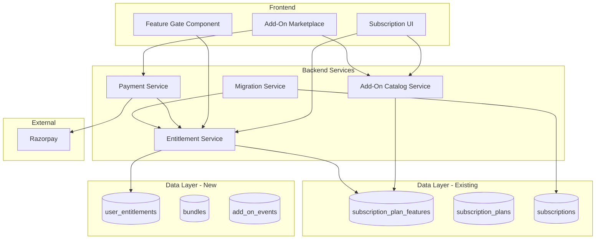

# Design Document: Feature Add-On Subscription System

## Overview

This design document outlines the architecture for transforming SkillPassport's subscription model from a tiered plan system to a modular add-on based system. The new system allows users to purchase individual features or bundles, providing flexibility and enabling granular monetization.

**Key Design Decision**: The existing database already has add-on infrastructure in `subscription_plan_features` table with `is_addon` and `addon_price` columns. This design leverages the existing schema and extends it with new tables for user entitlements, bundles, and analytics.

The system consists of:
1. **Add-On Catalog Service** - Leverages existing `subscription_plan_features` table with `is_addon=true`
2. **Entitlement Service** - NEW: Tracks user purchases and grants feature access
3. **Feature Gate** - Controls access to features based on entitlements
4. **Subscription Manager UI** - User interface for managing add-ons
5. **Migration Service** - Handles transition of existing subscribers

## Existing Database Schema (To Leverage)

The platform already has these subscription-related tables:
- `subscription_plans` - 4 plans (Basic, Professional, Enterprise, Ecosystem)
- `subscription_plan_features` - 84 features with `is_addon` and `addon_price` columns
- `subscriptions` - User subscriptions with Razorpay integration
- `payment_transactions`, `razorpay_orders` - Payment tracking

## Architecture



## Components and Interfaces

### 1. Add-On Catalog Service

Leverages the existing `subscription_plan_features` table where `is_addon = true`. Extends with new metadata.

```typescript
// Types - Maps to existing subscription_plan_features table
interface AddOn {
  id: string;                    // subscription_plan_features.id
  featureKey: string;            // subscription_plan_features.feature_key
  featureName: string;           // subscription_plan_features.feature_name
  category: string;              // subscription_plan_features.category
  addonPrice: number;            // subscription_plan_features.addon_price (to be populated)
  planId: string;                // subscription_plan_features.plan_id (base plan context)
  // Extended fields from new add_on_metadata table
  description?: string;
  targetRoles: UserRole[];
  monthlyPrice: number;
  annualPrice: number;
  iconUrl?: string;
  isActive: boolean;
}

type AddOnCategory = 
  | 'ai_features'
  | 'analytics'
  | 'integrations'
  | 'management'
  | 'assessments'
  | 'certificates'
  | 'support';

type UserRole = 
  | 'student'
  | 'educator'
  | 'school_admin'
  | 'college_admin'
  | 'university_admin'
  | 'recruiter';

interface Bundle {
  id: string;
  name: string;
  slug: string;
  description: string;
  targetRoles: UserRole[];
  includedFeatureKeys: string[];  // References feature_key from subscription_plan_features
  monthlyPrice: number;
  annualPrice: number;
  discountPercentage: number;
  isActive: boolean;
}

// Service Interface
interface AddOnCatalogService {
  getAddOns(filters?: { role?: UserRole; category?: string }): Promise<AddOn[]>;
  getAddOnByFeatureKey(featureKey: string): Promise<AddOn | null>;
  getBundles(role?: UserRole): Promise<Bundle[]>;
  getBundleById(id: string): Promise<Bundle | null>;
  calculateBundleSavings(bundleId: string): Promise<{ totalIndividual: number; bundlePrice: number; savings: number }>;
}
```

### 2. Entitlement Service

Tracks user purchases and manages feature access. This is a NEW service with a new table.

```typescript
interface UserEntitlement {
  id: string;
  userId: string;
  featureKey: string;            // References subscription_plan_features.feature_key
  bundleId?: string;             // If purchased as part of bundle
  status: EntitlementStatus;
  billingPeriod: 'monthly' | 'annual';
  startDate: Date;
  endDate: Date;
  autoRenew: boolean;
  priceAtPurchase: number;
  razorpaySubscriptionId?: string;
  isGrandfathered: boolean;
  grandfatheredUntil?: Date;
}

type EntitlementStatus = 'active' | 'cancelled' | 'expired' | 'grace_period';

interface EntitlementService {
  getUserEntitlements(userId: string): Promise<UserEntitlement[]>;
  hasFeatureAccess(userId: string, featureKey: string): Promise<boolean>;
  activateAddOn(userId: string, featureKey: string, billingPeriod: 'monthly' | 'annual'): Promise<UserEntitlement>;
  activateBundle(userId: string, bundleId: string, billingPeriod: 'monthly' | 'annual'): Promise<UserEntitlement[]>;
  cancelAddOn(entitlementId: string): Promise<UserEntitlement>;
  toggleAutoRenew(entitlementId: string, autoRenew: boolean): Promise<UserEntitlement>;
  calculateTotalCost(userId: string): Promise<{ monthly: number; annual: number }>;
  applyGracePeriod(entitlementId: string): Promise<UserEntitlement>;
}
```

### 3. Feature Gate

Client-side and server-side access control. Checks both plan-based access AND individual add-on entitlements.

```typescript
interface FeatureGateConfig {
  featureKey: string;            // Maps to subscription_plan_features.feature_key
  minimumPlan?: string;          // Plan that includes this feature
  fallbackBehavior: 'hide' | 'show_locked' | 'show_upgrade_prompt';
}

// React Hook - Enhanced to check both plan and add-on entitlements
function useFeatureGate(featureKey: string): {
  hasAccess: boolean;
  isLoading: boolean;
  accessSource: 'plan' | 'addon' | 'bundle' | null;
  requiredAddOn: AddOn | null;
  showUpgradePrompt: () => void;
}

// React Component for gating UI
interface FeatureGateProps {
  featureKey: string;
  children: React.ReactNode;
  fallback?: React.ReactNode;
  showUpgradePrompt?: boolean;
}

// Server-side middleware
function requireFeature(featureKey: string): Middleware;
```

### 4. Payment Integration

Handles add-on purchases through Razorpay. Extends existing payment infrastructure.

```typescript
interface AddOnPurchaseRequest {
  userId: string;
  items: Array<{
    type: 'addon' | 'bundle';
    featureKey?: string;         // For addon type
    bundleId?: string;           // For bundle type
    billingPeriod: 'monthly' | 'annual';
  }>;
  discountCode?: string;
}

interface AddOnPaymentService {
  createOrder(request: AddOnPurchaseRequest): Promise<RazorpayOrder>;
  verifyPayment(orderId: string, paymentId: string, signature: string): Promise<boolean>;
  processSuccessfulPayment(orderId: string): Promise<UserEntitlement[]>;
  calculateProration(userId: string, featureKey: string): Promise<number>;
  applyDiscountCode(code: string, items: AddOnPurchaseRequest['items']): Promise<{ discount: number; finalPrice: number }>;
  createSubscription(userId: string, featureKey: string, billingPeriod: 'monthly' | 'annual'): Promise<RazorpaySubscription>;
}
```

### 5. Migration Service

Handles transition of existing subscribers.

```typescript
interface MigrationMapping {
  planId: string;
  equivalentAddOnIds: string[];
  priceDifference: number;
}

interface MigrationService {
  getMigrationMapping(planId: string): Promise<MigrationMapping>;
  migrateUser(userId: string, preservePricing: boolean): Promise<UserEntitlement[]>;
  calculatePriceProtection(userId: string): Promise<{ originalPrice: number; newPrice: number; protectedUntil: Date }>;
  scheduleMigrationNotification(userId: string, migrationDate: Date): Promise<void>;
}
```

## Data Models

### Existing Tables (No Changes Required)

```sql
-- Already exists: subscription_plans
-- Columns: id, plan_code, name, business_type, entity_type, role_type, 
--          price_monthly, price_yearly, currency, max_users, features, 
--          description, is_recommended, is_active, display_order, etc.

-- Already exists: subscription_plan_features  
-- Columns: id, plan_id, category, feature_key, feature_name, feature_value,
--          is_included, is_addon, addon_price, display_order, created_at
-- NOTE: is_addon and addon_price columns already exist!

-- Already exists: subscriptions
-- Columns: id, user_id, plan_type, plan_amount, billing_cycle, 
--          razorpay_subscription_id, status, auto_renew, etc.
```

### Schema Modifications to Existing Tables

```sql
-- Add monthly/annual pricing to subscription_plan_features for add-ons
ALTER TABLE subscription_plan_features 
ADD COLUMN IF NOT EXISTS addon_price_monthly DECIMAL(10,2),
ADD COLUMN IF NOT EXISTS addon_price_annual DECIMAL(10,2),
ADD COLUMN IF NOT EXISTS addon_description TEXT,
ADD COLUMN IF NOT EXISTS target_roles TEXT[] DEFAULT '{}',
ADD COLUMN IF NOT EXISTS icon_url TEXT,
ADD COLUMN IF NOT EXISTS sort_order_addon INTEGER DEFAULT 0;

-- Update existing add-on features with pricing
UPDATE subscription_plan_features 
SET addon_price_monthly = addon_price,
    addon_price_annual = addon_price * 10  -- 2 months free for annual
WHERE is_addon = true AND addon_price IS NOT NULL;
```

### New Tables Required

```sql
-- User entitlements for purchased add-ons
CREATE TABLE user_entitlements (
  id UUID PRIMARY KEY DEFAULT gen_random_uuid(),
  user_id UUID NOT NULL REFERENCES auth.users(id) ON DELETE CASCADE,
  feature_key TEXT NOT NULL,  -- References subscription_plan_features.feature_key
  bundle_id UUID REFERENCES bundles(id),
  status VARCHAR(20) NOT NULL DEFAULT 'active' CHECK (status IN ('active', 'cancelled', 'expired', 'grace_period')),
  billing_period VARCHAR(10) NOT NULL CHECK (billing_period IN ('monthly', 'annual')),
  start_date TIMESTAMPTZ NOT NULL DEFAULT NOW(),
  end_date TIMESTAMPTZ NOT NULL,
  auto_renew BOOLEAN DEFAULT true,
  price_at_purchase DECIMAL(10,2) NOT NULL,
  razorpay_subscription_id VARCHAR(100),
  is_grandfathered BOOLEAN DEFAULT false,
  grandfathered_until TIMESTAMPTZ,
  cancelled_at TIMESTAMPTZ,
  created_at TIMESTAMPTZ DEFAULT NOW(),
  updated_at TIMESTAMPTZ DEFAULT NOW()
);

-- Bundles of add-ons
CREATE TABLE bundles (
  id UUID PRIMARY KEY DEFAULT gen_random_uuid(),
  name VARCHAR(100) NOT NULL,
  slug VARCHAR(100) UNIQUE NOT NULL,
  description TEXT,
  target_roles TEXT[] NOT NULL DEFAULT '{}',
  monthly_price DECIMAL(10,2) NOT NULL,
  annual_price DECIMAL(10,2) NOT NULL,
  discount_percentage INTEGER NOT NULL DEFAULT 0,
  is_active BOOLEAN DEFAULT true,
  display_order INTEGER DEFAULT 0,
  created_at TIMESTAMPTZ DEFAULT NOW(),
  updated_at TIMESTAMPTZ DEFAULT NOW()
);

-- Bundle to feature mapping
CREATE TABLE bundle_features (
  id UUID PRIMARY KEY DEFAULT gen_random_uuid(),
  bundle_id UUID NOT NULL REFERENCES bundles(id) ON DELETE CASCADE,
  feature_key TEXT NOT NULL,  -- References subscription_plan_features.feature_key
  created_at TIMESTAMPTZ DEFAULT NOW(),
  UNIQUE(bundle_id, feature_key)
);

-- Discount codes for add-ons
CREATE TABLE addon_discount_codes (
  id UUID PRIMARY KEY DEFAULT gen_random_uuid(),
  code VARCHAR(50) UNIQUE NOT NULL,
  discount_type VARCHAR(20) NOT NULL CHECK (discount_type IN ('percentage', 'fixed')),
  discount_value DECIMAL(10,2) NOT NULL,
  applicable_feature_keys TEXT[],  -- NULL means all add-ons
  applicable_bundle_ids UUID[],
  max_uses INTEGER,
  current_uses INTEGER DEFAULT 0,
  valid_from TIMESTAMPTZ NOT NULL,
  valid_until TIMESTAMPTZ NOT NULL,
  is_active BOOLEAN DEFAULT true,
  created_at TIMESTAMPTZ DEFAULT NOW()
);

-- Migration tracking for existing subscribers
CREATE TABLE subscription_migrations (
  id UUID PRIMARY KEY DEFAULT gen_random_uuid(),
  user_id UUID NOT NULL REFERENCES auth.users(id) ON DELETE CASCADE,
  old_plan_code VARCHAR(50) NOT NULL,
  old_subscription_id UUID REFERENCES subscriptions(id),
  migrated_feature_keys TEXT[] NOT NULL,
  original_price DECIMAL(10,2) NOT NULL,
  new_price DECIMAL(10,2) NOT NULL,
  price_protected_until TIMESTAMPTZ,
  migration_date TIMESTAMPTZ NOT NULL,
  notification_sent_at TIMESTAMPTZ,
  migration_status VARCHAR(20) DEFAULT 'pending' CHECK (migration_status IN ('pending', 'notified', 'completed', 'opted_out')),
  created_at TIMESTAMPTZ DEFAULT NOW()
);

-- Analytics events for add-ons
CREATE TABLE addon_events (
  id UUID PRIMARY KEY DEFAULT gen_random_uuid(),
  user_id UUID REFERENCES auth.users(id),
  event_type VARCHAR(50) NOT NULL CHECK (event_type IN ('view', 'purchase', 'activation', 'cancellation', 'renewal', 'expiry', 'upgrade_prompt')),
  feature_key TEXT,
  bundle_id UUID REFERENCES bundles(id),
  metadata JSONB DEFAULT '{}',
  created_at TIMESTAMPTZ DEFAULT NOW()
);

-- Indexes for performance
CREATE INDEX idx_user_entitlements_user_id ON user_entitlements(user_id);
CREATE INDEX idx_user_entitlements_feature_key ON user_entitlements(feature_key);
CREATE INDEX idx_user_entitlements_status ON user_entitlements(status);
CREATE INDEX idx_user_entitlements_end_date ON user_entitlements(end_date);
CREATE INDEX idx_bundle_features_bundle_id ON bundle_features(bundle_id);
CREATE INDEX idx_bundle_features_feature_key ON bundle_features(feature_key);
CREATE INDEX idx_addon_events_user_id ON addon_events(user_id);
CREATE INDEX idx_addon_events_created_at ON addon_events(created_at);
CREATE INDEX idx_addon_events_event_type ON addon_events(event_type);
CREATE INDEX idx_subscription_plan_features_is_addon ON subscription_plan_features(is_addon) WHERE is_addon = true;

-- RLS Policies
ALTER TABLE user_entitlements ENABLE ROW LEVEL SECURITY;
ALTER TABLE bundles ENABLE ROW LEVEL SECURITY;
ALTER TABLE bundle_features ENABLE ROW LEVEL SECURITY;
ALTER TABLE addon_discount_codes ENABLE ROW LEVEL SECURITY;
ALTER TABLE addon_events ENABLE ROW LEVEL SECURITY;

-- Users can read their own entitlements
CREATE POLICY "Users can view own entitlements" ON user_entitlements
  FOR SELECT USING (auth.uid() = user_id);

-- Bundles are publicly readable
CREATE POLICY "Bundles are publicly readable" ON bundles
  FOR SELECT USING (is_active = true);

CREATE POLICY "Bundle features are publicly readable" ON bundle_features
  FOR SELECT USING (true);

-- Discount codes readable by authenticated users
CREATE POLICY "Discount codes readable by authenticated" ON addon_discount_codes
  FOR SELECT USING (auth.role() = 'authenticated' AND is_active = true);

-- Events only insertable by authenticated users for themselves
CREATE POLICY "Users can insert own events" ON addon_events
  FOR INSERT WITH CHECK (auth.uid() = user_id);
```

## Correctness Properties

*A property is a characteristic or behavior that should hold true across all valid executions of a system—essentially, a formal statement about what the system should do. Properties serve as the bridge between human-readable specifications and machine-verifiable correctness guarantees.*

### Property 1: Add-On Data Integrity
*For any* feature with `is_addon = true` in `subscription_plan_features`, retrieving it shall return an object containing all required fields (feature_key, feature_name, category, addon_price_monthly) with valid values.
**Validates: Requirements 1.1**

### Property 2: Feature Key Uniqueness
*For any* two add-on features in the catalog, their `feature_key` values shall be distinct within the same plan context, and attempting to create a duplicate shall fail with a validation error.
**Validates: Requirements 1.2**

### Property 3: Role-Based Filtering
*For any* role filter applied to the add-on catalog, all returned add-ons shall have that role in their `target_roles` array, and no add-ons targeting only other roles shall be included.
**Validates: Requirements 1.3**

### Property 4: Deprecation Preserves Access
*For any* add-on that is marked inactive (`is_addon = false` or `is_active = false`), existing users with active entitlements shall retain access until their entitlement expires, while new purchases shall be blocked.
**Validates: Requirements 1.4**

### Property 5: Payment-Activation Relationship
*For any* add-on purchase, successful Razorpay payment verification shall result in immediate entitlement creation with correct end date, while failed payment shall not create any entitlement.
**Validates: Requirements 4.2, 4.5**

### Property 6: Multi-Add-On Purchase
*For any* transaction containing multiple add-ons, successful payment shall activate all add-ons in the transaction, and the total charge shall equal the sum of individual prices minus any applicable discounts.
**Validates: Requirements 4.3**

### Property 7: Proration Calculation
*For any* mid-cycle add-on purchase, the prorated charge shall equal (remaining_days / total_days) * full_price, rounded to two decimal places.
**Validates: Requirements 4.4**

### Property 8: Bundle Activation
*For any* bundle purchase, all features listed in `bundle_features` for that bundle shall have entitlements created, and the user shall have access to all included feature_keys.
**Validates: Requirements 5.1, 5.2, 5.3, 5.4**

### Property 9: Bundle Savings Calculation
*For any* bundle, the displayed savings shall equal the sum of individual add-on prices minus the bundle price, and this shall always be a positive value.
**Validates: Requirements 5.5**

### Property 10: Entitlement-Based Access Control
*For any* feature access check, access shall be granted if and only if: (a) the user's subscription plan includes the feature (`is_included = true`), OR (b) the user has an active entitlement for that `feature_key`.
**Validates: Requirements 6.1, 6.4**

### Property 11: Entitlement Cache Consistency
*For any* entitlement change (activation, cancellation, expiry), the SubscriptionContext cache shall be invalidated within 5 minutes, and subsequent access checks shall reflect the new state.
**Validates: Requirements 6.3**

### Property 12: Cancellation Grace Period
*For any* cancelled add-on, access shall be maintained until the `end_date` of the entitlement, and for failed renewals, a 7-day grace period shall be applied before access revocation.
**Validates: Requirements 7.2, 7.4**

### Property 13: Auto-Renewal Toggle
*For any* entitlement, toggling `auto_renew` shall persist the new value and affect only that specific entitlement without modifying other user entitlements.
**Validates: Requirements 7.3**

### Property 14: Total Cost Calculation
*For any* user with multiple active entitlements, the total cost shall equal the sum of all individual entitlement prices, correctly accounting for monthly vs annual billing periods.
**Validates: Requirements 7.5**

### Property 15: Active Add-On Indication
*For any* add-on in the catalog view, if the user has an active entitlement for that `feature_key`, it shall be marked as "owned" or "active" in the response.
**Validates: Requirements 8.4**

### Property 16: Discount Code Application
*For any* valid discount code applied to a purchase, the final price shall be reduced by the discount amount, and the code's `current_uses` shall be incremented.
**Validates: Requirements 8.5**

### Property 17: Plan-to-AddOn Migration Mapping
*For any* existing subscription, the migration mapping shall produce a set of `feature_keys` that collectively provide all features the user had access to under their original plan.
**Validates: Requirements 9.1**

### Property 18: Price Protection for Existing Subscribers
*For any* migrated user whose equivalent add-ons cost more than their original plan, the system shall apply price protection at the original price for 12 months from migration date via `grandfathered_until`.
**Validates: Requirements 9.2, 9.5**

### Property 19: Migration Notification Timing
*For any* scheduled migration, notification shall be sent exactly 30 days before the migration date, and the `notification_sent_at` record shall be persisted.
**Validates: Requirements 9.4**

### Property 20: Event Tracking Completeness
*For any* add-on lifecycle event (purchase, activation, cancellation, renewal, expiry), an `addon_events` record shall be created with correct `event_type`, `user_id`, `feature_key`, and timestamp.
**Validates: Requirements 10.1**

## Error Handling

### Payment Failures
- Failed payments trigger immediate notification to user
- No entitlement is created for failed payments
- Retry mechanism with exponential backoff for transient failures

### Renewal Failures
- 7-day grace period before access revocation
- Daily retry attempts during grace period
- Email notifications at day 1, 3, and 7

### Cache Failures
- Fallback to database query on cache miss
- Circuit breaker pattern for cache service
- Graceful degradation with slightly higher latency

### Migration Failures
- Atomic transactions for migration operations
- Rollback capability for partial migrations
- Manual intervention queue for failed migrations

## Testing Strategy

### Unit Tests
- Add-on CRUD operations
- Entitlement state transitions
- Price calculations (proration, bundles, discounts)
- Feature flag matching logic
- Migration mapping logic

### Property-Based Tests
- All 20 correctness properties implemented using fast-check
- Minimum 100 iterations per property test
- Custom generators for add-ons, entitlements, and user scenarios

### Integration Tests
- End-to-end purchase flow
- Payment webhook handling
- Cache invalidation
- Migration workflow

### Performance Tests
- Feature gate latency under load
- Cache hit rates
- Database query performance with indexes
