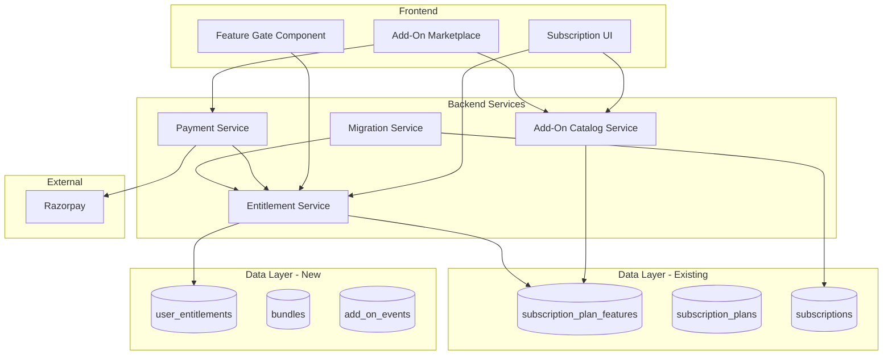

# Design Document: Feature Add-On Subscription System

## Overview

This design document outlines the architecture for transforming SkillPassport's subscription model from a tiered plan system to a modular add-on based system. The new system allows users to purchase individual features or bundles, providing flexibility and enabling granular monetization.

**Key Design Decision**: The existing database already has add-on infrastructure in `subscription_plan_features` table with `is_addon` and `addon_price` columns. This design leverages the existing schema and extends it with new tables for user entitlements, bundles, and analytics.

The system consists of:
1. **Add-On Catalog Service** - Leverages existing `subscription_plan_features` table with `is_addon=true`        
2. **Entitlement Service** - NEW: Tracks user purchases and grants feature access
3. **Feature Gate** - Controls access to features based on entitlements
4. **Subscription Manager UI** - User interface for managing add-ons
5. **Migration Service** - Handles transition of existing subscribers

## Existing Database Schema (To Leverage)

The platform already has these subscription-related tables:
- `subscription_plans` - 4 plans (Basic, Professional, Enterprise, Ecosystem)
- `subscription_plan_features` - 84 features with `is_addon` and `addon_price` columns
- `subscriptions` - User subscriptions with Razorpay integration
- `payment_transactions`, `razorpay_orders` - Payment tracking

## Architecture



## Components and Interfaces

### 1. Add-On Catalog Service

Leverages the existing `subscription_plan_features` table where `is_addon = true`. Extends with new metadata.     

```typescript
// Types - Maps to existing subscription_plan_features table
interface AddOn {
  id: string;                    // subscription_plan_features.id
  featureKey: string;            // subscription_plan_features.feature_key
  featureName: string;           // subscription_plan_features.feature_name
  category: string;              // subscription_plan_features.category
  addonPrice: number;            // subscription_plan_features.addon_price (to be populated)
  planId: string;                // subscription_plan_features.plan_id (base plan context)
  // Extended fields from new add_on_metadata table
  description?: string;
  targetRoles: UserRole[];
  monthlyPrice: number;
  annualPrice: number;
  iconUrl?: string;
  isActive: boolean;
}

type AddOnCategory =
  | 'ai_features'
  | 'analytics'
  | 'integrations'
  | 'management'
  | 'assessments'
  | 'certificates'
  | 'support';

type UserRole = 
  | 'student'
  | 'educator'
  | 'school_admin'
  | 'college_admin'
  | 'university_admin'
  | 'recruiter';

interface Bundle {
  id: string;
  name: string;
  slug: string;
  description: string;
  targetRoles: UserRole[];
  includedFeatureKeys: string[];  // References feature_key from subscription_plan_features
  monthlyPrice: number;
  annualPrice: number;
  discountPercentage: number;
  isActive: boolean;
}

// Service Interface
interface AddOnCatalogService {
  getAddOns(filters?: { role?: UserRole; category?: string }): Promise<AddOn[]>;
  getAddOnByFeatureKey(featureKey: string): Promise<AddOn | null>;
  getBundles(role?: UserRole): Promise<Bundle[]>;
  getBundleById(id: string): Promise<Bundle | null>;
  calculateBundleSavings(bundleId: string): Promise<{ totalIndividual: number; bundlePrice: number; savings: number }>;
}
```

### 2. Entitlement Service

Tracks user purchases and manages feature access. This is a NEW service with a new table.

```typescript
interface UserEntitlement {
  id: string;
  userId: string;
  featureKey: string;            // References subscription_plan_features.feature_key
  bundleId?: string;             // If purchased as part of bundle
  status: EntitlementStatus;
  billingPeriod: 'monthly' | 'annual';
  startDate: Date;
  endDate: Date;
  autoRenew: boolean;
  priceAtPurchase: number;
  razorpaySubscriptionId?: string;
  isGrandfathered: boolean;
  grandfatheredUntil?: Date;
}

type EntitlementStatus = 'active' | 'cancelled' | 'expired' | 'grace_period';

interface EntitlementService {
  getUserEntitlements(userId: string): Promise<UserEntitlement[]>;
  hasFeatureAccess(userId: string, featureKey: string): Promise<boolean>;
  activateAddOn(userId: string, featureKey: string, billingPeriod: 'monthly' | 'annual'): Promise<UserEntitlement>;
  activateBundle(userId: string, bundleId: string, billingPeriod: 'monthly' | 'annual'): Promise<UserEntitlement[]>;
  cancelAddOn(entitlementId: string): Promise<UserEntitlement>;
  toggleAutoRenew(entitlementId: string, autoRenew: boolean): Promise<UserEntitlement>;
  calculateTotalCost(userId: string): Promise<{ monthly: number; annual: number }>;
  applyGracePeriod(entitlementId: string): Promise<UserEntitlement>;
}
```

### 3. Feature Gate

Client-side and server-side access control. Checks both plan-based access AND individual add-on entitlements.     

```typescript
interface FeatureGateConfig {
  featureKey: string;            // Maps to subscription_plan_features.feature_key
  minimumPlan?: string;          // Plan that includes this feature
  fallbackBehavior: 'hide' | 'show_locked' | 'show_upgrade_prompt';
}

// React Hook - Enhanced to check both plan and add-on entitlements
function useFeatureGate(featureKey: string): {
  hasAccess: boolean;
  isLoading: boolean;
  accessSource: 'plan' | 'addon' | 'bundle' | null;
  requiredAddOn: AddOn | null;
  showUpgradePrompt: () => void;
}

// React Component for gating UI
interface FeatureGateProps {
  featureKey: string;
  children: React.ReactNode;
  fallback?: React.ReactNode;
  showUpgradePrompt?: boolean;
}

// Server-side middleware
function requireFeature(featureKey: string): Middleware;
```

### 4. Payment Integration

Handles add-on purchases through Razorpay. Extends existing payment infrastructure.

```typescript
interface AddOnPurchaseRequest {
  userId: string;
  items: Array<{
    type: 'addon' | 'bundle';
    featureKey?: string;         // For addon type
    bundleId?: string;           // For bundle type
    billingPeriod: 'monthly' | 'annual';
  }>;
  discountCode?: string;
}

interface AddOnPaymentService {
  createOrder(request: AddOnPurchaseRequest): Promise<RazorpayOrder>;
  verifyPayment(orderId: string, paymentId: string, signature: string): Promise<boolean>;
  processSuccessfulPayment(orderId: string): Promise<UserEntitlement[]>;
  calculateProration(userId: string, featureKey: string): Promise<{ amount: number; description: string }>;
  handleFailedPayment(orderId: string): Promise<void>;
}
```