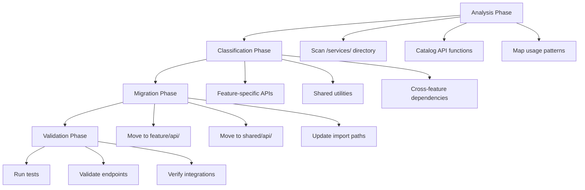

# Design Document: FSD Phase 5 - Service API Migration

## Overview

Phase 5 of the Feature-Sliced Design (FSD) migration focuses on systematically moving API functions from the centralized `/services/` directory to feature-specific `/api/` directories. This migration improves code organization, enhances feature isolation, and integrates with the Zustand stores established in Phase 4.

The migration involves three key transformations:
1. **Structural Migration**: Moving API functions from `/services/` to appropriate feature directories
2. **Integration Enhancement**: Connecting migrated APIs with existing Zustand stores
3. **Dependency Resolution**: Handling shared utilities and cross-feature dependencies

This phase builds upon the foundation established in previous phases, particularly the Zustand store architecture from Phase 4, ensuring that API functions properly integrate with state management patterns.

## Architecture

### Migration Strategy

The migration follows a systematic approach with four distinct phases:



### Target Architecture

The migration transforms the current centralized structure into a distributed FSD-compliant architecture:

**Before Migration:**
```
/services/
  ├── authService.js
  ├── subscriptionService.js
  ├── searchService.js
  ├── portfolioService.js
  └── utilityService.js
```

**After Migration:**
```
/src/
  ├── features/
  │   ├── authentication/
  │   │   └── api/
  │   │       └── authApi.js
  │   ├── subscription/
  │   │   └── api/
  │   │       └── subscriptionApi.js
  │   ├── search/
  │   │   └── api/
  │   │       └── searchApi.js
  │   └── portfolio/
  │       └── api/
  │           └── portfolioApi.js
  └── shared/
      └── api/
          ├── httpClient.js
          ├── apiUtils.js
          └── index.js
```

### Integration Points

The migrated APIs integrate with existing systems through well-defined interfaces:

1. **Zustand Store Integration**: API functions connect directly with store actions
2. **Error Handling**: Consistent error patterns across all features
3. **Type Safety**: Maintained TypeScript definitions and response types
4. **Testing**: Preserved test coverage with updated import paths

## Components and Interfaces

### Migration System Components

#### API Analyzer
Responsible for scanning and cataloging existing API functions:

```typescript
interface APIAnalyzer {
  scanServices(): ServiceFile[]
  extractFunctions(file: ServiceFile): APIFunction[]
  mapToFeatures(functions: APIFunction[]): FeatureMapping[]
  identifyDependencies(functions: APIFunction[]): DependencyGraph
}
```

#### Migration Engine
Handles the actual file movement and transformation:

```typescript
interface MigrationEngine {
  migrateFeatureAPIs(mapping: FeatureMapping[]): MigrationResult
  migrateSharedAPIs(sharedFunctions: APIFunction[]): MigrationResult
  updateImportPaths(changes: PathChange[]): UpdateResult
  validateMigration(): ValidationResult
}
```

#### Store Integrator
Connects migrated APIs with Zustand stores:

```typescript
interface StoreIntegrator {
  identifyStoreActions(apiFunction: APIFunction): StoreAction[]
  integrateWithStore(apiFunction: APIFunction, store: ZustandStore): Integration
  validateStoreIntegration(integration: Integration): boolean
}
```

### API Function Classification

API functions are classified into three categories:

#### Feature-Specific APIs
Functions that belong to a single feature domain:
- Authentication APIs → `/features/authentication/api/`
- Subscription APIs → `/features/subscription/api/`
- Search APIs → `/features/search/api/`
- Portfolio APIs → `/features/portfolio/api/`

#### Shared Utilities
Common functionality used across multiple features:
- HTTP client configuration
- Request/response interceptors
- Common error handling
- API endpoint constants

#### Cross-Feature Dependencies
Functions that legitimately need to interact across feature boundaries, handled through:
- Shared API layer for common operations
- Event-driven communication for loose coupling
- Documented architectural decisions for tight coupling

### Zustand Store Integration Patterns

#### Authentication Integration
```typescript
// Before: Direct API call
const loginUser = async (credentials) => {
  const response = await authService.login(credentials);
  // Manual state updates
};

// After: Integrated with store
const loginUser = async (credentials) => {
  const response = await authApi.login(credentials);
  useAuthActions.getState().setUser(response.user);
  useAuthActions.getState().setToken(response.token);
};
```

#### Subscription Integration
```typescript
// Integrated with subscription store
const updateSubscription = async (planId) => {
  const response = await subscriptionApi.updatePlan(planId);
  useSubscriptionStore.getState().updatePlan(response.plan);
  useSubscriptionStore.getState().setStatus(response.status);
};
```

## Data Models

### Migration Metadata

#### ServiceFile
```typescript
interface ServiceFile {
  path: string;
  name: string;
  functions: APIFunction[];
  dependencies: string[];
  exports: ExportDeclaration[];
}
```

#### APIFunction
```typescript
interface APIFunction {
  name: string;
  signature: string;
  feature: string | null;
  isShared: boolean;
  dependencies: string[];
  usageCount: number;
  storeIntegrations: StoreIntegration[];
}
```

#### FeatureMapping
```typescript
interface FeatureMapping {
  feature: string;
  functions: APIFunction[];
  targetPath: string;
  storeIntegrations: StoreIntegration[];
}
```

#### StoreIntegration
```typescript
interface StoreIntegration {
  storeName: string;
  actions: string[];
  selectors: string[];
  integrationPattern: 'direct' | 'event-driven' | 'callback';
}
```

### Migration Results

#### MigrationResult
```typescript
interface MigrationResult {
  success: boolean;
  migratedFiles: string[];
  updatedImports: ImportUpdate[];
  errors: MigrationError[];
  warnings: string[];
  rollbackData: RollbackData;
}
```

#### ValidationResult
```typescript
interface ValidationResult {
  testsPass: boolean;
  endpointsAccessible: boolean;
  storeIntegrationsValid: boolean;
  importPathsResolved: boolean;
  errors: ValidationError[];
}
```

### Store Integration Models

#### ZustandStoreMapping
```typescript
interface ZustandStoreMapping {
  storeName: string;
  actions: StoreAction[];
  selectors: StoreSelector[];
  apiIntegrations: APIIntegration[];
}
```

#### APIIntegration
```typescript
interface APIIntegration {
  apiFunction: string;
  triggerActions: string[];
  readSelectors: string[];
  errorHandling: ErrorHandlingPattern;
}
```
## Correctness Properties

*A property is a characteristic or behavior that should hold true across all valid executions of a system-essentially, a formal statement about what the system should do. Properties serve as the bridge between human-readable specifications and machine-verifiable correctness guarantees.*

### Property 1: Complete Discovery and Cataloging

*For any* `/services/` directory structure, the Migration System should discover all service files, extract all API functions within those files, and catalog all imports referencing those functions across the entire codebase.

**Validates: Requirements 1.1, 1.2, 3.1**

### Property 2: Accurate Classification

*For any* set of API functions, the Migration System should correctly classify each function as feature-specific or shared utility, map feature-specific functions to their corresponding FSD features, and identify cross-feature dependencies based on usage patterns.

**Validates: Requirements 1.3, 1.4, 1.5, 9.1**

### Property 3: Correct Migration Placement

*For any* classified API function, the Migration System should move feature-specific functions to their appropriate feature API directories, move shared utilities to `/src/shared/api/`, and group multiple functions belonging to the same feature in a single API file.

**Validates: Requirements 2.1, 2.2, 2.5, 4.1**

### Property 4: Import Path Consistency

*For any* import statement referencing a migrated API function, the Migration System should update the import path to the new location while preserving import aliases, destructuring patterns, and handling both relative and absolute paths correctly.

**Validates: Requirements 3.2, 3.3, 3.4, 4.3**

### Property 5: Function Preservation

*For any* migrated API function, the original function signature, behavior, error handling patterns, and response formats should remain unchanged after migration.

**Validates: Requirements 2.3, 2.4, 7.4, 7.5**

### Property 6: Store Integration Completeness

*For any* API function that updates application state, the Migration System should integrate it with the appropriate Zustand store actions (useAuthActions for user state, useSubscriptionStore for subscriptions, useSearchActions for search, usePortfolioActions for portfolio) and ensure proper store state updates and re-renders.

**Validates: Requirements 11.1, 11.2, 11.4, 11.5, 12.1, 12.2, 12.3, 12.4**

### Property 7: Legacy Pattern Replacement

*For any* API function using legacy context patterns, the Migration System should replace them with Zustand store selectors and ensure consistent patterns across all migrated functions.

**Validates: Requirements 11.3, 5.1, 5.2, 5.3, 5.4**

### Property 8: Validation and Testing Integrity

*For any* completed migration, the Validation System should execute all existing tests, verify API endpoint accessibility, and confirm that all updated imports resolve correctly.

**Validates: Requirements 7.1, 7.3, 3.5**

### Property 9: Services Directory Cleanup

*For any* migration completion, the Migration System should remove empty service files, preserve only shared utilities in `/services/`, and validate that no feature-specific code remains in the services directory.

**Validates: Requirements 6.1, 6.2, 6.4**

### Property 10: Rollback Completeness

*For any* migration that requires rollback, the Migration System should restore all files to their pre-migration state using created backups, validate the rollback success, and clean up any migration artifacts.

**Validates: Requirements 8.1, 8.3, 8.4, 8.5**

### Property 11: Architectural Compliance

*For any* cross-feature API dependencies, the Migration System should prevent circular dependencies, ensure compliance with FSD best practices, and suggest refactoring opportunities for tightly coupled functions.

**Validates: Requirements 9.3, 9.5, 9.4**

### Property 12: Comprehensive Documentation

*For any* completed migration, the Migration System should generate a complete migration report listing all moved files and functions, document standardized patterns, report cross-feature dependencies, list required manual interventions, and provide future improvement recommendations.

**Validates: Requirements 13.1, 13.2, 13.3, 13.4, 13.5, 4.4, 6.5, 9.2, 12.5**

### Property 13: Shared Utility Organization

*For any* shared API utilities, the Migration System should create appropriate barrel exports, ensure consistent naming conventions, and update all references to use the new shared API paths.

**Validates: Requirements 4.2, 4.5**

### Property 14: Error Reporting and Recommendations

*For any* migration issues or non-standard patterns, the Migration System should report specific test failures with likely causes, create deprecation notices for legacy files, and provide migration recommendations for deviating patterns.

**Validates: Requirements 7.2, 6.3, 5.5**

### Property 15: Change Tracking and Logging

*For any* migration operation, the Migration System should maintain a complete log of all changes made during migration and create backups of all files before modification.

**Validates: Requirements 8.2**

## Error Handling

### Migration Error Categories

The system handles four categories of errors during migration:

#### 1. Discovery Errors
- **Missing Service Files**: When expected service files are not found
- **Parse Errors**: When service files contain syntax errors preventing analysis
- **Dependency Resolution Failures**: When import dependencies cannot be resolved

**Handling Strategy**: Log errors, skip problematic files, continue with remaining files, report all issues in final summary.

#### 2. Classification Errors
- **Ambiguous Feature Mapping**: When API functions could belong to multiple features
- **Circular Dependencies**: When functions create circular dependency chains
- **Unknown Usage Patterns**: When function usage doesn't match expected patterns

**Handling Strategy**: Apply conservative classification (move to shared), document ambiguous cases, require manual review for complex scenarios.

#### 3. Migration Errors
- **File System Errors**: When directories cannot be created or files cannot be moved
- **Import Update Failures**: When import paths cannot be updated correctly
- **Store Integration Conflicts**: When API functions conflict with existing store patterns

**Handling Strategy**: Halt migration on critical errors, maintain rollback capability, provide detailed error messages with suggested fixes.

#### 4. Validation Errors
- **Test Failures**: When existing tests fail after migration
- **Endpoint Accessibility Issues**: When API endpoints become unreachable
- **Store Integration Problems**: When store updates don't trigger correctly

**Handling Strategy**: Automatic rollback on validation failure, detailed failure reporting, suggested remediation steps.

### Error Recovery Mechanisms

#### Automatic Recovery
- **Retry Logic**: For transient file system operations
- **Fallback Paths**: Alternative migration strategies for edge cases
- **Partial Success Handling**: Continue migration when non-critical components fail

#### Manual Recovery
- **Rollback System**: Complete restoration to pre-migration state
- **Selective Rollback**: Rollback specific features while preserving others
- **Manual Intervention Points**: Clear guidance for complex cases requiring human decision

#### Error Reporting
- **Structured Error Messages**: Consistent format with error codes, descriptions, and suggested actions
- **Context Preservation**: Full context of what was being attempted when error occurred
- **Recovery Guidance**: Step-by-step instructions for resolving each error type

## Testing Strategy

### Dual Testing Approach

The testing strategy employs both unit tests and property-based tests to ensure comprehensive coverage:

**Unit Tests** focus on:
- Specific migration scenarios with known inputs and expected outputs
- Edge cases like empty service files, malformed imports, and circular dependencies
- Integration points between migration components
- Error conditions and recovery mechanisms

**Property-Based Tests** focus on:
- Universal properties that must hold across all possible inputs
- Comprehensive input coverage through randomization
- Invariants that must be preserved during migration
- Round-trip properties for reversible operations

### Property-Based Testing Configuration

**Testing Library**: fast-check for JavaScript/TypeScript property-based testing
**Test Configuration**: Minimum 100 iterations per property test
**Test Tagging**: Each property test references its design document property

Example property test structure:
```typescript
// Feature: fsd-phase-5-service-api-migration, Property 1: Complete Discovery and Cataloging
fc.assert(fc.property(
  fc.array(serviceFileGenerator),
  (serviceFiles) => {
    const result = migrationSystem.discoverAndCatalog(serviceFiles);
    return result.discoveredFiles.length === serviceFiles.length &&
           result.catalogedFunctions.length >= 0 &&
           result.importReferences.length >= 0;
  }
), { numRuns: 100 });
```

### Unit Testing Strategy

**Migration Component Tests**:
- Test API analyzer with various service file structures
- Test migration engine with different function types and dependencies
- Test store integrator with various Zustand store configurations
- Test validation system with different error scenarios

**Integration Tests**:
- End-to-end migration scenarios with realistic project structures
- Store integration tests with actual Zustand stores
- Import path resolution tests with complex dependency graphs
- Rollback tests with various failure scenarios

**Error Handling Tests**:
- Test each error category with specific failure conditions
- Test recovery mechanisms with various error states
- Test error reporting with different error combinations
- Test rollback functionality with partial migration states

### Test Data Generation

**Service File Generators**: Create realistic service files with various API function patterns
**Dependency Graph Generators**: Generate complex import dependency structures
**Store Configuration Generators**: Create various Zustand store setups for integration testing
**Error Condition Generators**: Systematically generate different error scenarios

### Validation Testing

**Pre-Migration Validation**:
- Verify all existing tests pass before migration
- Confirm all API endpoints are accessible
- Validate current import paths resolve correctly

**Post-Migration Validation**:
- Execute complete test suite after migration
- Verify API endpoint accessibility is maintained
- Confirm all updated import paths resolve
- Validate store integrations trigger correctly

**Rollback Validation**:
- Verify rollback restores exact pre-migration state
- Confirm all tests pass after rollback
- Validate no migration artifacts remain