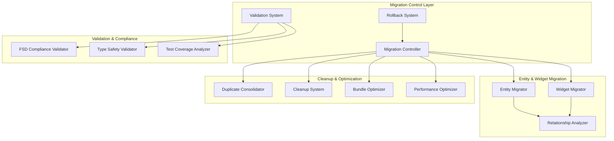
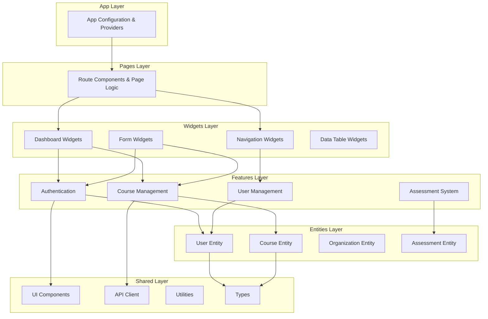

# Design Document: FSD Phase 6 Entities and Widgets Cleanup

## Overview

This design document outlines the technical architecture for Phase 6 of the Feature-Sliced Design (FSD) migration - the final phase that completes the FSD layer hierarchy by implementing the Entities and Widgets layers, performing comprehensive cleanup of deprecated code, and optimizing the application for production.

Phase 6 represents the culmination of a multi-phase architectural transformation, building upon the foundation established in previous phases:
- Phase 1-2: Shared layer and authentication migration
- Phase 3-4: High-impact and role-specific feature migration  
- Phase 5: Service API migration and tooling infrastructure

This phase focuses on three critical objectives:
1. **Complete FSD Layer Implementation**: Establish the Entities and Widgets layers to achieve full FSD architectural compliance
2. **Comprehensive Cleanup**: Remove all deprecated code structures and consolidate duplicates
3. **Production Optimization**: Implement performance optimizations, bundle size reduction, and comprehensive validation

The migration leverages the automated tooling system built in Phase 5, ensuring zero-downtime migration with comprehensive rollback capabilities.

## Architecture

### System Architecture Overview

The Phase 6 migration system extends the existing Migration_System with specialized components for entity/widget migration, cleanup operations, and optimization:



### FSD Layer Architecture

The completed FSD architecture after Phase 6 migration:



## Components and Interfaces

### Entity Migration System

The Entity Migration System handles the extraction and organization of business entities into the FSD Entities layer.

#### Entity Migrator Component

```typescript
interface EntityMigrator {
  analyzeEntities(): Promise<EntityAnalysis[]>
  migrateEntity(entity: EntityDefinition): Promise<MigrationResult>
  validateEntityStructure(entityPath: string): Promise<ValidationResult>
  updateImportPaths(entity: string, oldPaths: string[], newPaths: string[]): Promise<void>
}

interface EntityDefinition {
  name: string
  sourceFiles: string[]
  models: ModelFile[]
  uiComponents: ComponentFile[]
  apiMethods: ApiFile[]
  relationships: EntityRelationship[]
}

interface EntityAnalysis {
  entity: string
  complexity: 'simple' | 'moderate' | 'complex'
  dependencies: string[]
  usageCount: number
  migrationRisk: 'low' | 'medium' | 'high'
}
```

#### Entity Structure Template

Each entity follows a standardized directory structure:

```
src/entities/{entity-name}/
├── index.ts              # Public API exports
├── model/
│   ├── index.ts          # Model exports
│   ├── types.ts          # TypeScript interfaces
│   ├── validation.ts     # Validation logic
│   └── utils.ts          # Entity utilities
├── ui/
│   ├── index.ts          # UI exports
│   ├── {Entity}Card.tsx  # Display components
│   ├── {Entity}Form.tsx  # Form components
│   └── {Entity}List.tsx  # List components
└── api/
    ├── index.ts          # API exports
    ├── queries.ts        # Data fetching
    └── mutations.ts      # Data mutations
```

### Widget Migration System

The Widget Migration System identifies and migrates complex composite UI components to the Widgets layer.

#### Widget Migrator Component

```typescript
interface WidgetMigrator {
  identifyWidgets(): Promise<WidgetCandidate[]>
  analyzeComposition(component: ComponentFile): Promise<CompositionAnalysis>
  migrateWidget(widget: WidgetDefinition): Promise<MigrationResult>
  validateWidgetDependencies(widgetPath: string): Promise<ValidationResult>
}

interface WidgetCandidate {
  name: string
  sourceFile: string
  featureDependencies: string[]
  entityDependencies: string[]
  complexity: number
  isComposite: boolean
}

interface CompositionAnalysis {
  features: string[]
  entities: string[]
  sharedComponents: string[]
  stateManagement: 'local' | 'context' | 'store'
  migrationStrategy: 'direct' | 'refactor' | 'split'
}
```

#### Widget Structure Template

```
src/widgets/{widget-name}/
├── index.ts              # Public API exports
├── ui/
│   ├── index.ts          # UI exports
│   ├── {Widget}.tsx      # Main widget component
│   └── components/       # Internal components
└── model/
    ├── index.ts          # Model exports
    ├── types.ts          # Widget-specific types
    └── store.ts          # Widget state (if needed)
```

### Cleanup and Consolidation System

#### Duplicate Code Consolidator

```typescript
interface DuplicateConsolidator {
  scanForDuplicates(): Promise<DuplicateGroup[]>
  analyzeSemantic(files: string[]): Promise<SemanticAnalysis>
  consolidateDuplicates(group: DuplicateGroup): Promise<ConsolidationResult>
  updateReferences(oldPath: string, newPath: string): Promise<void>
}

interface DuplicateGroup {
  id: string
  files: string[]
  similarity: number
  canonicalLocation: string
  consolidationStrategy: 'merge' | 'replace' | 'extract'
}

interface SemanticAnalysis {
  functionalEquivalence: boolean
  typeCompatibility: boolean
  sideEffects: string[]
  dependencies: string[]
}
```

#### Deprecated Structure Cleanup

```typescript
interface CleanupSystem {
  analyzeDeprecatedStructure(): Promise<CleanupAnalysis>
  validateSafeToDelete(filePath: string): Promise<boolean>
  performCleanup(plan: CleanupPlan): Promise<CleanupResult>
  generateCleanupReport(): Promise<CleanupReport>
}

interface CleanupAnalysis {
  deprecatedDirectories: string[]
  orphanedFiles: string[]
  activeReferences: ReferenceMap
  safeToDelete: string[]
  requiresManualReview: string[]
}
```

### Optimization Systems

#### Bundle Optimizer

```typescript
interface BundleOptimizer {
  analyzeCurrentBundles(): Promise<BundleAnalysis>
  identifyOptimizations(): Promise<OptimizationOpportunity[]>
  implementCodeSplitting(): Promise<SplittingResult>
  optimizeTreeShaking(): Promise<TreeShakingResult>
}

interface BundleAnalysis {
  totalSize: number
  chunkSizes: Record<string, number>
  largeDependencies: Dependency[]
  unusedExports: string[]
  duplicatedModules: string[]
}

interface OptimizationOpportunity {
  type: 'code-splitting' | 'tree-shaking' | 'dependency-replacement'
  impact: 'high' | 'medium' | 'low'
  estimatedSavings: number
  implementationComplexity: 'simple' | 'moderate' | 'complex'
}
```

#### Performance Optimizer

```typescript
interface PerformanceOptimizer {
  analyzeRenderPerformance(): Promise<PerformanceAnalysis>
  identifyOptimizations(): Promise<PerformanceOptimization[]>
  implementOptimizations(optimizations: PerformanceOptimization[]): Promise<OptimizationResult>
  measureImprovements(): Promise<PerformanceMetrics>
}

interface PerformanceAnalysis {
  expensiveComponents: ComponentMetrics[]
  unnecessaryRerenders: RerenderAnalysis[]
  heavyComputations: ComputationAnalysis[]
  storeOptimizations: StoreOptimization[]
}
```

### Validation and Compliance Systems

#### FSD Compliance Validator

```typescript
interface FSDComplianceValidator {
  validateLayerHierarchy(): Promise<HierarchyValidation>
  validateDependencies(): Promise<DependencyValidation>
  validatePublicAPIs(): Promise<APIValidation>
  generateComplianceReport(): Promise<ComplianceReport>
}

interface HierarchyValidation {
  layerStructure: LayerValidation[]
  upwardDependencies: Violation[]
  crossLayerImports: ImportValidation[]
  publicAPIUsage: APIUsageValidation[]
}
```

## Data Models

### Core Migration Models

#### Entity Model

```typescript
interface Entity {
  name: string
  type: EntityType
  domain: string
  models: EntityModel[]
  relationships: EntityRelationship[]
  uiComponents: EntityComponent[]
  apiMethods: EntityAPI[]
}

type EntityType = 'User' | 'Course' | 'Organization' | 'Assessment' | 'Project' | 'Certificate' | 'Message' | 'Subscription'

interface EntityModel {
  name: string
  filePath: string
  interfaces: TypeInterface[]
  validationRules: ValidationRule[]
  businessLogic: BusinessLogicMethod[]
}

interface EntityRelationship {
  type: 'one-to-one' | 'one-to-many' | 'many-to-many'
  target: string
  foreignKey?: string
  description: string
}
```

#### Widget Model

```typescript
interface Widget {
  name: string
  type: WidgetType
  composition: WidgetComposition
  stateManagement: StateManagementType
  dependencies: WidgetDependency[]
}

type WidgetType = 'Dashboard' | 'Navigation' | 'Form' | 'DataTable' | 'Layout' | 'Modal'

interface WidgetComposition {
  features: string[]
  entities: string[]
  sharedComponents: string[]
  internalComponents: string[]
}

type StateManagementType = 'local' | 'context' | 'zustand' | 'none'
```

### Migration Tracking Models

```typescript
interface MigrationStep {
  id: string
  type: MigrationStepType
  status: MigrationStatus
  startTime: Date
  endTime?: Date
  result?: MigrationResult
  rollbackData?: RollbackData
}

type MigrationStepType = 'entity-migration' | 'widget-migration' | 'cleanup' | 'optimization' | 'validation'

type MigrationStatus = 'pending' | 'in-progress' | 'completed' | 'failed' | 'rolled-back'

interface MigrationResult {
  success: boolean
  filesModified: string[]
  filesCreated: string[]
  filesDeleted: string[]
  importPathsUpdated: ImportPathUpdate[]
  errors: MigrationError[]
  warnings: MigrationWarning[]
}
```

### Validation Models

```typescript
interface ValidationResult {
  passed: boolean
  violations: Violation[]
  warnings: Warning[]
  metrics: ValidationMetrics
}

interface Violation {
  type: ViolationType
  severity: 'error' | 'warning'
  file: string
  line?: number
  message: string
  suggestion?: string
}

type ViolationType = 'upward-dependency' | 'missing-public-api' | 'type-error' | 'test-failure' | 'performance-regression'
```

## Correctness Properties

*A property is a characteristic or behavior that should hold true across all valid executions of a system-essentially, a formal statement about what the system should do. Properties serve as the bridge between human-readable specifications and machine-verifiable correctness guarantees.*

After analyzing all acceptance criteria through prework analysis and performing property reflection to eliminate redundancy, the following properties ensure the correctness of the FSD Phase 6 migration system:

### Property 1: Entity Directory Structure Creation

*For any* business entity in the predefined list (User, Student, Educator, Recruiter, Admin, Course, Organization, Subscription, Message, Assessment, Project, Certificate), the Migration_System should create the entity directory with the required /model/, /ui/, and /api/ subdirectories.

**Validates: Requirements 1.2**

### Property 2: Entity Model Migration Completeness

*For any* entity model migration, all TypeScript interfaces and types should be extracted to {entity}/model/types.ts, business logic should be extracted to {entity}/model/, and all import paths should be updated correctly.

**Validates: Requirements 1.3, 1.4, 1.7**

### Property 3: Entity Component Migration Preservation

*For any* entity migration, UI components should be moved to {entity}/ui/, API functions should be moved to {entity}/api/, and backward compatibility should be maintained through re-exports.

**Validates: Requirements 1.5, 1.6, 1.8**

### Property 4: Widget Identification and Structure

*For any* component that uses multiple features or entities, if identified as a widget candidate, the Migration_System should create the widget directory with /ui/ and /model/ subdirectories and preserve composition patterns.

**Validates: Requirements 2.2, 2.3, 2.4**

### Property 5: Widget Migration Compliance

*For any* migrated widget, state management should be moved to {widget}/model/, import paths should be updated, prop interfaces should be maintained, and the widget should only import from entities, features, and shared layers.

**Validates: Requirements 2.5, 2.6, 2.7, 2.8**

### Property 6: Deprecated File Analysis and Cleanup

*For any* file in deprecated structure directories, the Migration_System should analyze for active usage, mark files with no imports for deletion, report files with active imports as blockers, and create backups before deletion.

**Validates: Requirements 3.2, 3.3, 3.4, 3.8**

### Property 7: Empty Directory and Report Generation

*For any* cleanup operation, empty directories should be removed from deprecated structure and a cleanup report should be generated listing all deleted files and directories.

**Validates: Requirements 3.5, 3.7**

### Property 8: Duplicate Code Consolidation Process

*For any* detected duplicate code, the Migration_System should analyze semantic equivalence, identify canonical location based on FSD rules, consolidate duplicates, update import paths, preserve functionality through testing, and report consolidation actions.

**Validates: Requirements 4.1, 4.2, 4.3, 4.4, 4.5, 4.6, 4.7**

### Property 9: Bundle Optimization Analysis

*For any* bundle analysis, the Bundle_Optimizer should identify large dependencies, detect tree shaking opportunities, identify code splitting candidates, and measure size reduction after optimizations.

**Validates: Requirements 5.2, 5.3, 5.4, 5.7**

### Property 10: Code Splitting Implementation

*For any* route or large feature module, the Code_Splitter should implement dynamic imports for routes and lazy loading for large modules.

**Validates: Requirements 5.5, 5.6**

### Property 11: Performance Analysis and Optimization

*For any* component analyzed for performance, the Migration_System should identify optimization opportunities, suggest React optimization patterns for re-renders, optimize expensive computations with memoization, and optimize Zustand store selectors.

**Validates: Requirements 6.1, 6.2, 6.3, 6.4**

### Property 12: Resource Optimization Implementation

*For any* large lists, tables, or images found, the Migration_System should implement virtualization for lists/tables and optimize image loading with lazy loading.

**Validates: Requirements 6.5, 6.6**

### Property 13: Performance Measurement and Reporting

*For any* performance optimization, the Migration_System should measure improvements using React DevTools Profiler metrics and generate a performance report with before/after metrics.

**Validates: Requirements 6.7, 6.8**

### Property 14: FSD Compliance Validation

*For any* codebase validation, the Migration_System should validate FSD hierarchy, verify no upward dependencies exist, verify cross-feature imports follow public API patterns, validate features expose proper public APIs, verify entities contain only domain logic, and verify widgets only compose from allowed layers.

**Validates: Requirements 7.1, 7.2, 7.3, 7.4, 7.5, 7.6**

### Property 15: Compliance Reporting and Remediation

*For any* FSD compliance validation, the Migration_System should generate a comprehensive report with pass/fail status and provide detailed remediation recommendations for any violations found.

**Validates: Requirements 7.7, 7.8**

### Property 16: Import Path Standardization

*For any* import in the codebase, the Migration_System should enforce absolute imports using @ alias, verify public API usage, automatically refactor non-standard paths, validate path patterns, ensure no cross-layer relative imports, and verify functionality through tests.

**Validates: Requirements 8.1, 8.2, 8.3, 8.4, 8.5, 8.7**

### Property 17: TypeScript Configuration and Reporting

*For any* import path standardization, the Migration_System should update TypeScript path mappings if needed and generate a report of all corrections made.

**Validates: Requirements 8.6, 8.8**

### Property 18: Type Safety Validation

*For any* TypeScript compilation, the Migration_System should run in strict mode, verify entities have complete interfaces, verify API functions have proper types, verify Zustand stores have typed selectors, categorize type errors by severity, ensure no 'any' types in disallowed locations, and validate React component prop interfaces.

**Validates: Requirements 9.1, 9.2, 9.3, 9.4, 9.5, 9.6, 9.7**

### Property 19: Test Execution and Coverage

*For any* migration step, the Migration_System should run all existing tests, report failures and halt on failure, measure test coverage for new layers, identify untested code paths, verify integration tests pass, run e2e tests, and enforce quality gates for coverage thresholds.

**Validates: Requirements 10.1, 10.2, 10.3, 10.4, 10.6, 10.7, 10.8**

### Property 20: Rollback System Operations

*For any* migration step, the Rollback_System should create timestamped backups with metadata, restore files from specified backups on request, verify file integrity using checksums, restore import paths, run tests after rollback, and maintain backup history.

**Validates: Requirements 11.1, 11.2, 11.3, 11.4, 11.5, 11.6, 11.8**

### Property 21: Entity and Widget Documentation

*For any* migrated entity or widget, the Migration_System should document the entity/widget with its public API and usage examples.

**Validates: Requirements 12.4, 12.5**

### Property 22: CI/CD Integration Updates

*For any* CI/CD configuration change needed, the Migration_System should update deployment scripts when paths change, verify all CI checks pass after migration, and document CI/CD changes.

**Validates: Requirements 13.6, 13.7, 13.8**

### Property 23: Zero Downtime Migration

*For any* migration operation, the Migration_System should maintain backward compatibility through re-exports, migrate incrementally without breaking functionality, keep old imports working for new structures, use feature flags for rollout control, monitor application health, pause and alert on error increases, and verify production metrics remain stable.

**Validates: Requirements 15.1, 15.2, 15.3, 15.4, 15.5, 15.6, 15.8**

### Property 24: Entity Relationship Analysis

*For any* entities found in the codebase, the Migration_System should analyze relationships between them, document cardinality, identify dependencies, verify relationships follow FSD rules, document shared types, validate relationships through TypeScript types, and generate relationship documentation.

**Validates: Requirements 16.1, 16.3, 16.4, 16.5, 16.6, 16.7, 16.8**

### Property 25: Widget Composition Pattern Analysis

*For any* widgets found in the codebase, the Migration_System should identify composition patterns, document feature composition patterns, document data passing patterns, validate composition best practices, and generate pattern documentation.

**Validates: Requirements 17.1, 17.2, 17.3, 17.6**

### Property 26: Final Validation Completeness

*For any* final validation run, the Migration_System should verify zero deprecated code remains, verify all tests pass with 100% success rate, verify bundle size meets targets, and verify performance metrics meet or exceed baseline.

**Validates: Requirements 18.3, 18.4, 18.5, 18.6**

## Error Handling

The FSD Phase 6 migration system implements comprehensive error handling across all migration operations:

### Migration Error Categories

1. **Structural Errors**: Issues with directory creation, file movement, or FSD layer violations
2. **Dependency Errors**: Circular dependencies, missing imports, or upward dependency violations  
3. **Type Errors**: TypeScript compilation failures, missing interfaces, or type mismatches
4. **Test Errors**: Test failures, coverage drops, or integration test issues
5. **Performance Errors**: Bundle size increases, performance regressions, or optimization failures
6. **Rollback Errors**: Backup corruption, restore failures, or integrity check failures

### Error Recovery Strategies

#### Automatic Recovery
- **Import Path Failures**: Automatically retry with alternative path resolution strategies
- **Type Errors**: Attempt automatic type inference and interface generation
- **Test Failures**: Isolate failing tests and continue with non-affected migrations
- **Bundle Optimization**: Fallback to previous optimization level if new optimizations fail

#### Manual Intervention Required
- **Circular Dependencies**: Require developer review and refactoring
- **Complex Type Conflicts**: Need manual type resolution
- **Critical Test Failures**: Require investigation before proceeding
- **FSD Compliance Violations**: Need architectural review and manual fixes

#### Rollback Triggers
- **Critical System Failures**: Automatic rollback to last known good state
- **Multiple Consecutive Errors**: Rollback after 3 consecutive migration step failures
- **Performance Degradation**: Rollback if performance drops below acceptable thresholds
- **Test Coverage Drop**: Rollback if coverage falls below quality gates

### Error Reporting and Monitoring

```typescript
interface ErrorHandler {
  handleMigrationError(error: MigrationError): Promise<ErrorResolution>
  categorizeError(error: Error): ErrorCategory
  determineRecoveryStrategy(error: MigrationError): RecoveryStrategy
  reportError(error: MigrationError, context: MigrationContext): Promise<void>
}

interface MigrationError {
  type: ErrorType
  severity: 'low' | 'medium' | 'high' | 'critical'
  message: string
  file?: string
  line?: number
  stackTrace: string
  context: MigrationContext
  suggestedFix?: string
  rollbackRequired: boolean
}
```

## Testing Strategy

The FSD Phase 6 migration employs a comprehensive dual testing approach combining unit tests for specific scenarios and property-based tests for universal validation across all inputs.

### Unit Testing Strategy

Unit tests focus on specific examples, edge cases, and integration points:

**Entity Migration Tests**:
- Test specific entity migrations (User, Course, Organization)
- Validate directory structure creation for known entities
- Test backward compatibility through re-exports
- Verify specific import path transformations

**Widget Migration Tests**:
- Test specific widget migrations (Dashboard, Navigation, Forms)
- Validate composition preservation for known widgets
- Test state management extraction for specific cases
- Verify FSD compliance for migrated widgets

**Cleanup Operation Tests**:
- Test cleanup of specific deprecated directories (/components/, /services/)
- Validate backup creation for known file sets
- Test rollback operations for specific scenarios
- Verify report generation with known data

**Integration Tests**:
- Test end-to-end migration workflows
- Validate CI/CD pipeline integration
- Test rollback system integration
- Verify monitoring and alerting systems

### Property-Based Testing Strategy

Property tests validate universal behaviors across all possible inputs with minimum 100 iterations per test:

**Configuration**: Using `fast-check` library for TypeScript property-based testing

**Test Tags**: Each property test references its design document property:
- **Feature: fsd-phase-6-entities-widgets-cleanup, Property 1**: Entity Directory Structure Creation
- **Feature: fsd-phase-6-entities-widgets-cleanup, Property 2**: Entity Model Migration Completeness
- **Feature: fsd-phase-6-entities-widgets-cleanup, Property 3**: Entity Component Migration Preservation

**Property Test Examples**:

```typescript
// Property 1: Entity Directory Structure Creation
test('Entity directory structure creation', () => {
  fc.assert(fc.property(
    fc.constantFrom('User', 'Course', 'Organization', 'Assessment'), // Entity types
    (entityType) => {
      const result = migrationSystem.migrateEntity(entityType)
      expect(result.directories).toContain(`src/entities/${entityType}/model`)
      expect(result.directories).toContain(`src/entities/${entityType}/ui`)
      expect(result.directories).toContain(`src/entities/${entityType}/api`)
    }
  ), { numRuns: 100 })
})

// Property 14: FSD Compliance Validation  
test('FSD compliance validation', () => {
  fc.assert(fc.property(
    fc.array(fc.record({
      layer: fc.constantFrom('app', 'pages', 'widgets', 'features', 'entities', 'shared'),
      imports: fc.array(fc.string())
    })),
    (codebase) => {
      const validation = fsdValidator.validateCompliance(codebase)
      // No upward dependencies should exist
      validation.violations.forEach(violation => {
        if (violation.type === 'upward-dependency') {
          expect(violation.severity).toBe('error')
        }
      })
    }
  ), { numRuns: 100 })
})
```

**Coverage Requirements**:
- Minimum 80% test coverage for critical migration paths
- 100% coverage for rollback system operations
- Property tests must cover all 26 correctness properties
- Integration tests must validate all user workflows

**Test Execution Strategy**:
- Run unit tests after each migration step
- Execute property tests during validation phases
- Perform integration tests before final sign-off
- Run performance tests to validate optimization claims

**Quality Gates**:
- All tests must pass with 100% success rate
- Coverage must meet minimum thresholds
- Property tests must complete all iterations successfully
- Performance tests must meet or exceed baseline metrics

The dual testing approach ensures both concrete correctness (unit tests) and universal correctness (property tests), providing comprehensive validation of the migration system's behavior across all possible scenarios.