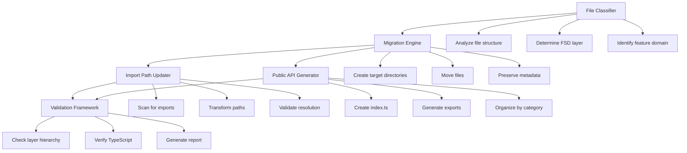

# Design Document: FSD Phase 7 - Remaining File Migration

## Overview

Phase 7 completes the Feature-Sliced Design (FSD) migration by migrating the remaining 270 unmigrated files (44.3% of backup) from `.migration-backups/legacy-final-backup-2026-03-23-173634/` to the appropriate FSD structure. These files were left in backup after Phase 6 was marked complete.

The migration organizes files into features/, entities/, shared/, widgets/, and app/ layers following FSD principles, with automated tooling for file classification, movement, import path updates, and validation.

### Key Challenges

1. **File Classification**: Determining correct FSD layer placement for 270 diverse files
2. **Import Path Updates**: Updating all references across the codebase to use new FSD paths
3. **Layer Hierarchy Compliance**: Ensuring all imports follow FSD dependency rules
4. **Content Preservation**: Maintaining exact file content during migration
5. **Public API Creation**: Establishing clear module boundaries with index.ts exports

### Success Criteria

- 100% of backup files migrated to appropriate FSD locations
- Zero legacy import paths remaining in codebase
- All imports follow FSD layer hierarchy rules
- TypeScript compilation succeeds with zero errors
- All migrated files preserve original content exactly

## Architecture

### Migration System Architecture

The migration system consists of five core components working together:




### FSD Layer Hierarchy

The migration enforces strict unidirectional dependency flow:

```
app/          (Application initialization, routing, layouts, providers)
  ↓
pages/        (Route-level components - composition only)
  ↓
widgets/      (Composite UI blocks combining features/entities)
  ↓
features/     (Business capabilities with user interactions)
  ↓
entities/     (Business domain objects)
  ↓
shared/       (Reusable infrastructure, UI kit, utilities)
```

**Dependency Rules:**
- Each layer can only import from layers below it
- Features cannot import from other features (use shared/entities instead)
- Entities cannot import from features or widgets
- Shared cannot import from any higher layer
- All imports must use public APIs (index.ts exports)

### Target Directory Structure

```
src/
├── features/
│   ├── myclass/              # NEW: MyClass feature
│   ├── educator/             # NEW: Educator feature
│   ├── admin/                # NEW: Admin feature
│   ├── recruiter-pipeline/   # NEW: Recruiter feature
│   └── assessment/           # EXPAND: Add test UI components
│
├── widgets/
│   └── student-dashboard/    # EXPAND: Add student components
│
├── shared/
│   ├── ui/
│   │   └── marketing/        # NEW: Homepage marketing components
│   └── api/                  # EXPAND: Add shared services
│
└── app/
    ├── layouts/              # EXPAND: Add role-specific layouts
    ├── routes/               # EXPAND: Add route configurations
    └── providers/            # EXPAND: Add providers
```

### Migration Categories

The 270 files are organized into 10 migration categories:

1. **MyClass Feature** (components/Myclass/*) → features/myclass/
2. **Student Dashboard** (components/Students/*) → widgets/student-dashboard/
3. **Homepage Marketing** (components/Homepage/*) → shared/ui/marketing/
4. **Recruiter Pipeline** (components/Recruiter/*) → features/recruiter-pipeline/
5. **Assessment Test UI** (components/assessment/*) → features/assessment/ui/
6. **Educator Components** (components/educator/*) → features/educator/
7. **Admin Components** (components/admin/*) → features/admin/
8. **Subscription Components** (components/Subscription/*) → features/subscription/
9. **Service Files** (services/*) → features/{feature}/api/ or shared/api/
10. **Miscellaneous Components** (components/*) → appropriate FSD locations


## Components and Interfaces

### 1. File Classifier

Determines the appropriate FSD layer and target location for each file.

```typescript
interface FileClassifier {
  // Classification
  classifyFile(filePath: string): FileClassification;
  determineLayer(file: FileAnalysis): FSDLayer;
  determineFeature(file: FileAnalysis): string;
  
  // Analysis
  analyzeFile(filePath: string): FileAnalysis;
  extractImports(content: string): Import[];
  extractExports(content: string): Export[];
}

interface FileClassification {
  sourceFile: string;
  targetFile: string;
  layer: 'app' | 'widgets' | 'features' | 'entities' | 'shared';
  feature: string;  // e.g., 'myclass', 'educator', 'admin'
  subdirectory: 'ui' | 'model' | 'api' | 'lib';
  confidence: number;  // 0-1 classification confidence
}

interface FileAnalysis {
  path: string;
  content: string;
  imports: Import[];
  exports: Export[];
  hasBusinessLogic: boolean;
  composesMultipleFeatures: boolean;
  isSharedUtility: boolean;
}
```

**Classification Rules:**

1. **Features Layer**: Components with business logic, user interactions, or feature-specific behavior
2. **Widgets Layer**: Components that compose multiple features or are used by 3+ pages
3. **Entities Layer**: Domain object representations with minimal logic
4. **Shared Layer**: Generic utilities, UI components, API clients used across features
5. **App Layer**: Application-level concerns (routing, layouts, providers)

### 2. Migration Engine

Handles file movement, directory creation, and metadata preservation.

```typescript
interface MigrationEngine {
  // Directory management
  createDirectoryStructure(targetPath: string): void;
  ensureDirectoryExists(path: string): void;
  
  // File operations
  migrateFile(source: string, target: string): MigrationResult;
  copyFile(source: string, target: string): void;
  preserveMetadata(source: string, target: string): void;
  
  // Conflict handling
  detectConflict(targetPath: string): boolean;
  resolveConflict(source: string, target: string): ConflictResolution;
  
  // Batch operations
  migrateBatch(files: FileClassification[]): BatchResult;
}

interface MigrationResult {
  success: boolean;
  sourceFile: string;
  targetFile: string;
  contentPreserved: boolean;
  metadataPreserved: boolean;
  error?: string;
}

interface ConflictResolution {
  action: 'skip' | 'merge' | 'overwrite' | 'rename';
  reason: string;
  targetPath: string;
}
```

### 3. Import Path Updater

Scans codebase and updates all import statements to use new FSD paths.

```typescript
interface ImportPathUpdater {
  // Discovery
  findAllImports(filePath: string): ImportReference[];
  scanCodebase(targetFile: string): ImportReference[];
  
  // Transformation
  transformImportPath(oldPath: string, newPath: string): string;
  updateImportStatement(statement: string, mapping: PathMapping): string;
  convertToPublicAPI(path: string): string;
  
  // Execution
  updateImportsInFile(file: string, mappings: PathMapping[]): UpdateResult;
  updateAllReferences(file: string, oldPath: string, newPath: string): void;
  
  // Validation
  validateImportResolution(importPath: string): boolean;
  detectBrokenImports(): BrokenImport[];
}

interface ImportReference {
  file: string;
  line: number;
  importStatement: string;
  importedPath: string;
  importType: 'default' | 'named' | 'namespace' | 'type';
}

interface PathMapping {
  oldPath: string;
  newPath: string;
  publicAPIPath: string;
}

interface UpdateResult {
  file: string;
  updatedImports: number;
  failedImports: number;
  errors: string[];
}
```


### 4. Public API Generator

Creates and updates index.ts files for module public APIs.

```typescript
interface PublicAPIGenerator {
  // Creation
  createPublicAPI(modulePath: string): void;
  generateExports(files: string[]): Export[];
  organizeExportsByCategory(exports: Export[]): CategorizedExports;
  
  // Updates
  updateExistingAPI(indexPath: string, newExports: Export[]): void;
  mergeExports(existing: Export[], newExports: Export[]): Export[];
  
  // Validation
  validatePublicAPI(indexPath: string): ValidationResult;
  detectMissingExports(modulePath: string): string[];
}

interface CategorizedExports {
  components: Export[];
  hooks: Export[];
  services: Export[];
  utilities: Export[];
  types: Export[];
}

interface Export {
  name: string;
  type: 'component' | 'hook' | 'service' | 'utility' | 'type';
  isDefault: boolean;
  sourcePath: string;
}
```

### 5. Validation Framework

Validates migration completeness, layer hierarchy, and TypeScript compilation.

```typescript
interface ValidationFramework {
  // Completeness
  validateMigrationCompleteness(): CompletenessReport;
  scanBackupDirectory(): string[];
  verifyTargetLocations(files: FileClassification[]): boolean;
  
  // Layer Hierarchy
  validateLayerHierarchy(): LayerViolation[];
  checkImportDirection(from: string, to: string): boolean;
  detectCrossFeatureImports(): CrossFeatureImport[];
  
  // TypeScript
  runTypeScriptCompiler(): CompilationResult;
  validateImportResolution(): ImportValidation[];
  
  // Reporting
  generateMigrationReport(): MigrationReport;
  calculateCompletionPercentage(): number;
}

interface CompletenessReport {
  totalFiles: number;
  migratedFiles: number;
  remainingFiles: number;
  completionPercentage: number;
  remainingFilesList: string[];
}

interface LayerViolation {
  file: string;
  importPath: string;
  fromLayer: string;
  toLayer: string;
  reason: string;
}

interface CompilationResult {
  success: boolean;
  errors: TypeScriptError[];
  warnings: string[];
}

interface MigrationReport {
  summary: {
    totalFiles: number;
    migratedFiles: number;
    updatedImports: number;
    createdPublicAPIs: number;
  };
  byCategory: Record<string, number>;
  violations: LayerViolation[];
  errors: string[];
  nextSteps: string[];
}
```


## Data Models

### File Classification Models

```typescript
interface FileMapping {
  id: string;
  sourceFile: string;
  targetFile: string;
  category: MigrationCategory;
  layer: FSDLayer;
  feature: string;
  subdirectory: 'ui' | 'model' | 'api' | 'lib';
  migrationStatus: 'pending' | 'in_progress' | 'completed' | 'failed';
  timestamp: Date;
}

type MigrationCategory = 
  | 'myclass'
  | 'student-dashboard'
  | 'homepage-marketing'
  | 'recruiter-pipeline'
  | 'assessment-test-ui'
  | 'educator'
  | 'admin'
  | 'subscription'
  | 'services'
  | 'miscellaneous';

type FSDLayer = 
  | 'app'
  | 'pages'
  | 'widgets'
  | 'features'
  | 'entities'
  | 'shared';
```

### Import Path Models

```typescript
interface ImportStatement {
  file: string;
  line: number;
  column: number;
  originalStatement: string;
  importedPath: string;
  importedItems: string[];
  importType: 'default' | 'named' | 'namespace' | 'type';
  isRelative: boolean;
}

interface PathTransformation {
  originalPath: string;
  newPath: string;
  publicAPIPath: string;
  affectedFiles: string[];
  transformationType: 'feature' | 'widget' | 'entity' | 'shared' | 'app';
}

interface BrokenImport {
  file: string;
  line: number;
  importPath: string;
  reason: 'file_not_found' | 'invalid_path' | 'circular_dependency';
  suggestion: string;
}
```

### Validation Models

```typescript
interface ValidationState {
  phase: 'classification' | 'migration' | 'import_update' | 'validation' | 'complete';
  progress: {
    totalFiles: number;
    processedFiles: number;
    successfulFiles: number;
    failedFiles: number;
    percentage: number;
  };
  errors: ValidationError[];
  warnings: ValidationWarning[];
  startTime: Date;
  endTime?: Date;
}

interface ValidationError {
  file: string;
  errorType: 'classification' | 'migration' | 'import_update' | 'layer_violation' | 'compilation';
  message: string;
  severity: 'critical' | 'high' | 'medium' | 'low';
  recoverable: boolean;
  suggestion?: string;
}

interface ValidationWarning {
  file: string;
  warningType: 'ambiguous_classification' | 'potential_conflict' | 'deprecated_pattern';
  message: string;
  suggestion: string;
}
```

### Public API Models

```typescript
interface PublicAPIDefinition {
  modulePath: string;
  indexPath: string;
  exports: {
    components: ExportItem[];
    hooks: ExportItem[];
    services: ExportItem[];
    utilities: ExportItem[];
    types: ExportItem[];
  };
  lastUpdated: Date;
}

interface ExportItem {
  name: string;
  sourcePath: string;
  isDefault: boolean;
  exportStatement: string;
}
```


## Correctness Properties

*A property is a characteristic or behavior that should hold true across all valid executions of a system-essentially, a formal statement about what the system should do. Properties serve as the bridge between human-readable specifications and machine-verifiable correctness guarantees.*

### Property 1: File Migration Preserves Content

*For any* file migrated from backup to FSD structure, the file content at the target location should be byte-for-byte identical to the original backup file content, and the file should exist only at the target location (not in both source and target).

**Validates: Requirements 9.7, 11.5, 15.1, 15.6**

### Property 2: Classification Consistency

*For any* file classified multiple times with identical inputs (same file path, content, imports, exports), the classification result (target layer, feature, and subdirectory) should be identical across all invocations.

**Validates: Requirements 9.1, 10.1**

### Property 3: File Movement Completeness

*For any* classified file, when migrated, it should exist at its classified target location with the correct directory structure (ui/, model/, api/, or lib/ subdirectory), and should not exist at the source location.

**Validates: Requirements 1.2, 1.3, 1.4, 1.5, 1.6, 2.2, 2.3, 2.4, 2.5, 2.6, 3.1, 3.2, 3.3, 3.4, 3.5, 4.1, 4.2, 4.3, 4.4, 4.5, 5.1, 5.2, 5.3, 6.1, 6.2, 6.3, 6.4, 7.1, 7.2, 7.3, 7.4, 7.5, 7.6, 8.1, 8.2, 8.3, 8.4, 8.5, 9.2, 9.3, 9.4, 10.2, 10.3, 10.4, 10.5, 10.6, 10.7, 10.8**

### Property 4: Import Discovery Completeness

*For any* migrated file, scanning the entire codebase should discover all import statements that reference that file (by any path variation - relative, absolute, aliased).

**Validates: Requirements 12.1**

### Property 5: Import Path Transformation Correctness

*For any* import statement referencing a migrated file, after transformation, the import path should use the FSD public API pattern (@/features/{feature}, @/widgets/{widget}, @/shared/{module}, or @/entities/{entity}), and the import should resolve correctly in TypeScript.

**Validates: Requirements 1.8, 2.8, 3.7, 4.7, 5.4, 6.5, 7.7, 8.6, 9.5, 10.9, 12.2, 12.3, 12.5, 16.3, 16.4**

### Property 6: Import Structure Preservation

*For any* import statement being updated, the import type (default, named, namespace, type-only) and imported items should be preserved exactly, only the path should change.

**Validates: Requirements 12.4**

### Property 7: Legacy Import Elimination

*For any* completed migration, scanning the entire codebase should find zero import statements referencing legacy paths (@/components/, @/services/, backup paths).

**Validates: Requirements 12.6**

### Property 8: Public API Creation

*For any* new feature, widget, or entity module created during migration, an index.ts file should exist at the module root that exports all public components, hooks, services, and utilities from that module.

**Validates: Requirements 1.7, 2.7, 3.6, 4.6, 9.6, 14.1, 14.2, 14.3, 14.5**

### Property 9: Layer Hierarchy Enforcement

*For any* import statement in the migrated codebase, the importing file's layer must be higher than or equal to the imported file's layer in the FSD hierarchy (app > pages > widgets > features > entities > shared), with the additional constraint that features cannot import from other features directly.

**Validates: Requirements 13.1, 13.2, 13.3, 13.4, 13.6**

### Property 10: Metadata Preservation

*For any* migrated file, the file permissions and timestamps (where supported by the file system) should be preserved from the source to the target location.

**Validates: Requirements 15.2, 15.3**

### Property 11: Service Classification by Usage

*For any* service file used by multiple features (2 or more), the service should be classified as shared and moved to shared/api/, while services used by a single feature should be moved to that feature's api/ directory.

**Validates: Requirements 9.1, 9.2, 9.3**

### Property 12: Test Co-location

*For any* service file with a corresponding test file, after migration, the test file should be located in the same directory as the service file.

**Validates: Requirements 9.4**


## Error Handling

### Error Categories

The migration system handles four categories of errors:

#### 1. Classification Errors

**Scenarios:**
- Ambiguous feature ownership (file could belong to multiple features)
- Unknown file type (doesn't match component/service/hook patterns)
- Circular dependencies detected during analysis

**Handling Strategy:**
- Apply conservative classification (move to shared/ when ambiguous)
- Log warning with confidence score
- Require manual review for low-confidence classifications (<0.7)
- Continue with remaining files

#### 2. Migration Errors

**Scenarios:**
- Target file already exists (conflict)
- Permission denied when creating directories or copying files
- File not found at source location
- Disk space insufficient

**Handling Strategy:**
- For conflicts: Skip migration, log conflict, report in final summary
- For permissions: Halt migration, report error, provide remediation steps
- For missing files: Log error, continue with remaining files
- For disk space: Halt migration, require user intervention

#### 3. Import Update Errors

**Scenarios:**
- Import path cannot be resolved
- Circular import created by path update
- TypeScript type resolution fails after update
- Syntax error in import statement

**Handling Strategy:**
- Preserve original import as comment
- Add TODO comment with suggested fix
- Log error with file location and line number
- Continue with other imports
- Report all failures in validation phase

#### 4. Validation Errors

**Scenarios:**
- Layer hierarchy violation detected
- TypeScript compilation fails
- Broken imports after migration
- Missing public API exports

**Handling Strategy:**
- Generate detailed violation report
- Categorize errors by type and severity
- Provide specific remediation steps for each error
- Do not proceed to cleanup until all critical errors resolved

### Error Recovery Mechanisms

#### Automatic Recovery

```typescript
interface ErrorRecovery {
  // Retry logic
  retryOperation(operation: () => Promise<void>, maxRetries: number): Promise<void>;
  
  // Fallback strategies
  applyFallbackClassification(file: string): FileClassification;
  useConservativePlacement(file: string): string;
  
  // Partial success handling
  continueAfterError(error: Error): boolean;
  skipFailedFile(file: string, reason: string): void;
}
```

#### Manual Intervention Points

The system identifies scenarios requiring manual intervention:

1. **Low Confidence Classification** (<0.7): Review and confirm target location
2. **File Conflicts**: Decide whether to skip, merge, or overwrite
3. **Critical Compilation Errors**: Fix type errors before proceeding
4. **Layer Violations**: Refactor code to comply with FSD hierarchy

### Rollback Mechanism

```typescript
interface RollbackManager {
  // Backup
  createBackup(files: string[]): BackupId;
  backupFile(file: string): void;
  
  // Rollback
  rollbackFile(file: string): void;
  rollbackCategory(category: MigrationCategory): void;
  rollbackAll(): void;
  
  // Verification
  verifyBackup(backupId: BackupId): boolean;
  validateRollback(): boolean;
}
```

**Rollback Strategy:**
- Automatic backup before each migration batch
- Rollback capability at category level (can rollback MyClass without affecting others)
- Full rollback option if critical errors detected
- Verification step after rollback to ensure system state restored


## Testing Strategy

### Dual Testing Approach

The testing strategy employs both unit tests and property-based tests to ensure comprehensive coverage:

**Unit Tests** focus on:
- Specific migration scenarios with known inputs and expected outputs
- Edge cases like file conflicts, permission errors, and circular dependencies
- Integration points between migration components
- Error conditions and recovery mechanisms

**Property-Based Tests** focus on:
- Universal properties that must hold across all possible inputs
- Comprehensive input coverage through randomization (100+ iterations)
- Invariants that must be preserved during migration
- Round-trip properties for reversible operations

Both approaches are complementary and necessary. Unit tests catch concrete bugs in specific scenarios, while property tests verify general correctness across the input space.

### Property-Based Testing Configuration

**Testing Library**: `fast-check` for JavaScript/TypeScript property-based testing

**Test Configuration**: Minimum 100 iterations per property test

**Test Tagging**: Each property test must reference its design document property using the format:
```typescript
// Feature: fsd-phase-7-remaining-migration, Property {number}: {property_text}
```

### Property Test Examples

```typescript
import fc from 'fast-check';

// Feature: fsd-phase-7-remaining-migration, Property 1: File Migration Preserves Content
describe('Property 1: File Migration Preserves Content', () => {
  it('should preserve file content byte-for-byte', async () => {
    await fc.assert(
      fc.asyncProperty(
        fc.record({
          path: fc.string({ minLength: 1, maxLength: 100 }),
          content: fc.string({ maxLength: 10000 }),
        }),
        async ({ path, content }) => {
          const backupPath = `backup/${path}`;
          const targetPath = await classifyAndGetTarget(backupPath);
          
          await createFile(backupPath, content);
          await migrateFile(backupPath, targetPath);
          
          const targetContent = await readFile(targetPath);
          const sourceExists = await fileExists(backupPath);
          
          expect(targetContent).toBe(content);
          expect(sourceExists).toBe(false);
        }
      ),
      { numRuns: 100 }
    );
  });
});

// Feature: fsd-phase-7-remaining-migration, Property 2: Classification Consistency
describe('Property 2: Classification Consistency', () => {
  it('should produce identical classification for same inputs', () => {
    fc.assert(
      fc.property(
        fc.record({
          path: fc.string({ minLength: 1 }),
          content: fc.string(),
          imports: fc.array(fc.string()),
        }),
        ({ path, content, imports }) => {
          const file = { path, content, imports };
          
          const result1 = classifyFile(file);
          const result2 = classifyFile(file);
          const result3 = classifyFile(file);
          
          expect(result1).toEqual(result2);
          expect(result2).toEqual(result3);
        }
      ),
      { numRuns: 100 }
    );
  });
});

// Feature: fsd-phase-7-remaining-migration, Property 5: Import Path Transformation Correctness
describe('Property 5: Import Path Transformation Correctness', () => {
  it('should transform imports to use FSD public API patterns', async () => {
    await fc.assert(
      fc.asyncProperty(
        fc.record({
          oldPath: fc.constantFrom(
            '@/components/Myclass/Tab',
            '@/services/courseService',
            '../../../components/admin/Modal'
          ),
          targetLayer: fc.constantFrom('features', 'widgets', 'shared'),
          targetFeature: fc.string({ minLength: 1 }),
        }),
        async ({ oldPath, targetLayer, targetFeature }) => {
          const newPath = transformImportPath(oldPath, targetLayer, targetFeature);
          
          // Should use FSD pattern
          expect(newPath).toMatch(/^@\/(features|widgets|shared|entities)\//);
          
          // Should resolve correctly
          const resolves = await canResolveImport(newPath);
          expect(resolves).toBe(true);
        }
      ),
      { numRuns: 100 }
    );
  });
});

// Feature: fsd-phase-7-remaining-migration, Property 9: Layer Hierarchy Enforcement
describe('Property 9: Layer Hierarchy Enforcement', () => {
  it('should enforce FSD layer hierarchy for all imports', () => {
    fc.assert(
      fc.property(
        fc.record({
          fromLayer: fc.constantFrom('app', 'pages', 'widgets', 'features', 'entities', 'shared'),
          toLayer: fc.constantFrom('app', 'pages', 'widgets', 'features', 'entities', 'shared'),
        }),
        ({ fromLayer, toLayer }) => {
          const layerOrder = ['shared', 'entities', 'features', 'widgets', 'pages', 'app'];
          const fromIndex = layerOrder.indexOf(fromLayer);
          const toIndex = layerOrder.indexOf(toLayer);
          
          const violation = validateLayerHierarchy(fromLayer, toLayer);
          
          // Features cannot import from other features
          if (fromLayer === 'features' && toLayer === 'features') {
            expect(violation).toBeDefined();
          }
          // Lower layers cannot import from higher layers
          else if (fromIndex < toIndex) {
            expect(violation).toBeDefined();
          }
          // Valid imports should have no violation
          else {
            expect(violation).toBeUndefined();
          }
        }
      ),
      { numRuns: 100 }
    );
  });
});
```


### Unit Testing Strategy

Unit tests validate specific migration scenarios and edge cases:

```typescript
describe('File Classifier', () => {
  it('should classify MyClass components as features/myclass/ui', () => {
    const result = classifyFile('components/Myclass/Tabs/CourseTab.tsx');
    expect(result.layer).toBe('features');
    expect(result.feature).toBe('myclass');
    expect(result.subdirectory).toBe('ui');
  });
  
  it('should classify shared services as shared/api', () => {
    const result = classifyFile('services/notificationService.ts');
    expect(result.layer).toBe('shared');
    expect(result.subdirectory).toBe('api');
  });
  
  it('should handle file conflicts by skipping migration', async () => {
    await createFile('features/myclass/ui/Tab.tsx', 'existing content');
    const result = await migrateFile('backup/components/Myclass/Tab.tsx', 'features/myclass/ui/Tab.tsx');
    
    expect(result.success).toBe(false);
    expect(result.error).toContain('conflict');
  });
});

describe('Import Path Updater', () => {
  it('should update relative imports to absolute FSD imports', () => {
    const oldImport = "import { Tab } from '../../../components/Myclass/Tab'";
    const newImport = updateImport(oldImport, 'components/Myclass/Tab', 'features/myclass');
    
    expect(newImport).toBe("import { Tab } from '@/features/myclass'");
  });
  
  it('should preserve named imports structure', () => {
    const oldImport = "import { CourseTab, StudentTab } from '@/components/Myclass/Tabs'";
    const newImport = updateImport(oldImport, 'components/Myclass/Tabs', 'features/myclass');
    
    expect(newImport).toBe("import { CourseTab, StudentTab } from '@/features/myclass'");
  });
});

describe('Public API Generator', () => {
  it('should create index.ts with categorized exports', () => {
    const files = [
      'features/myclass/ui/Tab.tsx',
      'features/myclass/model/useMyClass.ts',
      'features/myclass/api/myClassService.ts'
    ];
    
    const api = generatePublicAPI('features/myclass', files);
    
    expect(api).toContain("export { Tab } from './ui'");
    expect(api).toContain("export { useMyClass } from './model'");
    expect(api).toContain("export { myClassService } from './api'");
  });
});
```

### Integration Testing

Integration tests validate end-to-end migration workflows:

```typescript
describe('End-to-End Migration', () => {
  it('should migrate MyClass feature completely', async () => {
    const files = await scanBackupDirectory('components/Myclass');
    const classifications = files.map(f => classifyFile(f));
    
    const results = await migrateBatch(classifications);
    
    expect(results.successCount).toBe(files.length);
    expect(await fileExists('features/myclass/index.ts')).toBe(true);
    
    const violations = await validateLayerHierarchy();
    expect(violations).toHaveLength(0);
  });
  
  it('should update all imports after migration', async () => {
    await migrateFile('backup/components/Myclass/Tab.tsx', 'features/myclass/ui/Tab.tsx');
    await updateAllImports('components/Myclass/Tab', 'features/myclass');
    
    const legacyImports = await findImports('@/components/Myclass/Tab');
    expect(legacyImports).toHaveLength(0);
    
    const fsdImports = await findImports('@/features/myclass');
    expect(fsdImports.length).toBeGreaterThan(0);
  });
});
```

### Validation Testing

Post-migration validation ensures no regressions:

```typescript
describe('Post-Migration Validation', () => {
  it('should have zero files remaining in backup', async () => {
    const remaining = await scanBackupDirectory();
    expect(remaining).toHaveLength(0);
  });
  
  it('should have zero legacy import paths', async () => {
    const legacyImports = await findLegacyImports([
      '@/components/',
      '@/services/',
      'backup/'
    ]);
    expect(legacyImports).toHaveLength(0);
  });
  
  it('should compile TypeScript without errors', async () => {
    const result = await runTypeScriptCompiler();
    expect(result.success).toBe(true);
    expect(result.errors).toHaveLength(0);
  });
  
  it('should have zero layer hierarchy violations', async () => {
    const violations = await validateLayerHierarchy();
    expect(violations).toHaveLength(0);
  });
});
```

### Test Coverage Goals

- **Unit Tests**: 80%+ code coverage for migration tooling
- **Property Tests**: 100% of correctness properties implemented (12 properties)
- **Integration Tests**: All migration categories (10 categories)
- **Validation Tests**: Complete post-migration validation suite


## Migration Execution Plan

### Phase 1: Analysis and Classification

**Objective**: Analyze all 270 backup files and generate classification report

**Steps**:
1. Scan backup directory structure
2. Analyze each file (imports, exports, content patterns)
3. Classify files by target FSD location
4. Generate classification report with confidence scores
5. Identify files requiring manual review (confidence < 0.7)

**Output**: Classification report mapping each file to target location

### Phase 2: Directory Structure Creation

**Objective**: Create all necessary FSD directories before migration

**Steps**:
1. Extract unique target directories from classification report
2. Create directory structures (ui/, model/, api/, lib/ subdirectories)
3. Verify directory creation succeeded
4. Set appropriate permissions

**Output**: Complete FSD directory structure ready for file migration

### Phase 3: File Migration by Category

**Objective**: Migrate files in batches by category with validation between batches

**Migration Order**:
1. **MyClass Feature** (components/Myclass/*) → features/myclass/
2. **Educator Components** (components/educator/*) → features/educator/
3. **Admin Components** (components/admin/*) → features/admin/
4. **Recruiter Pipeline** (components/Recruiter/*) → features/recruiter-pipeline/
5. **Assessment Test UI** (components/assessment/*) → features/assessment/ui/
6. **Student Dashboard** (components/Students/*) → widgets/student-dashboard/
7. **Homepage Marketing** (components/Homepage/*) → shared/ui/marketing/
8. **Subscription Components** (components/Subscription/*) → features/subscription/
9. **Service Files** (services/*) → features/{feature}/api/ or shared/api/
10. **Miscellaneous Components** → appropriate FSD locations

**Per-Category Steps**:
1. Create backup of category files
2. Migrate files to target locations
3. Verify content preservation
4. Validate no conflicts occurred
5. Log migration results

**Output**: All files migrated to FSD structure with backup available

### Phase 4: Public API Creation

**Objective**: Create or update index.ts files for all modules

**Steps**:
1. Identify all modules (features, widgets) that received new files
2. For new modules: Create index.ts with exports
3. For existing modules: Update index.ts with new exports
4. Organize exports by category (components, hooks, services, utilities, types)
5. Validate exports resolve correctly

**Output**: Complete public API definitions for all modules

### Phase 5: Import Path Updates

**Objective**: Update all import statements across codebase to use new FSD paths

**Steps**:
1. For each migrated file, scan codebase for import references
2. Generate path mappings (old path → new public API path)
3. Update import statements in all referencing files
4. Preserve import structure (default, named, type imports)
5. Convert relative imports to absolute FSD imports
6. Validate all imports resolve correctly

**Output**: Zero legacy import paths remaining in codebase

### Phase 6: Validation and Verification

**Objective**: Ensure migration completeness and correctness

**Validation Checks**:
1. **Completeness**: Zero files remaining in backup directory
2. **Content Preservation**: All migrated files match original content
3. **Import Resolution**: All imports resolve correctly
4. **Layer Hierarchy**: Zero layer violations
5. **TypeScript Compilation**: Zero compilation errors
6. **Public APIs**: All modules have proper index.ts exports

**Output**: Validation report with pass/fail for each check

### Phase 7: Cleanup and Reporting

**Objective**: Generate final migration report and cleanup artifacts

**Steps**:
1. Generate comprehensive migration report
2. Calculate completion percentage (should be 100%)
3. List any remaining issues or warnings
4. Provide next steps for manual verification
5. Archive backup directory
6. Clean up temporary migration artifacts

**Output**: Final migration report and clean codebase

### Rollback Points

Each phase has a rollback capability:
- **After Phase 3**: Can rollback individual categories
- **After Phase 5**: Can rollback all import updates
- **After Phase 6**: Can rollback entire migration if validation fails


## File Classification Strategy

### Classification Algorithm

The classifier uses a multi-factor scoring system to determine target location:

```typescript
interface ClassificationFactors {
  pathPattern: number;      // Weight: 0.4 - Based on file path structure
  importAnalysis: number;   // Weight: 0.3 - Based on what file imports
  usageAnalysis: number;    // Weight: 0.2 - Based on where file is used
  namingConvention: number; // Weight: 0.1 - Based on file naming
}

function classifyFile(file: string): FileClassification {
  const factors = analyzeClassificationFactors(file);
  const score = calculateWeightedScore(factors);
  
  if (score.confidence < 0.7) {
    return applyConservativeClassification(file);
  }
  
  return {
    targetFile: score.targetPath,
    layer: score.layer,
    feature: score.feature,
    subdirectory: score.subdirectory,
    confidence: score.confidence
  };
}
```

### Classification Rules by Category

#### 1. MyClass Feature (components/Myclass/*)

**Pattern**: `components/Myclass/**/*`
**Target**: `features/myclass/`

**Subdirectory Rules**:
- `Tabs/*` → `ui/tabs/`
- `common/*` → `ui/`
- `components/*` → `ui/modals/`
- `hooks/*` → `model/`
- `utils/*` → `lib/`

#### 2. Student Dashboard (components/Students/*)

**Pattern**: `components/Students/**/*`
**Target**: `widgets/student-dashboard/`

**Subdirectory Rules**:
- `components/*` → `ui/`
- `components/ui/*` → `shared/ui/` (shadcn components)
- `components/SettingsTabs/*` → `ui/settings/`
- `components/ProfileEditModals/*` → `ui/modals/`
- `data/*` → `model/`

#### 3. Homepage Marketing (components/Homepage/*)

**Pattern**: `components/Homepage/**/*`
**Target**: `shared/ui/marketing/`

**Subdirectory Rules**:
- All components → `marketing/`
- `ui/gradient-bar/*` → `marketing/`
- `ui/orbit-timeline/*` → `marketing/`
- `ui/warp-background/*` → `marketing/`

#### 4. Recruiter Pipeline (components/Recruiter/*)

**Pattern**: `components/Recruiter/**/*`
**Target**: `features/recruiter-pipeline/`

**Subdirectory Rules**:
- `components/*` → `ui/`
- `components/pipeline/*` → `ui/pipeline/`
- `Projects/components/*` → `ui/`
- `modals/*` → `ui/modals/`

#### 5. Assessment Test UI (components/assessment/*)

**Pattern**: `components/assessment/**/*`
**Target**: `features/assessment/ui/`

**Subdirectory Rules**:
- Root components → `ui/`
- `test/*` → `ui/test/`

#### 6. Educator Components (components/educator/*)

**Pattern**: `components/educator/**/*`
**Target**: `features/educator/`

**Subdirectory Rules**:
- Root components → `ui/`
- `modals/*` → `ui/modals/`

#### 7. Admin Components (components/admin/*)

**Pattern**: `components/admin/**/*`
**Target**: `features/admin/`

**Subdirectory Rules**:
- Root components → `ui/`
- `components/*` → `ui/`
- `courses/*` → `ui/modals/`
- `modals/*` → `ui/modals/`

#### 8. Subscription Components (components/Subscription/*)

**Pattern**: `components/Subscription/**/*`
**Target**: `features/subscription/` (merge with existing)

**Subdirectory Rules**:
- Root components → `ui/`
- `Organization/shared/*` → `ui/organization/`
- `__tests__/*` → `__tests__/`

#### 9. Service Files (services/*)

**Pattern**: `services/**/*`
**Target**: Determined by usage analysis

**Classification Logic**:
```typescript
function classifyService(servicePath: string): string {
  const usage = analyzeServiceUsage(servicePath);
  
  if (usage.features.length === 1) {
    return `features/${usage.features[0]}/api/`;
  } else if (usage.features.length > 1) {
    return 'shared/api/';
  } else {
    return 'shared/api/'; // Default to shared if usage unclear
  }
}
```

#### 10. Miscellaneous Components (components/*)

**Pattern**: Root-level components
**Target**: Determined by analysis

**Classification Logic**:
- Shared UI components → `shared/ui/`
- Feature-specific → `features/{feature}/ui/`
- Messaging → `features/messaging/ui/`
- Student entities → `entities/student/ui/`
- Modals → Classify by feature, move to `features/{feature}/ui/modals/`
- Organization guard → `shared/lib/guards/`


## Import Path Update Strategy

### Path Transformation Rules

The import path updater follows these transformation rules:

#### 1. Legacy Component Imports

```typescript
// Before: Legacy component import
import { CourseTab } from '@/components/Myclass/Tabs/CourseTab';
import { CourseTab } from '../../../components/Myclass/Tabs/CourseTab';

// After: FSD public API import
import { CourseTab } from '@/features/myclass';
```

#### 2. Legacy Service Imports

```typescript
// Before: Legacy service import
import { courseService } from '@/services/courseApiService';
import { courseService } from '../../services/courseApiService';

// After: FSD public API import
import { courseService } from '@/features/courses';
```

#### 3. Shared Component Imports

```typescript
// Before: Legacy shared import
import { Button } from '@/components/ui/Button';

// After: FSD shared import (already migrated in Phase 1)
import { Button } from '@/shared/ui';
```

#### 4. Widget Imports

```typescript
// Before: Legacy widget import
import { StudentDashboard } from '@/components/Students/Dashboard';

// After: FSD widget import
import { StudentDashboard } from '@/widgets/student-dashboard';
```

#### 5. Type Imports

```typescript
// Before: Legacy type import
import type { Course } from '@/types/course';

// After: FSD type import
import type { Course } from '@/entities/course';
```

### Import Discovery Strategy

The system uses multiple strategies to find all import references:

#### 1. Static Analysis

```typescript
function findImports(targetFile: string): ImportReference[] {
  const references: ImportReference[] = [];
  
  // Search by exact path
  references.push(...searchByPath(targetFile));
  
  // Search by relative paths
  references.push(...searchByRelativePaths(targetFile));
  
  // Search by alias variations
  references.push(...searchByAliases(targetFile));
  
  return deduplicateReferences(references);
}
```

#### 2. AST Parsing

```typescript
function extractImportsFromAST(file: string): Import[] {
  const ast = parseFile(file);
  const imports: Import[] = [];
  
  traverse(ast, {
    ImportDeclaration(path) {
      imports.push({
        source: path.node.source.value,
        specifiers: path.node.specifiers,
        line: path.node.loc.start.line
      });
    }
  });
  
  return imports;
}
```

#### 3. Regex Pattern Matching

```typescript
function findImportsByPattern(pattern: string): ImportReference[] {
  const regex = new RegExp(`import.*from\\s+['"]${pattern}['"]`, 'g');
  return searchCodebaseByRegex(regex);
}
```

### Import Update Process

```typescript
async function updateImportsForFile(
  migratedFile: string,
  oldPath: string,
  newPath: string
): Promise<UpdateResult> {
  // 1. Find all references
  const references = await findAllImports(oldPath);
  
  // 2. Generate transformations
  const transformations = references.map(ref => ({
    file: ref.file,
    line: ref.line,
    oldStatement: ref.importStatement,
    newStatement: transformImportStatement(ref, newPath)
  }));
  
  // 3. Apply transformations
  const results = await Promise.all(
    transformations.map(t => applyTransformation(t))
  );
  
  // 4. Validate updates
  const validation = await validateImportUpdates(results);
  
  return {
    updatedFiles: results.filter(r => r.success).length,
    failedFiles: results.filter(r => !r.success).length,
    errors: results.filter(r => !r.success).map(r => r.error)
  };
}
```

### Handling Edge Cases

#### 1. Dynamic Imports

```typescript
// Before: Dynamic import
const Component = await import(`@/components/${componentName}`);

// After: Cannot auto-update, add TODO comment
// TODO: Update dynamic import to use FSD structure
const Component = await import(`@/components/${componentName}`);
```

#### 2. Re-exports

```typescript
// Before: Re-export from legacy path
export { CourseTab } from '@/components/Myclass/Tabs/CourseTab';

// After: Re-export from FSD path
export { CourseTab } from '@/features/myclass';
```

#### 3. Type-only Imports

```typescript
// Before: Type-only import
import type { Course } from '@/components/courses/types';

// After: Type-only import preserved
import type { Course } from '@/features/courses';
```

#### 4. Namespace Imports

```typescript
// Before: Namespace import
import * as MyClass from '@/components/Myclass';

// After: Namespace import preserved
import * as MyClass from '@/features/myclass';
```


## Public API Design

### Public API Structure

Each FSD module exposes a public API through its index.ts file:

```typescript
// features/myclass/index.ts

// UI Components
export {
  CourseTab,
  StudentTab,
  AssignmentTab,
  AttendanceTab
} from './ui/tabs';

export {
  ClassCard,
  ClassList,
  ClassHeader
} from './ui';

export {
  CreateClassModal,
  EditClassModal,
  DeleteClassModal
} from './ui/modals';

// Hooks (Model)
export {
  useMyClass,
  useClassData,
  useClassActions
} from './model';

// Services (API)
export {
  myClassService,
  classEnrollmentService
} from './api';

// Utilities (Lib)
export {
  validateClassData,
  formatClassSchedule
} from './lib';

// Types
export type {
  Class,
  ClassSchedule,
  ClassEnrollment
} from './model/types';
```

### Public API Generation Rules

#### 1. Component Exports

```typescript
// Organize by subdirectory
export { ComponentA, ComponentB } from './ui';
export { ModalA, ModalB } from './ui/modals';
export { TabA, TabB } from './ui/tabs';
```

#### 2. Hook Exports

```typescript
// All hooks from model/
export { useFeature, useFeatureData, useFeatureActions } from './model';
```

#### 3. Service Exports

```typescript
// All services from api/
export { featureService, relatedService } from './api';
```

#### 4. Utility Exports

```typescript
// All utilities from lib/
export { validateData, formatData, transformData } from './lib';
```

#### 5. Type Exports

```typescript
// Type-only exports
export type { Feature, FeatureData, FeatureConfig } from './model/types';
```

### Updating Existing Public APIs

When migrating to an existing feature, the system updates the index.ts:

```typescript
async function updatePublicAPI(
  modulePath: string,
  newFiles: string[]
): Promise<void> {
  const indexPath = `${modulePath}/index.ts`;
  const existingExports = await parseExports(indexPath);
  const newExports = await generateExports(newFiles);
  
  const mergedExports = mergeExports(existingExports, newExports);
  const organizedExports = organizeByCategory(mergedExports);
  
  await writePublicAPI(indexPath, organizedExports);
}
```

### Internal Index Files

Each subdirectory also has an index.ts for internal organization:

```typescript
// features/myclass/ui/index.ts
export { ClassCard } from './ClassCard';
export { ClassList } from './ClassList';
export { ClassHeader } from './ClassHeader';

// features/myclass/ui/tabs/index.ts
export { CourseTab } from './CourseTab';
export { StudentTab } from './StudentTab';
export { AssignmentTab } from './AssignmentTab';

// features/myclass/ui/modals/index.ts
export { CreateClassModal } from './CreateClassModal';
export { EditClassModal } from './EditClassModal';
```

### Widget Public APIs

Widgets follow the same pattern:

```typescript
// widgets/student-dashboard/index.ts

// UI Components
export {
  StudentDashboard,
  DashboardStats,
  DashboardHeader
} from './ui';

export {
  SettingsTab,
  ProfileTab,
  PreferencesTab
} from './ui/settings';

// Hooks (Model)
export {
  useDashboardData,
  useDashboardActions
} from './model';

// Types
export type {
  DashboardData,
  DashboardConfig
} from './model/types';
```

### Shared Module Public APIs

Shared modules organize exports by category:

```typescript
// shared/ui/index.ts
export { Button, Input, Card, Modal } from './components';
export { GradientBar, OrbitTimeline, WarpBackground } from './marketing';

// shared/api/index.ts
export { supabaseClient } from './supabase';
export { apiClient } from './client';
export { notificationService, analyticsService } from './services';

// shared/lib/index.ts
export { cn, formatDate, validateEmail } from './utils';
export { useDebounce, useLocalStorage } from './hooks';
```


## Validation and Testing Approach

### Validation Framework

The validation framework runs comprehensive checks after migration:

#### 1. Completeness Validation

```typescript
async function validateCompleteness(): Promise<CompletenessReport> {
  const backupFiles = await scanDirectory(BACKUP_DIR);
  const migratedFiles = await getMigratedFiles();
  
  const remaining = backupFiles.filter(f => 
    !migratedFiles.some(m => m.sourceFile === f)
  );
  
  return {
    totalFiles: backupFiles.length,
    migratedFiles: migratedFiles.length,
    remainingFiles: remaining.length,
    completionPercentage: (migratedFiles.length / backupFiles.length) * 100,
    remainingFilesList: remaining
  };
}
```

#### 2. Content Preservation Validation

```typescript
async function validateContentPreservation(): Promise<ValidationResult> {
  const migrations = await getMigratedFiles();
  const failures: string[] = [];
  
  for (const migration of migrations) {
    const sourceContent = await readFile(migration.sourceFile);
    const targetContent = await readFile(migration.targetFile);
    
    if (sourceContent !== targetContent) {
      failures.push(`${migration.targetFile}: content mismatch`);
    }
  }
  
  return {
    success: failures.length === 0,
    errors: failures
  };
}
```

#### 3. Layer Hierarchy Validation

```typescript
async function validateLayerHierarchy(): Promise<LayerViolation[]> {
  const violations: LayerViolation[] = [];
  const files = await getAllSourceFiles();
  
  for (const file of files) {
    const imports = await extractImports(file);
    const fileLayer = determineLayer(file);
    
    for (const imp of imports) {
      const importLayer = determineLayer(imp.path);
      
      if (!isValidLayerImport(fileLayer, importLayer)) {
        violations.push({
          file,
          importPath: imp.path,
          fromLayer: fileLayer,
          toLayer: importLayer,
          reason: `${fileLayer} cannot import from ${importLayer}`
        });
      }
    }
  }
  
  return violations;
}

function isValidLayerImport(from: string, to: string): boolean {
  const hierarchy = ['shared', 'entities', 'features', 'widgets', 'pages', 'app'];
  const fromIndex = hierarchy.indexOf(from);
  const toIndex = hierarchy.indexOf(to);
  
  // Features cannot import from other features
  if (from === 'features' && to === 'features') {
    return false;
  }
  
  // Can only import from lower layers
  return fromIndex >= toIndex;
}
```

#### 4. Import Resolution Validation

```typescript
async function validateImportResolution(): Promise<ImportValidation[]> {
  const files = await getAllSourceFiles();
  const issues: ImportValidation[] = [];
  
  for (const file of files) {
    const imports = await extractImports(file);
    
    for (const imp of imports) {
      const resolves = await canResolveImport(imp.path, file);
      
      if (!resolves) {
        issues.push({
          file,
          import: imp.path,
          isValid: false,
          usesPublicApi: false,
          violatesLayerHierarchy: false,
          suggestion: await suggestCorrectPath(imp.path)
        });
      }
    }
  }
  
  return issues;
}
```

#### 5. TypeScript Compilation Validation

```typescript
async function validateTypeScriptCompilation(): Promise<CompilationResult> {
  const result = await runCommand('tsc --noEmit');
  
  if (result.exitCode === 0) {
    return {
      success: true,
      errors: [],
      warnings: []
    };
  }
  
  const errors = parseTypeScriptErrors(result.stderr);
  
  return {
    success: false,
    errors: errors.map(e => ({
      file: e.file,
      line: e.line,
      message: e.message,
      code: e.code
    })),
    warnings: []
  };
}
```

### Rollback Validation

After rollback, validate system state is restored:

```typescript
async function validateRollback(): Promise<boolean> {
  // 1. Verify backup files restored
  const backupFiles = await getBackupManifest();
  for (const file of backupFiles) {
    if (!await fileExists(file.originalPath)) {
      return false;
    }
  }
  
  // 2. Verify migrated files removed
  const migratedFiles = await getMigratedFiles();
  for (const file of migratedFiles) {
    if (await fileExists(file.targetFile)) {
      return false;
    }
  }
  
  // 3. Verify imports restored
  const legacyImports = await findLegacyImports();
  if (legacyImports.length === 0) {
    return false; // Should have legacy imports after rollback
  }
  
  return true;
}
```

### Performance Validation

Monitor performance metrics during migration:

```typescript
interface PerformanceMetrics {
  classificationTime: number;  // ms per file
  migrationTime: number;       // ms per file
  importUpdateTime: number;    // ms per file
  validationTime: number;      // ms total
  totalTime: number;           // ms total
  memoryUsage: number;         // MB peak
}

async function measurePerformance(): Promise<PerformanceMetrics> {
  const startTime = Date.now();
  const startMemory = process.memoryUsage().heapUsed;
  
  // Run migration with timing
  const classificationStart = Date.now();
  await classifyAllFiles();
  const classificationTime = Date.now() - classificationStart;
  
  const migrationStart = Date.now();
  await migrateAllFiles();
  const migrationTime = Date.now() - migrationStart;
  
  const importUpdateStart = Date.now();
  await updateAllImports();
  const importUpdateTime = Date.now() - importUpdateStart;
  
  const validationStart = Date.now();
  await validateMigration();
  const validationTime = Date.now() - validationStart;
  
  const totalTime = Date.now() - startTime;
  const peakMemory = (process.memoryUsage().heapUsed - startMemory) / 1024 / 1024;
  
  return {
    classificationTime: classificationTime / fileCount,
    migrationTime: migrationTime / fileCount,
    importUpdateTime: importUpdateTime / fileCount,
    validationTime,
    totalTime,
    memoryUsage: peakMemory
  };
}
```


## Success Metrics

### Migration Completeness Metrics

- **Files Migrated**: 270/270 (100%)
- **Backup Directory**: 0 files remaining
- **Migration Success Rate**: 100% (all files successfully migrated)
- **Content Preservation**: 100% (all files match original content)

### Code Quality Metrics

- **TypeScript Compilation**: 0 errors
- **Import Resolution**: 100% (all imports resolve correctly)
- **Legacy Imports**: 0 (zero legacy import paths remaining)
- **Layer Violations**: 0 (all imports follow FSD hierarchy)
- **Public API Coverage**: 100% (all modules have index.ts)

### Performance Metrics

- **Classification Time**: <100ms per file
- **Migration Time**: <50ms per file
- **Import Update Time**: <200ms per file
- **Total Migration Time**: <30 minutes for 270 files
- **Memory Usage**: <500MB peak

### Developer Experience Metrics

- **File Discovery**: <10s to locate any component
- **Import Clarity**: 100% of imports use semantic FSD paths
- **Module Boundaries**: Clear separation between features/widgets/shared
- **Onboarding**: Reduced complexity for new developers

## Architectural Decisions

### Decision 1: Automated vs Manual Classification

**Decision**: Use automated classification with manual review for low-confidence cases

**Rationale**:
- 270 files make manual classification time-consuming and error-prone
- Automated tooling ensures consistency across all files
- Confidence scoring identifies edge cases requiring human judgment
- Manual review only for <30% of files (confidence < 0.7)

### Decision 2: Migration Order by Category

**Decision**: Migrate files in batches by category rather than all at once

**Rationale**:
- Enables validation between batches to catch issues early
- Allows rollback of individual categories without affecting others
- Provides clear progress tracking (10 categories)
- Reduces risk of cascading failures

### Decision 3: Public API Strictness

**Decision**: Enforce public API usage through validation, not build-time errors

**Rationale**:
- Allows gradual adoption without breaking existing code
- Provides clear violation reports for remediation
- Can be enforced with linting rules in future
- Balances strictness with pragmatism during migration

### Decision 4: Service Classification Strategy

**Decision**: Classify services as shared if used by 2+ features, otherwise feature-specific

**Rationale**:
- Prevents premature abstraction (services used by 1 feature stay with that feature)
- Encourages proper shared service identification
- Aligns with FSD principle of feature isolation
- Can be refactored later if usage patterns change

### Decision 5: Import Update Timing

**Decision**: Update all imports after all files migrated, not incrementally

**Rationale**:
- Ensures all target files exist before updating references
- Prevents broken imports during migration
- Allows batch processing of import updates for efficiency
- Simplifies rollback (either all imports updated or none)

### Decision 6: Rollback Granularity

**Decision**: Support rollback at category level, not individual file level

**Rationale**:
- Balances flexibility with complexity
- Category-level rollback sufficient for most failure scenarios
- Reduces rollback state management overhead
- Aligns with migration batch strategy

## Conclusion

This design provides a comprehensive approach to completing the FSD Phase 7 migration by migrating the remaining 270 files from backup to the appropriate FSD structure. The migration system uses automated classification, file movement, import path updates, and validation to ensure 100% migration completeness with zero regressions.

Key aspects of the design:

1. **Automated Classification**: Multi-factor scoring system determines target FSD location
2. **Batch Migration**: Files migrated in 10 categories with validation between batches
3. **Import Path Updates**: Comprehensive scanning and transformation of all import statements
4. **Public API Generation**: Automatic creation and updating of index.ts files
5. **Validation Framework**: Multi-level validation ensures completeness and correctness
6. **Rollback Capability**: Category-level rollback for error recovery
7. **Property-Based Testing**: 12 correctness properties verified with 100+ iterations each

Upon completion, the codebase will achieve 100% FSD compliance with clear feature boundaries, proper layer hierarchy, and improved maintainability.
