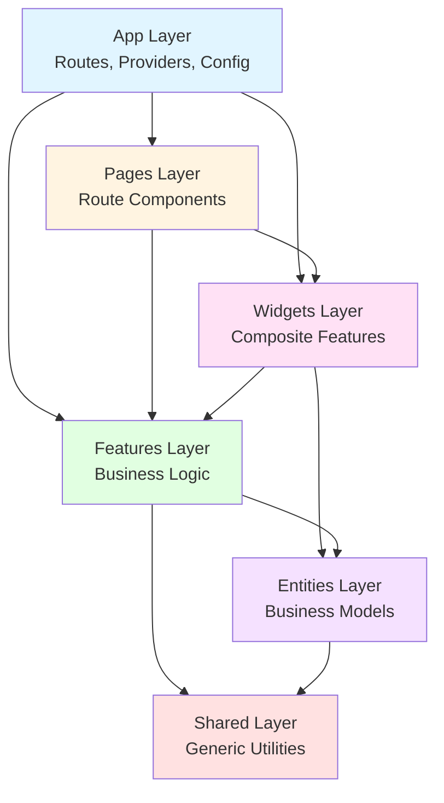

# Design Document: FSD Violations Cleanup

## Overview

This design addresses the final phase of Feature-Sliced Design (FSD) architectural migration, targeting the remaining ~20-30% of violations across import-level and structural categories. The codebase has progressed from 15-20% to 70-80% FSD compliance through previous migration efforts that eliminated legacy directories and established proper layer structure.

### Current State

The codebase exhibits two primary violation categories:

**Import-Level Violations:**
- Entities importing from features (~20 violations)
- Shared layer importing from features (~30 violations)
- Pages being imported into lower layers (3 violations)
- Relative imports using ../../ patterns (~100+ files)
- Internal API bypasses importing from /ui/, /api/, /model/ (~50+ files)
- Entities depending on global stores (5 violations)

**Structural Violations:**
- Non-FSD directories in src/ (stores/, data/, functions-lib/, scripts/, migration/, types.tsx)
- Duplicate feature implementations (admin/ui/collegeAdmin/, admin/ui/universityAdmin/, student-dashboard/, digital-passport/)
- Incomplete feature structures (missing required segments)
- Non-standard segment names (components/ instead of ui/, services/ instead of api/)
- Domain-specific code in shared layer
- Heavy components in pages layer
- Build artifacts (.PATCH.js files, duplicate .js/.ts pairs)

### Design Goals

1. **Preserve Build Stability**: Maintain working builds throughout refactoring with incremental changes
2. **Automate Repetitive Patterns**: Use scripts for systematic transformations across 100+ files
3. **Enforce Unidirectional Dependencies**: Ensure strict layer hierarchy (Shared → Entities → Features → Widgets → Pages → App)
4. **Establish Public API Boundaries**: Route all feature imports through index files
5. **Enable Continuous Compliance**: Provide automated violation detection for CI/CD integration

### Success Criteria

- Zero FSD violations across all 6 import categories
- All src/ directories conform to FSD layer structure
- All features use standard segment names (ui/, api/, model/, lib/)
- Build passes with `npm run build:dev`
- Violation detection script integrated into development workflow

## Architecture

### Refactoring Execution Model

The refactoring follows a **phased, bottom-up approach** respecting FSD dependency hierarchy:

```
Phase 1: Structural Foundation
├── Relocate non-FSD directories (stores/, data/, functions-lib/, scripts/, migration/)
├── Consolidate duplicate features
├── Complete incomplete feature structures
└── Standardize segment names

Phase 2: Shared Layer Cleanup
├── Remove domain-specific code from shared/
├── Fix shared→features imports
└── Extract heavy components to features

Phase 3: Entities Layer Cleanup
├── Remove entities→features imports
├── Remove entities→stores dependencies
└── Implement dependency injection patterns

Phase 4: Features Layer Cleanup
├── Enforce public API boundaries
├── Replace relative imports with absolute paths
└── Update all internal imports to use index files

Phase 5: Pages Layer Cleanup
├── Extract heavy components to features/widgets
├── Fix pages imports in lower layers
└── Ensure pages contain only routing logic

Phase 6: Validation & Integration
├── Run comprehensive violation detection
├── Verify build stability
└── Integrate detection into CI/CD
```

### Dependency Flow Enforcement



### Automated Refactoring Strategy

The design employs three automation levels:

1. **Detection Scripts**: AST-based analysis to identify violations with file/line precision
2. **Transformation Scripts**: Automated code modifications for repetitive patterns (import rewrites, file moves)
3. **Validation Scripts**: Build verification and compliance checking after each phase

## Components and Interfaces

### Violation Detection System

**Purpose**: Identify all FSD violations across the codebase with precise location information.

**Interface**:
```typescript
interface ViolationDetector {
  scanCodebase(): ViolationReport;
  detectImportViolations(layer: FSDLayer): ImportViolation[];
  detectStructuralViolations(): StructuralViolation[];
  generateReport(format: 'human' | 'json'): string;
}

interface ViolationReport {
  importViolations: {
    entitiesToFeatures: ImportViolation[];
    sharedToFeatures: ImportViolation[];
    lowerToPages: ImportViolation[];
    relativeImports: ImportViolation[];
    internalAPIBypass: ImportViolation[];
    entitiesToStores: ImportViolation[];
  };
  structuralViolations: {
    nonFSDDirectories: string[];
    duplicateFeatures: DuplicateFeature[];
    incompleteFeatures: IncompleteFeature[];
    nonStandardSegments: NonStandardSegment[];
    domainSpecificInShared: string[];
    heavyComponentsInPages: string[];
    buildArtifacts: string[];
  };
  summary: {
    totalViolations: number;
    violationsByCategory: Record<string, number>;
  };
}

interface ImportViolation {
  file: string;
  line: number;
  importStatement: string;
  violationType: string;
  suggestedFix: string;
}
```

**Implementation Approach**:
- Use TypeScript Compiler API for AST parsing
- Traverse import declarations to detect cross-layer violations
- Check import paths against FSD layer hierarchy rules
- Generate actionable fix suggestions based on violation type

### Import Transformation Engine

**Purpose**: Automatically rewrite import statements to fix violations.

**Interface**:
```typescript
interface ImportTransformer {
  replaceRelativeImports(files: string[]): TransformResult;
  enforcePublicAPI(feature: string): TransformResult;
  updateImportPaths(oldPath: string, newPath: string): TransformResult;
  rollback(transformId: string): void;
}

interface TransformResult {
  transformId: string;
  filesModified: string[];
  success: boolean;
  errors: TransformError[];
}
```

**Implementation Approach**:
- Use `jscodeshift` for AST-based code transformations
- Create codemods for each violation pattern
- Maintain transformation history for rollback capability
- Verify builds after each transformation batch

### File Relocation Manager

**Purpose**: Move files and directories while updating all import references.

**Interface**:
```typescript
interface FileRelocator {
  moveDirectory(source: string, destination: string): RelocationResult;
  moveFile(source: string, destination: string): RelocationResult;
  consolidateDuplicates(canonical: string, duplicates: string[]): RelocationResult;
  updateAllReferences(oldPath: string, newPath: string): void;
}

interface RelocationResult {
  success: boolean;
  filesAffected: string[];
  importsUpdated: number;
  errors: string[];
}
```

**Implementation Approach**:
- Scan codebase for all references before moving
- Update import statements atomically with file moves
- Preserve git history using `git mv` where possible
- Verify no broken imports after relocation

### Public API Generator

**Purpose**: Create and maintain feature index files that expose public APIs.

**Interface**:
```typescript
interface PublicAPIGenerator {
  generateIndexFile(feature: string): string;
  addExport(feature: string, exportName: string, sourcePath: string): void;
  removeExport(feature: string, exportName: string): void;
  validatePublicAPI(feature: string): ValidationResult;
}

interface ValidationResult {
  valid: boolean;
  missingExports: string[];
  unusedExports: string[];
  duplicateExports: string[];
}
```

**Implementation Approach**:
- Analyze feature usage across codebase to determine public API surface
- Generate index.ts files with named exports
- Ensure no duplicate default exports
- Follow naming conventions from export-import-policy.md

### Dependency Injection Refactorer

**Purpose**: Remove direct store dependencies from entities by injecting data as parameters.

**Interface**:
```typescript
interface DependencyInjector {
  refactorEntityStoreUsage(entityFile: string): RefactorResult;
  extractStoreAccess(file: string): StoreAccess[];
  convertToParameters(storeAccess: StoreAccess): ParameterInjection;
  updateCallers(entityFunction: string, newSignature: FunctionSignature): void;
}

interface StoreAccess {
  storeName: string;
  accessPattern: string;
  usageContext: string;
}

interface ParameterInjection {
  parameterName: string;
  parameterType: string;
  defaultValue?: string;
}
```

**Implementation Approach**:
- Identify store hook calls within entity files
- Extract data access patterns
- Refactor functions to accept data as parameters
- Update all call sites to pass store data

## Data Models

### FSD Layer Hierarchy

```typescript
enum FSDLayer {
  App = 'app',
  Pages = 'pages',
  Widgets = 'widgets',
  Features = 'features',
  Entities = 'entities',
  Shared = 'shared'
}

const LAYER_HIERARCHY: Record<FSDLayer, number> = {
  [FSDLayer.Shared]: 0,
  [FSDLayer.Entities]: 1,
  [FSDLayer.Features]: 2,
  [FSDLayer.Widgets]: 3,
  [FSDLayer.Pages]: 4,
  [FSDLayer.App]: 5
};

function canImport(from: FSDLayer, to: FSDLayer): boolean {
  return LAYER_HIERARCHY[from] >= LAYER_HIERARCHY[to];
}
```

### Feature Structure

```typescript
interface FeatureStructure {
  name: string;
  path: string;
  segments: {
    ui?: string;      // UI components
    api?: string;     // API calls and data fetching
    model?: string;   // Types, stores, business logic
    lib?: string;     // Utilities specific to this feature
  };
  publicAPI: string;  // index.ts file
  isComplete: boolean;
  violations: string[];
}

const STANDARD_SEGMENTS = ['ui', 'api', 'model', 'lib'];
const REQUIRED_SEGMENTS = ['ui', 'model']; // Minimum for complete feature
```

### Refactoring Phase State

```typescript
interface RefactoringPhase {
  id: string;
  name: string;
  status: 'pending' | 'in-progress' | 'completed' | 'failed';
  violations: ViolationReport;
  transformations: TransformResult[];
  buildStatus: BuildStatus;
  rollbackPoint?: string;
}

interface BuildStatus {
  success: boolean;
  errors: string[];
  warnings: string[];
  timestamp: Date;
}
```

### Migration Tracking

```typescript
interface MigrationState {
  phases: RefactoringPhase[];
  currentPhase: string;
  totalViolations: number;
  resolvedViolations: number;
  backupLocation: string;
  canRollback: boolean;
}
```

## Correctness Properties

*A property is a characteristic or behavior that should hold true across all valid executions of a system—essentially, a formal statement about what the system should do. Properties serve as the bridge between human-readable specifications and machine-verifiable correctness guarantees.*

### Property 1: Comprehensive Violation Detection

*For any* FSD codebase and violation category, when the detection script scans the codebase, it should identify all instances of that violation type with accurate file paths and line numbers.

**Validates: Requirements 1.1, 2.1, 3.1, 4.1, 5.1, 6.1, 11.1, 12.1, 13.1, 14.1, 15.1, 16.1, 17.1**

### Property 2: Import Consistency After File Relocation

*For any* file moved from path A to path B, all import statements that previously referenced path A should be updated to reference path B, and all imports should resolve successfully.

**Validates: Requirements 1.4, 12.6, 16.6**

### Property 3: Refactoring Preserves Runtime Behavior

*For any* refactoring operation (file move, import transformation, dependency injection), the system's runtime behavior should remain identical as verified by the test suite passing before and after the operation.

**Validates: Requirements 1.6, 2.6, 6.6, 8.5**

### Property 4: Import Transformation Preserves Module Resolution

*For any* import statement transformed from relative to absolute or from internal to public API, the transformed import should resolve to the same module as the original import.

**Validates: Requirements 4.2, 4.3, 5.4**

### Property 5: Layer Boundary Enforcement

*For any* two FSD layers A and B where A is lower than B in the hierarchy, no file in layer A should contain import statements from layer B after refactoring.

**Validates: Requirements 4.4, 10.5**

### Property 6: Public API Export Completeness

*For any* component imported from a feature's internal path (@/features/X/ui/Component), that component should be exported from the feature's public API (index file) after refactoring.

**Validates: Requirements 5.2, 5.3**

### Property 7: Segment Renaming Consistency

*For any* non-standard segment directory renamed to a standard name (components/→ui/, services/→api/, utils/→lib/), all imports referencing the old segment path should be updated to the new path, and the build should succeed.

**Validates: Requirements 14.2, 14.3, 14.4, 14.5, 14.6, 17.5**

### Property 8: Violation Report Structure

*For any* execution of the detection script, the output should contain categorized violations with file paths, line numbers, and violation counts for each of the 6 import violation categories.

**Validates: Requirements 7.2, 7.3**

### Property 9: CI/CD Exit Code Behavior

*For any* codebase state, when the detection script runs, it should exit with code 0 if zero violations exist and non-zero exit code if any violations exist.

**Validates: Requirements 7.4**

### Property 10: Dual Format Output Support

*For any* violation detection run, the script should be capable of producing both human-readable and machine-parseable (JSON) output formats containing the same violation data.

**Validates: Requirements 7.6**

### Property 11: Atomic Pattern Fixing

*For any* violation pattern identified across multiple files, either all files with that pattern should be fixed successfully or none should be modified (atomic operation).

**Validates: Requirements 8.4**

### Property 12: Feature Structure Completeness

*For any* feature directory after refactoring, it should contain at minimum both ui/ and model/ segments to be considered complete.

**Validates: Requirements 13.5**

### Property 13: FSD Layer Validity

*For any* directory in src/ after refactoring, it should correspond to a valid FSD layer (app/, pages/, widgets/, features/, entities/, shared/).

**Validates: Requirements 11.1**

### Property 14: Feature Public API Structure

*For any* feature directory, it should have an index file that exports its public API using named exports, with no duplicate default exports.

**Validates: Requirements 10.4**

### Property 15: Build Artifact Elimination

*For any* codebase after cleanup, there should be zero files with .PATCH.js extensions and zero duplicate .js/.ts file pairs in the same directory.

**Validates: Requirements 17.2, 17.3**

### Property 16: Relative Import Detection Threshold

*For any* import statement using relative paths, if it traverses 2 or more parent directories (../../), it should be detected as a violation and converted to an absolute path.

**Validates: Requirements 4.1**

### Property 17: Violation Processing Completeness

*For any* violation category with N detected violations, after running the fix operation, the detection script should report 0 violations in that category.

**Validates: Requirements 4.6, 5.6**

### Property 18: Duplicate Feature Detection

*For any* feature name, if multiple directories implement that feature (e.g., features/admin/ui/collegeAdmin/ and features/college-admin/), the detection script should identify them as duplicates.

**Validates: Requirements 12.1**

### Property 19: Incomplete Feature Detection

*For any* feature directory, if it contains fewer than 2 segments or is missing both ui/ and model/, the detection script should identify it as incomplete.

**Validates: Requirements 13.1**

### Property 20: Non-Standard Segment Detection

*For any* feature segment directory, if its name is not in the standard set (ui/, api/, model/, lib/), the detection script should identify it as non-standard.

**Validates: Requirements 14.1**

### Property 21: Domain-Specific Code Detection in Shared

*For any* file in the shared layer, if it contains role-specific logic, feature-specific logic, or entity-specific logic, the detection script should identify it as domain-specific.

**Validates: Requirements 15.1**

### Property 22: Heavy Component Detection in Pages

*For any* component in the pages layer, if it contains business logic, state management, or is a complete feature implementation, the detection script should identify it as a heavy component.

**Validates: Requirements 16.1**

### Property 23: Store Dependency Detection in Entities

*For any* file in the entities layer, if it imports from @/stores, the detection script should identify it as a store dependency violation.

**Validates: Requirements 6.1**

### Property 24: Caller Update Consistency

*For any* entity function refactored to accept parameters instead of accessing stores directly, all call sites should be updated to pass the required data from stores.

**Validates: Requirements 6.4**

## Error Handling

### Build Failure Recovery

**Strategy**: Implement checkpoint-based rollback for build failures.

**Approach**:
- Create git commits after each successful phase
- On build failure, identify the specific transformation that caused the error
- Roll back to the last successful checkpoint
- Log the failure with context for manual review
- Attempt alternative refactoring strategy if available

**Error Types**:
- Module resolution errors: Indicates import path is incorrect
- Type errors: Indicates type definitions need to be moved or updated
- Circular dependency errors: Indicates refactoring created a cycle
- Missing export errors: Indicates public API needs updating

### Transformation Conflicts

**Strategy**: Detect and resolve conflicts when multiple transformations affect the same file.

**Approach**:
- Queue transformations by dependency order
- Lock files during transformation
- Merge multiple transformations to the same file into a single operation
- Validate each transformation before committing

### Ambiguous Refactoring Decisions

**Strategy**: Use heuristics and fallback to manual review for ambiguous cases.

**Heuristics**:
- If a component is used by multiple features, move to entities or shared
- If a type is feature-specific, keep in feature; if generic, move to shared
- If a service has business logic, keep in feature; if generic, move to shared
- If uncertain, preserve current location and flag for manual review

**Manual Review Triggers**:
- Circular dependencies detected
- Component used across more than 3 features
- Unclear layer assignment for extracted functionality
- Breaking changes required to fix violation

### Incomplete Detection

**Strategy**: Handle cases where violations are not automatically detectable.

**Approach**:
- Provide manual inspection checklist for subjective violations
- Use naming conventions to hint at misplaced code (e.g., "StudentX" in shared)
- Generate warnings for suspicious patterns
- Document known limitations of automated detection

## Testing Strategy

### Dual Testing Approach

This feature requires both unit testing and property-based testing for comprehensive validation:

**Unit Tests**: Verify specific examples, edge cases, and error conditions
- Specific file move scenarios (OrganizationSetup, KPICard, etc.)
- Build failure recovery mechanisms
- Rollback functionality
- Report generation formats
- Edge cases: empty directories, circular dependencies, missing exports

**Property Tests**: Verify universal properties across all inputs
- Violation detection accuracy across random codebases
- Import transformation correctness for all path patterns
- Layer boundary enforcement for all layer combinations
- Atomic operation guarantees for batch transformations

### Property-Based Testing Configuration

**Library**: Use `fast-check` for TypeScript/JavaScript property-based testing

**Configuration**:
- Minimum 100 iterations per property test
- Each test must reference its design document property
- Tag format: **Feature: fsd-violations-cleanup, Property {number}: {property_text}**

**Test Structure**:
```typescript
import fc from 'fast-check';

// Feature: fsd-violations-cleanup, Property 1: Comprehensive Violation Detection
test('detects all violations in any codebase', () => {
  fc.assert(
    fc.property(
      fc.record({
        files: fc.array(fc.record({
          path: fc.string(),
          imports: fc.array(fc.string())
        }))
      }),
      (codebase) => {
        const violations = detectViolations(codebase);
        const actualViolations = manuallyCountViolations(codebase);
        return violations.length === actualViolations.length;
      }
    ),
    { numRuns: 100 }
  );
});
```

### Unit Testing Focus Areas

1. **Specific Refactoring Examples**:
   - Test moving OrganizationSetup from pages to features
   - Test consolidating admin/ui/collegeAdmin/ into college-admin/
   - Test removing .PATCH.js files
   - Test converting specific relative imports to absolute

2. **Error Handling**:
   - Test rollback when build fails
   - Test handling of circular dependencies
   - Test handling of missing exports
   - Test handling of duplicate default exports

3. **Integration Points**:
   - Test detection script CLI interface
   - Test CI/CD integration with exit codes
   - Test report generation in both formats
   - Test git commit creation at checkpoints

4. **Edge Cases**:
   - Empty feature directories
   - Features with only one segment
   - Files with no imports
   - Circular import chains
   - Duplicate feature names in different locations

### Property-Based Testing Focus Areas

1. **Detection Accuracy** (Properties 1, 16, 18, 19, 20, 21, 22, 23):
   - Generate random codebases with known violations
   - Verify detection finds all violations
   - Verify no false positives

2. **Transformation Correctness** (Properties 2, 4, 7):
   - Generate random import statements
   - Apply transformations
   - Verify imports still resolve correctly

3. **Layer Boundary Enforcement** (Property 5):
   - Generate random layer combinations
   - Verify lower layers never import from higher layers

4. **Atomic Operations** (Property 11):
   - Generate random batch operations
   - Verify all-or-nothing behavior

5. **Completeness** (Properties 12, 13, 14, 17):
   - Generate random feature structures
   - Verify all meet minimum requirements after refactoring

### Test Execution Strategy

**Phase 1: Pre-Refactoring Validation**
- Run existing test suite to establish baseline
- Capture test results for comparison
- Document any pre-existing test failures

**Phase 2: Incremental Testing**
- Run unit tests after each refactoring phase
- Run property tests for affected properties
- Verify build with `npm run build:dev`
- Commit on success, rollback on failure

**Phase 3: Post-Refactoring Validation**
- Run complete test suite
- Compare results with baseline
- Run violation detection script
- Verify zero violations
- Generate compliance report

**Continuous Integration**:
- Integrate violation detection into CI pipeline
- Fail builds on new violations
- Run property tests on every commit
- Maintain violation count metrics


## Correctness Properties

*A property is a characteristic or behavior that should hold true across all valid executions of a system-essentially, a formal statement about what the system should do. Properties serve as the bridge between human-readable specifications and machine-verifiable correctness guarantees.*

### Property Reflection

After analyzing all acceptance criteria, several properties were identified as redundant or combinable:

- **Detection properties (1.1, 2.1, 3.1, 4.1, 5.1, 6.1, 11.1, 12.1, 13.1, 14.1, 15.1, 16.1, 17.1)**: All follow the same pattern of scanning and identifying violations. These can be combined into a single comprehensive detection property.

- **Build verification properties (1.5, 2.5, 3.5, 4.5, 5.5, 6.5, 8.1, 8.5, 8.6, 10.2, 10.3, 11.7, 12.7, 13.6, 14.7, 15.7, 16.7, 17.6)**: All verify build success after refactoring. These are integration tests that should be combined into phase-level build validation.

- **Import consistency properties (1.4, 12.6, 16.6)**: All verify that imports are updated after file moves. These can be combined into a single property about import reference consistency.

- **Dependency injection properties (1.3, 2.3, 6.2)**: All verify that refactored code accepts data as parameters instead of importing from higher layers. These can be combined into a single property.

- **Segment rename properties (14.2, 14.3, 14.4, 17.5)**: All verify directory renaming operations. These can be combined into a single property about segment standardization.

- **Artifact cleanup properties (17.2, 17.3)**: Both verify removal of unwanted files. These can be combined into a single property.

The following properties provide unique validation value and will be included in the design:

### Property 1: Comprehensive Violation Detection

*For any* FSD codebase, when the violation detection script scans all layers, it should identify and categorize all violations including: entities→features imports, shared→features imports, lower→pages imports, relative imports with ../../ patterns, internal API bypasses (@/features/*/ui|api|model|lib/), entities→stores imports, non-FSD directories, duplicate features, incomplete features, non-standard segments, domain-specific code in shared, heavy components in pages, and build artifacts.

**Validates: Requirements 1.1, 2.1, 3.1, 4.1, 5.1, 6.1, 11.1, 12.1, 13.1, 14.1, 15.1, 16.1, 17.1**

### Property 2: Layer Dependency Enforcement

*For any* import statement in the codebase, the importing layer must be at the same level or higher than the imported layer according to FSD hierarchy (Shared=0, Entities=1, Features=2, Widgets=3, Pages=4, App=5).

**Validates: Requirements 1.1, 2.1, 3.1, 10.5**

### Property 3: Dependency Injection Refactoring

*For any* entity or shared layer function that previously imported from features or stores, after refactoring it should accept required data as function parameters instead of directly importing from higher layers.

**Validates: Requirements 1.3, 2.3, 6.2**

### Property 4: Import Reference Consistency

*For any* file or directory that is moved or renamed, all import statements referencing the old location should be updated to reference the new location, and no imports should reference non-existent paths.

**Validates: Requirements 1.4, 12.6, 16.6**

### Property 5: Relative to Absolute Import Conversion

*For any* relative import using ../../ or more parent directory traversals, converting it to an absolute import using @/ alias should resolve to the same module and maintain FSD layer boundaries.

**Validates: Requirements 4.2, 4.3, 4.4**

### Property 6: Public API Enforcement

*For any* feature import, it should reference the feature's index file (public API) rather than internal paths (/ui/, /api/, /model/, /lib/), and all imported components should be exported from that index file.

**Validates: Requirements 5.1, 5.2, 5.4**

### Property 7: Violation Report Structure

*For any* violation detection run, the output report should include categorized violations with file paths and line numbers, violation counts for each category, and support both human-readable and machine-parseable formats.

**Validates: Requirements 7.2, 7.3, 7.6**

### Property 8: Atomic Batch Operations

*For any* set of files with the same violation pattern, when applying a fix, either all files should be successfully transformed or none should be modified (atomic operation with rollback on failure).

**Validates: Requirements 8.2, 8.4**

### Property 9: Feature Structure Completeness

*For an
## Correctness Properties

*A property is a characteristic or behavior that should hold true across all valid executions of a system—essentially, a formal statement about what the system should do. Properties serve as the bridge between human-readable specifications and machine-verifiable correctness guarantees.*

### Property 1: Comprehensive Violation Detection

*For any* FSD codebase and violation category, when the detection script scans the codebase, it should identify all instances of that violation type with accurate file paths and line numbers.

**Validates: Requirements 1.1, 2.1, 3.1, 4.1, 5.1, 6.1, 11.1, 12.1, 13.1, 14.1, 15.1, 16.1, 17.1**

### Property 2: Import Consistency After File Relocation

*For any* file moved from path A to path B, all import statements that previously referenced path A should be updated to reference path B, and all imports should resolve successfully.

**Validates: Requirements 1.4, 12.6, 16.6**

### Property 3: Refactoring Preserves Runtime Behavior

*For any* refactoring operation (file move, import transformation, dependency injection), the system's runtime behavior should remain identical as verified by the test suite passing before and after the operation.

**Validates: Requirements 1.6, 2.6, 6.6, 8.5**

### Property 4: Import Transformation Preserves Module Resolution

*For any* import statement transformed from relative to absolute or from internal to public API, the transformed import should resolve to the same module as the original import.

**Validates: Requirements 4.2, 4.3, 5.4**

### Property 5: Layer Boundary Enforcement

*For any* two FSD layers A and B where A is lower than B in the hierarchy, no file in layer A should contain import statements from layer B after refactoring.

**Validates: Requirements 4.4, 10.5**

### Property 6: Public API Export Completeness

*For any* component imported from a feature's internal path (@/features/X/ui/Component), that component should be exported from the feature's public API (index file) after refactoring.

**Validates: Requirements 5.2, 5.3**

### Property 7: Segment Renaming Consistency

*For any* non-standard segment directory renamed to a standard name (components/→ui/, services/→api/, utils/→lib/), all imports referencing the old segment path should be updated to the new path, and the build should succeed.

**Validates: Requirements 14.2, 14.3, 14.4, 14.5, 14.6, 17.5**

### Property 8: Violation Report Structure

*For any* execution of the detection script, the output should contain categorized violations with file paths, line numbers, and violation counts for each of the 6 import violation categories.

**Validates: Requirements 7.2, 7.3**

### Property 9: CI/CD Exit Code Behavior

*For any* codebase state, when the detection script runs, it should exit with code 0 if zero violations exist and non-zero exit code if any violations exist.

**Validates: Requirements 7.4**

### Property 10: Dual Format Output Support

*For any* violation detection run, the script should be capable of producing both human-readable and machine-parseable (JSON) output formats containing the same violation data.

**Validates: Requirements 7.6**

### Property 11: Atomic Pattern Fixing

*For any* violation pattern identified across multiple files, either all files with that pattern should be fixed successfully or none should be modified (atomic operation).

**Validates: Requirements 8.4**

### Property 12: Feature Structure Completeness

*For any* feature directory after refactoring, it should contain at minimum both ui/ and model/ segments to be considered complete.

**Validates: Requirements 13.5**

### Property 13: FSD Layer Validity

*For any* directory in src/ after refactoring, it should correspond to a valid FSD layer (app/, pages/, widgets/, features/, entities/, shared/).

**Validates: Requirements 11.1**

### Property 14: Feature Public API Structure

*For any* feature directory, it should have an index file that exports its public API using named exports, with no duplicate default exports.

**Validates: Requirements 10.4**

### Property 15: Build Artifact Elimination

*For any* codebase after cleanup, there should be zero files with .PATCH.js extensions and zero duplicate .js/.ts file pairs in the same directory.

**Validates: Requirements 17.2, 17.3**

### Property 16: Relative Import Detection Threshold

*For any* import statement using relative paths, if it traverses 2 or more parent directories (../../), it should be detected as a violation and converted to an absolute path.

**Validates: Requirements 4.1**

### Property 17: Violation Processing Completeness

*For any* violation category with N detected violations, after running the fix operation, the detection script should report 0 violations in that category.

**Validates: Requirements 4.6, 5.6**

### Property 18: Duplicate Feature Detection

*For any* feature name, if multiple directories implement that feature (e.g., features/admin/ui/collegeAdmin/ and features/college-admin/), the detection script should identify them as duplicates.

**Validates: Requirements 12.1**

### Property 19: Incomplete Feature Detection

*For any* feature directory, if it contains fewer than 2 segments or is missing both ui/ and model/, the detection script should identify it as incomplete.

**Validates: Requirements 13.1**

### Property 20: Non-Standard Segment Detection

*For any* feature segment directory, if its name is not in the standard set (ui/, api/, model/, lib/), the detection script should identify it as non-standard.

**Validates: Requirements 14.1**

### Property 21: Domain-Specific Code Detection in Shared

*For any* file in the shared layer, if it contains role-specific logic, feature-specific logic, or entity-specific logic, the detection script should identify it as domain-specific.

**Validates: Requirements 15.1**

### Property 22: Heavy Component Detection in Pages

*For any* component in the pages layer, if it contains business logic, state management, or is a complete feature implementation, the detection script should identify it as a heavy component.

**Validates: Requirements 16.1**

### Property 23: Store Dependency Detection in Entities

*For any* file in the entities layer, if it imports from @/stores, the detection script should identify it as a store dependency violation.

**Validates: Requirements 6.1**

### Property 24: Caller Update Consistency

*For any* entity function refactored to accept parameters instead of accessing stores directly, all call sites should be updated to pass the required data from stores.

**Validates: Requirements 6.4**

## Error Handling

### Build Failure Recovery

**Strategy**: Implement checkpoint-based rollback for build failures.

**Approach**:
- Create git commits after each successful phase
- On build failure, identify the specific transformation that caused the error
- Roll back to the last successful checkpoint
- Log the failure with context for manual review
- Attempt alternative refactoring strategy if available

**Error Types**:
- Module resolution errors: Indicates import path is incorrect
- Type errors: Indicates type definitions need to be moved or updated
- Circular dependency errors: Indicates refactoring created a cycle
- Missing export errors: Indicates public API needs updating

### Transformation Conflicts

**Strategy**: Detect and resolve conflicts when multiple transformations affect the same file.

**Approach**:
- Queue transformations by dependency order
- Lock files during transformation
- Merge multiple transformations to the same file into a single operation
- Validate each transformation before committing

### Ambiguous Refactoring Decisions

**Strategy**: Use heuristics and fallback to manual review for ambiguous cases.

**Heuristics**:
- If a component is used by multiple features, move to entities or shared
- If a type is feature-specific, keep in feature; if generic, move to shared
- If a service has business logic, keep in feature; if generic, move to shared
- If uncertain, preserve current location and flag for manual review

**Manual Review Triggers**:
- Circular dependencies detected
- Component used across more than 3 features
- Unclear layer assignment for extracted functionality
- Breaking changes required to fix violation

### Incomplete Detection

**Strategy**: Handle cases where violations are not automatically detectable.

**Approach**:
- Provide manual inspection checklist for subjective violations
- Use naming conventions to hint at misplaced code (e.g., "StudentX" in shared)
- Generate warnings for suspicious patterns
- Document known limitations of automated detection

## Testing Strategy

### Dual Testing Approach

This feature requires both unit testing and property-based testing for comprehensive validation:

**Unit Tests**: Verify specific examples, edge cases, and error conditions
- Specific file move scenarios (OrganizationSetup, KPICard, etc.)
- Build failure recovery mechanisms
- Rollback functionality
- Report generation formats
- Edge cases: empty directories, circular dependencies, missing exports

**Property Tests**: Verify universal properties across all inputs
- Violation detection accuracy across random codebases
- Import transformation correctness for all path patterns
- Layer boundary enforcement for all layer combinations
- Atomic operation guarantees for batch transformations

### Property-Based Testing Configuration

**Library**: Use `fast-check` for TypeScript/JavaScript property-based testing

**Configuration**:
- Minimum 100 iterations per property test
- Each test must reference its design document property
- Tag format: **Feature: fsd-violations-cleanup, Property {number}: {property_text}**

**Test Structure**:
```typescript
import fc from 'fast-check';

// Feature: fsd-violations-cleanup, Property 1: Comprehensive Violation Detection
test('detects all violations in any codebase', () => {
  fc.assert(
    fc.property(
      fc.record({
        files: fc.array(fc.record({
          path: fc.string(),
          imports: fc.array(fc.string())
        }))
      }),
      (codebase) => {
        const violations = detectViolations(codebase);
        const actualViolations = manuallyCountViolations(codebase);
        return violations.length === actualViolations.length;
      }
    ),
    { numRuns: 100 }
  );
});
```

### Unit Testing Focus Areas

1. **Specific Refactoring Examples**:
   - Test moving OrganizationSetup from pages to features
   - Test consolidating admin/ui/collegeAdmin/ into college-admin/
   - Test removing .PATCH.js files
   - Test converting specific relative imports to absolute

2. **Error Handling**:
   - Test rollback when build fails
   - Test handling of circular dependencies
   - Test handling of missing exports
   - Test handling of duplicate default exports

3. **Integration Points**:
   - Test detection script CLI interface
   - Test CI/CD integration with exit codes
   - Test report generation in both formats
   - Test git commit creation at checkpoints

4. **Edge Cases**:
   - Empty feature directories
   - Features with only one segment
   - Files with no imports
   - Circular import chains
   - Duplicate feature names in different locations

### Property-Based Testing Focus Areas

1. **Detection Accuracy** (Properties 1, 16, 18, 19, 20, 21, 22, 23):
   - Generate random codebases with known violations
   - Verify detection finds all violations
   - Verify no false positives

2. **Transformation Correctness** (Properties 2, 4, 7):
   - Generate random import statements
   - Apply transformations
   - Verify imports still resolve correctly

3. **Layer Boundary Enforcement** (Property 5):
   - Generate random layer combinations
   - Verify lower layers never import from higher layers

4. **Atomic Operations** (Property 11):
   - Generate random batch operations
   - Verify all-or-nothing behavior

5. **Completeness** (Properties 12, 13, 14, 17):
   - Generate random feature structures
   - Verify all meet minimum requirements after refactoring

### Test Execution Strategy

**Phase 1: Pre-Refactoring Validation**
- Run existing test suite to establish baseline
- Capture test results for comparison
- Document any pre-existing test failures

**Phase 2: Incremental Testing**
- Run unit tests after each refactoring phase
- Run property tests for affected properties
- Verify build with `npm run build:dev`
- Commit on success, rollback on failure

**Phase 3: Post-Refactoring Validation**
- Run complete test suite
- Compare results with baseline
- Run violation detection script
- Verify zero violations
- Generate compliance report

**Continuous Integration**:
- Integrate violation detection into CI pipeline
- Fail builds on new violations
- Run property tests on every commit
- Maintain violation count metrics

## Refactoring Strategies

### Strategy 1: Entities→Features Import Resolution

**Problem**: Entities importing from features violates layer hierarchy (20+ violations found).

**Examples**:
- `entities/user/model/useUsers.ts` imports `userManagementService` from `features/college-admin`
- `entities/student/model/useStudentData.ts` imports API functions from `features/student-profile`
- `entities/student/model/useConversationStudents.ts` imports `MessageService` from `features/messaging`

**Resolution Pattern**:

1. **Move Service to Entities**: If the service is entity-level logic
   ```typescript
   // Before: features/college-admin/api/userManagementService.ts
   // After: entities/user/api/userManagementService.ts
   
   // Update imports in entities/user/model/useUsers.ts
   - import { userManagementService } from '@/features/college-admin/api/userManagementService';
   + import { userManagementService } from '@/entities/user/api/userManagementService';
   ```

2. **Move Service to Shared**: If the service is generic/reusable
   ```typescript
   // Before: features/messaging/api/MessageService.ts
   // After: shared/api/MessageService.ts
   
   // Update all imports
   - import { MessageService } from '@/features/messaging';
   + import { MessageService } from '@/shared/api';
   ```

3. **Dependency Injection**: If service must stay in feature
   ```typescript
   // Before: Entity directly imports feature service
   export const useConversationStudents = () => {
     const service = MessageService;
     // ...
   };
   
   // After: Accept service as parameter
   export const useConversationStudents = (messageService: MessageService) => {
     // ...
   };
   
   // Caller in feature passes the service
   const students = useConversationStudents(MessageService);
   ```

### Strategy 2: Shared→Features Import Resolution

**Problem**: Shared layer importing from features violates layer independence (30+ violations found).

**Examples**:
- `shared/ui/StudentProfileDrawer` imports from `features/student-profile/api`
- `shared/ui/exams/*` components import `UIExam` types from `features/exams`
- `shared/lib/hooks/useLessonPlans.ts` imports from `features/educator-copilot`

**Resolution Pattern**:

1. **Move Types to Shared**: If types are used across multiple features
   ```typescript
   // Before: features/exams/model/types.ts
   export interface UIExam { /* ... */ }
   
   // After: shared/types/exam.ts
   export interface UIExam { /* ... */ }
   
   // Update imports
   - import { UIExam } from '@/features/exams';
   + import { UIExam } from '@/shared/types/exam';
   ```

2. **Move Component to Feature**: If component is feature-specific
   ```typescript
   // Before: shared/ui/StudentProfileDrawer/
   // After: features/student-profile/ui/StudentProfileDrawer/
   
   // Update imports in pages/features that use it
   - import { StudentProfileDrawer } from '@/shared/ui';
   + import { StudentProfileDrawer } from '@/features/student-profile';
   ```

3. **Parameterize Hook**: If hook needs feature service
   ```typescript
   // Before: Hook imports feature service directly
   import { lessonPlanService } from '@/features/educator-copilot';
   export function useLessonPlans() {
     return lessonPlanService.getAll();
   }
   
   // After: Accept service as parameter
   export function useLessonPlans(service: LessonPlanService) {
     return service.getAll();
   }
   ```

### Strategy 3: Pages Import Resolution

**Problem**: Lower layers importing from pages (3 violations found).

**Examples**:
- `shared/lib/guards/OrganizationGuard.tsx` imports `OrganizationSetup` from `pages/organization`
- `app/layouts/PortfolioLayout.jsx` imports `PromotionalBanner` from `pages/homepage`

**Resolution Pattern**:

1. **Move Component to Features/Widgets**:
   ```typescript
   // Before: pages/organization/OrganizationSetup.tsx
   // After: features/organization/ui/OrganizationSetup.tsx
   
   // Update guard import
   - import OrganizationSetup from '@/pages/organization/OrganizationSetup';
   + import { OrganizationSetup } from '@/features/organization';
   ```

2. **Move to Widgets for Composite Components**:
   ```typescript
   // Before: pages/homepage/PromotionalBanner.tsx
   // After: widgets/promotional-banner/ui/PromotionalBanner.tsx
   
   // Update layout import
   - import { PromotionalBanner } from '@/pages/homepage';
   + import { PromotionalBanner } from '@/widgets/promotional-banner';
   ```

### Strategy 4: Relative Import Conversion

**Problem**: 100+ files using relative imports with ../../ patterns.

**Resolution Pattern**:

Use automated script with AST transformation:

```typescript
// Script: scripts/fix-relative-imports.ts
import { Project } from 'ts-morph';

const project = new Project({ tsConfigFilePath: 'tsconfig.json' });

project.getSourceFiles('src/**/*.{ts,tsx}').forEach(sourceFile => {
  sourceFile.getImportDeclarations().forEach(importDecl => {
    const moduleSpecifier = importDecl.getModuleSpecifierValue();
    
    // Detect relative imports with 2+ parent traversals
    if (moduleSpecifier.match(/^(\.\.\/){2,}/)) {
      const absolutePath = resolveToAbsolutePath(
        sourceFile.getFilePath(),
        moduleSpecifier
      );
      importDecl.setModuleSpecifier(absolutePath);
    }
  });
  
  sourceFile.saveSync();
});
```

**Example Transformation**:
```typescript
// Before: src/features/assessment/ui/CourseRecommendationCard.jsx
import { useStudentData } from '../../../entities/student/model/useStudentData';

// After:
import { useStudentData } from '@/entities/student/model/useStudentData';
```

### Strategy 5: Public API Enforcement

**Problem**: 50+ files importing from internal feature paths (/ui/, /api/, /model/).

**Resolution Pattern**:

1. **Ensure Export in Index**:
   ```typescript
   // features/messaging/index.ts
   export { MessageService } from './api/MessageService';
   export { useMessageStore } from './model/useMessageStore';
   export type { Message } from './model/types';
   ```

2. **Update Import Statements**:
   ```typescript
   // Before:
   import { MessageService } from '@/features/messaging/api/MessageService';
   import { useMessageStore } from '@/features/messaging/model/useMessageStore';
   
   // After:
   import { MessageService, useMessageStore } from '@/features/messaging';
   ```

3. **Automated Script**:
   ```typescript
   // For each feature, scan all imports to internal paths
   // Verify component is exported in index
   // If not, add export
   // Update all import statements to use index
   ```

### Strategy 6: Store Dependency Removal from Entities

**Problem**: 5 entities importing from stores (useUser, etc.).

**Examples**:
- `entities/student/model/useConversationStudents.ts` imports `useUser` from stores
- `entities/organization/model/useOrganizationSubscription.ts` imports `useAuth` from features

**Resolution Pattern**:

1. **Refactor to Accept Data as Parameters**:
   ```typescript
   // Before:
   export const useConversationStudents = () => {
     const { user } = useUser();
     const userId = user?.id;
     // ... use userId
   };
   
   // After:
   export const useConversationStudents = (userId: string) => {
     // ... use userId
   };
   
   // Caller (in feature/page):
   const { user } = useUser();
   const students = useConversationStudents(user?.id);
   ```

2. **Move Hook to Feature if Store Access is Essential**:
   ```typescript
   // If entity hook fundamentally needs store access,
   // it may actually be feature-level logic
   // Move from entities/student/model/ to features/messaging/model/
   ```

### Strategy 7: Non-FSD Directory Relocation

**Problem**: src/ contains non-FSD directories (stores/, data/, functions-lib/, scripts/, migration/).

**Resolution Pattern**:

1. **Stores → Feature/Entity Model Segments**:
   ```bash
   # Move store to owning feature
   src/stores/assessmentStore.ts → src/features/assessment/model/assessmentStore.ts
   src/stores/authStore.ts → src/features/auth/model/authStore.ts
   src/stores/portfolioStore.ts → src/features/digital-portfolio/model/portfolioStore.ts
   
   # Update all imports
   - import { useAssessment } from '@/stores/assessmentStore';
   + import { useAssessment } from '@/features/assessment';
   ```

2. **Data → Model Segments**:
   ```bash
   src/data/assessment/ → src/features/assessment/model/data/
   src/data/educator/ → src/features/educator/model/data/
   ```

3. **Functions-lib → Root Functions Directory**:
   ```bash
   src/functions-lib/ → functions/
   # These are Cloudflare Worker utilities, not app code
   ```

4. **Scripts → Root Scripts Directory**:
   ```bash
   src/scripts/ → scripts/
   src/migration/ → scripts/migration/
   ```

5. **Root Types → Shared Types**:
   ```bash
   src/types.tsx → src/shared/types/index.ts
   ```

### Strategy 8: Duplicate Feature Consolidation

**Problem**: Multiple directories implementing the same feature.

**Examples**:
- `features/admin/ui/collegeAdmin/` + `features/college-admin/`
- `features/admin/ui/universityAdmin/` + `features/university-admin/`
- `features/student-dashboard/` (only api/) + `widgets/student-dashboard/`

**Resolution Pattern**:

1. **Identify Canonical Location**:
   - Prefer complete feature structure over incomplete
   - Prefer features/ over nested admin/ structure
   - Prefer widgets/ for composite UI components

2. **Merge Content**:
   ```bash
   # Consolidate college admin
   features/admin/ui/collegeAdmin/* → features/college-admin/ui/
   
   # Consolidate university admin
   features/admin/ui/universityAdmin/* → features/university-admin/ui/
   
   # Merge student dashboard API into widget
   features/student-dashboard/api/* → widgets/student-dashboard/api/
   ```

3. **Update All Imports**:
   ```typescript
   // Automated script to find and replace all import paths
   - import { CollegeAdminComponent } from '@/features/admin/ui/collegeAdmin';
   + import { CollegeAdminComponent } from '@/features/college-admin';
   ```

### Strategy 9: Segment Name Standardization

**Problem**: Features using non-standard segment names (components/, services/, utils/, types/, prompts/, config/, handlers/).

**Resolution Pattern**:

1. **Rename Directories**:
   ```bash
   features/*/components/ → features/*/ui/
   features/*/services/ → features/*/api/
   features/*/utils/ → features/*/lib/
   ```

2. **Move Types**:
   ```bash
   # If feature-specific
   features/*/types/ → features/*/model/types.ts
   
   # If shared across features
   features/*/types/ → shared/types/
   ```

3. **Consolidate Non-Standard Segments**:
   ```bash
   features/*/prompts/ → features/*/lib/prompts/
   features/*/config/ → features/*/lib/config/
   features/*/handlers/ → features/*/lib/handlers/
   features/*/data/ → features/*/model/data/
   ```

4. **Update Imports**:
   ```typescript
   - import { Component } from '@/features/x/components/Component';
   + import { Component } from '@/features/x/ui/Component';
   
   - import { service } from '@/features/x/services/service';
   + import { service } from '@/features/x/api/service';
   ```

### Strategy 10: Build Artifact Cleanup

**Problem**: .PATCH.js files, duplicate .js/.ts pairs, markdown in features.

**Resolution Pattern**:

1. **Remove .PATCH.js Files**:
   ```bash
   find src -name "*.PATCH.js" -delete
   ```

2. **Deduplicate .js/.ts Pairs**:
   ```bash
   # Keep TypeScript version, remove JavaScript version
   # Example: shared/api/fileService.js + fileService.ts
   rm src/shared/api/fileService.js
   # Keep fileService.ts
   ```

3. **Move Documentation**:
   ```bash
   features/*/README.md → docs/features/*/README.md
   features/*/MIGRATION.md → docs/migration/*/MIGRATION.md
   ```

## Migration Patterns and Examples

### Pattern 1: Service Layer Migration

**Scenario**: Entity imports service from feature, service is entity-level logic.

**Before**:
```typescript
// features/college-admin/api/userManagementService.ts
export const userManagementService = {
  getUsers: async () => { /* ... */ },
  updateUser: async (id, data) => { /* ... */ }
};

// entities/user/model/useUsers.ts
import { userManagementService } from '@/features/college-admin/api/userManagementService';

export const useUsers = () => {
  const [users, setUsers] = useState([]);
  useEffect(() => {
    userManagementService.getUsers().then(setUsers);
  }, []);
  return users;
};
```

**After**:
```typescript
// entities/user/api/userManagementService.ts (moved)
export const userManagementService = {
  getUsers: async () => { /* ... */ },
  updateUser: async (id, data) => { /* ... */ }
};

// entities/user/model/useUsers.ts
import { userManagementService } from '@/entities/user/api/userManagementService';

export const useUsers = () => {
  const [users, setUsers] = useState([]);
  useEffect(() => {
    userManagementService.getUsers().then(setUsers);
  }, []);
  return users;
};

// entities/user/index.ts (public API)
export { userManagementService } from './api/userManagementService';
export { useUsers } from './model/useUsers';

// features/college-admin/ui/UserManagement.tsx (consumer)
import { useUsers } from '@/entities/user';
```

### Pattern 2: Type Migration to Shared

**Scenario**: Multiple features and shared components use the same type from a feature.

**Before**:
```typescript
// features/exams/model/types.ts
export interface UIExam {
  id: string;
  title: string;
  status: 'draft' | 'published' | 'completed';
}

// shared/ui/exams/ExamCard.tsx
import { UIExam } from '@/features/exams'; // ❌ Violation

// shared/ui/exams/ExamWorkflowManager.tsx
import { UIExam } from '@/features/exams'; // ❌ Violation

// features/educator/ui/ExamList.tsx
import { UIExam } from '@/features/exams'; // ✅ OK
```

**After**:
```typescript
// shared/types/exam.ts (moved)
export interface UIExam {
  id: string;
  title: string;
  status: 'draft' | 'published' | 'completed';
}

// shared/ui/exams/ExamCard.tsx
import { UIExam } from '@/shared/types/exam'; // ✅ Fixed

// shared/ui/exams/ExamWorkflowManager.tsx
import { UIExam } from '@/shared/types/exam'; // ✅ Fixed

// features/exams/model/types.ts
export type { UIExam } from '@/shared/types/exam'; // Re-export for convenience

// features/educator/ui/ExamList.tsx
import { UIExam } from '@/features/exams'; // ✅ Still works via re-export
```

### Pattern 3: Component Extraction from Pages

**Scenario**: Page component is imported into guards/layouts.

**Before**:
```typescript
// pages/organization/OrganizationSetup.tsx
export default function OrganizationSetup() {
  // Complex setup logic
  return <div>...</div>;
}

// shared/lib/guards/OrganizationGuard.tsx
import OrganizationSetup from '@/pages/organization/OrganizationSetup'; // ❌ Violation

export default function OrganizationGuard({ children }) {
  const { hasOrganization } = useOrganizationCheck();
  if (!hasOrganization) return <OrganizationSetup />;
  return children;
}
```

**After**:
```typescript
// features/organization/ui/OrganizationSetup.tsx (moved)
export function OrganizationSetup() {
  // Complex setup logic
  return <div>...</div>;
}

// features/organization/index.ts
export { OrganizationSetup } from './ui/OrganizationSetup';

// shared/lib/guards/OrganizationGuard.tsx
import { OrganizationSetup } from '@/features/organization'; // ✅ Fixed

export default function OrganizationGuard({ children }) {
  const { hasOrganization } = useOrganizationCheck();
  if (!hasOrganization) return <OrganizationSetup />;
  return children;
}

// pages/organization/OrganizationSetupPage.tsx (thin wrapper)
import { OrganizationSetup } from '@/features/organization';

export default function OrganizationSetupPage() {
  return <OrganizationSetup />;
}
```

### Pattern 4: Store Migration to Feature Model

**Scenario**: Global store should be feature-scoped.

**Before**:
```typescript
// stores/assessmentStore.ts
import { create } from 'zustand';

export const useAssessment = create((set) => ({
  currentTest: null,
  setCurrentTest: (test) => set({ currentTest: test }),
  // ... more assessment state
}));

// Multiple files import from stores
import { useAssessment } from '@/stores/assessmentStore';
```

**After**:
```typescript
// features/assessment/model/assessmentStore.ts (moved)
import { create } from 'zustand';

export const useAssessment = create((set) => ({
  currentTest: null,
  setCurrentTest: (test) => set({ currentTest: test }),
  // ... more assessment state
}));

// features/assessment/index.ts
export { useAssessment } from './model/assessmentStore';

// All consumers update imports
import { useAssessment } from '@/features/assessment';
```

### Pattern 5: Dependency Injection for Unavoidable Dependencies

**Scenario**: Entity needs feature service but service cannot be moved.

**Before**:
```typescript
// entities/student/model/useConversationStudents.ts
import { useUser } from '@/stores'; // ❌ Violation
import { MessageService } from '@/features/messaging'; // ❌ Violation

export const useConversationStudents = () => {
  const { user } = useUser();
  const [students, setStudents] = useState([]);
  
  useEffect(() => {
    if (user?.id) {
      MessageService.getConversations(user.id).then(setStudents);
    }
  }, [user?.id]);
  
  return students;
};
```

**After**:
```typescript
// entities/student/model/useConversationStudents.ts
export const useConversationStudents = (
  userId: string | undefined,
  messageService: typeof MessageService
) => {
  const [students, setStudents] = useState([]);
  
  useEffect(() => {
    if (userId) {
      messageService.getConversations(userId).then(setStudents);
    }
  }, [userId, messageService]);
  
  return students;
};

// features/messaging/ui/ConversationList.tsx (caller)
import { useUser } from '@/stores';
import { MessageService } from '@/features/messaging';
import { useConversationStudents } from '@/entities/student';

export function ConversationList() {
  const { user } = useUser();
  const students = useConversationStudents(user?.id, MessageService);
  // ...
}
```

### Pattern 6: Automated Batch Import Updates

**Script Example**:
```typescript
// scripts/update-imports.ts
import { Project } from 'ts-morph';

const project = new Project({ tsConfigFilePath: 'tsconfig.json' });

const importMappings = {
  '@/stores/assessmentStore': '@/features/assessment',
  '@/stores/authStore': '@/features/auth',
  '@/features/exams/model/types': '@/shared/types/exam',
  '@/pages/organization/OrganizationSetup': '@/features/organization',
};

project.getSourceFiles('src/**/*.{ts,tsx}').forEach(sourceFile => {
  sourceFile.getImportDeclarations().forEach(importDecl => {
    const moduleSpecifier = importDecl.getModuleSpecifierValue();
    
    if (importMappings[moduleSpecifier]) {
      importDecl.setModuleSpecifier(importMappings[moduleSpecifier]);
      console.log(`Updated: ${sourceFile.getFilePath()}`);
    }
  });
  
  sourceFile.saveSync();
});

console.log('Import updates complete. Running build verification...');
```

### Pattern 7: Incremental Verification

**Process**:
```bash
# 1. Create checkpoint
git add -A
git commit -m "checkpoint: before fixing entities→features imports"

# 2. Apply transformation
npm run fix:entities-features-imports

# 3. Verify build
npm run build:dev

# 4. If success, commit; if failure, rollback
if [ $? -eq 0 ]; then
  git add -A
  git commit -m "fix: resolve entities→features import violations"
else
  echo "Build failed, rolling back..."
  git reset --hard HEAD
fi
```

## Build Verification and Rollback Mechanisms

### Build Verification Process

**Critical Rule**: Always use `npm run build:dev` for testing builds, NEVER use `npm run dev`.

**Verification Steps**:
1. Run `npm run build:dev` after each refactoring phase
2. Capture build output and error messages
3. Parse errors to identify specific import/export issues
4. If build succeeds, create git checkpoint
5. If build fails, analyze errors and rollback

**Error Analysis**:
```typescript
interface BuildError {
  type: 'module-resolution' | 'type-error' | 'circular-dependency' | 'missing-export';
  file: string;
  line: number;
  message: string;
  suggestedFix?: string;
}

function analyzeBuildErrors(buildOutput: string): BuildError[] {
  // Parse build output to extract structured error information
  // Categorize errors by type
  // Generate suggested fixes based on error patterns
}
```

### Rollback Strategy

**Checkpoint-Based Rollback**:
- Create git commits after each successful phase
- Tag commits with phase identifiers
- On failure, reset to last successful checkpoint
- Preserve error logs for analysis

**Rollback Script**:
```bash
#!/bin/bash
# scripts/rollback-phase.sh

PHASE_NAME=$1
LAST_CHECKPOINT=$(git log --grep="checkpoint: $PHASE_NAME" -1 --format="%H")

if [ -z "$LAST_CHECKPOINT" ]; then
  echo "No checkpoint found for phase: $PHASE_NAME"
  exit 1
fi

echo "Rolling back to checkpoint: $LAST_CHECKPOINT"
git reset --hard $LAST_CHECKPOINT
echo "Rollback complete"
```

### Continuous Compliance Monitoring

**CI/CD Integration**:
```yaml
# .github/workflows/fsd-compliance.yml
name: FSD Compliance Check

on: [push, pull_request]

jobs:
  check-violations:
    runs-on: ubuntu-latest
    steps:
      - uses: actions/checkout@v3
      - name: Install dependencies
        run: npm ci
      - name: Run violation detection
        run: npm run detect:violations
      - name: Check for violations
        run: |
          if [ $? -ne 0 ]; then
            echo "FSD violations detected. Please fix before merging."
            exit 1
          fi
      - name: Verify build
        run: npm run build:dev
```

**Violation Detection Script**:
```typescript
// scripts/detect-violations.ts
import { detectAllViolations } from './violation-detector';

const violations = detectAllViolations();

if (violations.total > 0) {
  console.error(`Found ${violations.total} FSD violations:`);
  console.error(JSON.stringify(violations, null, 2));
  process.exit(1);
} else {
  console.log('✅ No FSD violations detected');
  process.exit(0);
}
```
