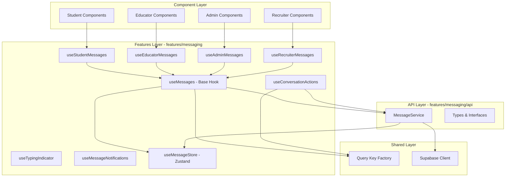

# Design Document: Messaging Hooks Consolidation

## Overview

This design consolidates 42 messaging-related hooks distributed across multiple FSD layers into a unified, maintainable messaging system. The current implementation suffers from ~4500+ lines of duplicated code, an exact duplicate store file, and inconsistent patterns for optimistic updates, real-time subscriptions, and cache management.

The consolidation will:
- Reduce code from 42 hooks to 1 base hook + 4 role-specific wrappers
- Eliminate the duplicate store file (src/stores/useMessageStore.ts)
- Unify three-layer caching (MessageService Map, React Query, Zustand)
- Centralize duplicate detection and optimistic update patterns
- Provide type-safe conversation filtering and role handling
- Establish FSD-compliant architecture

The system will support all conversation types (student-recruiter, student-educator, educator-recruiter, student-admin, student-college-admin, student-college-educator, educator-admin, college-educator-admin) and all user roles (student, recruiter, educator, college_educator, school_admin, college_admin, university_admin).

## Architecture

### High-Level Architecture



### Three-Layer Cache Coordination

The system coordinates three caching layers:

1. **MessageService Map Cache** (30-second TTL)
   - In-memory Map cache for deduplicating concurrent requests
   - Prevents multiple simultaneous fetches for the same data
   - Cleared on mutations

2. **React Query Cache** (1-minute staleTime, 10-minute gcTime)
   - Primary cache for component data
   - Handles background refetching and cache invalidation
   - Provides loading/error states

3. **Zustand Store** (Global State)
   - UI-focused state for current conversation, optimistic updates
   - Provides selectors for efficient re-renders
   - Synced with React Query on data changes

**Cache Invalidation Rules:**
- `sendMessage`: Invalidate conversation messages query, update Zustand optimistically
- `markAsRead`: Update conversation unread count in all layers
- `deleteConversation`: Invalidate conversations list, remove from Zustand
- `createConversation`: Invalidate conversations list
- Real-time updates: Update React Query cache, sync to Zustand if displayed

### FSD Layer Structure

```
src/
├── features/
│   └── messaging/
│       ├── api/
│       │   ├── messageService.ts       # MessageService class
│       │   ├── types.ts                # Message, Conversation types
│       │   └── index.ts
│       ├── model/
│       │   ├── useMessages.ts          # Base hook
│       │   ├── useStudentMessages.ts   # Role wrapper
│       │   ├── useEducatorMessages.ts  # Role wrapper
│       │   ├── useAdminMessages.ts     # Role wrapper
│       │   ├── useRecruiterMessages.ts # Role wrapper
│       │   ├── useConversationActions.ts
│       │   ├── useTypingIndicator.ts
│       │   ├── useMessageNotifications.ts
│       │   ├── useMessageStore.ts      # Zustand store (canonical)
│       │   └── index.ts
│       ├── ui/
│       │   └── (existing UI components)
│       └── index.ts
├── shared/
│   └── lib/
│       └── queryKeys.ts                # Query key factory
└── stores/
    └── useMessageStore.ts              # TO BE REMOVED (duplicate)
```

## Components and Interfaces

### Core Types

```typescript
// User roles
export type UserRole = 
  | 'student' 
  | 'recruiter' 
  | 'educator' 
  | 'college_educator' 
  | 'school_admin' 
  | 'college_admin' 
  | 'university_admin';

// Backward compatibility alias
export type CollegeLecturer = 'college_educator';

// Conversation types
export type ConversationType = 
  | 'student_recruiter'
  | 'student_educator'
  | 'educator_recruiter'
  | 'student_admin'
  | 'student_college_admin'
  | 'student_college_educator'
  | 'educator_admin'
  | 'college_educator_admin';

// Admin roles (special unread count handling)
export type AdminRole = 'school_admin' | 'college_admin' | 'university_admin';

export interface Message {
  id: number | string; // number for real, string for optimistic (temp_${timestamp})
  conversation_id: string;
  sender_id: string;
  sender_type: UserRole;
  receiver_id: string;
  receiver_type: UserRole;
  message_text: string;
  attachments?: any[];
  application_id?: number;
  opportunity_id?: number;
  class_id?: number;
  is_read: boolean;
  read_at?: string;
  created_at: string;
  updated_at: string;
}

export interface Conversation {
  id: string;
  student_id?: string;
  recruiter_id?: string;
  educator_id?: string;
  school_id?: string;
  college_id?: string;
  application_id?: number;
  opportunity_id?: number;
  class_id?: number;
  subject?: string;
  status: 'active' | 'archived' | 'closed';
  conversation_type: ConversationType;
  last_message_at?: string;
  last_message_preview?: string;
  last_message_sender?: string;
  
  // Unread counts per role
  student_unread_count: number;
  recruiter_unread_count: number;
  educator_unread_count: number;
  admin_unread_count?: number;
  college_admin_unread_count?: number;
  
  // Soft delete fields
  deleted_by_student?: boolean;
  deleted_by_recruiter?: boolean;
  deleted_by_educator?: boolean;
  deleted_by_admin?: boolean;
  deleted_by_college_admin?: boolean;
  
  // Archive fields
  archived_by_student?: boolean;
  archived_by_recruiter?: boolean;
  archived_by_educator?: boolean;
  archived_by_admin?: boolean;
  archived_by_college_admin?: boolean;
  
  created_at: string;
  updated_at: string;
  
  // Joined data
  student?: any;
  recruiter?: any;
  educator?: any;
  application?: any;
  opportunity?: any;
  class?: any;
}
```

### Base Hook Interface

```typescript
interface UseMessagesOptions {
  userId: string;
  userRole: UserRole;
  conversationId?: string | null;
  conversationType?: ConversationType | 'all';
  enableRealtime?: boolean;
  enabled?: boolean;
}

interface UseMessagesReturn {
  // Data
  messages: Message[];
  conversations: Conversation[];
  unreadCount: number;
  
  // Loading states
  isLoadingMessages: boolean;
  isLoadingConversations: boolean;
  isLoadingUnreadCount: boolean;
  
  // Mutations
  sendMessage: (params: SendMessageParams) => Promise<Message>;
  isSending: boolean;
  
  markAsRead: (conversationId: string) => Promise<void>;
  isMarkingAsRead: boolean;
  
  createConversation: (params: CreateConversationParams) => Promise<Conversation>;
  isCreatingConversation: boolean;
  
  clearUnreadCount: (conversationId: string) => Promise<void>;
  
  // Errors
  messagesError: Error | null;
  conversationsError: Error | null;
  unreadCountError: Error | null;
  
  // Refetch
  refetchMessages: () => Promise<void>;
  refetchConversations: () => Promise<void>;
  refetchUnreadCount: () => Promise<void>;
}

export function useMessages(options: UseMessagesOptions): UseMessagesReturn;
```

### Role-Specific Wrapper Hooks

```typescript
// Student wrapper
export function useStudentMessages(
  studentId: string,
  options?: Omit<UseMessagesOptions, 'userId' | 'userRole'>
): UseMessagesReturn {
  return useMessages({ userId: studentId, userRole: 'student', ...options });
}

// Educator wrapper
export function useEducatorMessages(
  educatorId: string,
  options?: Omit<UseMessagesOptions, 'userId' | 'userRole'>
): UseMessagesReturn {
  return useMessages({ userId: educatorId, userRole: 'educator', ...options });
}

// Recruiter wrapper
export function useRecruiterMessages(
  recruiterId: string,
  options?: Omit<UseMessagesOptions, 'userId' | 'userRole'>
): UseMessagesReturn {
  return useMessages({ userId: recruiterId, userRole: 'recruiter', ...options });
}

// Admin wrapper (auto-detects admin type)
export function useAdminMessages(
  adminId: string,
  adminRole: AdminRole,
  options?: Omit<UseMessagesOptions, 'userId' | 'userRole'>
): UseMessagesReturn {
  return useMessages({ userId: adminId, userRole: adminRole, ...options });
}
```

### Conversation Actions Hook

```typescript
interface UseConversationActionsOptions {
  userId: string;
  userRole: UserRole;
}

interface UseConversationActionsReturn {
  archiveConversation: (conversationId: string) => Promise<void>;
  unarchiveConversation: (conversationId: string) => Promise<void>;
  deleteConversation: (conversationId: string) => Promise<void>;
  restoreConversation: (conversationId: string) => Promise<void>;
  
  isArchiving: boolean;
  isUnarchiving: boolean;
  isDeleting: boolean;
  isRestoring: boolean;
}

export function useConversationActions(
  options: UseConversationActionsOptions
): UseConversationActionsReturn;
```

### Query Key Factory

```typescript
// In shared/lib/queryKeys.ts
export const queryKeys = {
  messages: {
    all: ['messages'] as const,
    
    // Conversation messages
    conversation: (conversationId: string | null) => 
      ['messages', 'conversation', conversationId] as const,
    
    // User conversations list
    conversations: (userId: string, userRole: UserRole, conversationType?: ConversationType | 'all') =>
      ['messages', 'conversations', userId, userRole, conversationType] as const,
    
    // Unread count
    unreadCount: (userId: string, userRole: UserRole) =>
      ['messages', 'unreadCount', userId, userRole] as const,
  },
};
```

## Data Models

### Message Store State

```typescript
interface MessageState {
  // Messages state
  messages: Message[];
  conversations: Conversation[];
  currentConversationId: string | null;
  unreadCount: number;
  
  // Loading states
  isLoadingMessages: boolean;
  isLoadingConversations: boolean;
  
  // Actions
  setMessages: (messages: Message[]) => void;
  addMessage: (message: Message) => void;
  updateMessage: (messageId: number | string, updates: Partial<Message>) => void;
  removeMessage: (messageId: number | string) => void;
  
  setConversations: (conversations: Conversation[]) => void;
  updateConversation: (conversationId: string, updates: Partial<Conversation>) => void;
  
  setCurrentConversationId: (conversationId: string | null) => void;
  setUnreadCount: (count: number) => void;
  incrementUnreadCount: () => void;
  decrementUnreadCount: (amount?: number) => void;
  
  setIsLoadingMessages: (isLoading: boolean) => void;
  setIsLoadingConversations: (isLoading: boolean) => void;
  
  // Optimistic updates
  addOptimisticMessage: (message: Omit<Message, 'id' | 'created_at' | 'updated_at'>) => string;
  removeOptimisticMessage: (tempId: string) => void;
  
  // Duplicate detection
  isDuplicateMessage: (messageId: number | string) => boolean;
  
  // Clear state
  clearMessages: () => void;
  clearAll: () => void;
}
```

### MessageService API

```typescript
class MessageService {
  // Conversation management
  static getOrCreateConversation(
    userId1: string,
    userId2: string,
    conversationType: ConversationType,
    metadata?: ConversationMetadata
  ): Promise<Conversation>;
  
  static getUserConversations(
    userId: string,
    userRole: UserRole,
    conversationType?: ConversationType | 'all'
  ): Promise<Conversation[]>;
  
  // Message operations
  static getConversationMessages(
    conversationId: string,
    options?: { limit?: number; offset?: number; useCache?: boolean }
  ): Promise<Message[]>;
  
  static sendMessage(
    conversationId: string,
    senderId: string,
    senderType: UserRole,
    receiverId: string,
    receiverType: UserRole,
    messageText: string,
    metadata?: MessageMetadata
  ): Promise<Message>;
  
  static markConversationAsRead(
    conversationId: string,
    userId: string,
    userRole: UserRole
  ): Promise<void>;
  
  // Unread count
  static getUnreadCount(
    userId: string,
    userRole: UserRole
  ): Promise<number>;
  
  // Conversation actions
  static archiveConversation(
    conversationId: string,
    userId: string,
    userRole: UserRole
  ): Promise<void>;
  
  static unarchiveConversation(
    conversationId: string,
    userId: string,
    userRole: UserRole
  ): Promise<void>;
  
  static deleteConversationForUser(
    conversationId: string,
    userId: string,
    userRole: UserRole
  ): Promise<void>;
  
  static restoreConversation(
    conversationId: string,
    userId: string,
    userRole: UserRole
  ): Promise<void>;
  
  // Real-time subscriptions
  static subscribeToConversation(
    conversationId: string,
    callback: (message: Message) => void
  ): { unsubscribe: () => void };
  
  static subscribeToUserConversations(
    userId: string,
    userRole: UserRole,
    callback: (conversation: Conversation) => void
  ): { unsubscribe: () => void };
  
  // Cache management
  static clearCache(): void;
  static clearConversationCache(conversationId: string): void;
}
```

### Real-Time Subscription Pattern

```typescript
// Unified subscription pattern for all hooks
function setupRealtimeSubscription(
  conversationId: string,
  userId: string,
  userRole: UserRole,
  queryClient: QueryClient,
  messageStore: MessageStore
) {
  const subscription = MessageService.subscribeToConversation(
    conversationId,
    (newMessage: Message) => {
      // 1. Check for duplicates
      if (messageStore.isDuplicateMessage(newMessage.id)) {
        return;
      }
      
      // 2. Update React Query cache
      queryClient.setQueryData<Message[]>(
        queryKeys.messages.conversation(conversationId),
        (oldMessages = []) => {
          const exists = oldMessages.some(m => m.id === newMessage.id);
          if (exists) return oldMessages;
          
          return [...oldMessages, newMessage].sort(
            (a, b) => new Date(a.created_at).getTime() - new Date(b.created_at).getTime()
          );
        }
      );
      
      // 3. Update Zustand store if this is the current conversation
      if (messageStore.currentConversationId === conversationId) {
        messageStore.addMessage(newMessage);
      }
      
      // 4. Update unread count if message is for current user
      if (newMessage.receiver_id === userId && !newMessage.is_read) {
        messageStore.incrementUnreadCount();
        queryClient.invalidateQueries({
          queryKey: queryKeys.messages.unreadCount(userId, userRole)
        });
      }
    }
  );
  
  return subscription;
}
```

### Optimistic Update Pattern

```typescript
// Unified optimistic update pattern for sendMessage
async function sendMessageWithOptimisticUpdate(
  params: SendMessageParams,
  queryClient: QueryClient,
  messageStore: MessageStore
) {
  const { conversationId, senderId, senderType, receiverId, receiverType, messageText } = params;
  
  // 1. Create optimistic message with temporary ID
  const tempId = `temp_${Date.now()}`;
  const optimisticMessage: Message = {
    id: tempId,
    conversation_id: conversationId,
    sender_id: senderId,
    sender_type: senderType,
    receiver_id: receiverId,
    receiver_type: receiverType,
    message_text: messageText,
    is_read: false,
    created_at: new Date().toISOString(),
    updated_at: new Date().toISOString(),
    attachments: []
  };
  
  // 2. Check for duplicate sends (within 1 second window)
  const recentMessages = messageStore.messages.filter(
    m => m.sender_id === senderId && 
         m.message_text === messageText &&
         Date.now() - new Date(m.created_at).getTime() < 1000
  );
  if (recentMessages.length > 0) {
    throw new Error('Duplicate send detected');
  }
  
  // 3. Add optimistic message to store
  messageStore.addOptimisticMessage(optimisticMessage);
  
  // 4. Update React Query cache
  queryClient.setQueryData<Message[]>(
    queryKeys.messages.conversation(conversationId),
    (old = []) => [...old, optimisticMessage]
  );
  
  try {
    // 5. Send to server
    const realMessage = await MessageService.sendMessage(
      conversationId,
      senderId,
      senderType,
      receiverId,
      receiverType,
      messageText
    );
    
    // 6. Replace optimistic with real message
    messageStore.removeOptimisticMessage(tempId);
    messageStore.addMessage(realMessage);
    
    queryClient.setQueryData<Message[]>(
      queryKeys.messages.conversation(conversationId),
      (old = []) => {
        const withoutOptimistic = old.filter(m => m.id !== tempId);
        return [...withoutOptimistic, realMessage].sort(
          (a, b) => new Date(a.created_at).getTime() - new Date(b.created_at).getTime()
        );
      }
    );
    
    // 7. Invalidate conversations list (update last message)
    queryClient.invalidateQueries({
      queryKey: queryKeys.messages.conversations(senderId, senderType)
    });
    
    return realMessage;
  } catch (error) {
    // 8. Rollback on error
    messageStore.removeOptimisticMessage(tempId);
    queryClient.setQueryData<Message[]>(
      queryKeys.messages.conversation(conversationId),
      (old = []) => old.filter(m => m.id !== tempId)
    );
    throw error;
  }
}
```


## Correctness Properties

This section defines executable correctness properties for property-based testing to validate the messaging system's behavior.

### Property 1: Message Store Uniqueness

**Property**: The message store SHALL never contain duplicate messages with the same ID.

**Formal Specification**:
```
∀ messages ∈ MessageStore.messages:
  |{m.id | m ∈ messages}| = |messages|
```

**Test Strategy**:
- Generate random sequences of message additions (real and optimistic)
- Generate random real-time message arrivals
- Verify no duplicate IDs exist in the store after each operation
- Test with concurrent operations

**Input Generation**:
- Message IDs: Mix of numeric (1-10000) and temp strings (temp_${timestamp})
- Operations: addMessage, addOptimisticMessage, real-time updates
- Concurrency: 1-10 simultaneous operations

### Property 2: Optimistic Update Consistency

**Property**: When an optimistic message is replaced by a real message, the message content SHALL remain identical except for the ID and timestamps.

**Formal Specification**:
```
∀ optimistic_msg, real_msg:
  IF optimistic_msg.id = temp_${t} AND real_msg replaces optimistic_msg
  THEN optimistic_msg.message_text = real_msg.message_text
    AND optimistic_msg.sender_id = real_msg.sender_id
    AND optimistic_msg.receiver_id = real_msg.receiver_id
    AND optimistic_msg.conversation_id = real_msg.conversation_id
```

**Test Strategy**:
- Generate random message sends with optimistic updates
- Simulate server responses with matching content
- Verify content consistency after replacement
- Test rollback on server errors

**Input Generation**:
- Message text: Random strings (1-500 chars)
- User IDs: Random UUIDs
- Success rate: 80% success, 20% failure for error testing

### Property 3: Unread Count Non-Negativity

**Property**: The unread count SHALL never be negative.

**Formal Specification**:
```
∀ state ∈ MessageStore:
  state.unreadCount ≥ 0
```

**Test Strategy**:
- Generate random sequences of increment/decrement operations
- Include edge cases: decrement when count is 0
- Verify count never goes below 0
- Test with concurrent updates

**Input Generation**:
- Operations: incrementUnreadCount, decrementUnreadCount(1-10)
- Initial count: 0-100
- Operation sequences: 10-100 operations

### Property 4: Cache Coordination Consistency

**Property**: After any mutation, all three cache layers SHALL eventually contain consistent data.

**Formal Specification**:
```
∀ mutation ∈ {sendMessage, markAsRead, deleteConversation}:
  AFTER mutation completes:
    MessageService.cache[key] = ReactQuery.cache[key] = Zustand.store[key]
    (within synchronization window)
```

**Test Strategy**:
- Execute mutations and verify cache consistency
- Test with different cache states (empty, stale, fresh)
- Verify invalidation triggers correctly
- Test race conditions with concurrent mutations

**Input Generation**:
- Mutations: Random mix of send, read, delete operations
- Cache states: empty, populated, stale
- Timing: Immediate checks and delayed checks (100ms, 500ms)

### Property 5: Real-Time Subscription Idempotency

**Property**: Receiving the same real-time message multiple times SHALL result in only one message in the store.

**Formal Specification**:
```
∀ msg, n ∈ ℕ:
  IF real-time subscription receives msg n times
  THEN |{m ∈ MessageStore.messages | m.id = msg.id}| = 1
```

**Test Strategy**:
- Simulate duplicate real-time message deliveries
- Verify duplicate detection prevents duplicates
- Test with optimistic updates in progress
- Test with various timing scenarios

**Input Generation**:
- Duplicate count: 2-10 duplicates per message
- Timing: Simultaneous and staggered (0-1000ms apart)
- Message states: With and without optimistic updates

### Property 6: Conversation Type Filtering Correctness

**Property**: When filtering by conversation type, only conversations of that type SHALL be returned.

**Formal Specification**:
```
∀ conversations, type ∈ ConversationType:
  filtered = filterByType(conversations, type)
  ⟹ ∀ c ∈ filtered: c.conversation_type = type
  AND ∀ c ∈ conversations: c.conversation_type = type ⟹ c ∈ filtered
```

**Test Strategy**:
- Generate random conversation lists with mixed types
- Filter by each conversation type
- Verify all returned conversations match the filter
- Verify no matching conversations are excluded
- Test "all" filter returns all conversations

**Input Generation**:
- Conversation types: All 8 valid types
- List sizes: 0-100 conversations
- Type distribution: Random mix

### Property 7: Role-Specific Unread Count Accuracy

**Property**: The unread count for a user SHALL equal the number of unread messages where the user is the receiver.

**Formal Specification**:
```
∀ userId, userRole:
  unreadCount(userId, userRole) = 
    |{m ∈ Messages | m.receiver_id = userId AND m.is_read = false}|
```

**Test Strategy**:
- Generate random message sequences
- Mark random messages as read
- Verify unread count matches actual unread messages
- Test with multiple users and roles

**Input Generation**:
- Users: 2-10 users with different roles
- Messages: 10-100 messages per conversation
- Read operations: Random 30-70% marked as read

### Property 8: Optimistic Update Rollback Completeness

**Property**: When a message send fails, the optimistic message SHALL be completely removed from all cache layers.

**Formal Specification**:
```
∀ optimistic_msg:
  IF sendMessage fails
  THEN optimistic_msg.id ∉ MessageStore.messages
    AND optimistic_msg.id ∉ ReactQuery.cache
```

**Test Strategy**:
- Simulate message send failures
- Verify optimistic message is removed from store
- Verify optimistic message is removed from React Query cache
- Test with various failure scenarios (network, validation, server error)

**Input Generation**:
- Failure types: Network timeout, 400 error, 500 error
- Timing: Immediate failure, delayed failure (100-1000ms)
- Concurrent operations: With and without other messages being sent

### Property 9: Conversation Sorting Consistency

**Property**: Conversations SHALL always be sorted by last_message_at in descending order.

**Formal Specification**:
```
∀ conversations:
  sorted = sortConversations(conversations)
  ⟹ ∀ i, j: i < j ⟹ sorted[i].last_message_at ≥ sorted[j].last_message_at
```

**Test Strategy**:
- Generate random conversation lists with various timestamps
- Verify sorting order after fetch
- Verify sorting maintained after updates
- Test with null/undefined last_message_at values

**Input Generation**:
- Timestamps: Random dates within last 30 days
- Null values: 0-20% of conversations with null last_message_at
- List sizes: 0-100 conversations

### Property 10: Duplicate Send Prevention

**Property**: Sending the same message text from the same sender within 1 second SHALL be prevented.

**Formal Specification**:
```
∀ msg1, msg2:
  IF msg1.sender_id = msg2.sender_id
    AND msg1.message_text = msg2.message_text
    AND |msg1.timestamp - msg2.timestamp| < 1000ms
  THEN sendMessage(msg2) SHALL throw Error
```

**Test Strategy**:
- Attempt to send duplicate messages rapidly
- Verify second send is rejected
- Test with different time windows (0ms, 500ms, 999ms, 1001ms)
- Verify legitimate duplicate messages after 1 second are allowed

**Input Generation**:
- Time deltas: 0ms, 100ms, 500ms, 999ms, 1000ms, 1001ms, 2000ms
- Message text: Same and different
- Senders: Same and different

## Implementation Plan

### Phase 1: Core Infrastructure (Priority P0)

**Goal**: Establish the foundation - unified store, base hook, and type system.

**Tasks**:
1. Create type definitions in `features/messaging/api/types.ts`
   - Define UserRole, ConversationType, AdminRole types
   - Define Message and Conversation interfaces
   - Add backward compatibility type aliases

2. Update Query Key Factory in `shared/lib/queryKeys.ts`
   - Add messages.conversation() factory
   - Add messages.conversations() factory
   - Add messages.unreadCount() factory

3. Enhance MessageStore in `features/messaging/model/useMessageStore.ts`
   - Add isDuplicateMessage() method
   - Add addOptimisticMessage() method
   - Add removeOptimisticMessage() method
   - Add proper TypeScript types
   - Add selectors for efficient subscriptions

4. Remove duplicate store
   - Delete `src/stores/useMessageStore.ts`
   - Update all imports to use `@/features/messaging/model/useMessageStore`

**Acceptance Criteria**:
- All types compile without errors
- Query key factory generates consistent keys
- MessageStore has all required methods
- No duplicate store files exist
- All imports updated successfully

**Estimated Effort**: 4-6 hours

### Phase 2: Base Hook Implementation (Priority P0)

**Goal**: Create the role-agnostic base hook with all core functionality.

**Tasks**:
1. Implement `useMessages` base hook in `features/messaging/model/useMessages.ts`
   - Accept userId, userRole, conversationId, conversationType parameters
   - Implement messages query with React Query
   - Implement conversations query with React Query
   - Implement unread count query with React Query
   - Implement sendMessage mutation with optimistic updates
   - Implement markAsRead mutation
   - Implement createConversation mutation
   - Implement clearUnreadCount method
   - Add real-time subscription setup
   - Add duplicate detection
   - Add error handling

2. Implement cache coordination logic
   - Coordinate MessageService Map cache
   - Coordinate React Query cache
   - Coordinate Zustand store
   - Define invalidation rules for each mutation

3. Add comprehensive error handling
   - Handle network errors
   - Handle validation errors
   - Handle subscription failures
   - Provide user-friendly error messages

**Acceptance Criteria**:
- Base hook compiles without errors
- All queries and mutations work correctly
- Optimistic updates work as expected
- Real-time subscriptions work correctly
- Cache coordination maintains consistency
- Error handling provides clear messages

**Estimated Effort**: 8-12 hours

### Phase 3: Role-Specific Wrappers (Priority P1)

**Goal**: Create convenience hooks for each role.

**Tasks**:
1. Implement `useStudentMessages` in `features/messaging/model/useStudentMessages.ts`
2. Implement `useEducatorMessages` in `features/messaging/model/useEducatorMessages.ts`
3. Implement `useRecruiterMessages` in `features/messaging/model/useRecruiterMessages.ts`
4. Implement `useAdminMessages` in `features/messaging/model/useAdminMessages.ts`
5. Implement `useConversationActions` in `features/messaging/model/useConversationActions.ts`
6. Update existing `useTypingIndicator` to use new types
7. Update existing `useMessageNotifications` to use new types

**Acceptance Criteria**:
- All wrapper hooks delegate to base hook
- No duplicated logic in wrappers
- All hooks export through index.ts
- TypeScript types are correct

**Estimated Effort**: 3-4 hours

### Phase 4: Component Migration (Priority P1)

**Goal**: Migrate existing components to use new hooks.

**Migration Order**:
1. Student components (5 files)
   - Update imports to use new hooks
   - Test messaging functionality
   - Verify real-time updates work

2. Educator components (3 files)
   - Update imports to use new hooks
   - Test messaging functionality
   - Verify real-time updates work

3. Recruiter components (2 files)
   - Update imports to use new hooks
   - Test messaging functionality
   - Verify real-time updates work

4. Admin components (5 files)
   - Update imports to use new hooks
   - Test messaging functionality
   - Verify real-time updates work

**Acceptance Criteria**:
- All components use new hooks
- No compilation errors
- All messaging features work correctly
- Real-time updates work correctly
- No regressions in functionality

**Estimated Effort**: 6-8 hours

### Phase 5: Cleanup and Deprecation (Priority P2)

**Goal**: Remove old hooks and clean up codebase.

**Tasks**:
1. Add deprecation notices to old hooks
2. Create migration guide document
3. Remove deprecated hooks after all migrations complete:
   - Remove 21 hooks from features/messaging layer
   - Remove 8 hooks from educator feature
   - Remove 1 hook from student-profile feature
   - Remove 17 hooks from entities/student layer
   - Remove duplicate hooks from notifications and shared

4. Update all index.ts exports
5. Run final build verification
6. Update documentation

**Acceptance Criteria**:
- All deprecated hooks removed
- Build succeeds without errors
- All tests pass
- Documentation updated
- Code reduction of 3500+ lines achieved

**Estimated Effort**: 3-4 hours

### Phase 6: Testing and Validation (Priority P0)

**Goal**: Ensure system correctness through comprehensive testing.

**Tasks**:
1. Write property-based tests for all 10 correctness properties
2. Write unit tests for base hook
3. Write unit tests for MessageStore
4. Write integration tests for cache coordination
5. Write integration tests for real-time subscriptions
6. Write integration tests for optimistic updates
7. Perform manual testing across all user roles
8. Performance testing and optimization

**Acceptance Criteria**:
- All property-based tests pass
- All unit tests pass
- All integration tests pass
- Manual testing confirms functionality
- Performance meets requirements (< 100ms for most operations)

**Estimated Effort**: 8-10 hours

## Migration Strategy

### Backward Compatibility Approach

During migration, both old and new hooks will coexist:

1. **Phase 1-3**: New hooks available, old hooks still work
2. **Phase 4**: Components gradually migrate to new hooks
3. **Phase 5**: Old hooks deprecated with warnings
4. **Phase 6**: Old hooks removed after all migrations complete

### Deprecation Notices

Add to each deprecated hook:

```typescript
/**
 * @deprecated This hook is deprecated. Use useMessages from @/features/messaging instead.
 * 
 * Migration guide:
 * 
 * Before:
 * const { messages } = useStudentMessages(studentId, conversationId);
 * 
 * After:
 * const { messages } = useMessages({ 
 *   userId: studentId, 
 *   userRole: 'student', 
 *   conversationId 
 * });
 * 
 * Or use the convenience wrapper:
 * const { messages } = useStudentMessages(studentId, { conversationId });
 */
```

### Rollback Plan

If critical issues arise during migration:

1. **Immediate Rollback**: Revert to previous commit
2. **Partial Rollback**: Keep new hooks but restore old hooks temporarily
3. **Component-Level Rollback**: Revert specific components while keeping others migrated

### Risk Mitigation

1. **Feature Flags**: Use feature flags to enable/disable new hooks per component
2. **Gradual Rollout**: Migrate one component at a time, test thoroughly
3. **Monitoring**: Add logging to track hook usage and errors
4. **Backup**: Keep old hooks in deprecated/ folder until fully validated

## Performance Considerations

### Optimization Strategies

1. **React Query Configuration**:
   - staleTime: 60000 (1 minute) - Prevent unnecessary refetches
   - gcTime: 600000 (10 minutes) - Keep data in cache longer
   - refetchOnWindowFocus: false - Reduce background refetches

2. **Zustand Selectors**:
   - Use shallow equality checks for arrays
   - Provide granular selectors to prevent unnecessary re-renders
   - Example: `useMessageStore(state => state.unreadCount)` instead of entire state

3. **MessageService Cache**:
   - 30-second TTL for conversation messages
   - Clear cache on mutations to prevent stale data
   - Use Map for O(1) lookups

4. **Real-Time Subscriptions**:
   - Debounce typing indicators (2 seconds)
   - Batch multiple updates into single render
   - Unsubscribe when component unmounts

5. **Message Sorting**:
   - Sort once on fetch, maintain order on updates
   - Use binary search for insertion to maintain sorted order
   - Cache sorted results in Zustand store

### Performance Targets

- Message fetch: < 200ms (p95)
- Message send: < 300ms (p95)
- Optimistic update: < 50ms (immediate UI feedback)
- Real-time message arrival: < 100ms (from server to UI)
- Conversation list fetch: < 300ms (p95)
- Unread count fetch: < 100ms (p95)

## Error Handling Strategy

### Error Categories

1. **Network Errors**:
   - Display: "Unable to connect. Please check your internet connection."
   - Action: Retry with exponential backoff
   - Logging: Log to console with network details

2. **Validation Errors**:
   - Display: Specific validation message (e.g., "Message text is required")
   - Action: Prevent submission, show inline error
   - Logging: Log validation failure details

3. **Server Errors**:
   - Display: "Something went wrong. Please try again."
   - Action: Rollback optimistic updates, allow retry
   - Logging: Log full error details including stack trace

4. **Subscription Errors**:
   - Display: "Real-time updates unavailable. Refresh to see new messages."
   - Action: Attempt reconnection with exponential backoff
   - Logging: Log subscription failure details

### Error Recovery

1. **Optimistic Update Rollback**:
   - Remove optimistic message from store
   - Remove from React Query cache
   - Display error message
   - Allow user to retry

2. **Subscription Reconnection**:
   - Attempt reconnection after 1s, 2s, 4s, 8s, 16s
   - Max 5 attempts before giving up
   - Notify user if reconnection fails
   - Provide manual refresh option

3. **Cache Invalidation on Error**:
   - Invalidate affected queries on mutation errors
   - Force refetch to ensure data consistency
   - Clear MessageService cache on critical errors

## Testing Strategy

### Unit Tests

Test individual functions and hooks in isolation:

1. **MessageStore Tests**:
   - Test all state mutations
   - Test selectors
   - Test optimistic update methods
   - Test duplicate detection

2. **Base Hook Tests**:
   - Mock MessageService and React Query
   - Test query execution
   - Test mutation execution
   - Test error handling

3. **Wrapper Hook Tests**:
   - Verify correct parameters passed to base hook
   - Verify return values match base hook

### Integration Tests

Test interactions between components:

1. **Cache Coordination Tests**:
   - Test MessageService → React Query sync
   - Test React Query → Zustand sync
   - Test invalidation cascades

2. **Real-Time Subscription Tests**:
   - Test message arrival updates all caches
   - Test duplicate prevention
   - Test unread count updates

3. **Optimistic Update Tests**:
   - Test optimistic message added to all caches
   - Test replacement with real message
   - Test rollback on error

### Property-Based Tests

Implement all 10 correctness properties using fast-check or similar library:

```typescript
import fc from 'fast-check';

describe('Property 1: Message Store Uniqueness', () => {
  it('should never contain duplicate message IDs', () => {
    fc.assert(
      fc.property(
        fc.array(messageArbitrary),
        (messages) => {
          const store = createMessageStore();
          messages.forEach(msg => store.addMessage(msg));
          
          const ids = store.messages.map(m => m.id);
          const uniqueIds = new Set(ids);
          
          expect(ids.length).toBe(uniqueIds.size);
        }
      )
    );
  });
});
```

### Manual Testing Checklist

- [ ] Send message as student to recruiter
- [ ] Send message as educator to student
- [ ] Send message as admin to student
- [ ] Receive real-time message
- [ ] Mark conversation as read
- [ ] Archive conversation
- [ ] Delete conversation
- [ ] Restore conversation
- [ ] Create new conversation
- [ ] Filter conversations by type
- [ ] View unread count
- [ ] Test optimistic updates
- [ ] Test error scenarios
- [ ] Test with slow network
- [ ] Test with offline mode
- [ ] Test typing indicators
- [ ] Test message notifications

## Success Metrics

### Code Quality Metrics

- **Code Reduction**: Reduce from ~4500 lines to ~1000 lines (78% reduction)
- **Hook Consolidation**: Reduce from 42 hooks to 5 hooks (88% reduction)
- **Duplicate Elimination**: Remove 100% of duplicate code patterns
- **Type Safety**: 100% TypeScript strict mode compliance
- **Test Coverage**: > 80% code coverage

### Performance Metrics

- **Message Fetch Time**: < 200ms (p95)
- **Message Send Time**: < 300ms (p95)
- **Optimistic Update**: < 50ms
- **Real-Time Latency**: < 100ms
- **Unread Count Fetch**: < 100ms

### Reliability Metrics

- **Property Test Pass Rate**: 100% (all 10 properties pass)
- **Unit Test Pass Rate**: 100%
- **Integration Test Pass Rate**: 100%
- **Zero Regressions**: No functionality lost during migration

### Developer Experience Metrics

- **API Simplicity**: Single base hook vs 42 separate hooks
- **Type Safety**: Compile-time error detection for invalid role/type combinations
- **Documentation**: Complete migration guide and API documentation
- **Maintainability**: Single source of truth for messaging logic
