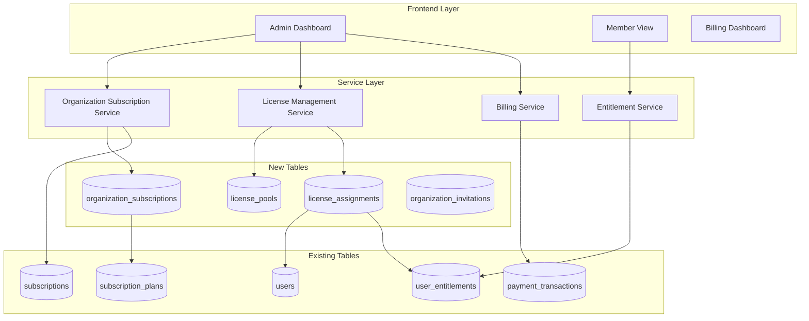
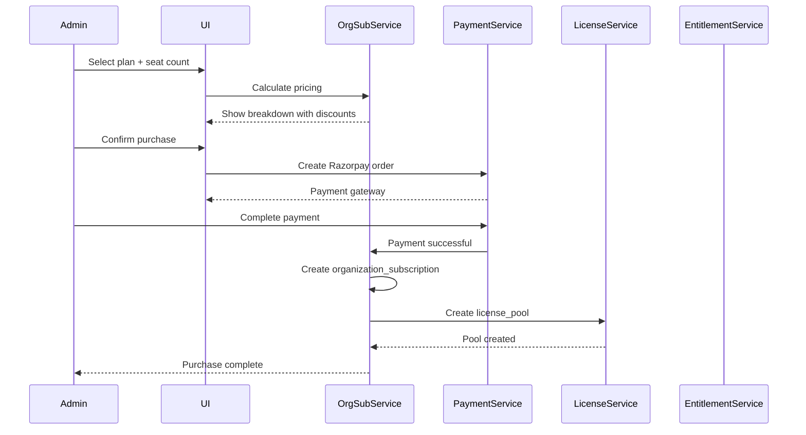
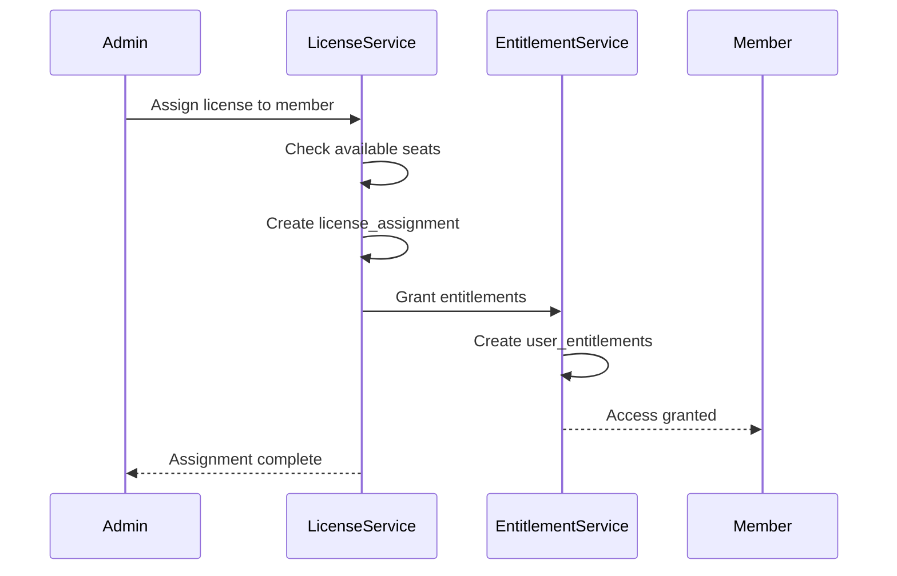
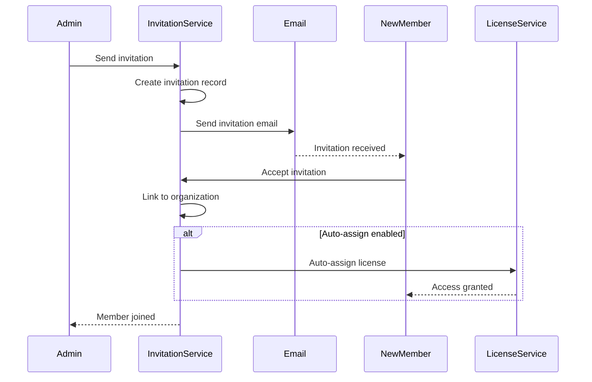

# Design Document: Organization-Level Subscription Management

## Overview

This design document outlines an industrial-grade architecture for enabling organization administrators to purchase and manage subscriptions for their members. The solution leverages existing database tables while adding minimal new tables for organization-specific functionality.

**Key Design Principles:**
1. **Reuse Existing Infrastructure**: Leverage existing `subscriptions`, `user_entitlements`, `subscription_plans`, and payment tables
2. **Minimal Schema Changes**: Add only essential new tables for organization management
3. **Backward Compatibility**: Individual B2C subscriptions continue to work alongside B2B organization subscriptions
4. **Scalability**: Support from small schools (10 users) to large universities (10,000+ users)
5. **Audit Trail**: Complete tracking of all subscription assignments and changes

## Architecture



## Database Schema Analysis

### Existing Tables (Reusable)

**1. users** - Already contains organization relationships
- Has `school_id`, `college_id` columns for organization membership
- Has `role` column to distinguish admins from members
- **Reuse**: No changes needed

**2. subscriptions** - Can be extended for organization subscriptions
- Currently tracks individual user subscriptions
- **Extension**: Add `organization_id` and `purchased_by` columns
- **Extension**: Add `seat_count` column for bulk purchases

**3. user_entitlements** - Already tracks feature access
- **Extension**: Add `granted_by_org` boolean and `organization_subscription_id` columns
- **Reuse**: Existing entitlement logic works for org-granted access

**4. subscription_plans** - Already has B2B support
- Has `plan_type` column with 'B2B' option
- Has `max_users` column for seat limits
- **Reuse**: No changes needed

**5. payment_transactions** - Already tracks payments
- **Extension**: Add `organization_id` column for org purchases
- **Reuse**: Existing Razorpay integration works


### New Tables Required

```sql
-- ============================================================================
-- ORGANIZATION SUBSCRIPTIONS
-- ============================================================================
-- Tracks subscriptions purchased by organization admins
CREATE TABLE organization_subscriptions (
  id UUID PRIMARY KEY DEFAULT gen_random_uuid(),
  organization_id UUID NOT NULL,  -- References schools.id, colleges.id, or universities.id
  organization_type VARCHAR(20) NOT NULL CHECK (organization_type IN ('school', 'college', 'university')),
  subscription_plan_id UUID NOT NULL REFERENCES subscription_plans(id),
  purchased_by UUID NOT NULL REFERENCES users(id),  -- Admin who made the purchase
  
  -- Seat management
  total_seats INTEGER NOT NULL CHECK (total_seats > 0),
  assigned_seats INTEGER DEFAULT 0 CHECK (assigned_seats >= 0),
  available_seats INTEGER GENERATED ALWAYS AS (total_seats - assigned_seats) STORED,
  
  -- Member targeting
  target_member_type VARCHAR(20) NOT NULL CHECK (target_member_type IN ('educator', 'student', 'both')),
  
  -- Subscription lifecycle
  status VARCHAR(20) NOT NULL DEFAULT 'active' CHECK (status IN ('active', 'paused', 'cancelled', 'expired', 'grace_period')),
  start_date TIMESTAMPTZ NOT NULL DEFAULT NOW(),
  end_date TIMESTAMPTZ NOT NULL,
  auto_renew BOOLEAN DEFAULT true,
  
  -- Pricing
  price_per_seat DECIMAL(10,2) NOT NULL,
  total_amount DECIMAL(10,2) NOT NULL,
  discount_percentage INTEGER DEFAULT 0,
  final_amount DECIMAL(10,2) NOT NULL,
  
  -- Payment integration
  razorpay_subscription_id VARCHAR(100),
  razorpay_order_id VARCHAR(100),
  
  -- Audit
  created_at TIMESTAMPTZ DEFAULT NOW(),
  updated_at TIMESTAMPTZ DEFAULT NOW(),
  cancelled_at TIMESTAMPTZ,
  cancellation_reason TEXT,
  
  CONSTRAINT valid_seat_count CHECK (assigned_seats <= total_seats)
);

CREATE INDEX idx_org_subs_org_id ON organization_subscriptions(organization_id);
CREATE INDEX idx_org_subs_status ON organization_subscriptions(status);
CREATE INDEX idx_org_subs_end_date ON organization_subscriptions(end_date);
CREATE INDEX idx_org_subs_purchased_by ON organization_subscriptions(purchased_by);

-- ============================================================================
-- LICENSE POOLS
-- ============================================================================
-- Manages available subscription seats for organizations
CREATE TABLE license_pools (
  id UUID PRIMARY KEY DEFAULT gen_random_uuid(),
  organization_subscription_id UUID NOT NULL REFERENCES organization_subscriptions(id) ON DELETE CASCADE,
  organization_id UUID NOT NULL,
  organization_type VARCHAR(20) NOT NULL,
  
  -- Pool details
  pool_name VARCHAR(100),  -- e.g., "Computer Science Department", "Grade 10"
  member_type VARCHAR(20) NOT NULL CHECK (member_type IN ('educator', 'student')),
  
  -- Seat allocation
  allocated_seats INTEGER NOT NULL CHECK (allocated_seats > 0),
  assigned_seats INTEGER DEFAULT 0 CHECK (assigned_seats >= 0),
  available_seats INTEGER GENERATED ALWAYS AS (allocated_seats - assigned_seats) STORED,
  
  -- Auto-assignment rules
  auto_assign_new_members BOOLEAN DEFAULT false,
  assignment_criteria JSONB DEFAULT '{}',  -- e.g., {"department": "CS", "grade": "10"}
  
  -- Status
  is_active BOOLEAN DEFAULT true,
  
  -- Audit
  created_at TIMESTAMPTZ DEFAULT NOW(),
  updated_at TIMESTAMPTZ DEFAULT NOW(),
  created_by UUID REFERENCES users(id),
  
  CONSTRAINT valid_pool_seats CHECK (assigned_seats <= allocated_seats)
);

CREATE INDEX idx_license_pools_org_sub ON license_pools(organization_subscription_id);
CREATE INDEX idx_license_pools_org_id ON license_pools(organization_id);
CREATE INDEX idx_license_pools_member_type ON license_pools(member_type);

-- ============================================================================
-- LICENSE ASSIGNMENTS
-- ============================================================================
-- Tracks which members have been assigned subscription seats
CREATE TABLE license_assignments (
  id UUID PRIMARY KEY DEFAULT gen_random_uuid(),
  license_pool_id UUID NOT NULL REFERENCES license_pools(id) ON DELETE CASCADE,
  organization_subscription_id UUID NOT NULL REFERENCES organization_subscriptions(id) ON DELETE CASCADE,
  
  -- Member details
  user_id UUID NOT NULL REFERENCES users(id) ON DELETE CASCADE,
  member_type VARCHAR(20) NOT NULL CHECK (member_type IN ('educator', 'student')),
  
  -- Assignment lifecycle
  status VARCHAR(20) NOT NULL DEFAULT 'active' CHECK (status IN ('active', 'suspended', 'revoked', 'expired')),
  assigned_at TIMESTAMPTZ DEFAULT NOW(),
  assigned_by UUID NOT NULL REFERENCES users(id),  -- Admin who assigned
  expires_at TIMESTAMPTZ,
  
  -- Revocation
  revoked_at TIMESTAMPTZ,
  revoked_by UUID REFERENCES users(id),
  revocation_reason TEXT,
  
  -- Transfer tracking
  transferred_from UUID REFERENCES license_assignments(id),
  transferred_to UUID REFERENCES license_assignments(id),
  
  -- Audit
  created_at TIMESTAMPTZ DEFAULT NOW(),
  updated_at TIMESTAMPTZ DEFAULT NOW(),
  
  CONSTRAINT unique_active_assignment UNIQUE (user_id, organization_subscription_id, status) 
    WHERE status = 'active'
);

CREATE INDEX idx_license_assign_user ON license_assignments(user_id);
CREATE INDEX idx_license_assign_pool ON license_assignments(license_pool_id);
CREATE INDEX idx_license_assign_status ON license_assignments(status);
CREATE INDEX idx_license_assign_org_sub ON license_assignments(organization_subscription_id);

-- ============================================================================
-- ORGANIZATION INVITATIONS
-- ============================================================================
-- Tracks member invitations with auto-subscription assignment
CREATE TABLE organization_invitations (
  id UUID PRIMARY KEY DEFAULT gen_random_uuid(),
  organization_id UUID NOT NULL,
  organization_type VARCHAR(20) NOT NULL,
  
  -- Invitee details
  email VARCHAR(255) NOT NULL,
  member_type VARCHAR(20) NOT NULL CHECK (member_type IN ('educator', 'student')),
  invited_by UUID NOT NULL REFERENCES users(id),
  
  -- Auto-assignment
  auto_assign_subscription BOOLEAN DEFAULT false,
  target_license_pool_id UUID REFERENCES license_pools(id),
  
  -- Invitation lifecycle
  status VARCHAR(20) NOT NULL DEFAULT 'pending' CHECK (status IN ('pending', 'accepted', 'expired', 'cancelled')),
  invitation_token VARCHAR(100) UNIQUE NOT NULL,
  expires_at TIMESTAMPTZ NOT NULL,
  
  -- Acceptance
  accepted_at TIMESTAMPTZ,
  accepted_by UUID REFERENCES users(id),
  
  -- Metadata
  invitation_message TEXT,
  metadata JSONB DEFAULT '{}',
  
  -- Audit
  created_at TIMESTAMPTZ DEFAULT NOW(),
  updated_at TIMESTAMPTZ DEFAULT NOW(),
  
  CONSTRAINT unique_pending_invitation UNIQUE (organization_id, email, status) 
    WHERE status = 'pending'
);

CREATE INDEX idx_org_inv_org_id ON organization_invitations(organization_id);
CREATE INDEX idx_org_inv_email ON organization_invitations(email);
CREATE INDEX idx_org_inv_token ON organization_invitations(invitation_token);
CREATE INDEX idx_org_inv_status ON organization_invitations(status);
```


### Schema Extensions to Existing Tables

```sql
-- ============================================================================
-- EXTEND SUBSCRIPTIONS TABLE
-- ============================================================================
ALTER TABLE subscriptions 
ADD COLUMN IF NOT EXISTS organization_id UUID,
ADD COLUMN IF NOT EXISTS organization_type VARCHAR(20),
ADD COLUMN IF NOT EXISTS purchased_by UUID REFERENCES users(id),
ADD COLUMN IF NOT EXISTS seat_count INTEGER DEFAULT 1,
ADD COLUMN IF NOT EXISTS is_organization_subscription BOOLEAN DEFAULT false;

CREATE INDEX idx_subscriptions_org_id ON subscriptions(organization_id) WHERE organization_id IS NOT NULL;

-- ============================================================================
-- EXTEND USER_ENTITLEMENTS TABLE
-- ============================================================================
ALTER TABLE user_entitlements 
ADD COLUMN IF NOT EXISTS granted_by_organization BOOLEAN DEFAULT false,
ADD COLUMN IF NOT EXISTS organization_subscription_id UUID REFERENCES organization_subscriptions(id) ON DELETE CASCADE,
ADD COLUMN IF NOT EXISTS granted_by UUID REFERENCES users(id);

CREATE INDEX idx_entitlements_org_sub ON user_entitlements(organization_subscription_id) 
  WHERE organization_subscription_id IS NOT NULL;

-- ============================================================================
-- EXTEND PAYMENT_TRANSACTIONS TABLE
-- ============================================================================
ALTER TABLE payment_transactions 
ADD COLUMN IF NOT EXISTS organization_id UUID,
ADD COLUMN IF NOT EXISTS organization_type VARCHAR(20),
ADD COLUMN IF NOT EXISTS seat_count INTEGER,
ADD COLUMN IF NOT EXISTS is_bulk_purchase BOOLEAN DEFAULT false;

CREATE INDEX idx_payments_org_id ON payment_transactions(organization_id) WHERE organization_id IS NOT NULL;

-- ============================================================================
-- EXTEND ADDON_PENDING_ORDERS TABLE
-- ============================================================================
ALTER TABLE addon_pending_orders 
ADD COLUMN IF NOT EXISTS organization_id UUID,
ADD COLUMN IF NOT EXISTS target_member_type VARCHAR(20),
ADD COLUMN IF NOT EXISTS target_member_ids UUID[],
ADD COLUMN IF NOT EXISTS is_bulk_order BOOLEAN DEFAULT false;
```

## Components and Interfaces

### 1. Organization Subscription Service

```typescript
interface OrganizationSubscription {
  id: string;
  organizationId: string;
  organizationType: 'school' | 'college' | 'university';
  subscriptionPlanId: string;
  purchasedBy: string;
  totalSeats: number;
  assignedSeats: number;
  availableSeats: number;
  targetMemberType: 'educator' | 'student' | 'both';
  status: 'active' | 'paused' | 'cancelled' | 'expired' | 'grace_period';
  startDate: Date;
  endDate: Date;
  autoRenew: boolean;
  pricePerSeat: number;
  totalAmount: number;
  discountPercentage: number;
  finalAmount: number;
}

interface OrganizationSubscriptionService {
  // Purchase operations
  purchaseSubscription(request: OrgSubscriptionPurchaseRequest): Promise<OrganizationSubscription>;
  calculateBulkPricing(planId: string, seatCount: number): Promise<PricingBreakdown>;
  
  // Subscription management
  getOrganizationSubscriptions(organizationId: string): Promise<OrganizationSubscription[]>;
  updateSeatCount(subscriptionId: string, newSeatCount: number): Promise<OrganizationSubscription>;
  cancelSubscription(subscriptionId: string, reason: string): Promise<void>;
  renewSubscription(subscriptionId: string, options?: RenewalOptions): Promise<OrganizationSubscription>;
  
  // Upgrade/downgrade
  upgradeSubscription(subscriptionId: string, newPlanId: string): Promise<OrganizationSubscription>;
  downgradeSubscription(subscriptionId: string, newPlanId: string): Promise<OrganizationSubscription>;
}

interface OrgSubscriptionPurchaseRequest {
  organizationId: string;
  organizationType: 'school' | 'college' | 'university';
  planId: string;
  seatCount: number;
  targetMemberType: 'educator' | 'student' | 'both';
  billingCycle: 'monthly' | 'annual';
  autoRenew: boolean;
  paymentMethod: string;
}

interface PricingBreakdown {
  basePrice: number;
  seatCount: number;
  subtotal: number;
  discountPercentage: number;
  discountAmount: number;
  taxAmount: number;
  finalAmount: number;
  pricePerSeat: number;
}
```

### 2. License Management Service

```typescript
interface LicensePool {
  id: string;
  organizationSubscriptionId: string;
  organizationId: string;
  poolName: string;
  memberType: 'educator' | 'student';
  allocatedSeats: number;
  assignedSeats: number;
  availableSeats: number;
  autoAssignNewMembers: boolean;
  assignmentCriteria: Record<string, any>;
}

interface LicenseAssignment {
  id: string;
  licensePoolId: string;
  organizationSubscriptionId: string;
  userId: string;
  memberType: 'educator' | 'student';
  status: 'active' | 'suspended' | 'revoked' | 'expired';
  assignedAt: Date;
  assignedBy: string;
  expiresAt?: Date;
}

interface LicenseManagementService {
  // Pool management
  createLicensePool(request: CreatePoolRequest): Promise<LicensePool>;
  getLicensePools(organizationId: string): Promise<LicensePool[]>;
  updatePoolAllocation(poolId: string, newAllocation: number): Promise<LicensePool>;
  
  // Assignment operations
  assignLicense(poolId: string, userId: string, assignedBy: string): Promise<LicenseAssignment>;
  unassignLicense(assignmentId: string, reason: string): Promise<void>;
  transferLicense(fromUserId: string, toUserId: string, transferredBy: string): Promise<LicenseAssignment>;
  bulkAssignLicenses(poolId: string, userIds: string[], assignedBy: string): Promise<LicenseAssignment[]>;
  
  // Query operations
  getUserAssignments(userId: string): Promise<LicenseAssignment[]>;
  getPoolAssignments(poolId: string): Promise<LicenseAssignment[]>;
  getAvailableSeats(organizationId: string, memberType: 'educator' | 'student'): Promise<number>;
  
  // Auto-assignment
  configureAutoAssignment(poolId: string, criteria: Record<string, any>): Promise<LicensePool>;
  processAutoAssignments(organizationId: string): Promise<LicenseAssignment[]>;
}
```

### 3. Organization Entitlement Service

```typescript
interface OrganizationEntitlementService {
  // Grant entitlements based on license assignment
  grantEntitlementsFromAssignment(assignment: LicenseAssignment): Promise<UserEntitlement[]>;
  
  // Revoke entitlements when license is unassigned
  revokeEntitlementsFromAssignment(assignmentId: string): Promise<void>;
  
  // Check if user has access through organization
  hasOrganizationAccess(userId: string, featureKey: string): Promise<boolean>;
  
  // Get all entitlements for a user (org + personal)
  getUserEntitlements(userId: string): Promise<{
    organizationProvided: UserEntitlement[];
    selfPurchased: UserEntitlement[];
  }>;
  
  // Sync entitlements when subscription changes
  syncOrganizationEntitlements(subscriptionId: string): Promise<void>;
}
```

### 4. Organization Billing Service

```typescript
interface BillingDashboard {
  organizationId: string;
  currentPeriod: {
    startDate: Date;
    endDate: Date;
    totalCost: number;
    subscriptionCosts: number;
    addonCosts: number;
  };
  subscriptions: Array<{
    planName: string;
    seatCount: number;
    utilization: number;  // percentage
    monthlyCost: number;
  }>;
  addons: Array<{
    addonName: string;
    memberCount: number;
    monthlyCost: number;
  }>;
  upcomingRenewals: Array<{
    subscriptionId: string;
    renewalDate: Date;
    estimatedCost: number;
  }>;
  paymentHistory: PaymentRecord[];
}

interface OrganizationBillingService {
  // Dashboard data
  getBillingDashboard(organizationId: string): Promise<BillingDashboard>;
  
  // Invoicing
  generateInvoice(transactionId: string): Promise<Invoice>;
  downloadInvoice(invoiceId: string): Promise<Blob>;
  getInvoiceHistory(organizationId: string): Promise<Invoice[]>;
  
  // Cost projections
  projectMonthlyCost(organizationId: string): Promise<number>;
  calculateSeatAdditionCost(subscriptionId: string, additionalSeats: number): Promise<number>;
  
  // Payment methods
  updatePaymentMethod(organizationId: string, paymentMethod: PaymentMethod): Promise<void>;
  addBillingContact(organizationId: string, contact: BillingContact): Promise<void>;
}
```


### 5. Member Invitation Service

```typescript
interface OrganizationInvitation {
  id: string;
  organizationId: string;
  email: string;
  memberType: 'educator' | 'student';
  invitedBy: string;
  autoAssignSubscription: boolean;
  targetLicensePoolId?: string;
  status: 'pending' | 'accepted' | 'expired' | 'cancelled';
  invitationToken: string;
  expiresAt: Date;
}

interface MemberInvitationService {
  // Invitation operations
  inviteMember(request: InviteMemberRequest): Promise<OrganizationInvitation>;
  bulkInviteMembers(requests: InviteMemberRequest[]): Promise<OrganizationInvitation[]>;
  resendInvitation(invitationId: string): Promise<void>;
  cancelInvitation(invitationId: string): Promise<void>;
  
  // Acceptance
  acceptInvitation(token: string, userId: string): Promise<{
    organization: Organization;
    assignedLicense?: LicenseAssignment;
  }>;
  
  // Query
  getPendingInvitations(organizationId: string): Promise<OrganizationInvitation[]>;
  getInvitationByToken(token: string): Promise<OrganizationInvitation>;
}

interface InviteMemberRequest {
  organizationId: string;
  email: string;
  memberType: 'educator' | 'student';
  autoAssignSubscription: boolean;
  licensePoolId?: string;
  invitationMessage?: string;
}
```

## Frontend UI Extensions

### 1. Admin Dashboard - Subscription Management Tab

**Location**: `/school-admin/subscription/manage`, `/college-admin/subscription/manage`, `/university-admin/subscription/manage`

**New Components**:

```typescript
// Main organization subscription dashboard
<OrganizationSubscriptionDashboard>
  <SubscriptionOverview />
  <LicensePoolManager />
  <MemberAssignments />
  <BillingDashboard />
  <InvitationManager />
</OrganizationSubscriptionDashboard>

// Subscription overview card
<SubscriptionOverview>
  - Active subscriptions list
  - Seat utilization metrics (progress bars)
  - Quick actions (Add seats, Upgrade, Renew)
  - Expiration warnings
</SubscriptionOverview>

// License pool management
<LicensePoolManager>
  - Create/edit license pools
  - Allocate seats to pools
  - Configure auto-assignment rules
  - View pool utilization
</LicensePoolManager>

// Member assignment interface
<MemberAssignments>
  - Searchable member list
  - Bulk assignment actions
  - Assignment history
  - Transfer licenses
  - Revoke access
</MemberAssignments>

// Billing dashboard
<BillingDashboard>
  - Current period costs
  - Cost breakdown (subscriptions vs addons)
  - Payment history
  - Downloadable invoices
  - Upcoming renewals
</BillingDashboard>

// Invitation manager
<InvitationManager>
  - Send individual/bulk invitations
  - Pending invitations list
  - Resend/cancel invitations
  - Auto-assignment configuration
</InvitationManager>
```

### 2. Purchase Flow Modifications

**Location**: `/subscription/plans?type=school_admin&mode=organization`

**Changes to SubscriptionPlans.jsx**:

```typescript
// Add organization purchase mode
const isOrganizationPurchase = searchParams.get('mode') === 'organization';

// Modify plan cards to show seat-based pricing
<PlanCard>
  {isOrganizationPurchase && (
    <SeatSelector 
      minSeats={1}
      maxSeats={plan.maxUsers}
      onSeatCountChange={handleSeatCountChange}
      showVolumeDiscounts={true}
    />
  )}
  <PricingBreakdown 
    basePrice={plan.price}
    seatCount={selectedSeats}
    discount={calculateVolumeDiscount(selectedSeats)}
  />
</PlanCard>

// Add member type selector
<MemberTypeSelector>
  <option value="educator">Educators Only</option>
  <option value="student">Students Only</option>
  <option value="both">Both Educators & Students</option>
</MemberTypeSelector>
```

### 3. Member View - Subscription Status

**Location**: `/student/subscription/manage`, `/educator/subscription/manage`

**New Component**:

```typescript
<MemberSubscriptionView>
  <OrganizationProvidedFeatures>
    - Features provided by organization
    - Organization admin contact
    - Subscription expiration date
    - "Managed by [Organization Name]" badge
  </OrganizationProvidedFeatures>
  
  <PersonalAddOns>
    - Self-purchased add-ons
    - Available add-ons to purchase
    - "Purchase for yourself" option
  </PersonalAddOns>
</MemberSubscriptionView>
```

### 4. Bulk Purchase Flow

**New Page**: `/admin/subscription/bulk-purchase`

```typescript
<BulkPurchaseWizard>
  <Step1_SelectPlan>
    - Choose subscription plan
    - Select member type
  </Step1_SelectPlan>
  
  <Step2_ConfigureSeats>
    - Enter seat count
    - View volume discounts
    - See pricing breakdown
  </Step2_ConfigureSeats>
  
  <Step3_SelectMembers>
    - Option 1: Auto-assign to all current members
    - Option 2: Select specific members
    - Option 3: Create license pool for future assignment
  </Step3_SelectMembers>
  
  <Step4_Review>
    - Review purchase details
    - Add billing information
    - Complete payment
  </Step4_Review>
</BulkPurchaseWizard>
```

## Data Flow Diagrams

### Purchase Flow



### License Assignment Flow



### Member Invitation Flow



## Volume Discount Calculation

```typescript
function calculateVolumeDiscount(seatCount: number): number {
  if (seatCount >= 500) return 30;
  if (seatCount >= 100) return 20;
  if (seatCount >= 50) return 10;
  return 0;
}

function calculateBulkPricing(
  basePricePerSeat: number,
  seatCount: number
): PricingBreakdown {
  const subtotal = basePricePerSeat * seatCount;
  const discountPercentage = calculateVolumeDiscount(seatCount);
  const discountAmount = (subtotal * discountPercentage) / 100;
  const taxAmount = (subtotal - discountAmount) * 0.18; // 18% GST
  const finalAmount = subtotal - discountAmount + taxAmount;
  
  return {
    basePrice: basePricePerSeat,
    seatCount,
    subtotal,
    discountPercentage,
    discountAmount,
    taxAmount,
    finalAmount,
    pricePerSeat: finalAmount / seatCount
  };
}
```

## Access Control Logic

```typescript
async function checkFeatureAccess(
  userId: string,
  featureKey: string
): Promise<{
  hasAccess: boolean;
  source: 'organization' | 'personal' | 'none';
  expiresAt?: Date;
}> {
  // Check organization-provided access
  const orgEntitlement = await db.query(`
    SELECT ue.*, la.expires_at
    FROM user_entitlements ue
    JOIN license_assignments la ON ue.organization_subscription_id = la.organization_subscription_id
    WHERE ue.user_id = $1
    AND ue.feature_key = $2
    AND ue.granted_by_organization = true
    AND la.status = 'active'
    AND ue.is_active = true
  `, [userId, featureKey]);
  
  if (orgEntitlement) {
    return {
      hasAccess: true,
      source: 'organization',
      expiresAt: orgEntitlement.expires_at
    };
  }
  
  // Check personal subscription
  const personalEntitlement = await db.query(`
    SELECT * FROM user_entitlements
    WHERE user_id = $1
    AND feature_key = $2
    AND granted_by_organization = false
    AND is_active = true
    AND (expires_at IS NULL OR expires_at > NOW())
  `, [userId, featureKey]);
  
  if (personalEntitlement) {
    return {
      hasAccess: true,
      source: 'personal',
      expiresAt: personalEntitlement.expires_at
    };
  }
  
  return { hasAccess: false, source: 'none' };
}
```


## Error Handling

### Payment Failures
- Retry mechanism with exponential backoff
- Admin notification via email and dashboard alert
- Grace period before seat deactivation
- Automatic seat suspension after 3 failed payment attempts

### Seat Limit Exceeded
- Prevent new assignments when pool is full
- Show clear error message with upgrade option
- Suggest seat count increase or member removal
- Queue assignments for when seats become available

### Member Not Found
- Validate member belongs to organization before assignment
- Check member type matches pool type
- Provide clear error with member search functionality

### Concurrent Assignment Conflicts
- Use database-level locking for seat allocation
- Implement optimistic locking with version numbers
- Retry logic for transient conflicts
- Clear error messages for permanent conflicts

### Subscription Expiration
- 30-day advance warning to admin
- 7-day warning to all affected members
- 7-day grace period after expiration
- Automatic entitlement revocation after grace period
- Preserve assignment records for audit

## Testing Strategy

### Unit Tests
- Volume discount calculations
- Seat allocation logic
- Entitlement granting/revoking
- Access control checks
- Pricing calculations with edge cases

### Integration Tests
- End-to-end purchase flow
- License assignment workflow
- Member invitation and acceptance
- Subscription renewal process
- Bulk operations (assign/unassign)

### Load Tests
- 1000+ concurrent seat assignments
- Bulk invitation of 10,000 members
- Dashboard loading with 100+ subscriptions
- Payment processing under load

### Security Tests
- Authorization checks (admin-only operations)
- Cross-organization access prevention
- SQL injection prevention
- XSS prevention in invitation messages
- Rate limiting on bulk operations

## Migration Strategy

### Phase 1: Database Setup (Week 1)
1. Create new tables (organization_subscriptions, license_pools, etc.)
2. Add columns to existing tables
3. Create indexes and constraints
4. Set up RLS policies
5. Test schema with sample data

### Phase 2: Backend Services (Week 2-3)
1. Implement OrganizationSubscriptionService
2. Implement LicenseManagementService
3. Implement OrganizationEntitlementService
4. Implement OrganizationBillingService
5. Implement MemberInvitationService
6. Add API endpoints
7. Write unit tests

### Phase 3: Frontend UI (Week 4-5)
1. Create OrganizationSubscriptionDashboard
2. Modify SubscriptionPlans for organization mode
3. Create BulkPurchaseWizard
4. Update MemberSubscriptionView
5. Add admin management interfaces
6. Implement responsive design
7. Write integration tests

### Phase 4: Testing & Refinement (Week 6)
1. End-to-end testing
2. Load testing
3. Security audit
4. Bug fixes
5. Performance optimization
6. Documentation

### Phase 5: Pilot Launch (Week 7)
1. Deploy to staging
2. Pilot with 2-3 organizations
3. Gather feedback
4. Make adjustments
5. Monitor metrics

### Phase 6: Production Launch (Week 8)
1. Deploy to production
2. Gradual rollout to existing organizations
3. Monitor system health
4. Provide admin training
5. Customer support readiness

## Monitoring & Observability

### Key Metrics
- Subscription purchase rate
- Seat utilization percentage
- License assignment velocity
- Payment success rate
- Member invitation acceptance rate
- Average time to assign licenses
- Cost per active user
- Renewal rate

### Alerts
- Payment failures
- Low seat availability (<10%)
- Subscription expiring in 7 days
- High unassigned seat count (>20%)
- Failed bulk operations
- API error rate >1%

### Dashboards
- Real-time subscription health
- Revenue metrics
- Seat utilization trends
- Member growth
- Payment processing status
- System performance metrics

## Security Considerations

### Authorization
- Role-based access control (RBAC)
- Organization-scoped operations
- Admin-only subscription management
- Member-only self-service views

### Data Protection
- Encrypt payment information
- PII protection for member data
- Audit logs for all admin actions
- Secure invitation tokens (UUID v4)
- Token expiration (7 days)

### Rate Limiting
- Bulk operations: 100 requests/minute
- API endpoints: 1000 requests/minute per org
- Payment operations: 10 requests/minute
- Invitation sending: 50/hour per admin

### Compliance
- GDPR compliance for EU members
- Data retention policies
- Right to be forgotten
- Export member data on request
- Audit trail for 7 years

## Performance Optimization

### Database
- Indexed foreign keys
- Materialized views for dashboards
- Query optimization with EXPLAIN
- Connection pooling
- Read replicas for reporting

### Caching
- Redis cache for entitlement checks (5-minute TTL)
- Cache organization subscriptions (1-hour TTL)
- Cache license pool data (15-minute TTL)
- Invalidate on updates

### API
- Pagination for large result sets
- Batch operations for bulk actions
- Async processing for heavy operations
- Rate limiting per organization
- Response compression

### Frontend
- Lazy loading for large member lists
- Virtual scrolling for 1000+ items
- Debounced search inputs
- Optimistic UI updates
- Progressive loading

## Backward Compatibility

### Individual Subscriptions
- Existing B2C subscriptions continue to work
- No migration required for individual users
- Coexistence of B2C and B2B models
- Clear separation in UI and data

## Database Triggers (IMPLEMENTED)

The following database triggers have been implemented to automate license management:

### Auto-Assign License Triggers

When a new member is added to the organization, these triggers automatically assign a license if an eligible pool exists:

| Trigger Name | Table | Event | Function |
|-------------|-------|-------|----------|
| `trigger_auto_assign_license_students` | `students` | INSERT | `auto_assign_license_to_member()` |
| `trigger_auto_assign_license_school_educators` | `school_educators` | INSERT | `auto_assign_license_to_member()` |
| `trigger_auto_assign_license_college_lecturers` | `college_lecturers` | INSERT | `auto_assign_license_to_member()` |

**Auto-assign conditions:**
- Pool has `auto_assign_new_members = true`
- Pool has `is_active = true`
- Pool has available seats (`assigned_seats < allocated_seats`)
- Member doesn't already have an active license in the organization

### Seat Sync Trigger

Keeps the `assigned_seats` count synchronized automatically:

| Trigger Name | Table | Event | Function |
|-------------|-------|-------|----------|
| `trigger_sync_pool_seats` | `license_assignments` | INSERT/UPDATE/DELETE | `sync_pool_assigned_seats()` |

**Migration files:**
- `implement_auto_assign_license_triggers` - Creates the triggers and functions
- `cleanup_duplicate_pool_seat_triggers` - Removes any duplicate triggers

**Frontend service reference:** `src/services/organization/licenseManagementService.ts`

### Existing Features
- All current subscription features preserved
- Add-on system works for both models
- Payment integration unchanged
- Entitlement system extended, not replaced

### API Compatibility
- New endpoints for organization features
- Existing endpoints unchanged
- Versioned API (v2) for new features
- Deprecation notices for old patterns

## Future Enhancements

### Phase 2 Features
- Department-level sub-pools
- Custom role-based access
- Advanced analytics and reporting
- Integration with HR systems
- SSO for organization members
- Custom branding per organization
- White-label options

### Phase 3 Features
- Multi-year contracts
- Usage-based billing
- Marketplace for third-party add-ons
- API for external integrations
- Mobile app for admins
- AI-powered seat optimization
- Predictive renewal analytics

## Success Criteria

### Business Metrics
- 50% of organizations adopt within 6 months
- 30% increase in average revenue per organization
- 90% seat utilization rate
- 95% renewal rate
- <5% churn rate

### Technical Metrics
- 99.9% uptime
- <200ms API response time (p95)
- <2s dashboard load time
- Zero data loss incidents
- <0.1% payment failure rate

### User Satisfaction
- 4.5+ admin satisfaction score
- 90% would recommend to other organizations
- <10% support ticket rate
- <24h average response time for issues

