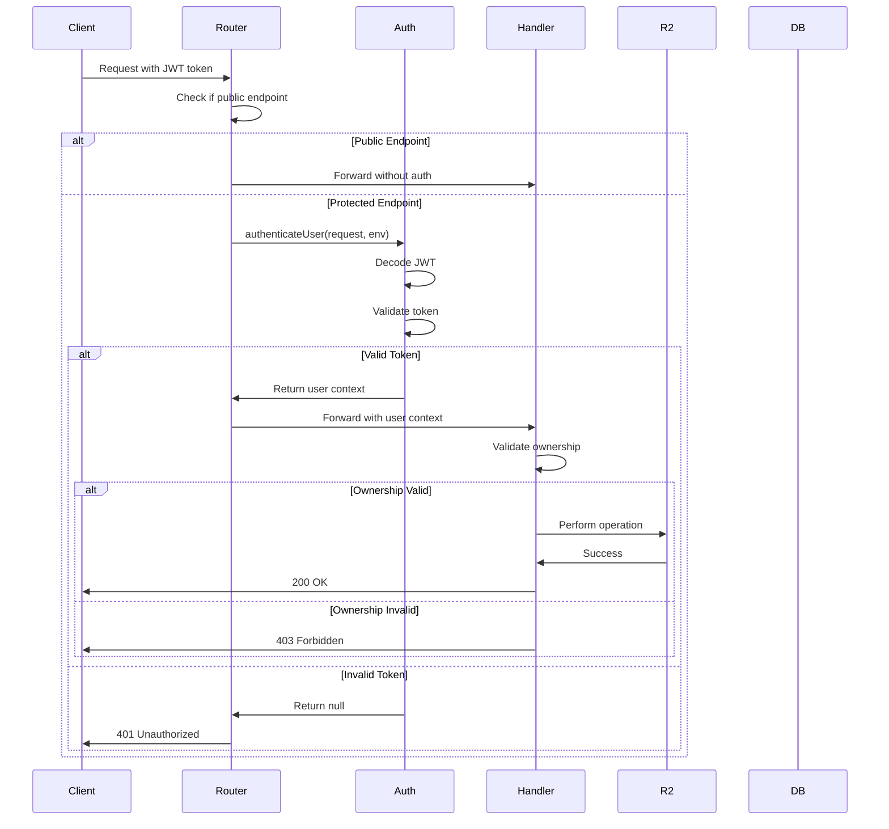

# Design Document: Storage API Authentication

## Overview

This design implements JWT-based authentication and ownership validation for the Storage API using existing Supabase infrastructure. The solution adds an authentication middleware layer to the main router, validates ownership in individual handlers, and updates frontend services to include authentication tokens in all requests.

The design follows the established pattern from the adaptive-session API, using the shared `authenticateUser()` function and maintaining backward compatibility with existing API contracts.

## Architecture

### High-Level Architecture

```
┌─────────────────┐
│  Frontend Apps  │
│  (React/Vue)    │
└────────┬────────┘
         │ JWT Token in Authorization header
         ▼
┌─────────────────────────────────────────┐
│   Storage API Router                    │
│   (functions/api/storage/[[path]].ts)   │
│                                         │
│   ┌─────────────────────────────┐     │
│   │  Authentication Middleware  │     │
│   │  - Check public endpoints   │     │
│   │  - Validate JWT token       │     │
│   │  - Attach user context      │     │
│   └─────────────┬───────────────┘     │
│                 │                       │
│                 ▼                       │
│   ┌─────────────────────────────┐     │
│   │  Route to Handler           │     │
│   └─────────────┬───────────────┘     │
└─────────────────┼───────────────────────┘
                  │
                  ▼
┌─────────────────────────────────────────┐
│   Individual Handlers                   │
│   - Upload (validate user)              │
│   - Delete (validate ownership)         │
│   - Payment Receipt (validate ownership)│
│   - Document Access (validate access)   │
│   - Presigned (validate user)           │
└─────────────────────────────────────────┘
```

### Authentication Flow



## Components and Interfaces

### 1. Authentication Middleware (Router Level)

**Location:** `functions/api/storage/[[path]].ts`

**Interface:**
```typescript
interface AuthenticatedContext extends PagesFunction {
  user?: AuthUser;
  supabase?: SupabaseClient;
  supabaseAdmin?: SupabaseClient;
}

const PUBLIC_ENDPOINTS = [
  '/',
  '/course-certificate',
  '/extract-content'
];

function isPublicEndpoint(path: string): boolean;
async function authenticateRequest(context: PagesFunction): Promise<AuthenticatedContext>;
```

**Responsibilities:**
- Determine if endpoint is public
- Call `authenticateUser()` for protected endpoints
- Return 401 if authentication fails
- Attach user context to request for handlers

### 2. Ownership Validation Utilities

**Location:** `functions/api/storage/utils/ownership.ts` (new file)

**Interface:**
```typescript
interface OwnershipValidationResult {
  isOwner: boolean;
  reason?: string;
}

// Extract user ID from file path patterns
function extractUserIdFromPath(fileKey: string): string | null;

// Validate certificate ownership
function validateCertificateOwnership(
  fileKey: string,
  userId: string
): OwnershipValidationResult;

// Validate payment receipt ownership
function validatePaymentReceiptOwnership(
  fileKey: string,
  userId: string
): OwnershipValidationResult;

// Validate upload ownership
function validateUploadOwnership(
  fileKey: string,
  userId: string
): OwnershipValidationResult;

// Check if user is educator (for course materials)
async function isEducator(
  userId: string,
  supabase: SupabaseClient
): Promise<boolean>;
```

**Path Patterns:**
- Certificates: `certificates/{studentId}/...`
- Payment Receipts: `payment_pdf/{name}_{userId}/...`
- User Uploads: `uploads/{userId}/...`
- Course Materials: `courses/...` (educator only)

### 3. Updated Delete Handler

**Location:** `functions/api/storage/handlers/delete.ts`

**Changes:**
```typescript
export const handleDelete: PagesFunction = async (context: AuthenticatedContext) => {
  // Require authentication
  if (!context.user) {
    return jsonResponse({ error: 'Authentication required' }, 401);
  }

  const { user, supabase } = context;
  
  // ... existing code to get fileKey ...
  
  // Validate ownership
  const ownership = await validateOwnership(fileKey, user.id, supabase);
  if (!ownership.isOwner) {
    return jsonResponse({ 
      error: 'Access denied',
      reason: ownership.reason 
    }, 403);
  }
  
  // ... existing delete logic ...
};
```

### 4. Updated Payment Receipt Handler

**Location:** `functions/api/storage/handlers/payment-receipt.ts`

**Changes to handleGetPaymentReceipt:**
```typescript
export const handleGetPaymentReceipt: PagesFunction = async (context: AuthenticatedContext) => {
  // Require authentication
  if (!context.user) {
    return jsonResponse({ error: 'Authentication required' }, 401);
  }

  const { user, supabaseAdmin } = context;
  
  // ... existing code to get fileKey ...
  
  // Extract payment ID from fileKey
  const paymentId = extractPaymentIdFromKey(fileKey);
  
  // Query database for payment ownership
  const { data: payment, error } = await supabaseAdmin
    .from('orders')
    .select('user_id')
    .eq('id', paymentId)
    .single();
  
  if (error || !payment) {
    return jsonResponse({ error: 'Payment not found' }, 404);
  }
  
  // Validate ownership
  if (payment.user_id !== user.id) {
    return jsonResponse({ error: 'Access denied' }, 403);
  }
  
  // ... existing file retrieval logic ...
};
```

### 5. Updated Upload Handler

**Location:** `functions/api/storage/handlers/upload.ts`

**Changes:**
```typescript
export const handleUpload: PagesFunction = async (context: AuthenticatedContext) => {
  // Require authentication
  if (!context.user) {
    return jsonResponse({ error: 'Authentication required' }, 401);
  }

  const { user } = context;
  
  // ... existing validation logic ...
  
  // Generate unique file key with user ID
  const fileKey = generateUniqueKey(filename, user.id);
  
  // ... existing upload logic ...
};

// Updated function signature
function generateUniqueKey(filename: string, userId: string): string {
  const timestamp = Date.now();
  const randomString = crypto.randomUUID().replace(/-/g, '').substring(0, 16);
  const extension = filename.substring(filename.lastIndexOf('.'));
  return `uploads/${userId}/${timestamp}-${randomString}${extension}`;
}
```

### 6. Updated Document Access Handler

**Location:** `functions/api/storage/handlers/document-access.ts`

**Changes:**
```typescript
export const handleDocumentAccess: PagesFunction = async (context: AuthenticatedContext) => {
  // Check if document is public
  const isPublic = checkIfPublicDocument(fileKey);
  
  if (!isPublic) {
    // Require authentication for private documents
    if (!context.user) {
      return jsonResponse({ error: 'Authentication required' }, 401);
    }
    
    // Validate ownership
    const ownership = validateDocumentOwnership(fileKey, context.user.id);
    if (!ownership.isOwner) {
      return jsonResponse({ error: 'Access denied' }, 403);
    }
  }
  
  // ... existing document retrieval logic ...
};
```

### 7. Updated Presigned URL Handlers

**Location:** `functions/api/storage/handlers/presigned.ts`

**Changes:**
```typescript
export const handlePresigned: PagesFunction = async (context: AuthenticatedContext) => {
  // Require authentication
  if (!context.user) {
    return jsonResponse({ error: 'Authentication required' }, 401);
  }

  const { user } = context;
  
  // ... existing code to parse request ...
  
  // Generate file key with user ID
  const fileKey = generatePresignedKey(filename, user.id, courseId, lessonId);
  
  // ... existing presigned URL generation ...
};

export const handleConfirm: PagesFunction = async (context: AuthenticatedContext) => {
  // Require authentication
  if (!context.user) {
    return jsonResponse({ error: 'Authentication required' }, 401);
  }

  const { user } = context;
  const { fileKey } = await request.json();
  
  // Validate that fileKey contains user's ID
  if (!fileKey.includes(user.id)) {
    return jsonResponse({ error: 'Access denied' }, 403);
  }
  
  // ... existing confirmation logic ...
};
```

### 8. Frontend Service Updates

#### cloudflareR2Upload.ts

**Changes:**
```typescript
import { supabase } from '../supabaseClient'; // Import supabase client

export async function uploadToCloudflareR2(
  file: File,
  folder: string = 'courses'
): Promise<R2UploadResponse> {
  try {
    // Get authentication token
    const { data: { session }, error: sessionError } = await supabase.auth.getSession();
    
    if (sessionError || !session) {
      return {
        success: false,
        error: 'Authentication required. Please log in.'
      };
    }

    // ... existing validation ...

    const response = await fetch(`${STORAGE_API_URL}/upload`, {
      method: 'POST',
      headers: {
        'Authorization': `Bearer ${session.access_token}`
      },
      body: formData
    });

    if (response.status === 401) {
      return {
        success: false,
        error: 'Authentication failed. Please refresh and log in again.'
      };
    }

    // ... existing response handling ...
  } catch (error) {
    // ... existing error handling ...
  }
}

export async function deleteFromCloudflareR2(url: string): Promise<boolean> {
  try {
    // Get authentication token
    const { data: { session }, error: sessionError } = await supabase.auth.getSession();
    
    if (sessionError || !session) {
      console.error('Authentication required');
      return false;
    }

    const response = await fetch(`${STORAGE_API_URL}/delete`, {
      method: 'POST',
      headers: {
        'Content-Type': 'application/json',
        'Authorization': `Bearer ${session.access_token}`
      },
      body: JSON.stringify({ url })
    });

    // ... existing response handling ...
  } catch (error) {
    // ... existing error handling ...
  }
}
```

#### storageApiService.ts

**Changes:**
```typescript
import { supabase } from '../supabaseClient';

// Helper to get token
async function getAuthToken(): Promise<string | null> {
  const { data: { session } } = await supabase.auth.getSession();
  return session?.access_token || null;
}

// Update all methods to get token automatically
export async function uploadFile(
  file: File,
  options: UploadOptions
): Promise<any> {
  const token = await getAuthToken();
  
  if (!token) {
    throw new Error('Authentication required. Please log in.');
  }

  // ... existing implementation with token ...
}

export async function deleteFile(fileUrl: string): Promise<any> {
  const token = await getAuthToken();
  
  if (!token) {
    throw new Error('Authentication required. Please log in.');
  }

  // ... existing implementation with token ...
}

// Update all other methods similarly
```

## Data Models

### AuthenticatedContext

```typescript
interface AuthUser {
  id: string;
  email?: string;
}

interface AuthenticatedContext {
  request: Request;
  env: Record<string, string>;
  user?: AuthUser;
  supabase?: SupabaseClient;
  supabaseAdmin?: SupabaseClient;
  params?: Record<string, string>;
}
```

### Ownership Validation Result

```typescript
interface OwnershipValidationResult {
  isOwner: boolean;
  reason?: string; // e.g., "User ID mismatch", "Not an educator"
}
```

### File Path Patterns

```typescript
type FilePathPattern = 
  | `certificates/${string}/${string}`
  | `payment_pdf/${string}_${string}/${string}`
  | `uploads/${string}/${string}`
  | `courses/${string}/${string}`;
```

## Correctness Properties


A property is a characteristic or behavior that should hold true across all valid executions of a system—essentially, a formal statement about what the system should do. Properties serve as the bridge between human-readable specifications and machine-verifiable correctness guarantees.

### Property 1: Protected endpoints reject unauthenticated requests

*For any* protected endpoint (not in PUBLIC_ENDPOINTS list), when a request is made without a valid JWT token in the Authorization header, the API should return a 401 Unauthorized response with a clear error message.

**Validates: Requirements 1.1, 1.2, 2.4**

### Property 2: Valid tokens attach user context

*For any* protected endpoint, when a request is made with a valid JWT token, the API should extract the user ID from the token and make it available to the handler.

**Validates: Requirements 1.4**

### Property 3: Public endpoints allow unauthenticated access

*For any* endpoint in the PUBLIC_ENDPOINTS list (/, /course-certificate, /extract-content), requests without authentication tokens should succeed.

**Validates: Requirements 1.5, 2.1, 2.2, 2.3**

### Property 4: Uploaded files include user ID in path

*For any* authenticated file upload, the returned file key should contain the authenticated user's ID in the path structure.

**Validates: Requirements 3.3**

### Property 5: File deletion validates ownership

*For any* file deletion request, when the file path contains a user ID (in patterns like certificates/{userId}/, payment_pdf/{name}_{userId}/, or uploads/{userId}/), the API should only allow deletion if the authenticated user ID matches the user ID in the path, otherwise returning 403 Forbidden.

**Validates: Requirements 4.1, 4.2, 4.3, 4.4**

### Property 6: Payment receipt access validates ownership

*For any* payment receipt access request, the API should query the database to find the owner of the payment, and only allow access if the authenticated user ID matches the payment owner's user ID, otherwise returning 403 Forbidden.

**Validates: Requirements 5.3, 5.4, 5.5**

### Property 7: Private document access validates ownership

*For any* private document access request, the API should verify the authenticated user has ownership or permission to access the document, otherwise returning 403 Forbidden.

**Validates: Requirements 6.3**

### Property 8: Presigned URLs include user ID

*For any* presigned URL generation request, the generated file key should include the authenticated user's ID in the path.

**Validates: Requirements 7.2**

### Property 9: Upload confirmation validates user ID

*For any* upload confirmation request, when the file key contains a user ID, the API should only allow confirmation if the authenticated user ID matches the user ID in the file key, otherwise returning 403 Forbidden.

**Validates: Requirements 7.3**

### Property 10: Error responses include clear messages

*For any* 401 or 403 error response, the response body should include a clear error message field indicating either "authentication required" (401) or "access denied" / "insufficient permissions" (403).

**Validates: Requirements 12.3, 12.4**

## Error Handling

### Authentication Errors (401)

**Scenarios:**
- Missing Authorization header
- Invalid JWT token format
- Expired JWT token
- Tampered JWT token
- Invalid signature

**Response Format:**
```json
{
  "error": "Authentication required",
  "message": "Please provide a valid JWT token in the Authorization header"
}
```

**Logging:**
```typescript
console.error('[Auth] Authentication failed:', {
  endpoint: request.url,
  timestamp: new Date().toISOString(),
  reason: 'missing_token' | 'invalid_token' | 'expired_token'
});
```

### Authorization Errors (403)

**Scenarios:**
- User ID mismatch in file path
- Attempting to access another user's payment receipt
- Non-educator attempting to delete course materials
- Attempting to access private documents without ownership

**Response Format:**
```json
{
  "error": "Access denied",
  "message": "You do not have permission to access this resource"
}
```

**Logging:**
```typescript
console.error('[Auth] Authorization failed:', {
  userId: user.id,
  fileKey: fileKey,
  timestamp: new Date().toISOString(),
  reason: 'ownership_mismatch' | 'insufficient_role'
});
```

### Error Handling Best Practices

1. **Never log sensitive data:** Do not log JWT tokens, file contents, or user passwords
2. **Provide actionable error messages:** Tell users what they need to do (e.g., "Please log in")
3. **Log security events:** Track all authentication and authorization failures for security monitoring
4. **Use consistent error formats:** All errors should follow the same JSON structure
5. **Return appropriate status codes:** 401 for authentication, 403 for authorization, 404 for not found

## Testing Strategy

### Dual Testing Approach

This feature requires both unit tests and property-based tests to ensure comprehensive coverage:

**Unit Tests:** Verify specific examples, edge cases, and error conditions
- Test specific public endpoints without authentication
- Test expired token handling
- Test educator role validation
- Test specific file path patterns

**Property Tests:** Verify universal properties across all inputs
- Test authentication across all protected endpoints
- Test ownership validation across all file path patterns
- Test error message format across all error responses

Both testing approaches are complementary and necessary for comprehensive coverage. Unit tests catch concrete bugs in specific scenarios, while property tests verify general correctness across many inputs.

### Property-Based Testing Configuration

**Library:** Use `fast-check` for TypeScript/JavaScript property-based testing

**Configuration:**
- Minimum 100 iterations per property test
- Each property test must reference its design document property
- Tag format: `Feature: storage-api-authentication, Property {number}: {property_text}`

**Example Property Test Structure:**
```typescript
import fc from 'fast-check';

describe('Storage API Authentication', () => {
  // Feature: storage-api-authentication, Property 1: Protected endpoints reject unauthenticated requests
  it('should reject unauthenticated requests to protected endpoints', () => {
    fc.assert(
      fc.property(
        fc.constantFrom('/upload', '/delete', '/presigned', '/confirm'),
        async (endpoint) => {
          const response = await fetch(`${API_URL}${endpoint}`, {
            method: 'POST',
            body: JSON.stringify({})
          });
          
          expect(response.status).toBe(401);
          const data = await response.json();
          expect(data.error).toContain('Authentication required');
        }
      ),
      { numRuns: 100 }
    );
  });
  
  // Feature: storage-api-authentication, Property 5: File deletion validates ownership
  it('should only allow users to delete their own files', () => {
    fc.assert(
      fc.property(
        fc.uuid(), // user ID
        fc.uuid(), // different user ID
        fc.string(), // filename
        async (userId, otherUserId, filename) => {
          const fileKey = `uploads/${userId}/${filename}`;
          
          // Try to delete with different user's token
          const response = await authenticatedRequest(
            '/delete',
            { key: fileKey },
            otherUserId
          );
          
          expect(response.status).toBe(403);
        }
      ),
      { numRuns: 100 }
    );
  });
});
```

### Unit Test Coverage

**Authentication Tests:**
- Upload with valid token succeeds
- Upload with invalid token returns 401
- Upload with expired token returns 401
- Missing Authorization header returns 401
- Tampered JWT tokens return 401

**Authorization Tests:**
- Delete own file succeeds
- Delete other user's file returns 403
- Payment receipt access for own receipt succeeds
- Payment receipt access for other user's receipt returns 403
- Educator can delete course materials
- Non-educator cannot delete course materials

**Public Endpoint Tests:**
- /course-certificate works without authentication
- /extract-content works without authentication
- Health check (/) works without authentication

**Integration Tests:**
- Frontend token retrieval and inclusion
- Token refresh on expiration
- End-to-end upload with authentication
- End-to-end delete with ownership validation

### Test Environment Setup

**Mock Data:**
```typescript
const mockUsers = {
  user1: { id: 'user-1-uuid', email: 'user1@example.com' },
  user2: { id: 'user-2-uuid', email: 'user2@example.com' },
  educator: { id: 'educator-uuid', email: 'educator@example.com', role: 'educator' }
};

const mockPayments = {
  payment1: { id: 'payment-1', user_id: 'user-1-uuid' },
  payment2: { id: 'payment-2', user_id: 'user-2-uuid' }
};
```

**Test Utilities:**
```typescript
// Generate valid JWT token for testing
function generateTestToken(userId: string): string;

// Generate expired JWT token for testing
function generateExpiredToken(userId: string): string;

// Make authenticated request
async function authenticatedRequest(
  endpoint: string,
  body: any,
  userId: string
): Promise<Response>;
```

## Implementation Notes

### Security Considerations

1. **Token Validation:** Always validate JWT tokens server-side, never trust client-side validation
2. **User ID Extraction:** Extract user ID from verified JWT payload, not from request body
3. **Database Queries:** Use parameterized queries to prevent SQL injection
4. **Path Traversal:** Validate file paths to prevent directory traversal attacks
5. **Rate Limiting:** Consider adding rate limiting to prevent brute force attacks (future enhancement)

### Performance Optimizations

1. **Token Caching:** Cache decoded JWT payload for request duration to avoid repeated decoding
2. **Database Connection Pooling:** Reuse Supabase client instances
3. **Async Operations:** Use Promise.all() for parallel ownership checks when possible
4. **Early Returns:** Return 401/403 as early as possible to avoid unnecessary processing

### Deployment Considerations

1. **Environment Variables:** Ensure SUPABASE_URL, SUPABASE_ANON_KEY, and SUPABASE_SERVICE_ROLE_KEY are set
2. **Synchronized Deployment:** Deploy backend changes before frontend changes to avoid breaking existing clients
3. **Monitoring:** Set up alerts for authentication failure rate spikes
4. **Rollback Plan:** Keep ability to temporarily disable authentication if critical issues arise

### Future Enhancements

1. **Role-Based Access Control (RBAC):** Expand beyond owner/educator to support more granular roles
2. **API Key Authentication:** Support API keys for programmatic access
3. **Audit Logging:** Store all access attempts in database for compliance
4. **File Sharing:** Allow users to share files with specific other users
5. **Rate Limiting:** Implement per-user rate limits to prevent abuse
