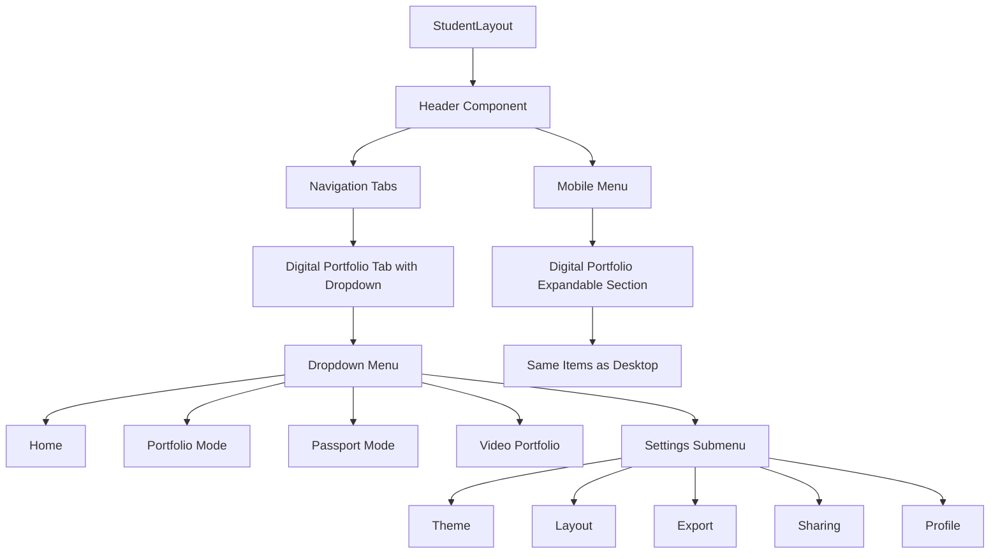

# Design Document: Student Digital Portfolio Navigation Merge

## Overview

This design merges the floating `StudentDigitalPortfolioNav` component into the main StudentLayout header as a dropdown submenu. The goal is to eliminate redundant navigation and provide a unified, consistent navigation experience.

## Architecture



## Components and Interfaces

### 1. DigitalPortfolioDropdown Component

New component to handle the dropdown menu logic.

```typescript
// src/components/Students/components/DigitalPortfolioDropdown.tsx

interface DropdownMenuItem {
  id: string;
  label: string;
  icon: React.ComponentType<{ className?: string }>;
  path: string;
  children?: DropdownMenuItem[];
}

interface DigitalPortfolioDropdownProps {
  isOpen: boolean;
  onClose: () => void;
  onNavigate: (path: string) => void;
  currentPath: string;
}

const menuItems: DropdownMenuItem[] = [
  { id: 'home', label: 'Home', icon: ArrowRight, path: '/student/digital-portfolio' },
  { id: 'portfolio', label: 'Portfolio Mode', icon: User, path: '/student/digital-portfolio/portfolio' },
  { id: 'passport', label: 'Passport Mode', icon: BookOpen, path: '/student/digital-portfolio/passport' },
  { id: 'video', label: 'Video Portfolio', icon: Video, path: '/student/digital-portfolio/video' },
  { 
    id: 'settings', 
    label: 'Settings', 
    icon: Settings, 
    path: '/student/digital-portfolio/settings',
    children: [
      { id: 'theme', label: 'Theme', icon: Palette, path: '/student/digital-portfolio/settings/theme' },
      { id: 'layout', label: 'Layout', icon: Layout, path: '/student/digital-portfolio/settings/layout' },
      { id: 'export', label: 'Export', icon: Download, path: '/student/digital-portfolio/settings/export' },
      { id: 'sharing', label: 'Sharing', icon: Share2, path: '/student/digital-portfolio/settings/sharing' },
      { id: 'profile', label: 'Profile', icon: User, path: '/student/digital-portfolio/settings/profile' },
    ]
  },
];

// Theme toggle integration - shown at bottom of dropdown
interface DigitalPortfolioDropdownProps {
  // ... existing props
  showThemeToggle?: boolean; // Show theme toggle at bottom of dropdown
}
```

### 2. Modified Header Component

Update the existing Header to include dropdown functionality for Digital Portfolio tab.

```typescript
// Changes to src/components/Students/components/Header.jsx

// Add state for dropdown
const [digitalPortfolioDropdownOpen, setDigitalPortfolioDropdownOpen] = useState(false);

// Add ref for click-outside detection
const dropdownRef = useRef<HTMLDivElement>(null);

// Check if current route is a digital portfolio route
const isDigitalPortfolioRoute = location.pathname.startsWith('/student/digital-portfolio');
```

### 3. Mobile Menu Integration

Extend the existing mobile menu to include expandable Digital Portfolio section.

```typescript
// Mobile menu state
const [mobileDigitalPortfolioExpanded, setMobileDigitalPortfolioExpanded] = useState(false);
```

## Data Models

### Menu Item Structure

```typescript
interface MenuItem {
  id: string;
  label: string;
  icon: React.ComponentType<{ className?: string }>;
  path: string;
  children?: MenuItem[];
}

interface DropdownState {
  isOpen: boolean;
  activeSubmenu: string | null;
}
```

### Theme Toggle Integration

The dropdown will include the existing `ThemeToggle` component from `src/components/digital-pp/ThemeToggle.tsx` at the bottom of the dropdown menu, separated by a divider. This preserves the dark/light mode switching functionality that exists in the current floating nav.

```typescript
// Dropdown footer section
<div className="border-t border-gray-200 dark:border-gray-700 pt-3 mt-3">
  <div className="px-4 flex items-center justify-between">
    <span className="text-sm text-gray-600 dark:text-gray-400">Theme</span>
    <ThemeToggle />
  </div>
</div>
```

## Correctness Properties

*A property is a characteristic or behavior that should hold true across all valid executions of a system-essentially, a formal statement about what the system should do. Properties serve as the bridge between human-readable specifications and machine-verifiable correctness guarantees.*

### Property 1: Dropdown displays on interaction
*For any* interaction (hover or click) on the Digital Portfolio tab, the dropdown menu should become visible with all menu items rendered.
**Validates: Requirements 1.1, 1.2**

### Property 2: Navigation and close on submenu click
*For any* submenu item click (desktop or mobile), the system should navigate to the corresponding route AND close the dropdown/mobile menu.
**Validates: Requirements 1.3, 3.3, 4.4**

### Property 3: Active route highlighting
*For any* route under `/student/digital-portfolio/*`, the Digital Portfolio tab should have active styling AND the corresponding submenu item should be highlighted.
**Validates: Requirements 1.4, 5.3**

### Property 4: Floating nav removal
*For any* Digital Portfolio page render, the `StudentDigitalPortfolioNav` component should NOT be present in the DOM, AND the page should render correctly with full functionality.
**Validates: Requirements 2.1, 2.3**

### Property 5: Mobile and desktop menu parity
*For any* menu item in the desktop dropdown, there should be an equivalent item in the mobile expandable section with the same label, icon, and navigation path.
**Validates: Requirements 3.4**

### Property 6: Expandable menu behavior
*For any* expandable menu section (Digital Portfolio in mobile, Settings in dropdown), clicking/tapping should toggle the expanded state and show/hide child items.
**Validates: Requirements 3.2, 4.3**

### Property 7: Menu items have icons
*For any* menu item in the dropdown, there should be an associated icon element rendered alongside the label.
**Validates: Requirements 5.2**

## Error Handling

| Scenario | Handling |
|----------|----------|
| Navigation fails | Show toast notification, keep dropdown open |
| Click outside during animation | Queue close action after animation completes |
| Invalid route in menu config | Log error, skip rendering invalid item |
| Mobile menu state conflicts | Reset all submenus when main menu closes |

## Testing Strategy

### Unit Tests
- Verify dropdown renders correct menu items
- Verify click handlers trigger navigation
- Verify active state detection for routes
- Verify mobile menu expansion toggle

### Property-Based Tests
- **Property 1**: Generate random interaction events, verify dropdown visibility
- **Property 2**: Generate random menu item clicks, verify navigation and close
- **Property 3**: Generate random digital portfolio routes, verify active highlighting
- **Property 4**: Render all digital portfolio pages, verify no floating nav
- **Property 5**: Compare desktop and mobile menu items for parity
- **Property 6**: Generate random expand/collapse sequences, verify state consistency
- **Property 7**: Iterate all menu items, verify icon presence

### Integration Tests
- Full navigation flow from header to digital portfolio pages
- Mobile responsive behavior at different breakpoints
- Keyboard navigation accessibility

### Test Configuration
- Minimum 100 iterations per property test
- Use React Testing Library for component tests
- Use fast-check for property-based testing
- Tag format: **Feature: student-digital-portfolio-nav-merge, Property {number}: {property_text}**
