# Assessment Result Data Flow Analysis

## Overview
This document provides a comprehensive analysis of how assessment data flows through the personal assessment system, from initial question response to final result generation and storage.

---

## 1. Data Flow Architecture

### 1.1 High-Level System Architecture


### 1.2 Complete Data Flow Pipeline


### 1.3 Database Entity Relationship


### 1.4 Score Calculation Flow


### 1.5 AI Analysis Integration Flow


### 1.6 Detailed Flow Stages

### 1.7 Assessment Attempt State Machine


### 1.8 Response Type Handling

```mermaid
flowchart TD
    Question[Question Received] --> CheckType{Question Type?}
    
    CheckType -->|rating| Rating[Rating Response<br/>Value: 1-5]
    CheckType -->|multiselect| Multi[Multiselect Response<br/>Value: Array of strings]
    CheckType -->|singleselect| Single[Single Select Response<br/>Value: String]
    CheckType -->|mcq| MCQ[MCQ Response<br/>Value: String]
    CheckType -->|text| Text[Text Response<br/>Value: String]
    CheckType -->|sjt| SJT[SJT Response<br/>Value: Object]
    
    Rating --> ValidateRating{Valid?<br/>1 ≤ n ≤ 5}
    Multi --> ValidateMulti{Valid?<br/>Array length ≤ max_selections}
    Single --> ValidateSingle{Valid?<br/>In options list}
    MCQ --> ValidateMCQ{Valid?<br/>In options list}
    Text --> ValidateText{Valid?<br/>Not empty}
    SJT --> ValidateSJT{Valid?<br/>Has best & worst}
    
    ValidateRating -->|Yes| StoreRating[Store: response_value = 4]
    ValidateRating -->|No| Error[Return Error]
    
    ValidateMulti -->|Yes| StoreMulti[Store: response_value = <br/>array of selected options]
    ValidateMulti -->|No| Error
    
    ValidateSingle -->|Yes| StoreSingle[Store: response_value = <br/>selected option]
    ValidateSingle -->|No| Error
    
    ValidateMCQ -->|Yes| CheckAnswer{Correct?}
    ValidateMCQ -->|No| Error
    CheckAnswer -->|Yes| StoreMCQCorrect[Store: response_value = answer<br/>is_correct = true]
    CheckAnswer -->|No| StoreMCQWrong[Store: response_value = answer<br/>is_correct = false]
    
    ValidateText -->|Yes| StoreText[Store: response_value = text]
    ValidateText -->|No| Error
    
    ValidateSJT -->|Yes| StoreSJT[Store: response_value = <br/>best and worst choices]
    ValidateSJT -->|No| Error
    
    StoreRating --> UpdateProgress[Update Attempt Progress]
    StoreMulti --> UpdateProgress
    StoreSingle --> UpdateProgress
    StoreMCQCorrect --> UpdateProgress
    StoreMCQWrong --> UpdateProgress
    StoreText --> UpdateProgress
    StoreSJT --> UpdateProgress
    
    UpdateProgress --> Done([Response Saved])
    Error --> Done
    
    style Question fill:#e1f5ff
    style CheckType fill:#fff4e1
    style UpdateProgress fill:#51cf66
    style Done fill:#51cf66
    style Error fill:#ff6b6b
```



### 1.9 Result Generation Pipeline


#### Stage 1: Assessment Initialization
```
personal_assessment_streams (grade level selection)
         ↓
personal_assessment_sections (section loading)
         ↓
personal_assessment_questions (question retrieval)
         ↓
personal_assessment_attempts (attempt creation)
```

**Key Data Points:**
- `student_id`: Links to auth.users
- `stream_id`: Educational stream (CS, BCA, BBA, etc.)
- `grade_level`: 'middle', 'highschool', or 'after12'
- `status`: 'in_progress' initially

#### Stage 2: Response Collection
```
User Interface
    ↓
personal_assessment_responses (individual answers)
    ↓
personal_assessment_attempts (progress tracking)
```

**Response Data Structure:**
```json
{
  "response_value": {
    // Polymorphic based on question_type:
    "rating": 4,                                    // Number (1-5)
    "multiselect": ["option1", "option2"],          // Array
    "singleselect": "option3",                      // String
    "text": "My detailed response...",              // String
    "sjt": {"best": "option1", "worst": "option2"}, // Object
    "mcq": "option2"                                // String
  }
}
```

#### Stage 3: Score Calculation
When `status` changes to 'completed':

**3.1 RIASEC Scoring (All Grade Levels)**
```sql
-- Extract responses from Interest Explorer section
SELECT q.category_mapping, r.response_value
FROM personal_assessment_responses r
JOIN personal_assessment_questions q ON r.question_id = q.id
JOIN personal_assessment_sections s ON q.section_id = s.id
WHERE r.attempt_id = ? AND s.name = 'interest_explorer'
```

**Calculation Logic:**
```javascript
// For multiselect questions with category_mapping
const riasecScores = { R: 0, I: 0, A: 0, S: 0, E: 0, C: 0 };

responses.forEach(response => {
  const selectedOptions = response.response_value; // Array
  selectedOptions.forEach(option => {
    const category = question.category_mapping[option]; // 'R', 'I', etc.
    riasecScores[category] += 1;
  });
});

// Sort to get top 3
const topInterests = Object.entries(riasecScores)
  .sort((a, b) => b[1] - a[1])
  .slice(0, 3)
  .map(([key]) => key);
```

**3.2 Strengths Scoring (All Grade Levels)**
```sql
-- Extract responses from Strengths section
SELECT q.strength_type, r.response_value
FROM personal_assessment_responses r
JOIN personal_assessment_questions q ON r.question_id = q.id
JOIN personal_assessment_sections s ON q.section_id = s.id
WHERE r.attempt_id = ? AND s.name = 'strengths_character'
```

**Calculation Logic:**
```javascript
// Group by strength_type and average ratings
const strengthScores = {};

responses.forEach(response => {
  const strengthType = question.strength_type; // 'Curiosity', 'Perseverance', etc.
  const rating = response.response_value; // 1-4 or 1-5
  
  if (!strengthScores[strengthType]) {
    strengthScores[strengthType] = { total: 0, count: 0 };
  }
  
  strengthScores[strengthType].total += rating;
  strengthScores[strengthType].count += 1;
});

// Calculate averages
Object.keys(strengthScores).forEach(type => {
  strengthScores[type] = strengthScores[type].total / strengthScores[type].count;
});

// Get top 5 strengths
const topStrengths = Object.entries(strengthScores)
  .sort((a, b) => b[1] - a[1])
  .slice(0, 5)
  .map(([key]) => key);
```

**3.3 Aptitude Scoring (High School)**
```sql
-- Extract responses from Aptitude section
SELECT q.task_type, r.response_value
FROM personal_assessment_responses r
JOIN personal_assessment_questions q ON r.question_id = q.id
JOIN personal_assessment_sections s ON q.section_id = s.id
WHERE r.attempt_id = ? AND s.name = 'aptitude_tasks'
```

**Calculation Logic:**
```javascript
// Structure: {taskType: {ease: avg, enjoyment: avg}}
const aptitudeScores = {};

responses.forEach(response => {
  const taskType = question.task_type; // 'Analytical', 'Creative', etc.
  const ratings = response.response_value; // {ease: 3, enjoyment: 4}
  
  if (!aptitudeScores[taskType]) {
    aptitudeScores[taskType] = { ease: [], enjoyment: [] };
  }
  
  aptitudeScores[taskType].ease.push(ratings.ease);
  aptitudeScores[taskType].enjoyment.push(ratings.enjoyment);
});

// Calculate averages
Object.keys(aptitudeScores).forEach(type => {
  const ease = aptitudeScores[type].ease;
  const enjoyment = aptitudeScores[type].enjoyment;
  
  aptitudeScores[type] = {
    ease: ease.reduce((a, b) => a + b, 0) / ease.length,
    enjoyment: enjoyment.reduce((a, b) => a + b, 0) / enjoyment.length
  };
});
```

**3.4 Knowledge Test Scoring (After 12th)**
```sql
-- Extract MCQ responses
SELECT q.correct_answer, q.points, r.response_value, r.is_correct
FROM personal_assessment_responses r
JOIN personal_assessment_questions q ON r.question_id = q.id
JOIN personal_assessment_sections s ON q.section_id = s.id
WHERE r.attempt_id = ? AND s.name = 'knowledge_test'
```

**Calculation Logic:**
```javascript
let totalPoints = 0;
let earnedPoints = 0;

responses.forEach(response => {
  totalPoints += question.points;
  if (response.is_correct) {
    earnedPoints += question.points;
  }
});

const knowledgeScore = earnedPoints;
const knowledgePercentage = (earnedPoints / totalPoints) * 100;
```

**3.5 Big Five Personality (After 12th)**
```sql
-- Extract personality responses
SELECT q.text, r.response_value
FROM personal_assessment_responses r
JOIN personal_assessment_questions q ON r.question_id = q.id
JOIN personal_assessment_sections s ON q.section_id = s.id
WHERE r.attempt_id = ? AND s.name = 'personality'
```

**Calculation Logic:**
```javascript
// Questions are tagged with personality dimensions
const personalityScores = {
  Openness: [],
  Conscientiousness: [],
  Extraversion: [],
  Agreeableness: [],
  Neuroticism: []
};

responses.forEach(response => {
  const dimension = question.personality_dimension;
  const rating = response.response_value;
  const isReversed = question.is_reversed_scored;
  
  const score = isReversed ? (6 - rating) : rating; // Reverse if needed
  personalityScores[dimension].push(score);
});

// Calculate averages
Object.keys(personalityScores).forEach(dimension => {
  const scores = personalityScores[dimension];
  personalityScores[dimension] = scores.reduce((a, b) => a + b, 0) / scores.length;
});
```

#### Stage 4: AI Analysis (Gemini Integration)
```
Calculated Scores → Gemini API → AI-Generated Insights
```

**Input Payload to Gemini:**
```json
{
  "student_profile": {
    "grade_level": "after12",
    "stream": "Computer Science"
  },
  "assessment_data": {
    "riasec_scores": {"R": 15, "I": 18, "A": 8, "S": 10, "E": 7, "C": 5},
    "top_interests": ["I", "R", "S"],
    "strengths_scores": {
      "Curiosity": 4.2,
      "Perseverance": 3.8,
      "Creativity": 4.0
    },
    "top_strengths": ["Curiosity", "Creativity", "Perseverance"],
    "personality_scores": {
      "Openness": 4.1,
      "Conscientiousness": 3.7,
      "Extraversion": 3.2,
      "Agreeableness": 3.9,
      "Neuroticism": 2.8
    },
    "knowledge_score": 42,
    "knowledge_percentage": 84.0,
    "work_values": ["Autonomy", "Creativity", "Impact"]
  },
  "prompt": "Analyze this student's assessment results and provide career recommendations..."
}
```

**Expected Gemini Response:**
```json
{
  "analysis": {
    "interest_summary": "Strong investigative and realistic interests...",
    "strength_summary": "High curiosity and creativity indicate...",
    "personality_insights": "Openness to experience combined with...",
    "learning_style": "Prefers hands-on, problem-solving approaches..."
  },
  "career_recommendations": [
    {
      "title": "Software Engineer",
      "match_score": 92,
      "reasoning": "Aligns with investigative interests and technical aptitude..."
    },
    {
      "title": "Data Scientist",
      "match_score": 88,
      "reasoning": "Strong analytical skills and curiosity..."
    }
  ],
  "skill_development": [
    "Communication skills for team collaboration",
    "Project management fundamentals"
  ],
  "next_steps": [
    "Explore internships in software development",
    "Build portfolio projects"
  ]
}
```

#### Stage 5: Result Storage
```
AI Analysis → personal_assessment_results (final storage)
```

**Result Record Structure:**
```sql
INSERT INTO personal_assessment_results (
  attempt_id,
  student_id,
  grade_level,
  
  -- RIASEC
  riasec_scores,
  top_interests,
  
  -- Strengths
  strengths_scores,
  top_strengths,
  
  -- Learning
  learning_styles,
  work_preferences,
  
  -- Aptitude (high school)
  aptitude_scores,
  
  -- Personality (after12)
  personality_scores,
  
  -- Work Values (after12)
  work_values_scores,
  
  -- Knowledge Test (after12)
  knowledge_score,
  knowledge_percentage,
  
  -- AI Analysis
  gemini_analysis,
  career_recommendations,
  skill_gaps,
  
  generated_at
) VALUES (?, ?, ?, ...);
```

---

## 2. Data Relationships

### 2.1 Primary Relationships
```
personal_assessment_attempts (1) ←→ (many) personal_assessment_responses
personal_assessment_attempts (1) ←→ (1) personal_assessment_results
personal_assessment_questions (1) ←→ (many) personal_assessment_responses
personal_assessment_sections (1) ←→ (many) personal_assessment_questions
```

### 2.2 Lookup Relationships
```
personal_assessment_streams ←→ personal_assessment_attempts
personal_assessment_streams ←→ personal_assessment_questions (for stream-specific)
personal_assessment_sections ←→ personal_assessment_response_scales
```

---

## 3. Critical Data Points

### 3.1 Attempt Lifecycle
```
Status: in_progress → completed
         ↓              ↓
    Responses      Trigger:
    collected      - Score calculation
                   - AI analysis
                   - Result storage
                   - Restriction creation
```

### 3.2 Timing Data
```javascript
// Stored in personal_assessment_attempts
{
  "started_at": "2026-01-28T10:00:00Z",
  "completed_at": "2026-01-28T11:30:00Z",
  "elapsed_time": 5400, // seconds
  "section_timings": [
    {
      "sectionIndex": 0,
      "sectionName": "Interest Explorer",
      "startTime": "2026-01-28T10:00:00Z",
      "endTime": "2026-01-28T10:25:00Z",
      "timeSpent": 1500
    },
    {
      "sectionIndex": 1,
      "sectionName": "Strengths & Character",
      "startTime": "2026-01-28T10:25:00Z",
      "endTime": "2026-01-28T10:50:00Z",
      "timeSpent": 1500
    }
  ]
}
```

---

## 4. Service Layer Implementation

### 4.1 Response Submission Service
```javascript
async function submitResponse(attemptId, questionId, responseValue) {
  // 1. Validate attempt is in_progress
  const attempt = await getAttempt(attemptId);
  if (attempt.status !== 'in_progress') {
    throw new Error('Cannot submit response to completed attempt');
  }
  
  // 2. Validate question belongs to current section
  const question = await getQuestion(questionId);
  const currentSection = await getCurrentSection(attempt);
  if (question.section_id !== currentSection.id) {
    throw new Error('Question does not belong to current section');
  }
  
  // 3. Validate response format
  validateResponseFormat(question.question_type, responseValue);
  
  // 4. Check if MCQ and mark correctness
  let isCorrect = null;
  if (question.question_type === 'mcq') {
    isCorrect = responseValue === question.correct_answer;
  }
  
  // 5. Store response
  await supabase
    .from('personal_assessment_responses')
    .upsert({
      attempt_id: attemptId,
      question_id: questionId,
      response_value: responseValue,
      is_correct: isCorrect,
      time_taken: calculateTimeTaken()
    });
  
  // 6. Update attempt progress
  await updateAttemptProgress(attemptId);
}
```

### 4.2 Score Calculation Service
```javascript
async function calculateScores(attemptId) {
  const attempt = await getAttempt(attemptId);
  const responses = await getResponses(attemptId);
  
  const scores = {
    riasec: await calculateRIASEC(responses),
    strengths: await calculateStrengths(responses),
    aptitude: attempt.grade_level === 'highschool' 
      ? await calculateAptitude(responses) 
      : null,
    personality: attempt.grade_level === 'after12'
      ? await calculatePersonality(responses)
      : null,
    knowledge: attempt.grade_level === 'after12'
      ? await calculateKnowledge(responses)
      : null
  };
  
  // Store raw scores in attempt
  await supabase
    .from('personal_assessment_attempts')
    .update({ raw_scores: scores })
    .eq('id', attemptId);
  
  return scores;
}
```

### 4.3 AI Analysis Service
```javascript
async function generateAIAnalysis(attemptId) {
  const attempt = await getAttempt(attemptId);
  const scores = attempt.raw_scores;
  
  // Build prompt
  const prompt = buildAnalysisPrompt(attempt.grade_level, scores);
  
  // Call Gemini API
  const geminiResponse = await callGeminiAPI(prompt);
  
  // Parse and structure response
  const analysis = parseGeminiResponse(geminiResponse);
  
  // Store in attempt
  await supabase
    .from('personal_assessment_attempts')
    .update({ analysis_result: analysis })
    .eq('id', attemptId);
  
  return analysis;
}
```

### 4.4 Result Generation Service
```javascript
async function generateFinalResult(attemptId) {
  const attempt = await getAttempt(attemptId);
  
  if (attempt.status !== 'completed') {
    throw new Error('Attempt must be completed');
  }
  
  const scores = attempt.raw_scores;
  const analysis = attempt.analysis_result;
  
  // Create result record
  const result = await supabase
    .from('personal_assessment_results')
    .insert({
      attempt_id: attemptId,
      student_id: attempt.student_id,
      grade_level: attempt.grade_level,
      
      // Scores
      riasec_scores: scores.riasec.scores,
      top_interests: scores.riasec.top,
      strengths_scores: scores.strengths.scores,
      top_strengths: scores.strengths.top,
      
      // Grade-specific
      aptitude_scores: scores.aptitude,
      personality_scores: scores.personality,
      knowledge_score: scores.knowledge?.score,
      knowledge_percentage: scores.knowledge?.percentage,
      
      // AI Analysis
      gemini_analysis: analysis,
      career_recommendations: analysis.career_recommendations.map(c => c.title),
      skill_gaps: analysis.skill_development,
      
      generated_at: new Date().toISOString()
    })
    .select()
    .single();
  
  // Generate PDF report (async)
  generatePDFReport(result.id);
  
  return result;
}
```

---

## 5. Query Patterns

### 5.1 Get Student's Latest Result
```sql
SELECT r.*
FROM personal_assessment_results r
JOIN personal_assessment_attempts a ON r.attempt_id = a.id
WHERE r.student_id = ?
  AND r.grade_level = ?
ORDER BY r.generated_at DESC
LIMIT 1;
```

### 5.2 Get All Responses for Attempt
```sql
SELECT 
  r.*,
  q.text as question_text,
  q.question_type,
  s.name as section_name,
  s.title as section_title
FROM personal_assessment_responses r
JOIN personal_assessment_questions q ON r.question_id = q.id
JOIN personal_assessment_sections s ON q.section_id = s.id
WHERE r.attempt_id = ?
ORDER BY s.order_number, q.order_number;
```

### 5.3 Check Assessment Eligibility
```sql
SELECT can_take_assessment(?, ?) as can_take;

-- Or manually:
SELECT 
  CASE 
    WHEN next_allowed_date IS NULL THEN true
    WHEN NOW() >= next_allowed_date THEN true
    ELSE false
  END as can_take,
  next_allowed_date
FROM personal_assessment_restrictions
WHERE student_id = ? AND grade_level = ?
ORDER BY last_attempt_date DESC
LIMIT 1;
```

### 5.4 Get Progress Statistics
```sql
SELECT 
  a.id,
  a.status,
  a.current_section_index,
  a.current_question_index,
  COUNT(r.id) as responses_count,
  (
    SELECT COUNT(*) 
    FROM personal_assessment_questions q
    JOIN personal_assessment_sections s ON q.section_id = s.id
    WHERE s.grade_level = a.grade_level
      AND s.is_active = true
      AND q.is_active = true
      AND (q.stream_id IS NULL OR q.stream_id = a.stream_id)
  ) as total_questions,
  ROUND(
    (COUNT(r.id)::numeric / NULLIF(
      (SELECT COUNT(*) FROM personal_assessment_questions q
       JOIN personal_assessment_sections s ON q.section_id = s.id
       WHERE s.grade_level = a.grade_level
         AND s.is_active = true
         AND q.is_active = true
         AND (q.stream_id IS NULL OR q.stream_id = a.stream_id)
      ), 0
    )) * 100, 2
  ) as completion_percentage
FROM personal_assessment_attempts a
LEFT JOIN personal_assessment_responses r ON a.id = r.attempt_id
WHERE a.id = ?
GROUP BY a.id;
```

---

## 6. Error Handling & Edge Cases

### 6.1 Incomplete Attempts
- **Issue**: Student abandons assessment mid-way
- **Solution**: Status remains 'in_progress', can resume later
- **Cleanup**: Consider marking as 'abandoned' after 30 days

### 6.2 Duplicate Responses
- **Issue**: Student submits same question twice
- **Solution**: UNIQUE constraint on (attempt_id, question_id)
- **Behavior**: UPSERT updates existing response

### 6.3 Missing AI Analysis
- **Issue**: Gemini API fails or times out
- **Solution**: Store partial results, retry analysis later
- **Fallback**: Generate basic recommendations from scores

### 6.4 Score Calculation Errors
- **Issue**: Invalid response data or missing questions
- **Solution**: Validate all responses before calculation
- **Logging**: Log errors for manual review

---

## 7. Performance Considerations

### 7.1 Indexes
All critical indexes are in place:
- `idx_assessment_responses_attempt` - Fast response retrieval
- `idx_assessment_results_student` - Quick student result lookup
- `idx_assessment_attempts_student` - Student attempt history

### 7.2 Query Optimization
- Use JOINs instead of multiple queries
- Fetch only required columns
- Cache section/question data (rarely changes)

### 7.3 Batch Operations
- Calculate all scores in single transaction
- Bulk insert responses when possible
- Generate PDF asynchronously

---

## 8. Security & Privacy

### 8.1 RLS Policies
- Students can only access their own data
- Responses tied to attempts via RLS
- Results visible only to student

### 8.2 Data Retention
- Keep all attempts for historical analysis
- Archive old attempts after 2 years
- Anonymize data for research (with consent)

---

## 9. Future Enhancements

### 9.1 Comparative Analytics
```sql
-- Compare student to peers
SELECT 
  AVG((riasec_scores->>'R')::numeric) as avg_realistic,
  AVG((riasec_scores->>'I')::numeric) as avg_investigative
FROM personal_assessment_results
WHERE grade_level = ? AND stream_id = ?;
```

### 9.2 Longitudinal Tracking
- Track changes over multiple attempts
- Show growth in strengths/interests
- Identify career path evolution

### 9.3 Enhanced AI Integration
- Real-time feedback during assessment
- Adaptive questioning based on responses
- Personalized learning path generation

---

## 10. PDF Data Mapping

### 10.1 PDF Generation Process

The PDF is generated using the browser's print functionality:

```javascript
// In AssessmentResult.jsx
const handlePrint = () => {
  const printContent = document.querySelector('.print-view');
  const printWindow = window.open('', '_blank');
  
  printWindow.document.write(`
    <!DOCTYPE html>
    <html>
    <head>
      <title>Career Assessment Report</title>
      <style>@page { size: A4 portrait; margin: 12mm 15mm; }</style>
    </head>
    <body>${printContent.innerHTML}</body>
    </html>
  `);
  
  printWindow.print();
};
```

### 10.2 Data Flow to PDF

```
personal_assessment_results (DB)
    ↓
useAssessmentResults Hook (Transform)
    ↓
results object (Component State)
    ↓
PrintView Component (Router)
    ↓
Grade-Specific PrintView (Render)
    ↓
window.print() (PDF Output)
```

### 10.3 Critical Data Mapping Issues

**⚠️ See detailed analysis in:** [`ASSESSMENT_PDF_DATA_MAPPING.md`](./ASSESSMENT_PDF_DATA_MAPPING.md)

**Key Issues Identified:**

1. **Aptitude Data Structure Mismatch**
   - Database: `{taskType: {ease, enjoyment}}`
   - PDF expects: `{testType: {percentage, raw}}`
   - **Status:** 🔴 Critical - Needs transformation

2. **Gemini Analysis Flattening**
   - Database: Nested `gemini_analysis` object
   - PDF expects: Separate `overallSummary`, `careerFit`, `skillGap`, `roadmap`
   - **Status:** 🔴 Critical - Needs transformation

3. **Career Recommendations Enrichment**
   - Database: Simple array `["Software Engineer", "Data Scientist"]`
   - PDF expects: Rich objects with roles, skills, salary
   - **Status:** 🟡 Important - Needs enrichment

4. **Missing Sections in PDF**
   - `learning_styles` - Not displayed
   - `work_preferences` - Not displayed
   - `aptitude_overall_score` - Not displayed
   - **Status:** 🟡 Nice-to-have - Should be added

### 10.4 Recommended Fixes

**Immediate Actions (Week 1):**
```javascript
// In useAssessmentResults.js - Add transformation layer
const transformDatabaseResults = (dbResults) => {
  return {
    ...dbResults,
    aptitude: transformAptitudeScores(dbResults.aptitude_scores),
    ...transformGeminiAnalysis(dbResults.gemini_analysis),
    careerFit: enrichCareerRecommendations(dbResults.career_recommendations)
  };
};
```

**Files to Modify:**
1. `src/features/assessment/assessment-result/hooks/useAssessmentResults.js` - Add transformations
2. `src/features/assessment/assessment-result/components/PrintView*.jsx` - Add missing sections
3. `database/personal_assessment_schema_complete.sql` - Consider schema updates

---

## 11. Summary

The assessment result data flow is a multi-stage pipeline:

1. **Collection**: Responses stored with polymorphic structure
2. **Calculation**: Multiple scoring algorithms based on grade level
3. **Analysis**: AI-powered insights via Gemini
4. **Storage**: Comprehensive results with all dimensions
5. **Retrieval**: Optimized queries for student access
6. **PDF Generation**: Browser-based print with data transformation

Key design principles:
- **Flexibility**: Supports multiple grade levels and question types
- **Extensibility**: Easy to add new sections or scoring methods
- **Performance**: Indexed for fast queries
- **Security**: RLS ensures data privacy
- **Reliability**: Constraints prevent data inconsistency

**⚠️ Current PDF Issues:**
- Data structure mismatches between database and PDF components
- Missing transformation layer in useAssessmentResults hook
- Some database fields not displayed in PDF
- See [`ASSESSMENT_PDF_DATA_MAPPING.md`](./ASSESSMENT_PDF_DATA_MAPPING.md) for detailed analysis and fixes

