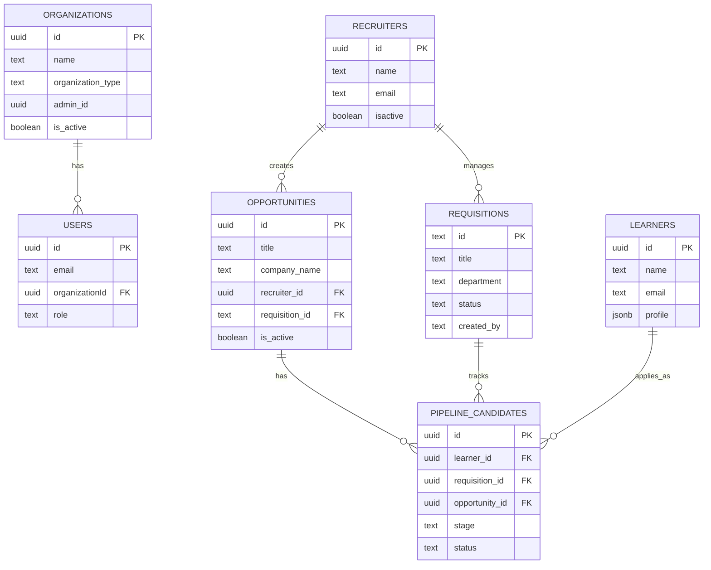
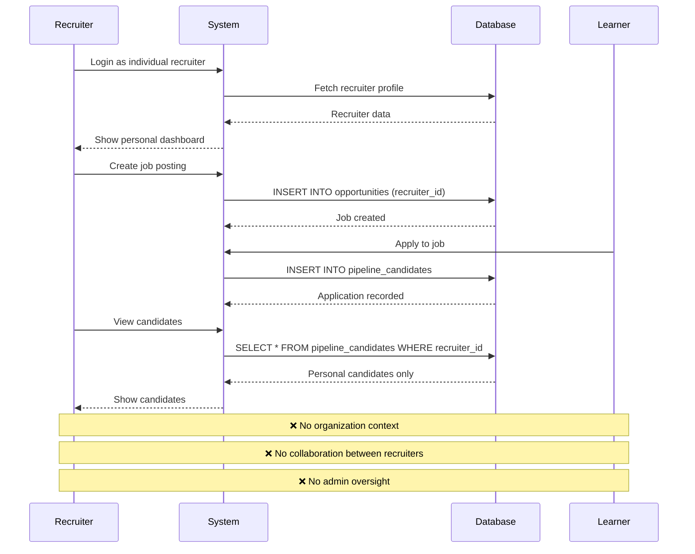
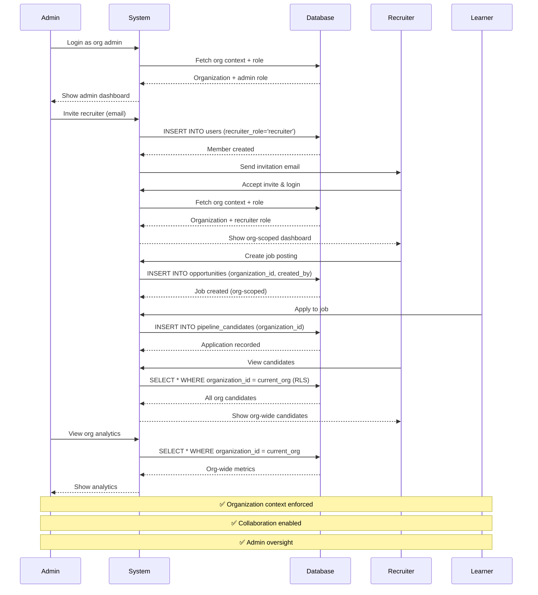
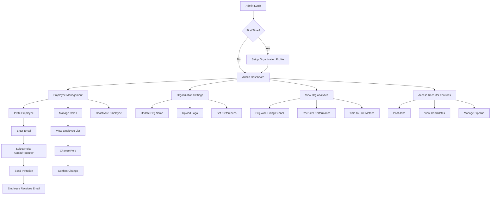
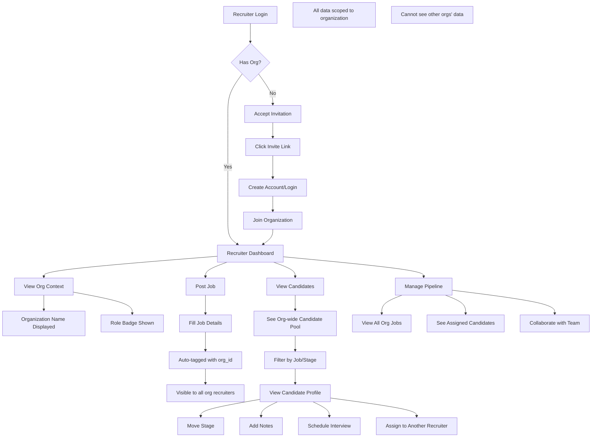
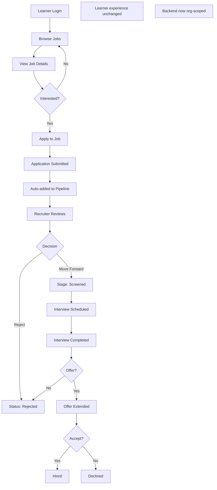
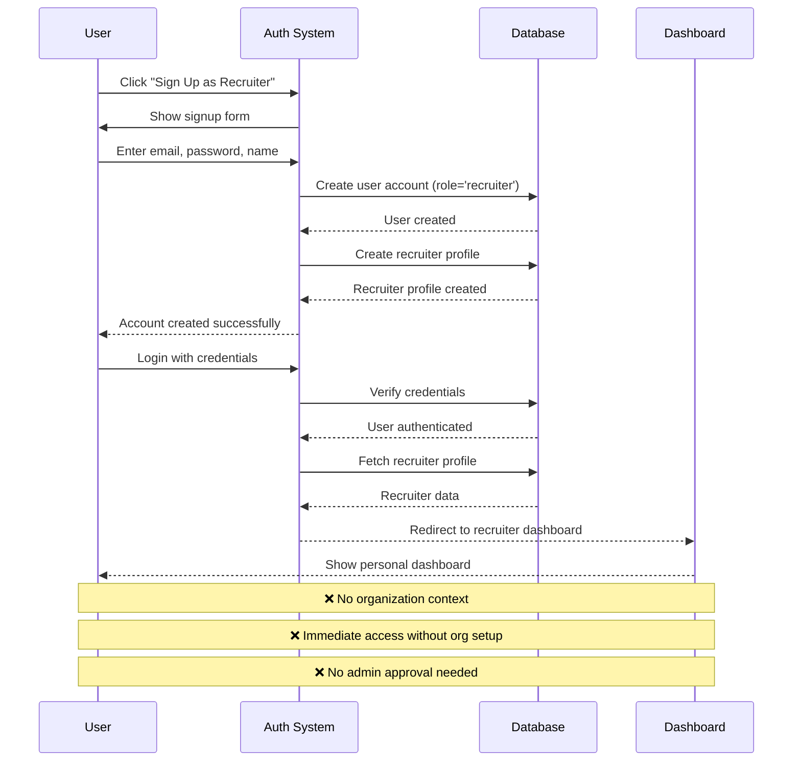
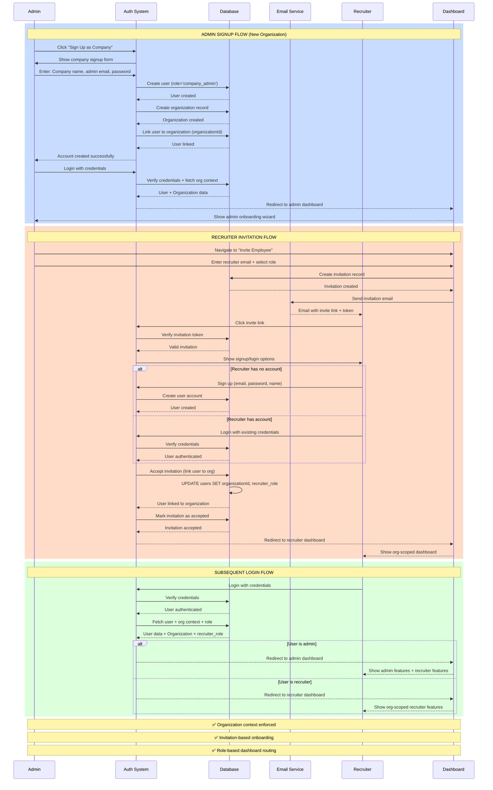

# Organization-Level Recruitment Dashboard - Complete 2-Week Plan

## Executive Summary

Rapid MVP implementation of organization-level recruitment platform with core multi-tenancy, admin controls, and org-scoped recruiting in 2 weeks.

---

## Table of Contents

1. [Current State Analysis](#current-state-analysis)
2. [ERD Diagrams](#erd-diagrams)
3. [System Flow Diagrams](#system-flow-diagrams)
4. [User Flow Diagrams](#user-flow-diagrams)
5. [System Architecture](#system-architecture)
6. [2-Week Sprint Plan](#2-week-sprint-plan)
7. [Database Schema Changes](#database-schema-changes)
8. [Testing Strategy](#testing-strategy)

---

## Current State Analysis

### ✅ What Already Exists

#### **Database Tables (Recruitment)**

1. **organizations** ✅
   - id, name, description, organization_type
   - admin_id, email, phone, website
   - verification_status, is_active
   - Already supports: school, college, university, company

2. **requisitions** ✅
   - id, title, department, location
   - job_type, openings, status, priority
   - description, requirements, salary_range
   - owner, hiring_manager, created_by

3. **opportunities** ✅
   - id, title, company_name, job_title
   - employment_type, location, mode
   - recruiter_id (uuid)
   - requisition_id (text)
   - is_active, status

4. **pipeline_candidates** ✅
   - id, learner_id, candidate_name
   - stage (sourced, screened, interview_1, interview_2, offer, hired)
   - status (active, rejected, withdrawn)
   - requisition_id, opportunity_id
   - assigned_to, added_by, source

5. **recruiters** ✅
   - id, name, email, phone
   - verificationstatus, isactive

6. **learners** ✅ (Candidates)
   - id, name, email, contact_number
   - school_id, college_id
   - user_id, profile (jsonb)

#### **Existing Features**
- ✅ Organization entity with CRUD
- ✅ Organization subscription system
- ✅ License pool management
- ✅ Member invitation system (organization_invitations table)
- ✅ Recruiter dashboard (individual, non-org-scoped)
- ✅ Job requisition management
- ✅ Candidate pipeline management
- ✅ Recruitment analytics

### ❌ What's Missing

#### **Database Schema Gaps**
- ❌ No `organization_id` on recruitment tables
- ❌ No role field for recruiters in organization context
- ❌ No RLS policies for multi-tenant data isolation

#### **Feature Gaps**
- ❌ No organization-scoped recruitment data
- ❌ No admin portal for managing recruiter employees
- ❌ No role-based access control for recruitment
- ❌ No org-wide candidate pool visibility
- ❌ No collaborative hiring workflows

#### **Current Limitations**
- 🔴 All recruitment data is global (no org isolation)
- 🔴 Any recruiter can see any job/candidate
- 🔴 No admin controls for recruitment team
- 🟡 Users can only belong to one organization
- 🟡 No recruitment-specific roles

---

## ERD Diagrams

### Current State ERD



**🔴 PROBLEMS:**
- No `organization_id` on recruitment tables
- No data isolation between organizations
- Recruiters are independent entities

### Future State ERD

```mermaid
erDiagram
    ORGANIZATIONS ||--o{ USERS : has
    ORGANIZATIONS ||--o{ REQUISITIONS : owns
    ORGANIZATIONS ||--o{ OPPORTUNITIES : posts
    ORGANIZATIONS ||--o{ PIPELINE_CANDIDATES : manages
    USERS ||--o{ REQUISITIONS : creates
    USERS ||--o{ OPPORTUNITIES : creates
    OPPORTUNITIES ||--o{ PIPELINE_CANDIDATES : has
    REQUISITIONS ||--o{ PIPELINE_CANDIDATES : tracks
    LEARNERS ||--o{ PIPELINE_CANDIDATES : applies_as
    
    ORGANIZATIONS {
        uuid id PK
        text name
        text organization_type
        uuid admin_id
        boolean is_active
        boolean recruitment_enabled NEW
        int max_recruiters NEW
    }
    
    USERS {
        uuid id PK
        text email
        uuid organizationId FK
        text role
        text recruiter_role NEW "admin or recruiter"
        boolean is_active NEW
    }
    
    REQUISITIONS {
        text id PK
        uuid organization_id FK NEW
        text title
        text department
        uuid created_by FK NEW
        uuid assigned_to FK NEW
        text approval_status NEW
    }
    
    OPPORTUNITIES {
        uuid id PK
        uuid organization_id FK NEW
        text title
        uuid requisition_id FK
        uuid created_by FK NEW
    }
    
    PIPELINE_CANDIDATES {
        uuid id PK
        uuid organization_id FK NEW
        uuid learner_id FK
        uuid requisition_id FK
        uuid assigned_to FK NEW
        text stage
    }
    
    LEARNERS {
        uuid id PK
        text name
        text email
        jsonb profile
    }
```

**✅ SOLUTIONS:**
- All recruitment tables have `organization_id`
- RLS policies enforce data isolation
- Role-based access control for recruiters

---

## System Flow Diagrams

### Current System Flow (Individual Recruiter)



### New System Flow (Organization-Level)



---

## User Flow Diagrams

### Admin User Flow



### Recruiter User Flow



### Candidate/Learner Flow (Unchanged)



---

## Authentication & Onboarding Flow Changes

### Current Authentication Flow (Individual Recruiter)



### New Authentication Flow (Organization-Level)



### Signup & Login UI Changes

#### Current Signup Page (Individual Recruiter)

```
┌─────────────────────────────────────────┐
│         Sign Up as Recruiter            │
├─────────────────────────────────────────┤
│                                         │
│  Full Name:     [________________]      │
│                                         │
│  Email:         [________________]      │
│                                         │
│  Password:      [________________]      │
│                                         │
│  Phone:         [________________]      │
│                                         │
│  [✓] I agree to Terms & Conditions      │
│                                         │
│         [ Create Account ]              │
│                                         │
│  Already have an account? Login         │
│                                         │
└─────────────────────────────────────────┘

❌ No organization context
❌ Direct access after signup
```

#### New Signup Page (Organization Admin)

```
┌─────────────────────────────────────────┐
│    Sign Up Your Company for Hiring      │
├─────────────────────────────────────────┤
│                                         │
│  COMPANY INFORMATION                    │
│  ─────────────────────────────────────  │
│  Company Name:  [________________]      │
│                                         │
│  Industry:      [▼ Select Industry]     │
│                                         │
│  Company Size:  [▼ 1-10, 11-50, etc.]   │
│                                         │
│  ADMIN ACCOUNT                          │
│  ─────────────────────────────────────  │
│  Your Name:     [________________]      │
│                                         │
│  Work Email:    [________________]      │
│                                         │
│  Password:      [________________]      │
│                                         │
│  Phone:         [________________]      │
│                                         │
│  [✓] I agree to Terms & Conditions      │
│                                         │
│      [ Create Company Account ]         │
│                                         │
│  Already have an account? Login         │
│                                         │
└─────────────────────────────────────────┘

✅ Organization context captured
✅ Admin role assigned automatically
```

#### New Invitation Acceptance Page (Recruiter)

```
┌─────────────────────────────────────────┐
│     Join [Company Name] as Recruiter    │
├─────────────────────────────────────────┤
│                                         │
│  You've been invited by:                │
│  admin@company.com                      │
│                                         │
│  Role: Recruiter                        │
│                                         │
│  ─────────────────────────────────────  │
│                                         │
│  ○ I already have an account            │
│     [ Login to Accept Invitation ]      │
│                                         │
│  ○ I'm new here                         │
│                                         │
│     Full Name:  [________________]      │
│                                         │
│     Password:   [________________]      │
│                                         │
│     Phone:      [________________]      │
│                                         │
│     [✓] I agree to Terms & Conditions   │
│                                         │
│     [ Create Account & Join ]           │
│                                         │
└─────────────────────────────────────────┘

✅ Invitation-based onboarding
✅ Email pre-filled from invitation
✅ Organization context from invite
```

#### New Login Page (Unified)

```
┌─────────────────────────────────────────┐
│              Login                      │
├─────────────────────────────────────────┤
│                                         │
│  Email:         [________________]      │
│                                         │
│  Password:      [________________]      │
│                                         │
│  [✓] Remember me                        │
│                                         │
│         [ Login ]                       │
│                                         │
│  ─────────────────────────────────────  │
│                                         │
│  Don't have an account?                 │
│  • Sign up as Company Admin             │
│  • Have an invitation? Use invite link  │
│                                         │
│  Forgot password?                       │
│                                         │
└─────────────────────────────────────────┘

✅ Single login for all roles
✅ Role-based routing after login
✅ Clear signup options
```

### Post-Login Routing Logic

```typescript
// src/app/routes/authRoutes.ts

export const handlePostLoginRouting = async (user: User) => {
  // Fetch user's organization context
  const orgContext = await getOrgContext(user.id);
  
  if (!orgContext) {
    // User not linked to any organization
    return '/onboarding/join-organization';
  }
  
  // Check user's role in the organization
  const { organizationId, recruiter_role, is_active } = orgContext;
  
  if (!is_active) {
    // User has been deactivated
    return '/account-deactivated';
  }
  
  // Route based on role
  switch (recruiter_role) {
    case 'admin':
      return '/recruiter/admin/dashboard';
    
    case 'recruiter':
      return '/recruiter/dashboard';
    
    default:
      // No recruiter role assigned
      return '/recruiter/dashboard';
  }
};
```

### Database Changes for Authentication

```sql
-- ============================================
-- Authentication & User Management Changes
-- ============================================

-- 1. Extend users table
ALTER TABLE users 
  ADD COLUMN recruiter_role VARCHAR(20) CHECK (recruiter_role IN ('admin', 'recruiter')),
  ADD COLUMN is_active BOOLEAN DEFAULT true,
  ADD COLUMN invited_at TIMESTAMP,
  ADD COLUMN invited_by UUID REFERENCES users(id),
  ADD COLUMN last_login_at TIMESTAMP,
  ADD COLUMN onboarding_completed BOOLEAN DEFAULT false;

-- 2. Create invitation tokens table (if not exists)
CREATE TABLE IF NOT EXISTS organization_invitations (
  id UUID PRIMARY KEY DEFAULT gen_random_uuid(),
  organization_id UUID REFERENCES organizations(id) NOT NULL,
  invited_by UUID REFERENCES users(id) NOT NULL,
  invitee_email TEXT NOT NULL,
  invitee_role VARCHAR(20) CHECK (invitee_role IN ('admin', 'recruiter')) NOT NULL,
  token TEXT UNIQUE NOT NULL,
  status VARCHAR(20) DEFAULT 'pending' CHECK (status IN ('pending', 'accepted', 'expired', 'cancelled')),
  expires_at TIMESTAMP NOT NULL,
  accepted_at TIMESTAMP,
  accepted_by UUID REFERENCES users(id),
  created_at TIMESTAMP DEFAULT NOW(),
  updated_at TIMESTAMP DEFAULT NOW()
);

CREATE INDEX idx_invitations_token ON organization_invitations(token);
CREATE INDEX idx_invitations_email ON organization_invitations(invitee_email);
CREATE INDEX idx_invitations_org ON organization_invitations(organization_id);

-- 3. Function to generate invitation token
CREATE OR REPLACE FUNCTION generate_invitation_token()
RETURNS TEXT AS $
BEGIN
  RETURN encode(gen_random_bytes(32), 'base64');
END;
$ LANGUAGE plpgsql;

-- 4. Function to create invitation
CREATE OR REPLACE FUNCTION create_organization_invitation(
  p_organization_id UUID,
  p_invited_by UUID,
  p_invitee_email TEXT,
  p_invitee_role VARCHAR(20)
)
RETURNS UUID AS $
DECLARE
  v_invitation_id UUID;
  v_token TEXT;
BEGIN
  -- Generate unique token
  v_token := generate_invitation_token();
  
  -- Create invitation
  INSERT INTO organization_invitations (
    organization_id,
    invited_by,
    invitee_email,
    invitee_role,
    token,
    expires_at
  ) VALUES (
    p_organization_id,
    p_invited_by,
    p_invitee_email,
    p_invitee_role,
    v_token,
    NOW() + INTERVAL '7 days'
  )
  RETURNING id INTO v_invitation_id;
  
  RETURN v_invitation_id;
END;
$ LANGUAGE plpgsql SECURITY DEFINER;

-- 5. Function to accept invitation
CREATE OR REPLACE FUNCTION accept_organization_invitation(
  p_token TEXT,
  p_user_id UUID
)
RETURNS BOOLEAN AS $
DECLARE
  v_invitation RECORD;
BEGIN
  -- Get invitation details
  SELECT * INTO v_invitation
  FROM organization_invitations
  WHERE token = p_token
    AND status = 'pending'
    AND expires_at > NOW();
  
  IF NOT FOUND THEN
    RAISE EXCEPTION 'Invalid or expired invitation';
  END IF;
  
  -- Update user with organization context
  UPDATE users
  SET 
    "organizationId" = v_invitation.organization_id,
    recruiter_role = v_invitation.invitee_role,
    is_active = true,
    invited_at = NOW(),
    invited_by = v_invitation.invited_by
  WHERE id = p_user_id;
  
  -- Mark invitation as accepted
  UPDATE organization_invitations
  SET 
    status = 'accepted',
    accepted_at = NOW(),
    accepted_by = p_user_id,
    updated_at = NOW()
  WHERE id = v_invitation.id;
  
  RETURN true;
END;
$ LANGUAGE plpgsql SECURITY DEFINER;
```

### Frontend Implementation

#### Admin Invitation Component

```typescript
// src/features/org-recruitment-admin/ui/InviteEmployee.tsx

import { useState } from 'react';
import { orgRecruitmentService } from '@/entities/organization';

export const InviteEmployee = () => {
  const [email, setEmail] = useState('');
  const [role, setRole] = useState<'admin' | 'recruiter'>('recruiter');
  const [loading, setLoading] = useState(false);
  const [success, setSuccess] = useState(false);

  const handleInvite = async (e: React.FormEvent) => {
    e.preventDefault();
    setLoading(true);

    try {
      const invitation = await orgRecruitmentService.inviteMember(email, role);
      
      // Send invitation email
      await sendInvitationEmail({
        email,
        role,
        invitationToken: invitation.token,
        organizationName: invitation.organization_name,
      });
      
      setSuccess(true);
      setEmail('');
      
      // Show success message
      toast.success(`Invitation sent to ${email}`);
    } catch (error) {
      toast.error('Failed to send invitation');
    } finally {
      setLoading(false);
    }
  };

  return (
    <form onSubmit={handleInvite} className="space-y-4">
      <div>
        <label className="block text-sm font-medium">Email Address</label>
        <input
          type="email"
          value={email}
          onChange={(e) => setEmail(e.target.value)}
          required
          className="mt-1 block w-full rounded-md border-gray-300"
          placeholder="recruiter@company.com"
        />
      </div>

      <div>
        <label className="block text-sm font-medium">Role</label>
        <select
          value={role}
          onChange={(e) => setRole(e.target.value as 'admin' | 'recruiter')}
          className="mt-1 block w-full rounded-md border-gray-300"
        >
          <option value="recruiter">Recruiter</option>
          <option value="admin">Admin</option>
        </select>
        <p className="mt-1 text-sm text-gray-500">
          {role === 'admin' 
            ? 'Can manage employees and access all features'
            : 'Can post jobs and manage candidates'}
        </p>
      </div>

      <button
        type="submit"
        disabled={loading}
        className="w-full bg-blue-600 text-white py-2 rounded-md hover:bg-blue-700"
      >
        {loading ? 'Sending...' : 'Send Invitation'}
      </button>

      {success && (
        <div className="p-3 bg-green-50 text-green-800 rounded-md">
          Invitation sent successfully! The recipient will receive an email with instructions.
        </div>
      )}
    </form>
  );
};
```

#### Invitation Acceptance Page

```typescript
// src/pages/auth/AcceptInvitation.tsx

import { useEffect, useState } from 'react';
import { useSearchParams, useNavigate } from 'react-router-dom';
import { orgRecruitmentService } from '@/entities/organization';
import { supabase } from '@/shared/api';

export const AcceptInvitationPage = () => {
  const [searchParams] = useSearchParams();
  const navigate = useNavigate();
  const token = searchParams.get('token');
  
  const [invitation, setInvitation] = useState(null);
  const [loading, setLoading] = useState(true);
  const [hasAccount, setHasAccount] = useState(false);
  
  // Form state for new users
  const [name, setName] = useState('');
  const [password, setPassword] = useState('');
  const [phone, setPhone] = useState('');

  useEffect(() => {
    if (token) {
      verifyInvitation(token);
    }
  }, [token]);

  const verifyInvitation = async (token: string) => {
    try {
      const inv = await orgRecruitmentService.verifyInvitation(token);
      setInvitation(inv);
    } catch (error) {
      toast.error('Invalid or expired invitation');
      navigate('/login');
    } finally {
      setLoading(false);
    }
  };

  const handleAcceptWithExistingAccount = async () => {
    // Redirect to login with invitation token
    navigate(`/login?invitation=${token}`);
  };

  const handleAcceptWithNewAccount = async (e: React.FormEvent) => {
    e.preventDefault();
    setLoading(true);

    try {
      // Create new user account
      const { data: authData, error: authError } = await supabase.auth.signUp({
        email: invitation.invitee_email,
        password,
        options: {
          data: {
            name,
            phone,
          },
        },
      });

      if (authError) throw authError;

      // Accept invitation (links user to organization)
      await orgRecruitmentService.acceptInvitation(token, authData.user.id);

      toast.success('Account created successfully!');
      navigate('/recruiter/dashboard');
    } catch (error) {
      toast.error('Failed to create account');
    } finally {
      setLoading(false);
    }
  };

  if (loading) {
    return <div>Loading...</div>;
  }

  if (!invitation) {
    return <div>Invalid invitation</div>;
  }

  return (
    <div className="max-w-md mx-auto mt-10 p-6 bg-white rounded-lg shadow">
      <h1 className="text-2xl font-bold mb-4">
        Join {invitation.organization_name}
      </h1>
      
      <div className="mb-6 p-4 bg-blue-50 rounded">
        <p className="text-sm text-gray-700">
          You've been invited by <strong>{invitation.invited_by_email}</strong>
        </p>
        <p className="text-sm text-gray-700 mt-1">
          Role: <strong className="capitalize">{invitation.invitee_role}</strong>
        </p>
      </div>

      <div className="space-y-4">
        <div>
          <label className="flex items-center space-x-2">
            <input
              type="radio"
              checked={hasAccount}
              onChange={() => setHasAccount(true)}
            />
            <span>I already have an account</span>
          </label>
          
          {hasAccount && (
            <button
              onClick={handleAcceptWithExistingAccount}
              className="mt-2 w-full bg-blue-600 text-white py-2 rounded hover:bg-blue-700"
            >
              Login to Accept Invitation
            </button>
          )}
        </div>

        <div>
          <label className="flex items-center space-x-2">
            <input
              type="radio"
              checked={!hasAccount}
              onChange={() => setHasAccount(false)}
            />
            <span>I'm new here</span>
          </label>
          
          {!hasAccount && (
            <form onSubmit={handleAcceptWithNewAccount} className="mt-4 space-y-3">
              <input
                type="text"
                placeholder="Full Name"
                value={name}
                onChange={(e) => setName(e.target.value)}
                required
                className="w-full px-3 py-2 border rounded"
              />
              
              <input
                type="email"
                value={invitation.invitee_email}
                disabled
                className="w-full px-3 py-2 border rounded bg-gray-100"
              />
              
              <input
                type="password"
                placeholder="Password"
                value={password}
                onChange={(e) => setPassword(e.target.value)}
                required
                minLength={8}
                className="w-full px-3 py-2 border rounded"
              />
              
              <input
                type="tel"
                placeholder="Phone (optional)"
                value={phone}
                onChange={(e) => setPhone(e.target.value)}
                className="w-full px-3 py-2 border rounded"
              />
              
              <button
                type="submit"
                disabled={loading}
                className="w-full bg-blue-600 text-white py-2 rounded hover:bg-blue-700"
              >
                {loading ? 'Creating Account...' : 'Create Account & Join'}
              </button>
            </form>
          )}
        </div>
      </div>
    </div>
  );
};
```

### Key Changes Summary

#### 🔄 Signup Flow Changes

**Before:**
- Direct signup as individual recruiter
- Immediate access to dashboard
- No organization context

**After:**
- **Admin**: Signs up with company information
- **Recruiter**: Invitation-based onboarding only
- Organization context captured during signup
- Role assigned automatically

#### 🔄 Login Flow Changes

**Before:**
- Single login → Direct to recruiter dashboard
- No role differentiation

**After:**
- Single login → Role-based routing
- Admin → Admin dashboard (with recruiter features)
- Recruiter → Recruiter dashboard (org-scoped)
- Organization context loaded on login

#### 🔄 Invitation Flow (New)

1. Admin invites employee via email
2. System generates unique invitation token
3. Email sent with invitation link
4. Recipient clicks link
5. Option to login (existing user) or signup (new user)
6. User linked to organization with assigned role
7. Redirect to appropriate dashboard

---

## System Architecture

```
┌─────────────────────────────────────────────────────────────┐
│                    Frontend (React + FSD)                    │
├─────────────────────────────────────────────────────────────┤
│  Organization Admin Portal  │  Recruiter Portal (Employee)   │
│  - Employee Management       │  - Job Posting (Org-scoped)   │
│  - Role Assignment           │  - Candidate Management        │
│  - Basic Settings            │  - Pipeline Management         │
└─────────────────────────────────────────────────────────────┘
                              │
                              ▼
┌─────────────────────────────────────────────────────────────┐
│                    API Layer (Supabase)                      │
├─────────────────────────────────────────────────────────────┤
│  - Row Level Security (RLS) for multi-tenancy               │
│  - Organization-scoped queries                               │
│  - Basic RBAC (Admin, Recruiter)                             │
└─────────────────────────────────────────────────────────────┘
                              │
                              ▼
┌─────────────────────────────────────────────────────────────┐
│                    Database Schema                           │
├─────────────────────────────────────────────────────────────┤
│  organizations (existing)                                    │
│  ├─ users (extended with recruiter_role)                     │
│  └─ organization_subscriptions (existing)                    │
│                                                              │
│  recruitment (org-scoped)                                    │
│  ├─ requisitions (jobs) + organization_id                    │
│  ├─ opportunities + organization_id                          │
│  ├─ pipeline_candidates + organization_id                    │
│  └─ interviews + organization_id                             │
└─────────────────────────────────────────────────────────────┘
```

---

## 2-Week Sprint Plan Overview

### Phase Summary

| Phase | Duration | Focus Area | Key Deliverables |
|-------|----------|------------|------------------|
| **Phase 1** | Days 1-2 | Database & RLS | Schema changes, RLS policies, migrations |
| **Phase 2** | Days 3-4 | API & Services | Org context API, admin endpoints, hooks |
| **Phase 3** | Days 5-7 | Backend Refactor | Org-scoped queries, type updates |
| **Phase 4** | Days 8-9 | Admin Portal | Employee management UI, settings |
| **Phase 5** | Days 10-11 | Recruiter Portal | Org-aware dashboard, job posting |
| **Phase 6** | Days 12-13 | Testing & QA | Integration tests, E2E tests, bug fixes |
| **Phase 7** | Day 14 | Documentation & Deploy | User guides, technical docs, deployment |

---

## Detailed Phase Breakdown

### **Phase 1: Database Schema & RLS Policies** (Days 1-2)

#### Objective
Establish multi-tenant database foundation with organization-scoped data isolation.

#### Tasks Breakdown

**Day 1 Morning: Schema Design**
- [ ] Review existing tables (requisitions, opportunities, pipeline_candidates)
- [ ] Design `organization_id` foreign key additions
- [ ] Design `users` table extensions (recruiter_role, is_active)
- [ ] Create migration scripts
- [ ] Peer review schema changes

**Day 1 Afternoon: Schema Implementation**
- [ ] Run migrations on development database
- [ ] Add `organization_id` to requisitions table
- [ ] Add `organization_id` to opportunities table
- [ ] Add `organization_id` to pipeline_candidates table
- [ ] Add `organization_id` to shortlists table
- [ ] Extend users table with recruiter fields
- [ ] Create indexes for performance

**Day 2 Morning: RLS Policy Design**
- [ ] Design RLS policies for requisitions
- [ ] Design RLS policies for opportunities
- [ ] Design RLS policies for pipeline_candidates
- [ ] Design helper functions (get_current_user_organization, is_org_admin)

**Day 2 Afternoon: RLS Implementation & Testing**
- [ ] Implement RLS policies on all recruitment tables
- [ ] Create helper functions
- [ ] Write unit tests for RLS policies
- [ ] Test data isolation between organizations
- [ ] Verify admin vs recruiter permissions
- [ ] Document RLS policy logic

**Deliverables:**
- ✅ Migration scripts for all schema changes
- ✅ RLS policies on all recruitment tables
- ✅ Helper functions for org context
- ✅ Unit tests for data isolation
- ✅ Performance indexes

**Success Criteria:**
- All migrations run without errors
- RLS policies prevent cross-org data access
- Unit tests pass with 100% coverage
- Query performance within acceptable limits (<100ms)

---

### **Phase 2: API Layer & Services** (Days 3-4)

#### Objective
Build organization context utilities and admin management APIs.

#### Tasks Breakdown

**Day 3 Morning: Organization Context**
- [ ] Create `useOrgContext` hook
- [ ] Implement `getCurrentOrgContext()` function
- [ ] Create organization context provider
- [ ] Add org context to React Query cache
- [ ] Write unit tests for context utilities

**Day 3 Afternoon: Admin API - Invitation System**
- [ ] Create `inviteMember()` API function
- [ ] Implement invitation token generation
- [ ] Create email template for invitations
- [ ] Integrate with email service (Supabase/SendGrid)
- [ ] Write unit tests for invitation flow

**Day 4 Morning: Admin API - Member Management**
- [ ] Create `getOrgMembers()` API function
- [ ] Create `updateMemberRole()` API function
- [ ] Create `deactivateMember()` API function
- [ ] Create `reactivateMember()` API function
- [ ] Add pagination for member lists

**Day 4 Afternoon: Permission Checking & Testing**
- [ ] Create `checkPermission()` utility
- [ ] Implement role-based access checks
- [ ] Create permission constants/enums
- [ ] Write integration tests for all APIs
- [ ] Test error handling and edge cases
- [ ] Document API endpoints

**Deliverables:**
- ✅ Organization context hook and provider
- ✅ Admin API endpoints (invite, manage members)
- ✅ Permission checking utilities
- ✅ Email invitation system
- ✅ API unit tests (>80% coverage)
- ✅ API documentation

**Success Criteria:**
- Org context loads correctly on login
- Invitation emails sent successfully
- Member management APIs work as expected
- Permission checks prevent unauthorized access
- All API tests pass

---

### **Phase 3: Backend Refactoring** (Days 5-7)

#### Objective
Refactor existing recruiter features to be organization-scoped.

#### Tasks Breakdown

**Day 5: Type System Updates**
- [ ] Update `src/shared/types/recruiter.ts` with org fields
- [ ] Add `organization_id` to Job interface
- [ ] Add `organization_id` to Candidate interface
- [ ] Add `organization_id` to Pipeline interface
- [ ] Update all related type definitions
- [ ] Fix TypeScript compilation errors

**Day 6 Morning: Requisitions API Refactor**
- [ ] Update `getRequisitions()` to filter by org_id
- [ ] Update `createRequisition()` to include org_id
- [ ] Update `updateRequisition()` to check org ownership
- [ ] Update `deleteRequisition()` to check admin role
- [ ] Add org context to all requisition queries

**Day 6 Afternoon: Opportunities API Refactor**
- [ ] Update `getOpportunities()` to filter by org_id
- [ ] Update `createOpportunity()` to include org_id
- [ ] Update `updateOpportunity()` to check org ownership
- [ ] Link opportunities to org-scoped requisitions
- [ ] Test opportunity creation flow

**Day 7 Morning: Pipeline API Refactor**
- [ ] Update `getPipelineCandidates()` to filter by org_id
- [ ] Update `addCandidateToPipeline()` to include org_id
- [ ] Update `moveCandidateStage()` to check org ownership
- [ ] Update `assignCandidate()` to org members only
- [ ] Test pipeline management flow

**Day 7 Afternoon: Integration Testing**
- [ ] Write integration tests for requisitions
- [ ] Write integration tests for opportunities
- [ ] Write integration tests for pipeline
- [ ] Test cross-feature workflows
- [ ] Fix any bugs discovered
- [ ] Code review and cleanup

**Deliverables:**
- ✅ Updated type definitions with org fields
- ✅ Org-scoped requisitions API
- ✅ Org-scoped opportunities API
- ✅ Org-scoped pipeline API
- ✅ Integration tests for all features
- ✅ Zero TypeScript errors

**Success Criteria:**
- All queries filter by organization_id
- No cross-org data leakage
- Existing features work with org context
- Integration tests pass
- No breaking changes to UI

---

### **Phase 4: Admin Portal UI** (Days 8-9)

#### Objective
Build admin dashboard for employee and organization management.

#### Tasks Breakdown

**Day 8 Morning: Admin Dashboard Layout**
- [ ] Create `src/features/org-recruitment-admin/` directory
- [ ] Create admin dashboard page layout
- [ ] Add navigation tabs (Employees, Settings, Analytics)
- [ ] Create header with org context display
- [ ] Add role badge for admin users

**Day 8 Afternoon: Employee Management UI**
- [ ] Create `EmployeeList` component
- [ ] Display all org members with roles
- [ ] Add search and filter functionality
- [ ] Create `InviteEmployee` modal/form
- [ ] Add email validation
- [ ] Add role selection dropdown

**Day 9 Morning: Role Management UI**
- [ ] Create role change confirmation modal
- [ ] Add `updateRole()` handler
- [ ] Create deactivate/reactivate toggle
- [ ] Add confirmation dialogs for destructive actions
- [ ] Show last login and activity status

**Day 9 Afternoon: Organization Settings UI**
- [ ] Create `OrgSettings` component
- [ ] Add organization name edit
- [ ] Add logo upload functionality
- [ ] Add recruitment preferences form
- [ ] Create save/cancel buttons
- [ ] Add success/error notifications

**Day 9 Evening: Component Testing**
- [ ] Write tests for EmployeeList component
- [ ] Write tests for InviteEmployee form
- [ ] Write tests for role management
- [ ] Write tests for settings form
- [ ] Test responsive design
- [ ] Fix UI bugs

**Deliverables:**
- ✅ Admin dashboard layout
- ✅ Employee management interface
- ✅ Invitation form with validation
- ✅ Role management UI
- ✅ Organization settings page
- ✅ Component tests (>70% coverage)

**Success Criteria:**
- Admin can view all org members
- Admin can invite new members
- Admin can change member roles
- Admin can deactivate members
- Settings save successfully
- UI is responsive and accessible

---

### **Phase 5: Recruiter Portal Updates** (Days 10-11)

#### Objective
Update existing recruiter dashboard to be organization-aware.

#### Tasks Breakdown

**Day 10 Morning: Dashboard Context Integration**
- [ ] Update `src/widgets/recruiter-dashboard/` with org context
- [ ] Display organization name in header
- [ ] Show user's role badge
- [ ] Add "Admin Settings" link for admins
- [ ] Update dashboard stats to be org-scoped

**Day 10 Afternoon: Job Posting Updates**
- [ ] Update job posting form to include org_id
- [ ] Show department/team selection (org-specific)
- [ ] Add "Assign to" dropdown (org members)
- [ ] Auto-populate organization context
- [ ] Test job creation flow

**Day 11 Morning: Candidate View Updates**
- [ ] Update candidate list to show org-wide pool
- [ ] Add "Assigned to" column showing recruiter
- [ ] Add filter by assigned recruiter
- [ ] Update candidate profile drawer
- [ ] Add "Reassign" functionality

**Day 11 Afternoon: Pipeline Updates**
- [ ] Update pipeline view to show all org jobs
- [ ] Add filter by job/requisition
- [ ] Show candidate assignment in pipeline
- [ ] Add collaboration indicators (who's viewing)
- [ ] Test pipeline drag-and-drop with org context

**Day 11 Evening: Component Testing**
- [ ] Write tests for updated dashboard
- [ ] Write tests for org-scoped job posting
- [ ] Write tests for candidate list
- [ ] Write tests for pipeline view
- [ ] Test role-based UI rendering
- [ ] Fix any bugs

**Deliverables:**
- ✅ Org-aware recruiter dashboard
- ✅ Updated job posting with org context
- ✅ Org-wide candidate pool view
- ✅ Updated pipeline with collaboration
- ✅ Component tests (>70% coverage)

**Success Criteria:**
- Recruiters see only org data
- Job posting includes org context
- Candidate pool is org-wide
- Pipeline shows all org jobs
- Collaboration features work
- No access to other orgs' data

---

### **Phase 6: Integration & E2E Testing** (Days 12-13)

#### Objective
Comprehensive testing and bug fixing across all features.

#### Tasks Breakdown

**Day 12 Morning: Integration Test Suite**
- [ ] Write integration test: Admin invites recruiter
- [ ] Write integration test: Recruiter accepts invitation
- [ ] Write integration test: Data isolation between orgs
- [ ] Write integration test: Role-based access control
- [ ] Write integration test: Job posting workflow

**Day 12 Afternoon: E2E Test Suite**
- [ ] Setup Playwright/Cypress test environment
- [ ] Write E2E test: Complete admin workflow
- [ ] Write E2E test: Complete recruiter workflow
- [ ] Write E2E test: Invitation acceptance flow
- [ ] Write E2E test: Org-scoped job posting

**Day 13 Morning: Bug Fixing**
- [ ] Run all tests and collect failures
- [ ] Prioritize bugs by severity
- [ ] Fix critical bugs (data leakage, auth issues)
- [ ] Fix high-priority bugs (UI issues, errors)
- [ ] Fix medium-priority bugs (UX improvements)

**Day 13 Afternoon: Performance Optimization**
- [ ] Profile database queries
- [ ] Optimize slow queries (add indexes if needed)
- [ ] Implement query result caching
- [ ] Optimize React component re-renders
- [ ] Test with large datasets (1000+ candidates)
- [ ] Measure page load times

**Day 13 Evening: Final QA Pass**
- [ ] Manual testing of all features
- [ ] Test on different browsers (Chrome, Firefox, Safari)
- [ ] Test responsive design (mobile, tablet)
- [ ] Test error handling and edge cases
- [ ] Verify accessibility (keyboard navigation, screen readers)
- [ ] Create bug report for post-MVP issues

**Deliverables:**
- ✅ Integration test suite (Vitest)
- ✅ E2E test suite (Playwright/Cypress)
- ✅ All critical bugs fixed
- ✅ Performance benchmarks
- ✅ QA report with findings
- ✅ Post-MVP bug backlog

**Success Criteria:**
- All integration tests pass
- All E2E tests pass
- No critical bugs remaining
- Page load time <2s
- Query response time <100ms
- Test coverage >80%

---

### **Phase 7: Documentation & Deployment** (Day 14)

#### Objective
Complete documentation and prepare for production deployment.

#### Tasks Breakdown

**Day 14 Morning: Technical Documentation**
- [ ] Document database schema changes
- [ ] Document RLS policies and security model
- [ ] Document API endpoints with examples
- [ ] Create architecture diagrams
- [ ] Document environment variables
- [ ] Create deployment checklist

**Day 14 Midday: User Documentation**
- [ ] Write admin user guide
  - How to sign up as company
  - How to invite employees
  - How to manage roles
  - How to configure settings
- [ ] Write recruiter user guide
  - How to accept invitation
  - How to post jobs
  - How to manage candidates
  - Understanding org context

**Day 14 Afternoon: Deployment Preparation**
- [ ] Review deployment checklist
- [ ] Run final test suite
- [ ] Create database backup
- [ ] Prepare rollback plan
- [ ] Set up monitoring and alerts
- [ ] Configure error tracking (Sentry)

**Day 14 Evening: Deployment & Verification**
- [ ] Deploy to staging environment
- [ ] Run smoke tests on staging
- [ ] Deploy to production
- [ ] Verify production deployment
- [ ] Monitor error logs
- [ ] Send launch announcement

**Deliverables:**
- ✅ Technical documentation
- ✅ Admin user guide
- ✅ Recruiter user guide
- ✅ API reference documentation
- ✅ Deployment checklist
- ✅ Production deployment
- ✅ Monitoring setup

**Success Criteria:**
- All documentation complete
- Deployment successful
- No production errors
- Monitoring active
- User guides accessible
- Launch announcement sent

---

## 2-Week Sprint Plan (Detailed)

### **Week 1: Foundation & Backend** (Days 1-7)

#### **Day 1-2: Database Schema & RLS**

**Tasks:**
1. Add `organization_id` to all recruitment tables
2. Extend `users` table with `recruiter_role` and `is_active`
3. Create RLS policies for data isolation
4. Write migration scripts

**Deliverables:**
```sql
-- Add organization_id to recruitment tables
ALTER TABLE requisitions ADD COLUMN organization_id UUID REFERENCES organizations(id);
ALTER TABLE opportunities ADD COLUMN organization_id UUID REFERENCES organizations(id);
ALTER TABLE pipeline_candidates ADD COLUMN organization_id UUID REFERENCES organizations(id);

-- Extend users table
ALTER TABLE users ADD COLUMN recruiter_role VARCHAR(20) CHECK (recruiter_role IN ('admin', 'recruiter'));
ALTER TABLE users ADD COLUMN is_active BOOLEAN DEFAULT true;

-- RLS Policies
ALTER TABLE requisitions ENABLE ROW LEVEL SECURITY;

CREATE POLICY "org_members_view_requisitions"
  ON requisitions FOR SELECT
  USING (
    organization_id IN (
      SELECT "organizationId" FROM users 
      WHERE id = auth.uid() AND is_active = true
    )
  );
```

**Unit Tests:**
- RLS policy verification
- Data isolation between orgs

---

#### **Day 3-4: API Layer & Services**

**Tasks:**
1. Create organization context utilities
2. Build admin API endpoints
3. Extend recruiter API with org-scoping
4. Add permission checking

**Deliverables:**
```typescript
// src/entities/organization/api/orgRecruitmentService.ts
export const orgRecruitmentService = {
  getCurrentOrgContext: async () => { ... },
  inviteMember: async (email: string, role: 'admin' | 'recruiter') => { ... },
  updateMemberRole: async (userId: string, role: string) => { ... },
  deactivateMember: async (userId: string) => { ... },
  getOrgMembers: async () => { ... },
};

// src/shared/lib/hooks/useOrgContext.ts
export const useOrgContext = () => {
  // Returns current org_id, role, permissions
};
```

**Unit Tests:**
- API endpoint tests
- Permission checking tests
- Org context hook tests

---

#### **Day 5-7: Refactor Existing Recruiter Features**

**Tasks:**
1. Add org context to all recruiter queries
2. Update `src/features/recruiter/api/` to filter by org_id
3. Modify `src/features/recruiter-pipeline/` for org-scoping
4. Update types in `src/shared/types/recruiter.ts`

**Deliverables:**
```typescript
// Updated types
export interface Job {
  id: string;
  organization_id: string; // NEW
  title: string;
  // ... existing fields
}

// Updated API calls
export const getRequisitions = async () => {
  const { organization_id } = await getCurrentOrgContext();
  return supabase
    .from('requisitions')
    .select('*')
    .eq('organization_id', organization_id);
};
```

**Unit Tests:**
- Org-scoped query tests
- Data filtering tests
- Integration tests

---

### **Week 2: Frontend & Integration** (Days 8-14)

#### **Day 8-9: Admin Portal UI**

**Tasks:**
1. Create `src/features/org-recruitment-admin/` feature
2. Build employee management interface
3. Create role assignment UI
4. Add basic org settings page

**Deliverables:**
- Employee list component
- Invite form component
- Role management UI
- Settings page

**Component Tests:**
- Employee list rendering
- Invite form validation
- Role update functionality

---

#### **Day 10-11: Update Recruiter Portal**

**Tasks:**
1. Add org context to existing recruiter dashboard
2. Update `src/widgets/recruiter-dashboard/` with org awareness
3. Modify job posting to be org-scoped
4. Update candidate views to show org-wide pool

**Deliverables:**
- Updated dashboard with org context
- Org-scoped job posting
- Org-wide candidate pool view

**Component Tests:**
- Org context integration
- Role-based UI rendering
- Org-scoped data display

---

#### **Day 12-13: Integration & E2E Testing**

**Tasks:**
1. Integration testing across admin and recruiter flows
2. E2E tests for critical paths
3. Bug fixes and refinements
4. Performance optimization

**Test Scenarios:**
- Admin invites recruiter
- Recruiters only see org jobs
- Candidates are isolated by organization
- Role-based access control

**Deliverables:**
- Integration test suite (Vitest)
- E2E test suite (Playwright/Cypress)
- Performance benchmarks
- Bug fix log

---

#### **Day 14: Documentation & Deployment**

**Tasks:**
1. Write technical documentation
2. Create user guides (admin & recruiter)
3. Deployment preparation
4. Final QA pass

**Deliverables:**
- Admin user guide
- Recruiter user guide
- Technical documentation
- API reference
- Migration guide

---

## Database Schema Changes

### Complete Migration Script

```sql
-- ============================================
-- PHASE 1: Add organization_id to recruitment tables
-- ============================================

-- 1. Requisitions
ALTER TABLE requisitions 
  ADD COLUMN organization_id UUID REFERENCES organizations(id);

CREATE INDEX idx_requisitions_org ON requisitions(organization_id);

-- 2. Opportunities
ALTER TABLE opportunities 
  ADD COLUMN organization_id UUID REFERENCES organizations(id);

CREATE INDEX idx_opportunities_org ON opportunities(organization_id);

-- 3. Pipeline Candidates
ALTER TABLE pipeline_candidates 
  ADD COLUMN organization_id UUID REFERENCES organizations(id);

CREATE INDEX idx_pipeline_candidates_org ON pipeline_candidates(organization_id);

-- 4. Shortlists (if exists)
ALTER TABLE shortlists 
  ADD COLUMN organization_id UUID REFERENCES organizations(id);

-- ============================================
-- PHASE 2: Extend users table for recruitment roles
-- ============================================

ALTER TABLE users 
  ADD COLUMN recruiter_role VARCHAR(20) CHECK (recruiter_role IN ('admin', 'recruiter')),
  ADD COLUMN is_active BOOLEAN DEFAULT true,
  ADD COLUMN invited_at TIMESTAMP DEFAULT NOW(),
  ADD COLUMN invited_by UUID REFERENCES users(id);

CREATE INDEX idx_users_org_active ON users("organizationId", is_active);

-- ============================================
-- PHASE 3: RLS Policies for requisitions
-- ============================================

ALTER TABLE requisitions ENABLE ROW LEVEL SECURITY;

-- View policy
CREATE POLICY "org_members_view_requisitions"
  ON requisitions FOR SELECT
  USING (
    organization_id IN (
      SELECT "organizationId" FROM users 
      WHERE id = auth.uid() AND is_active = true
    )
  );

-- Create policy
CREATE POLICY "org_members_create_requisitions"
  ON requisitions FOR INSERT
  WITH CHECK (
    organization_id IN (
      SELECT "organizationId" FROM users 
      WHERE id = auth.uid() AND is_active = true
    )
  );

-- Update policy
CREATE POLICY "org_members_update_requisitions"
  ON requisitions FOR UPDATE
  USING (
    organization_id IN (
      SELECT "organizationId" FROM users 
      WHERE id = auth.uid() AND is_active = true
    )
  );

-- Delete policy (admin only)
CREATE POLICY "org_admins_delete_requisitions"
  ON requisitions FOR DELETE
  USING (
    organization_id IN (
      SELECT "organizationId" FROM users 
      WHERE id = auth.uid() 
        AND is_active = true 
        AND recruiter_role = 'admin'
    )
  );

-- ============================================
-- PHASE 4: RLS Policies for opportunities
-- ============================================

ALTER TABLE opportunities ENABLE ROW LEVEL SECURITY;

CREATE POLICY "org_members_view_opportunities"
  ON opportunities FOR SELECT
  USING (
    organization_id IN (
      SELECT "organizationId" FROM users 
      WHERE id = auth.uid() AND is_active = true
    )
  );

CREATE POLICY "org_members_create_opportunities"
  ON opportunities FOR INSERT
  WITH CHECK (
    organization_id IN (
      SELECT "organizationId" FROM users 
      WHERE id = auth.uid() AND is_active = true
    )
  );

CREATE POLICY "org_members_update_opportunities"
  ON opportunities FOR UPDATE
  USING (
    organization_id IN (
      SELECT "organizationId" FROM users 
      WHERE id = auth.uid() AND is_active = true
    )
  );

CREATE POLICY "org_admins_delete_opportunities"
  ON opportunities FOR DELETE
  USING (
    organization_id IN (
      SELECT "organizationId" FROM users 
      WHERE id = auth.uid() 
        AND is_active = true 
        AND recruiter_role = 'admin'
    )
  );

-- ============================================
-- PHASE 5: RLS Policies for pipeline_candidates
-- ============================================

ALTER TABLE pipeline_candidates ENABLE ROW LEVEL SECURITY;

CREATE POLICY "org_members_view_pipeline_candidates"
  ON pipeline_candidates FOR SELECT
  USING (
    organization_id IN (
      SELECT "organizationId" FROM users 
      WHERE id = auth.uid() AND is_active = true
    )
  );

CREATE POLICY "org_members_manage_pipeline_candidates"
  ON pipeline_candidates FOR ALL
  USING (
    organization_id IN (
      SELECT "organizationId" FROM users 
      WHERE id = auth.uid() AND is_active = true
    )
  );

-- ============================================
-- PHASE 6: Helper functions
-- ============================================

-- Function to get current user's organization
CREATE OR REPLACE FUNCTION get_current_user_organization()
RETURNS UUID AS $
DECLARE
  org_id UUID;
BEGIN
  SELECT "organizationId" INTO org_id
  FROM users
  WHERE id = auth.uid();
  
  RETURN org_id;
END;
$ LANGUAGE plpgsql SECURITY DEFINER;

-- Function to check if user is org admin
CREATE OR REPLACE FUNCTION is_org_admin()
RETURNS BOOLEAN AS $
DECLARE
  is_admin BOOLEAN;
BEGIN
  SELECT (recruiter_role = 'admin') INTO is_admin
  FROM users
  WHERE id = auth.uid();
  
  RETURN COALESCE(is_admin, false);
END;
$ LANGUAGE plpgsql SECURITY DEFINER;
```

---

## Testing Strategy

### Unit Tests

```typescript
// src/entities/organization/api/__tests__/orgRecruitmentService.test.ts
describe('orgRecruitmentService', () => {
  test('inviteMember creates invitation', async () => { ... });
  test('updateMemberRole changes role', async () => { ... });
  test('deactivateMember sets is_active to false', async () => { ... });
});

// src/features/recruiter/api/__tests__/requisitions.test.ts
describe('Org-scoped requisitions', () => {
  test('getRequisitions filters by org_id', async () => { ... });
  test('createRequisition adds org_id automatically', async () => { ... });
});
```

### Integration Tests

```typescript
// src/__tests__/integration/org-recruitment.test.ts
describe('Organization Recruitment Flow', () => {
  test('Admin invites recruiter and they can access org data', async () => {
    // Setup: Create org and admin
    // Action: Admin invites recruiter
    // Assert: Recruiter can see org data
  });
  
  test('Data isolation between organizations', async () => {
    // Setup: Create 2 orgs with data
    // Assert: Org A cannot see Org B data
  });
});
```

### E2E Tests

```typescript
// e2e/org-recruitment.spec.ts
test('Complete admin workflow', async ({ page }) => {
  await page.goto('/recruiter/admin');
  await page.click('text=Invite Employee');
  await page.fill('input[name=email]', 'recruiter@test.com');
  await page.selectOption('select[name=role]', 'recruiter');
  await page.click('button:has-text("Send Invite")');
  await expect(page.locator('text=Invitation sent')).toBeVisible();
});
```

---

## MVP Feature Scope

### ✅ Included (MVP)
- Multi-tenant data isolation (RLS)
- Basic RBAC (Admin, Recruiter roles)
- Admin: Invite/manage employees
- Admin: Assign roles
- Admin: Basic org settings
- Recruiter: Org-scoped job posting
- Recruiter: Org-wide candidate pool
- Recruiter: Org-scoped pipelines
- Unit tests for all features
- E2E tests for critical paths

### ❌ Deferred (Post-MVP)
- Advanced roles (Manager, Viewer)
- Custom permissions
- Approval workflows
- Advanced analytics
- Integrations (ATS, HRIS)
- AI features
- Audit logging UI
- Billing/subscription changes
- SSO
- Mobile optimization

---

## Risk Mitigation

| Risk | Mitigation |
|------|------------|
| **Scope creep** | Strict MVP feature list, defer everything else |
| **RLS complexity** | Use simple policies, test thoroughly on Day 2 |
| **Migration issues** | Manual migration for existing users (post-MVP) |
| **Testing time** | Write tests alongside features (TDD approach) |
| **Integration bugs** | Daily integration testing from Day 8 |
| **Performance** | Add indexes on Day 2, optimize queries early |

---

## Daily Checklist

### Week 1
- [ ] **Day 1**: Schema design complete, migrations written
- [ ] **Day 2**: RLS policies implemented, unit tests passing
- [ ] **Day 3**: Org context API complete, tested
- [ ] **Day 4**: Admin API endpoints complete, tested
- [ ] **Day 5**: Recruiter API refactored for org-scoping
- [ ] **Day 6**: All recruiter features org-aware
- [ ] **Day 7**: Backend integration tests passing

### Week 2
- [ ] **Day 8**: Admin UI components built
- [ ] **Day 9**: Admin portal functional, component tests passing
- [ ] **Day 10**: Recruiter dashboard updated with org context
- [ ] **Day 11**: All recruiter features working with org-scoping
- [ ] **Day 12**: E2E tests written and passing
- [ ] **Day 13**: Bug fixes, performance optimization
- [ ] **Day 14**: Documentation complete, ready for deployment

---

## Success Criteria

### Technical
- ✅ All RLS policies prevent cross-org data access
- ✅ Unit test coverage >80%
- ✅ E2E tests cover critical paths
- ✅ No breaking changes to existing non-org features
- ✅ Page load time <2s

### Functional
- ✅ Admin can invite employees
- ✅ Admin can assign roles (admin/recruiter)
- ✅ Recruiters see only org-scoped data
- ✅ Job posting includes org context
- ✅ Candidate pool is org-wide but isolated

---

## Technology Stack

### Frontend
- **Framework**: React 18 + TypeScript
- **Architecture**: Feature-Sliced Design (FSD)
- **State Management**: React Query + Zustand
- **UI Library**: Tailwind CSS + Headless UI
- **Testing**: Vitest (unit) + Playwright/Cypress (E2E)

### Backend
- **Database**: PostgreSQL (Supabase)
- **Authentication**: Supabase Auth
- **API**: Supabase REST API + RLS
- **File Storage**: Supabase Storage

### Infrastructure
- **Hosting**: Cloudflare Pages
- **CDN**: Cloudflare CDN

---

## Conclusion

This 2-week plan delivers a functional MVP with:
- Core multi-tenancy via RLS
- Admin controls for employee management
- Org-scoped recruiting features
- Comprehensive testing

**Key Success Factors:**
1. Strict scope adherence
2. Test-driven development
3. Daily integration testing
4. Leverage existing infrastructure
5. Simple, effective RLS policies