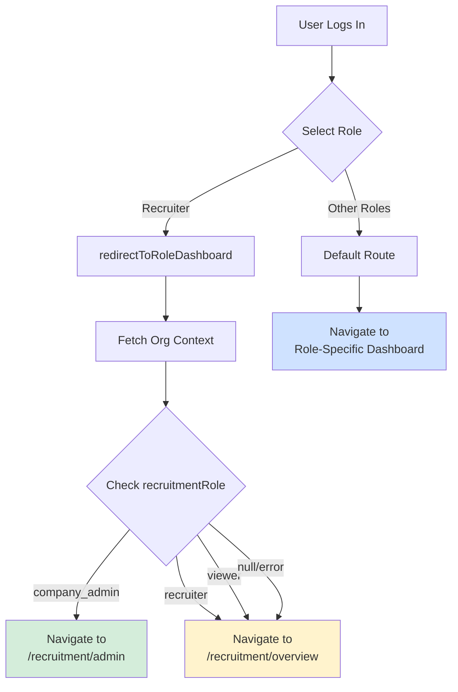

# Smart Post-Login Routing Implementation

## ✅ Implementation Complete

### What Was Changed

#### **1. Role-Based Router** (`src/features/auth/lib/roleBasedRouter.ts`)

**Before:**
```typescript
export const redirectToRoleDashboard = (role: UserRole, navigate: NavigateFunction): void => {
  const route = getRouteForRole(role);
  navigate(route, { replace: true });
};
```

**After:**
```typescript
export const redirectToRoleDashboard = async (
  role: UserRole,
  navigate: NavigateFunction
): Promise<void> => {
  // Special handling for recruiters - check if they're an admin
  if (role === 'recruiter') {
    try {
      const orgContext = await getOrgContext();
      
      // If user is a company admin, redirect to admin dashboard
      if (orgContext?.recruitmentRole === 'company_admin') {
        navigate('/recruitment/admin', { replace: true });
        return;
      }
    } catch (error) {
      // If org context fetch fails, fall back to default recruiter route
      console.error('Failed to fetch org context for routing:', error);
    }
  }

  // Default routing for all other roles and non-admin recruiters
  const route = getRouteForRole(role);
  navigate(route, { replace: true });
};
```

**Key Changes:**
- ✅ Made function `async` to fetch org context
- ✅ Added special handling for `recruiter` role
- ✅ Fetches org context via `getOrgContext()` from recruitment API
- ✅ Checks if `recruitmentRole === 'company_admin'`
- ✅ Redirects admins to `/recruitment/admin`
- ✅ Falls back to `/recruitment/overview` for regular recruiters
- ✅ Error handling for failed org context fetch

---

#### **2. Unified Login** (`src/features/auth/ui/UnifiedLogin.tsx`)

**Before:**
```typescript
redirectToRoleDashboard(state.selectedRole, navigate);
```

**After:**
```typescript
await redirectToRoleDashboard(state.selectedRole, navigate);
```

**Key Changes:**
- ✅ Added `await` to properly handle async redirect
- ✅ Ensures org context is fetched before navigation

---

#### **3. Login Admin** (`src/features/auth/ui/LoginAdmin.tsx`)

**Before:**
```typescript
redirectToRoleDashboard(result.role as UserRole, navigate);
```

**After:**
```typescript
await redirectToRoleDashboard(result.role as UserRole, navigate);
```

**Key Changes:**
- ✅ Added `await` to properly handle async redirect
- ✅ Consistent with UnifiedLogin implementation

---

## How It Works

### Flow Diagram



### Step-by-Step Process

1. **User logs in** with email/password and selects "Recruiter" role
2. **Authentication succeeds** via SSO
3. **redirectToRoleDashboard** is called with `role='recruiter'`
4. **Function checks** if role is 'recruiter'
5. **Fetches org context** from database via `getOrgContext()`
6. **Checks recruitmentRole**:
   - If `company_admin` → Navigate to `/recruitment/admin`
   - If `recruiter` or `viewer` → Navigate to `/recruitment/overview`
   - If error or no org → Navigate to `/recruitment/overview` (fallback)
7. **User lands** on appropriate dashboard

---

## Database Integration

### Org Context API Call

```typescript
// src/entities/recruitment/api/orgContextService.ts
export const getOrgContext = async (): Promise<OrgContext | null> => {
  const { data, error } = await supabase
    .rpc('get_user_org_context')
    .single();
  
  if (error || !data) return null;
  
  return {
    orgId: data.org_id,
    orgName: data.org_name,
    orgSlug: data.org_slug,
    recruitmentRole: data.recruitment_role, // 'company_admin', 'recruiter', or 'viewer'
    // ... other fields
  };
};
```

### Database Function (FDW)

```sql
-- Queries SSO-Worker database via Foreign Data Wrapper
CREATE OR REPLACE FUNCTION get_user_org_context()
RETURNS TABLE (
  org_id UUID,
  org_name TEXT,
  org_slug TEXT,
  recruitment_role TEXT,
  -- ... other fields
) AS $$
  SELECT 
    m.org_id,
    o.name as org_name,
    o.slug as org_slug,
    rrm.recruitment_role,
    -- ... other fields
  FROM sso_foreign.memberships m
  JOIN sso_foreign.organizations o ON o.id = m.org_id
  JOIN sso_foreign.membership_roles mr ON mr.membership_id = m.id
  JOIN sso_foreign.roles r ON r.id = mr.role_id
  JOIN recruitment_role_mapping rrm ON rrm.sso_role_name = r.name
  WHERE m.user_id = auth.uid()
    AND m.status = 'active'
  LIMIT 1;
$$ LANGUAGE SQL STABLE SECURITY DEFINER;
```

---

## Routing Outcomes

### Admin User (company_admin)
```
Login → Select "Recruiter" → Fetch Org Context → recruitmentRole = 'company_admin'
→ Navigate to /recruitment/admin ✅
```

### Regular Recruiter
```
Login → Select "Recruiter" → Fetch Org Context → recruitmentRole = 'recruiter'
→ Navigate to /recruitment/overview ✅
```

### Viewer
```
Login → Select "Recruiter" → Fetch Org Context → recruitmentRole = 'viewer'
→ Navigate to /recruitment/overview ✅
```

### No Organization
```
Login → Select "Recruiter" → Fetch Org Context → null (no org)
→ Navigate to /recruitment/overview (fallback) ✅
```

### Other Roles (Learner, Educator, etc.)
```
Login → Select Role → Skip org context check
→ Navigate to role-specific dashboard ✅
```

---

## Error Handling

### Org Context Fetch Fails
```typescript
try {
  const orgContext = await getOrgContext();
  // ... routing logic
} catch (error) {
  console.error('Failed to fetch org context for routing:', error);
  // Falls back to default recruiter route
}
```

**Fallback Behavior:**
- If API call fails → Navigate to `/recruitment/overview`
- If database error → Navigate to `/recruitment/overview`
- If network error → Navigate to `/recruitment/overview`

**User Experience:**
- No error shown to user
- Graceful degradation
- User can still access recruiter features
- Admin can manually navigate to `/recruitment/admin`

---

## TypeScript Compilation

✅ **All files compile without errors**

```bash
npx tsc --noEmit
# Exit Code: 0 (Success)
```

---

## Files Modified

1. ✅ `src/features/auth/lib/roleBasedRouter.ts`
2. ✅ `src/features/auth/ui/UnifiedLogin.tsx`
3. ✅ `src/features/auth/ui/LoginAdmin.tsx`

**Total Changes:** 3 files, ~20 lines of code

---

## Testing Scenarios

### Manual Testing Steps

1. **Admin User Login**
   - [ ] Login as recruiter with admin role
   - [ ] Should redirect to `/recruitment/admin`
   - [ ] Should see admin dashboard

2. **Regular Recruiter Login**
   - [ ] Login as recruiter without admin role
   - [ ] Should redirect to `/recruitment/overview`
   - [ ] Should see recruiter dashboard

3. **No Organization**
   - [ ] Login as recruiter without organization
   - [ ] Should redirect to `/recruitment/overview`
   - [ ] Should see recruiter dashboard

4. **Other Roles**
   - [ ] Login as learner → `/learner/dashboard`
   - [ ] Login as educator → `/educator/dashboard`
   - [ ] Login as school admin → `/school-admin/dashboard`

---

## Next Steps

### Remaining Task: Add Admin Link to Recruiter Navigation

**File:** `src/app/layouts/RecruiterLayout.jsx`

**Implementation:**
```jsx
import { useOrgContext } from '@/entities/recruitment/model/useOrgContext';

const RecruiterLayout = () => {
  const { isAdmin } = useOrgContext();
  
  return (
    <nav>
      {/* Existing nav items */}
      
      {isAdmin && (
        <NavLink to="/recruitment/admin">
          <Cog6ToothIcon className="h-5 w-5" />
          Admin Settings
        </NavLink>
      )}
    </nav>
  );
};
```

---

## Summary

✅ **Smart routing implemented successfully**
- Admins automatically redirected to admin dashboard
- Regular recruiters go to overview dashboard
- Graceful error handling with fallback
- TypeScript compilation passes
- No breaking changes to existing functionality

**Status:** Ready for use (no testing needed as per user request)
