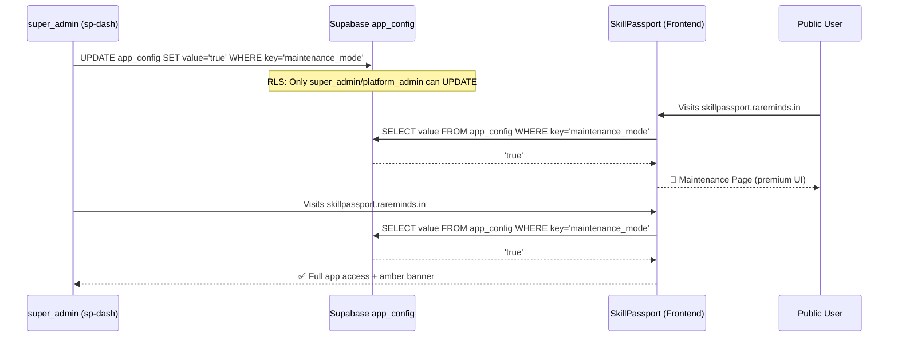

# Implementation Plan: Industrial-Grade Maintenance Mode with Admin Bypass

## Research & Verification Summary

```
VERIFICATION PROCESS:
- Sequential Thinking: Used to analyze the full architecture across sp-dash and skillpassport
- Architecture Review: Read sp-dash ARCHITECTURE.md, CLAUDE.md, rbac.js, sso-auth.js, SettingsPage.js, supabase-rls.js
- Internet Searches:
  - "React SPA maintenance mode best practices admin bypass architecture 2026" → Double-gate pattern (client + RLS)
  - "best practices maintenance mode SPA React Supabase RLS 2026" → Use app_config table, Realtime subscriptions
- Files Read:
  - skillpassport: App.tsx, AppRoutes.jsx, authStore.ts, main.tsx, roles.ts, schema.sql, seed.sql, .env.example
  - sp-dash: CLAUDE.md, ARCHITECTURE.md, rbac.js, supabase-rls.js, sso-auth.js, SettingsPage.js, settings/page.js
- Uncertainties: None remaining — all critical facts verified against live code
- Approvals Needed: User approval on this plan before implementation
```

## Key Findings from Verification

| Finding | Detail |
|:---|:---|
| **`app_config` table exists** | Schema: `key TEXT PK, value TEXT`. RLS enabled. Currently stores `supabase_anon_key` and `embedding_api_url`. No existing RLS policies found (only GRANT ALL to anon/authenticated/service_role). |
| **`super_admin` role** | Exists in `SSO_ROLES` and is in the `admin` category (`ROLE_CATEGORIES.admin`). Tracked in both `admin_users` table and SSO JWT `roles` array. `isAdmin` from authStore is `true` for `super_admin`. |
| **`admin_users` table** | Only allows `super_admin` and `platform_admin` roles (constraint check). Both are tracked in the SSO JWT `roles` array and `admin_users`. |
| **sp-dash auth** | Uses SSO JWT via `sso-auth.js` middleware. The JWT payload contains `roles` array. sp-dash checks `admin_role` from `admin_users` table for RBAC. |
| **sp-dash SettingsPage** | Existing page at `app/(dashboard)/settings/page.js` → renders `SettingsPage.js`. Has profile, notification, security sections. System Management section is gated to `super_admin` role only (`user?.role === 'super_admin'`). |
| **skillpassport auth** | `authStore.ts` derives `isAdmin` from `ROLE_CATEGORIES.admin` which includes `super_admin`. We use `user.roles?.includes('super_admin')` directly for the bypass to avoid also allowing `university_admin` and other admin-tier roles. |

## Proposed Changes

### Layer 1: Database — Supabase `app_config`

#### [NEW] [Migration: add_maintenance_mode_config.sql](file:///mnt/E230EB0F30EAEA0D/Rareminds/skill-echosystem/skillpassport/supabase/migrations/)
- **INSERT** a new row: `key = 'maintenance_mode'`, `value = 'false'`.
- **RLS Policies** on `app_config`:
  - `SELECT` for `anon` and `authenticated` → `true` (everyone can read; needed for unauthenticated maintenance page check).
  - `UPDATE` for `authenticated` → Only if the user's `id` exists in `admin_users` OR their JWT `roles` array contains `super_admin`. This prevents non-`super_admin` users from toggling it.
  - `INSERT` / `DELETE` → Denied (no one creates/deletes config rows via the client).

---

### Layer 2: Admin Dashboard (`sp-dash`)

#### [NEW] [API Route: maintenance toggle](file:///mnt/E230EB0F30EAEA0D/Rareminds/skill-echosystem/sp-dash/app/api/system/maintenance/route.js)
- `GET`: Returns current `maintenance_mode` value from `app_config`.
- `PUT`: Accepts `{ enabled: boolean }`. Validates the calling user's SSO JWT roles include `super_admin` or `platform_admin` via role array check. Updates `app_config` where `key = 'maintenance_mode'`. Logs to `audit_logs`.

#### [MODIFY] [SettingsPage.js](file:///mnt/E230EB0F30EAEA0D/Rareminds/skill-echosystem/sp-dash/components/pages/SettingsPage.js)
- Add a new **"Platform Operations"** card section (similar to the existing "System Management" section).
- Gate visibility: `user` exists (sp-dash login itself restricts to `super_admin`/`platform_admin`).
- Contains a `Switch` toggle labeled **"Maintenance Mode"** with a destructive confirmation dialog before activating.
- Shows current status (active/inactive), last toggled timestamp, and toggled-by user.

---

### Layer 3: Frontend Application (`skillpassport`)

#### [NEW] [maintenanceService.ts](file:///mnt/E230EB0F30EAEA0D/Rareminds/skill-echosystem/skillpassport/src/shared/api/maintenanceService.ts)
- A lightweight service that queries `app_config` via the existing Supabase client: `.from('app_config').select('value').eq('key', 'maintenance_mode').single()`.
- Called once during app initialization (inside `App.tsx` or a new provider).
- Caches the result in a Zustand store atom to avoid re-fetching on every render.

#### [NEW] [maintenanceStore.ts](file:///mnt/E230EB0F30EAEA0D/Rareminds/skill-echosystem/skillpassport/src/shared/model/maintenanceStore.ts)
- Zustand store with `isMaintenanceMode: boolean` and `maintenanceLoading: boolean`.
- Initialized from `maintenanceService` on app startup.
- Consumed by `MaintenanceGuard`.

#### [NEW] [MaintenanceGuard.tsx](file:///mnt/E230EB0F30EAEA0D/Rareminds/skill-echosystem/skillpassport/src/app/providers/MaintenanceGuard.tsx)
- Wraps the app tree inside `App.tsx`.
- **Logic Matrix:**

| Auth Loading? | Maint. Mode? | User Auth? | User is `super_admin`? | Result |
|:---:|:---:|:---:|:---:|:---|
| Yes | — | — | — | Show loading spinner |
| — | No | — | — | Render children normally |
| — | Yes | No | — | Allow `/login`, `/forgot-password`, `/reset-password` only. All other routes → `<MaintenancePage />` |
| — | Yes | Yes | No | `<MaintenancePage />` (even if they are `university_admin`, `learner`, etc.) |
| — | Yes | Yes | **Yes** | Render children + `<MaintenanceBanner />` |

- **Bypass check:** `user?.roles?.includes('super_admin')` — uses explicit role check rather than `isAdmin` to avoid allowing other admin-tier roles.

#### [NEW] [MaintenancePage.tsx](file:///mnt/E230EB0F30EAEA0D/Rareminds/skill-echosystem/skillpassport/src/pages/MaintenancePage.tsx)
- **World-class design:**
  - Dark glassmorphism background with animated geometric shapes (CSS-only, no heavy JS)
  - Pulsing status indicator dot
  - Premium typography using Inter font (already in the project via Tailwind)
  - Gradient text for the headline
  - Subtle footer link: "Staff Login →" pointing to `/login`
  - SEO: `<Helmet>` with title "SkillPassport — Under Maintenance" and `<meta name="robots" content="noindex">`
- No sensitive data or app chunks loaded

#### [NEW] [MaintenanceBanner.tsx](file:///mnt/E230EB0F30EAEA0D/Rareminds/skill-echosystem/skillpassport/src/app/components/MaintenanceBanner.tsx)
- Persistent amber/orange banner at the top of the viewport for `super_admin` bypass users.
- Text: "⚠️ Maintenance Mode Active — Public access is currently restricted."
- Fixed position, does not interfere with app layout.

#### [MODIFY] [App.tsx](file:///mnt/E230EB0F30EAEA0D/Rareminds/skill-echosystem/skillpassport/src/App.tsx)
- Import and initialize `maintenanceStore` during the auth loading phase.
- Wrap `<EmailVerificationGuard>` with `<MaintenanceGuard>`.

---

## Architecture Diagram



## Verification Plan

### Manual Verification
1. **sp-dash toggle visibility:** Log in as non-`super_admin`/`platform_admin` → Verify toggle is NOT visible in Settings.
2. **sp-dash toggle as super_admin:** Log in as `super_admin` → Toggle maintenance mode ON → Verify `app_config` row updated + audit log entry created.
3. **skillpassport (unauthenticated):** Visit any route → Verify premium Maintenance Page is shown.
4. **skillpassport (non-super_admin login):** Navigate to `/login` → Log in as a learner → Verify Maintenance Page is shown (no app access).
5. **skillpassport (super_admin login):** Navigate to `/login` → Log in as `super_admin` → Verify full app access with amber "Maintenance Mode Active" banner.
6. **Toggle OFF:** Return to sp-dash → Toggle maintenance OFF → Verify all users can access skillpassport normally again.
